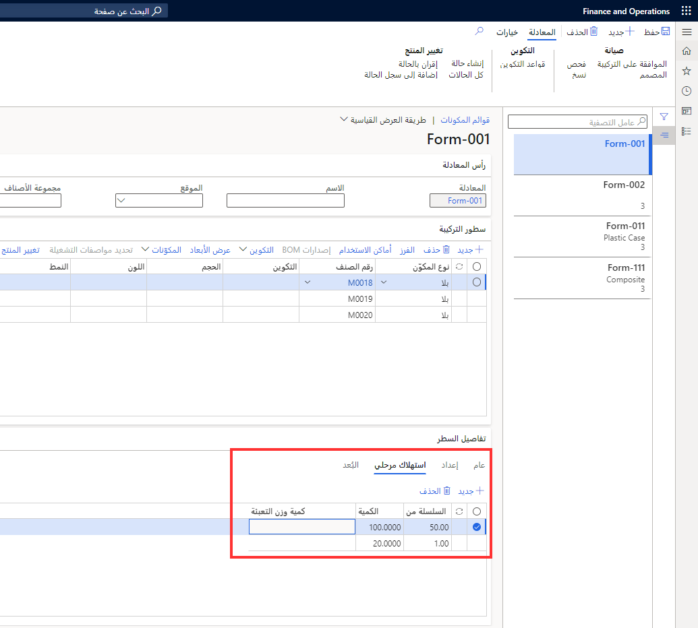

يقوم استهلاك الخطوة باستبعاد المتطلب الذي يجب إدخال كميته في علامة التبويب **بند المعادلة** لأحد المكونات. وبدلاً من ذلك، يتم تكوين استهلاك الخطوة بحيث يكون له قيمة من **السلسلة** و **الكمية**. 

يتم تحديد المعلومات الواردة من سجل **استهلاك الخطوة لكل سلسلة** التي تفي بالكمية الموجودة في أمر الدفعة. 

يكون استهلاك الخطوة مفيداً عندما تكون نسبة الاستهلاك غير خطية بالنسبة لحجم الأمر الدفعي ويقوم بزيادة الطلب فقط عند استيفاء حد كمية معين. 

لتمكين هذه الميزة لإحدى الصيغ الجديدة، ضمن مجموعة **حساب الاستهلاك**، قم بتغيير إعداد المعادلة للمكون القابل للتطبيق من **قياسي** إلى **الخطوة**. 

يمكنك تحديد أسلوب الاستهلاك هذا في علامة التبويب **إعداد** من صفحة **بند المعادلة**.

حدد **إدارة معلومات المنتج > ‏‫قوائم مكونات الصنف والمعادلات‬ > الصيغ** ثم حدد أية صيغة. في تفاصيل البند، ستقوم علامة التبويب **استهلاك الخطوة** بعرض الصفحة التالية.

