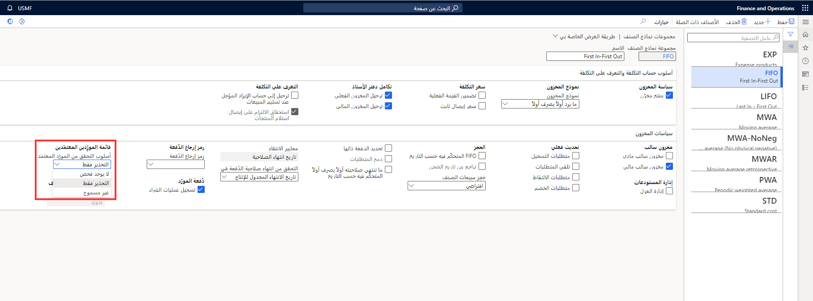

تسمح قوائم الموردين المعتمدين (AVL) بوضع قيود على صنف ما لتحديد الموردين الذين يمكن شراء الصنف منهم. تضمن هذه الطريقة أن حركات الشراء يتم إجراؤها دائماً على القائمة المعتمدة فقط.

أثناء إعداد مجموعة نماذج الصنف، يتم تحديد التحقق من المورد الافتراضي ضمن مجموعة نماذج الصنف، والذي يمكن تغييره على مستوى الصنف إذا لزم الأمر.

على مستوى المنتج، يمكن تعديل أسلوب التحقق من المورِد لإملاء مدى تقييد التحكم في قائمة الموردين المعتمدين لهذا الصنف المحدد. الخيارات الموجودة في أسلوب التحقق من المورد هي:

-   **لا يوجد شيك** - يمكن استخدام أي مورد سواء كان المورد موجوداً في قوائم الموردين المعتمدين أم لا.

-   **تحذير فقط** - عندما يتم استخدام مورد غير موجود في قوائم الموردين المعتمدين، سيحصل المستخدم على تحذير، ولكن سيتم حفظ الحركة.

-   **غير مسموح به** - عندما يتم استخدام مورد غير موجود في قوائم الموردين المعتمدين، سيتلقى المستخدم رسالة خطأ ولن يتم حفظ الحركة.

**إدارة المخزون> إعداد> مخزون> مجموعات نماذج الصنف**

عند إضافة صنف إلى سطر مستند الشراء، تكمل Supply Chain Management التحقق من الصنف لتحديد ما إذا كان أسلوب التحقق من المورد المعتمد **تحذير فقط** أو **غير مسموح به** مطلوباً للصنف. إذا تم تعيين إما **تحذير فقط** أو **غير مسموح به** على الصنف، يتم استكمال مراجعة قائمة المورِّدين المعتمدين للصنف للعثور على المورد في مستند الشراء. 

يتم بعد ذلك التحقق من صحة التواريخ الموجودة في قوائم الموردين المعتمدين للتحقق من اعتماد المورد لتاريخ مستند الشراء. إذا لم تتم الموافقة على المورد وتم تعيين **رسالة التحقق من المورد** على تحذير، فستظهر رسالة تفيد بأن المورد المحدد غير مخول للصنف، ولكن يتم إنشاء أمر شراء. إذا تم تعيين **أسلوب التحقق من المورد المعتمد** على **غير مسموح به**، فلن يتم إنشاء سطر أمر الشراء، ويجب على المستخدم تغيير إعداد المورد المعتمد أو تغيير الموردين في أمر الشراء.

يتم التحقق من صحة إعداد علاقة الصنف والمورد في قائمة الموردين المعتمدين عند إدخال الصنف في:

-   أمر الشراء

-   اتفاقيات الشراء

-   طلبات الشراء

-   ردود طلب عرض أسعار (RFQ) - عندما تتلقى رداً من الموردين للحصول على عرض أسعار، يتم إدخال سعر الشراء الذي يحدده المورد في صفحة **الرد على طلب عرض الأسعار** وقبوله. أثناء قبولك عرض أسعار الشراء، يتم التحقق من صحة قائمة الموردين المعتمدين للصنف مع المورد الذي يتم وضع رد طلب عرض الأسعار معه.
