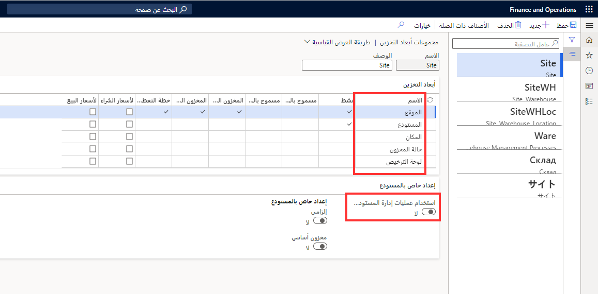
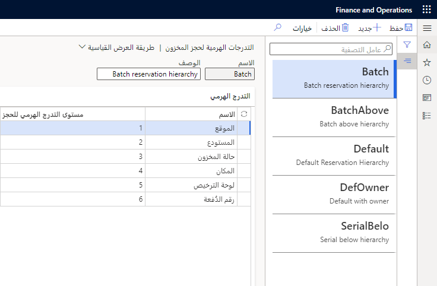
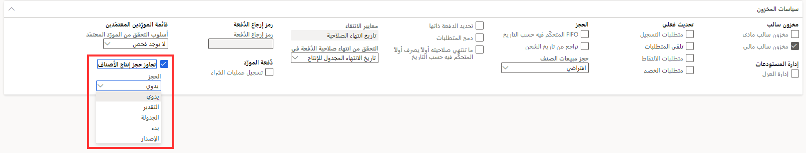
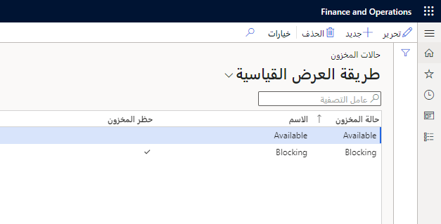
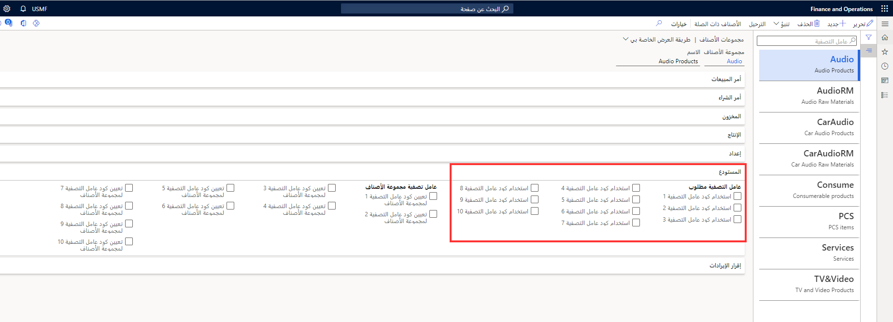
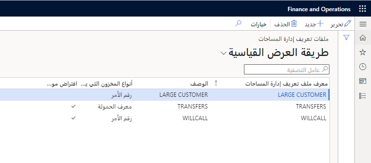

عندما تكون الشركة في طور تنفيذ إدارة المستودعات، يجب إكمال الإعداد الأساسي للتأكد من أن النظام يعمل لتلبية احتياجات أعمال الشركة. 

## مجموعات أبعاد التخزين  

مجموعات أبعاد التخزين هي بُعد مخزون يتم استخدامه لتحديد معلومات تخزين المخزون للعناصر الخاصة بك، وكيف ستقوم بتخزين أو استرداد العناصر التي تم جردها. يمكنك إعداد مجموعات أبعاد تخزين متعددة لتناسب احتياجات عملك. على سبيل المثال، قد يكون لديك بعض المنتجات المخزنة حسب الموقع والمستودع، وقد يكون لديك عناصر أخرى يتم تخزينها حسب الموقع والمستودع والموقع. 

يمكن تكوين مجموعات أبعاد التخزين في **إدارة معلومات المنتج > الإعداد > مجموعات الأبعاد والمتغيرات**، يشير الخيار **استخدام عملية إدارة المستودعات** إلى أن المستودع سيتم استخدام وظيفة الإدارة لجميع المنتجات التي تم تعيينها لبُعد التخزين هذا.

 
يُستخدم خيار **حالة المخزون** لتقسيم المخزون إلى فئات، مثل متاح أو غير متاح. كما يمكنه أيضاً منع أنشطة معينة في حالة عدم توفر أصناف معينة في المخزون.

على سبيل المثال، إذا كنت ترغب في منع عامل من انتقاء الأصناف لأي أوامر، استخدم ميزة حظر المخزون، التي تمنع استخدام الأصناف غير المتوفرة.

يمكن استخدام بعد المخزون **لوحة الترخيص** لتعقب المخزون الذي يتم تجميعه معاً في المستودع، مثل البالته أو الصندوق أو العربة أو الصنف الفردي.

إذا كنت تريد استخدام عمليات إدارة المستودعات وتطبيق تسلسل هرمي للحجز، فيجب عليك إعداد مجموعة أبعاد تخزين واحدة على الأقل ببُعد تخزين واحد على الأقل.

## مجموعات أبعاد التتبع 

تُستخدم مجموعات أبعاد التتبع في Supply Chain Management لتمكينك من تتبع العناصر الخاصة بك في منشآتك. على سبيل المثال، يمكنك تتبع الأصناف الخاصة بك عن طريق الأرقام التسلسلية أو أرقام الدُفعات أو الملكية. 

- يمكن استخدام الأرقام التسلسلية إذا كان لديك أصناف فريدة، أو إذا كنت ترغب في تتبع العناصر الخاصة بك على أساس صنف واحد. يمكن استخدام أرقام الدُفعات لمجموعات الأصناف. 
- يعد ترقيم الدُفعات مفيداً أيضاً لتتبع مشكلات الإنتاج أو الشحن. 
- يمكن استخدام الملكية إذا كنت تقوم بتخزين العناصر التي يملكها طرف ثالث وليس مؤسستك. 

في إدارة المستودعات، تعد أبعاد التتبع اختيارية لـ **التدرجات الهرمية للحجز**، الموجودة في **إدارة المستودعات > الإعداد > المخزون**. وعادة ما يتم استخدام أبعاد التعقب كعنصر تحكم في الدُفعة أو لإجراء تسلسل للمخزون. عندما تقوم بالتحديد لتمكين بعد رقم تسلسلي، يتوفر لديك خيار لتحديد متى سيتم التقاط الرقم التسلسلي في عملية Warehouse Management.

## تجاوز مبدأ الحجز الافتراضي للمواد في الإنتاج
عند إنشاء أمر إنتاج جديد أو أمر دُفعي، سيُطلب منك اختيار مبدأ الحجز الذي سيتم تطبيقه على الأمر وجميع بنود قائمة مكونات الصنف أو بنود المعادلة. عند تمكين ميزة **تجاوز حجز الإنتاج الافتراضي**، يمكن لأي من أو كل قائمة المواد أو سطور الصيغة تجاوز مبدأ الحجز المحدد لمجموعة نموذج الصنف ذات الصلة واستخدام مبدأ الحجز المحدد لذلك مجموعة نموذج العنصر بدلاً من ذلك.

بشكل افتراضي، يمكنك تحديد مبدأ الحجز الافتراضي لكل مجموعة نماذج صنف. غالباً ما تتطلب فاتورة المواد (BOM) أو معادلات الأوامر الدُفعية مبادئ حجز مختلفة. حدد مبدأ الحجز الافتراضي الذي سيتم استخدامه للأمر، وكذلك مبدأ الحجز الذي سيتم استخدامه بدلاً من ذلك (يدوي، أو تقدير، أو جدولة، أو تحرير، أو بدء).
 

على سبيل المثال، إذا كانت لديك مواد أولية أو مكونات تتطلب الانتقاء، فيجب أن تتضمن أي قوائم مواد أو سطور معادلة مطورة لتلك السلع حجزاً مادياً، لأن الحجز المادي مطلوب لإنشاء أعمال المستودعات. إذا كنت تريد إجراء الحجز تلقائياً، فعادة ما تختار أحد مبادئ الحجز: التقديرات أو الجدولة أو الإصدار أو البدء. إذا كانت لديك مواد أو مكونات لا تتطلب عملاً مختاراً لأنها مأخوذة مباشرة من موقع ما، فمن المحتمل أن تختار مفهوم الحجز اليدوي، والذي لا يقوم بأي حجوزات فعلية أو ينشئ أي عمل اختيار.

لمزيد من المعلومات، راجع [تجاوز مبدأ الحجز الافتراضي للمواد في الإنتاج](/dynamics365/supply-chain/production-control/override-default-reservation-principle/?azure-portal=true)

## مجموعات تسلسل الوحدات 

يجب تعيين مجموعة تسلسل الوحدة إلى أي صنف يحتوي على مجموعة أبعاد تخزين تستخدم إدارة المستودعات.

تحدد مجموعة تسلسل الوحدة تسلسل الوحدات التي يمكن استخدامها في عمليات المستودع. يحدد التسلسل ترتيب الوحدات التي يتم إنشاء عمل المستودع بها، ويتم تطبيقه عند إنشاء العمل للكميات الموجودة في بند أمر الشراء أو بند أمر التحويل.
يجب أن تتضمن مجموعة تسلسل الوحدات وحدات القياس التي تتراوح من أصغر وحدة إلى أكبر وحدة ويمكن استخدامها للمنتج في عمليات المستودع.

فيما يلي الميزات المهمة في صفحة **مجموعات تسلسلات الوحدات**:

-   يمكن تحديد كل وحدة قياس إذا كنت ستسمح باستخدام هذه الوحدة في حساب الدورات.
-   يمكنك تحديد وحدة قياس باعتبارها الوحدة الافتراضية لأوامر الشراء أو الإنتاج أو استهلاك المواد.
-   ويمكنك تحديد نوع حاوية افتراضي للوحدة.

إذا كنت ترغب في استلام صنف أكبر من حجم البالته وإجراء تجميع له، فحدد حقل **تجميع لوحة الترخيص**. إذا لم يتم تحديد هذا الخيار، سيتم تعيين كل صنف مفرد أعلى وحدة البالته إلى لوحة الترخيص الخاصة به.

## حالات المخزون  

يمكن استخدام بُعد حالة المخزون لتقسيم الأصناف إلى فئات، مثل **التوفر** و **الحظر**. يمكنك إنشاء عدد غير محدود من الحالات. بالإضافة إلى ذلك، يمكنك تعيين الإعداد الافتراضي لحالة المخزون ليتم تطبيقه على كافة الأصناف أو للأصناف الموجودة في مستودع واحد أو لأحد العملاء أو الموردين.

بعد إعداد حالة المخزون، يمكنك تعيين حالة المخزون الافتراضية للموقع والصنف والمستودع. يمكنك تغيير الحالة الافتراضية على جهاز محمول أو في أمر الشراء أو أمر المبيعات أو بند أمر التحويل.

## مجموعات الأصناف 
تُستخدم مجموعات الأصناف أيضاً لتجميع العناصر معاً والتي تشترك جميعها في ملف تعريف ترحيل مماثل. بهذه الطريقة، لن تضطر إلى إعداد ملف تعريف للنشر لكل صنف لديك في التطبيق. يتم استخدام المعلومات داخل مجموعة الأصناف للعديد من المعاملات في النظام. على سبيل المثال، عند حدوث حركة، سيتم استخدام مجموعة الأصناف المخصصة للأصناف داخل الحركة لتحديد حسابات دفتر الأستاذ التي سيتم ترحيل الحركة إليها.

في مجموعات الأصناف، قد تحتاج إلى إعداد استخدام عوامل التصفية. يمكن استخدام عوامل التصفية، التي تُستخدم لوصف صنف ما بشكل إضافي، في تحديد الأصناف الخاصة بالموردين والعملاء ويمكن تحويلها إلى إعداد مطلوب لأحد المنتجات.

تتيح عوامل التصفية للمستخدمين تصنيف الأصناف وتحديد العملاء للأصناف، ثم تحديد الموردين للأصناف. على سبيل المثال، يجب استخدام عوامل التصفية في حالة وجود متطلب لبيع الأصناف فقط التي تحتوي على عامل التصفية المحدد.

تتوفر أربعة أكواد لعوامل التصفية في Supply Chain Management. تأكد من تعريف القيم مسبقاً لكل كود عامل تصفية وخذ بعين الاعتبار إعادة تسمية أكواد عامل التصفية بدلاً من التسميات العامة مثل الكود واحد والكود اثنان والكود ثلاثة لمطابقة استخدام الأعمال لكود عامل التصفية.

يتم تشغيل عوامل التصفية وإيقاف تشغيلها في صفحة **مجموعات الأصناف**.

يشير خيار **استخدام كود عامل التصفية** إلى أنك ستستخدم كود عامل التصفية للعنصر وأنك ستقوم يدوياً بتعيين كود التصفية هذا في صفحة **المنتج الصادر**. يمكنك أيضاً إعداد مجموعات عوامل تصفية، والتي ستستخدم تلقائياً أكواد عوامل التصفية الافتراضية استناداً إلى اختيار مجموعة الأصناف عند إنشاء منتج جديد.

بعد إنشاء أكواد التصفية، يمكنك بعد ذلك تكوين الأصناف المطلوب أن تكون متوفرة بوجه عام، والتي تتجاوز أكواد عوامل تصفية الخاصة بالعميل أو المورد، أو يمكنك إضافة عوامل التصفية إلى العملاء والموردين.

## ملفات تعريف إدارة المساحات  

يساعد ملف تعريف "إدارة المساحات" في التحكم في أصناف المخزون للأوامر أو الشحنات أو التحميلات أو الموجات المتعددة في المساحات التي يتم فيها استلام الأصناف الواردة أو يتم فيها تحميل الأصناف الصادرة. تحدد أيضاً ملفات تعريف الموقع ما إذا كان موقع المستودع يخضع للتحكم من خلال لوحة ترخيص، ويمكن حساب الدورات به أم لا، وما إذا كان يسمح بخلط دفعات المخزون أم لا.

يمكن إعداد ملف تعريف إدارة المساحات وتعيينه إلى ملف تعريف الموقع لإدارة خلط المخزون في مواقع مستودع محددة.

على سبيل المثال، عند قيامك بتجهيز منتج في موقع مرحلي، فربما تحتاج فقط إلى تجهيز أمر واحد في كل مسار مرحلي، أو فصل الأصناف حسب معرف الشحنة، ومعرف التحميل، ورقم الأمر، ومعرف الموجة، ونوع أمر العمل.
