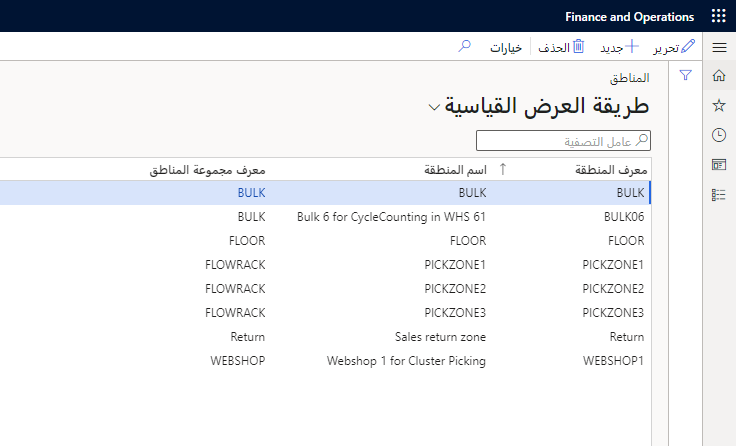
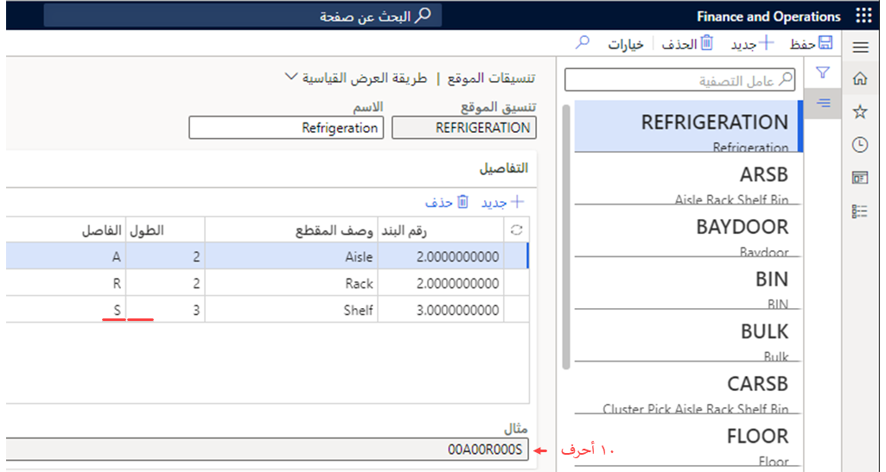
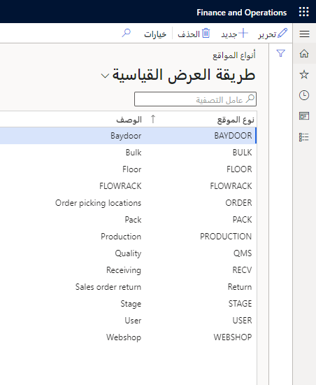

توفر إدارة المستودعات طرقاً مرنة لتحديد تخطيط مستودعك لتلبية الاحتياجات المتغيرة كي تتمكّن من تحقيق كفاءة المستودع المثلى. تسمح لك إدارة المستودعات بالقيام بما يلي: 

-   إنشاء مساحات ذات أولوية عالية وأولوية منخفضة لتمكين الموضع الأمثل للبضائع.
-   تقسيم مستودعك إلى مناطق لتلبية مختلف احتياجات التخزين، مثل متطلبات درجة الحرارة أو معدلات الدوران المتنوعة للأصناف.
-   تحديد مواقع المستودعات على أي مستوى (على سبيل المثال، الموقع، والمستودع، والممر، والحامل، والرف، وموضع الصندوق).
-   تجميع المواقع باستخدام إعدادات قيود السعة الفعلية.
-   التحكم في كيفية تخزين الأصناف وانتقائها، استناداً إلى القواعد المعرّفة بواسطة الاستعلام.

لاستخدام إدارة المستودعات في Supply Chain Management، يجب عليك إنشاء مستودع وتمكينه لأنشطة إدارة المستودعات الأكثر تقدماً أو تخصصاً.

في القسم **إعداد خاص بالمستودع**، حدد الخيار **استخدام عمليات إدارة المستودعات**.

بعد تمكين عمليات إدارة المستودعات، يمكنك إكمال عمليات إعداد إضافية للمعلمات العامة والتسلسلات الرقمية‬ والمواقع والعمل وغير ذلك.

تمثّل منطقة المستودع مساحة محددة في المستودع يتم تخصيص أصناف مخزون معينة لها. إنها عبارة عن مجموعة مكوّنة من مواقع مختلفة.

كجزء من عملية تمكين تخطيط المستودع،يجب عليك تعريف ما يلي:

-   **Zone groups** - تجميع فعلي أو منطقي لمناطق داخل مستودع.
-   **المناطق‏‎** - تجميع فعلي أو منطقي لمواقع داخل مستودع.
-   **ملفات تعريف الموقع‬** - تجميع فعلي أو منطقي لمواقع لديها السياسات نفسها لعمليات موقع المستودع. على سبيل المثال، يمكن تخزين خليط من أرقام أصناف مختلفة هناك، وتنطبق قيود السعة الفعلية نفسها. علاوةً على ذلك، تسمح لك أيضاً ملفات تعريف الموقع‬ بخلط أبعاد المنتج في موقع واحد. من شأن هذه الوظيفة أن تساعدك على استخدام المواقع بشكل أفضل من خلال السماح لك بتحديد التكوينات والألوان والأنماط والأحجام التي يمكن خلطها في ملف تعريف موقع معين. علاوةً على ذلك، يمكنك تحديد مجموعات معينة من هذه الأبعاد التي يمكن خلطها في الموقع. 
-   **أنواع المواقع** - تجميع فعلي أو منطقي لمواقع المستودعات. على سبيل المثال، يمكنك إنشاء نوع موقع لجميع مواقع التقسيم المرحلي. تعمل الإعدادات الإلزامية في صفحة **معلمات إدارة المستودعات** على تشغيل عملية تعريف أنواع مواقع التقسيم المرحلي ونوع موقع الشحن النهائي.
-   **المواقع** - المستوى الأدنى لمعلومات الموقع. تُستخدم المواقع لتعقب مكان تخزين المخزون المتاح وانتقائه في مستودع.

    

يتم استخدام الكيانات التي تقوم بإنشائها لتعريف تخطيط مستودعك في الاستعلامات التي تم إعدادها في قوالب العمل لتشغيل أوامر العمل في المستودع. وبالتالي، عندما تعرّف المناطق وأنواع المواقع، وغير ذلك، عليك أن تأخذ في الاعتبار كيفية استخدام المساحات المختلفة في المستودع لعمليات مختلفة.

علاوةً على ذلك، خذ في الاعتبار عوامل مثل الخصائص المادية لمساحة ما. على سبيل المثال، من المحتمل وجود بعض المساحات حيث يمكنك استخدام رافعة شوكية من نوع معين. مثال آخر: إذا كان لدى شركتك بضائع إنتاج وبضائع نهائية في المرفق نفسه، وأردت إنشاء مستودع واحد في Supply Chain Management، ثم فصل العمليتين من خلال إنشاء مجموعتين من المناطق. أدخل أسماء وصفية للكيانات، بحيث يسهل التعرف عليها عند استخدامها في استعلامات القوالب.‬

## المناطق ومجموعات المناطق 

تسمح لك المناطق بتصنيف المواقع أو تجميعها في منطقة، وقد يكون ذلك مفيداً لتخصيص المنتجات بالاستناد إلى مساحة في منطقة. مجموعة المناطق هي عبارة عن تجميع منطقي لمناطق مختلفة في المستودع. يتم إنشاء كل من المناطق ومجموعات المناطق لإعداد التقارير.

على سبيل المثال، يمكنك تحديد مناطق للمنتجات المختلطة والمجمدة والمرتجعة. **إدارة المستودعات > إعداد > المستودع**

## تنسيقات الموقع  

يمكنك استخدام **إدارة المستودعات > إعداد > المستودع > صفحة تنسيقات الموقع** لإنشاء تنسيق للمعرف الذي يتم استخدامه لتحديد موقع مستودع معين. تسمح لك تنسيقات الموقع بتعريف نظام الترقيم في مستودعك. وبإمكان المواقع أن تكون ذات تنسيق فريد، وهذا يتوقف على استخدام الممرات والحوامل والأرفف والصناديق.

بإمكان تنسيق الموقع أن يحتوي على أجزاء متعددة، ولكن لا يجوز أن يزيد إجمالي طوله عن 10 أحرف.

على سبيل المثال، يمكنك إنشاء تنسيق موقع يحتوي على أجزاء واستخدام حرف كفاصل، مثل 00A00R000S. "م" = ممر و"ح" = حامل و"ر" = رف.  عند إعداد المواقع، بإمكان العاملين في المستودع الانتقال بسهولة إلى الممر والرف والحامل المعين للمنتج الذي يحتاجون إليه في المستودع وذلك باستخدام تنسيقات الموقع. 

## ملفات تعريف الموقع 

يمثّل ملف تعريف الموقع المكان الذي يتم فيه تطبيق جميع الإعدادات التي أكملتها حتى الآن على ملف التعريف، والتي يتم عندئذٍ تعيينها إلى كل موقع في مستودعك. علاوةً على ذلك، يتم تطبيق عدة قواعد أخرى على الموقع:

-   إذا كان سيتم استخدام تعقب لوحة الترخيص
-   إذا كان المخزون السالب مسموحاً به
-   إذا كان الجرد الدوري مسموحاً به

على سبيل المثال، يمكنك تحديد أبعاد الموقع مثل الارتفاع والطول والعرض وما إلى ذلك لوحدة قياس شائعة مثل البالتات أو الصناديق، أو يمكنك تعيين الأحجام حسب حجم الموقع. وبالتالي، إذا كانت لديك مساحة تحتوي على أرفف أو حوامل مختلفة الأحجام، فستحتاج إلى إنشاء ملف تعريف موقع مختلف.

علاوةً على ذلك، تسمح علامة تبويب السريعة **خلط أبعاد المنتج المسموح بها‬** بإدارة المواقع عند استخدام متغيرات منتجات أو منتجات ذات أبعاد. إنها تسمح لك بتحديد ما إذا كان من الممكن خلط التكوينات والألوان والأنماط والأحجام في موقع معين (ملف تعريف) أو ما إذا كان من الممكن وضع بُعد واحد فقط أو مجموعة من هذه الأبعاد في الموقع نفسه.

## أنواع المواقع  

تُستخدم أنواع المواقع لتعريف المواقع التي سيستخدمها مستودعك. يمكن العثور عليها في **إدارة المستودعات > إعداد > المستودع**، بعد إضافة وصف إلى مواقعك، يمكنك استخدام أنواع المواقع لتصفية المواقع بحيث ترى فقط تلك التي تريد استخدامها لعمليات انتقاء الأصناف أو تخزينها. 

يمكنك استخدام أنواع المواقع في مستودع كبير لتحديد موقع مخصص لعمليات الفحص أو المرتجعات. وبطريقة مماثلة، يمكنك استخدام أنواع المواقع لتسمية موقع باب الرصيف، سواء كان وارداً أو صادراً أو كليهما.

يمكنك أيضاً تحديد أنواع المواقع لأصناف معينة مثل البضائع الجافة أو الطازجة أو المجمدة.

قد توجد لديك مواقع تخزين مجمّعة لوضع جميع الأصناف لتحويلها في وقت لاحق. بدلاً من ذلك، قد يكون لديك موقع تقسيم مرحلي لتغليف الفقاعات، على سبيل المثال، في عملية التعبئة التي تسبق شحن البضائع.

شاهد هذا الفيديو للتعرف على كيفية إعداد **أنواع المواقع** و **تنسيقات الموقع‬** و **ملفات تعريف الموقع‬**.
 > [!VIDEO https://www.microsoft.com/videoplayer/embed/RE4MvtR]

## المواقع  

تُستخدم مواقع المخزون لتعقب المعلومات المتعلقة بموقع مخزونك في المستودع. يمكنك إنشاء مواقع يدوياً أو استخدام معالج لإنشاء المواقع.

شاهد هذا الفيديو لمعرفة كيفية إنشاء موقع باستخدام **معالج إعداد الموقع**.
 > [!VIDEO https://www.microsoft.com/videoplayer/embed/RE4MBmX]

## حدود مخزون الموقع

تأكد من مراعاة التخطيط المادي للمستودع لتحديد سعات التخزين (حدود مخزون الموقع وملفات تعريف الموقع) ولإنجاز عمليات المستودع المثلى.

يمكنك إنشاء حدود مخزون الموقع لتحديد كمية المنتج القصوى التي يمكن تخزينها في الموقع.

على سبيل المثال، بإمكان المواقع المجمّعة أن تحتوي على ثلاث بالتات، في حين تحتوي مواقع الانتقاء على عشرة صناديق، وليس لدى أبواب الأرصفة ومواقع التقسيم المرحلي أي قيود.

تتطلب منك حدود المخزون إدخال موقع محدد أو ملف تعريف موقع محدد، ولكن ليس كليهما. بإمكان أصناف متعددة مقيّدة بحدود المخزون أن تكون موجودة في الموقع نفسه، وبإمكان صنف واحد أن يكون مقيداً بحدود في مواقع متعددة. يمكنك أيضاً تحديد حدود المخزون للمنتجات ومتغيرات المنتجات وأنواع الحاويات. لا تسمح Supply Chain Management بأكثر من الكمية المحددة لأحد الأصناف في موقع معين.

بإمكان حدود مخزون الموقع أن تساعد على ضمان عدم تقديم طلب لوضع المخزون في موقع لا تتوفر فيه السعة المادية لحمل المخزون.

على سبيل المثال، إذا كان باستطاعة بعض المواقع داخل مستودع استيعاب بالتة واحدة لكل موقع، فيمكنك تمكين حدود مخزون الموقع.
يمكن تعيين قيمة **الكمية** إلى **1**، وقيمة **الوحدة** إلى **PL** داخل تجميع ملف تعريف موقع معين.

إذا كانت هناك حاجة إلى عمليات حسابية أكثر تقدماً للتحكم في قيود سعة الموقع، فيمكن استخدام إعدادات ملف تعريف الموقع. في هذه الحالة، يؤخذ الوزن والحجم في الاعتبار عند إجراء حسابات السعة.

لإنجاز العمليات الصادرة المثلى، يجب عليك تقييم ما إذا كان يجب استخدام مواقع انتقاء و/أو مواقع تعبئة ثابتة. في أغلب الأحيان، يتم استخدام الحد الأدنى/الأقصى للتزويد لعمليات التزويد من مساحة مجمّعة إلى مواقع الانتقاء الثابتة. علاوةً على ذلك، يمكن تمكين مواقع انتقاء ثابتة متعددة داخل المستودع نفسه ولمتغيرات المنتجات. خذ في الاعتبار المرونة التي يمكنك تحقيقها من خلال تمكين المواقع المخصصة لتجاوز سعة تزويد الطلبات والتي تُستخدم فقط لمعالجة تزويد الموجة/حمل العمل.

يمكنك استخدام معالج **إعداد الموقع** لإنشاء مواقع داخل المستودع بسرعة. كجزء من هذه العملية، يمكنك الاحتفاظ بتنسيق أسماء المواقع.

تتضمن وظيفة **حالة الموقع** في Supply Chain Management حقولاً في صفحة **المواقع** ستسمح لك بالحصول على المزيد من المرونة عند العمل مع المواقع وصيانتها. يمكن تضمين حالة الموقع في استعلام توجيهات الموقع للمساعدة في التحكم بسير العمل في المستودع بشكل أفضل. 
