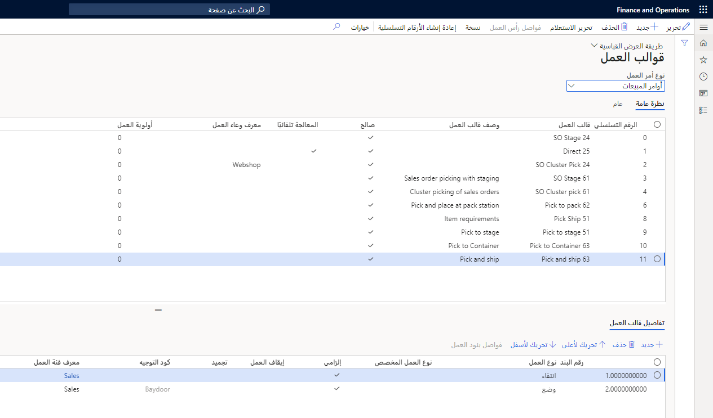
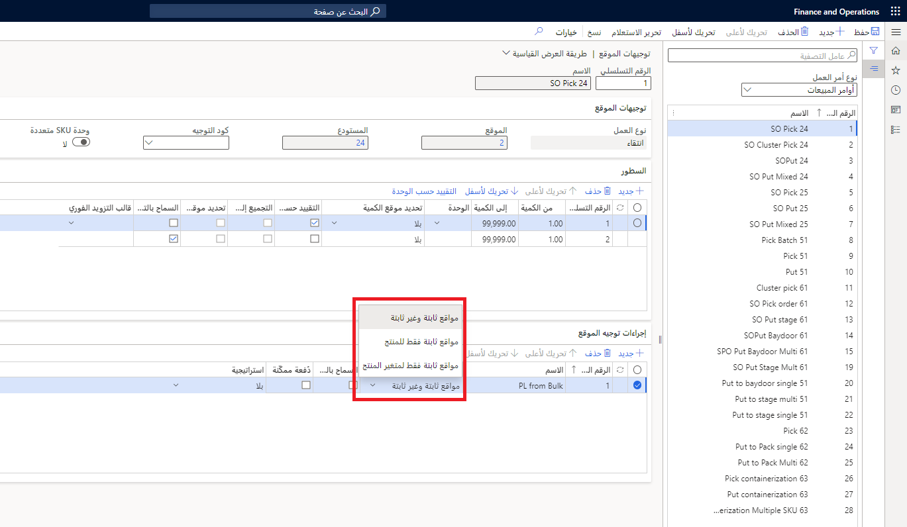
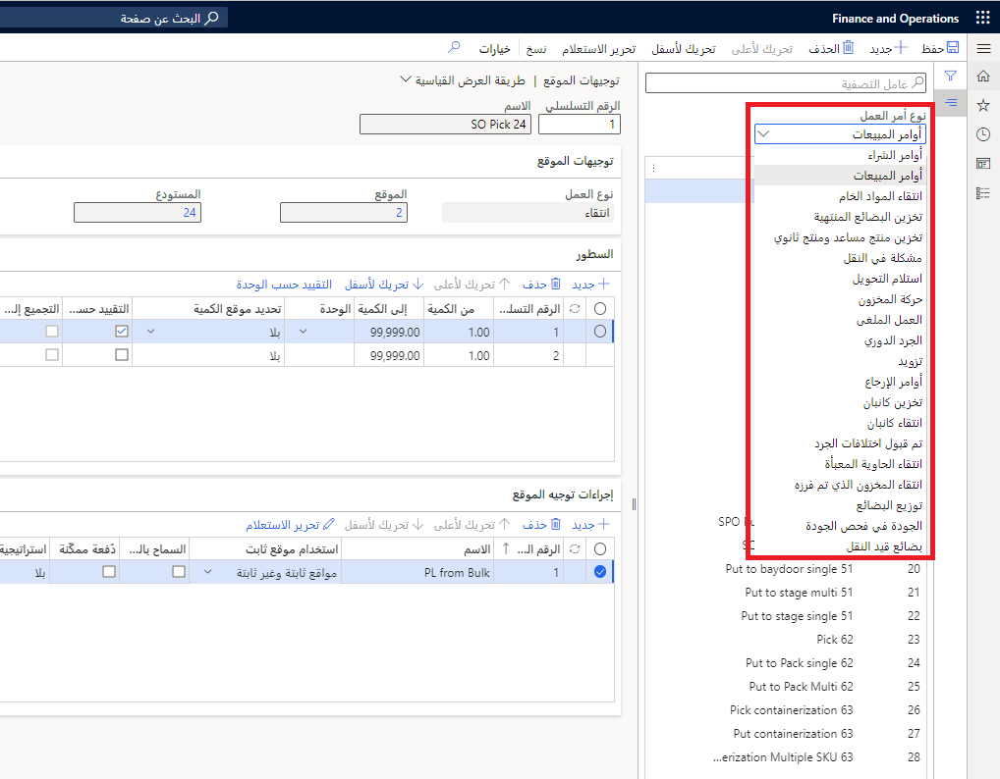
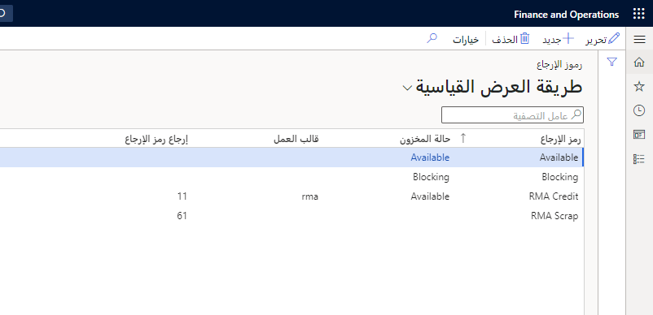

كجزء من تكوين المستودع، عليك تمكين عمليات المستودع وفقاً لمتطلبات العمل التجاري. أحد أهم المكونات التي يتعين عليك تكوينها هو قوالب الموجة وقوالب العمل وأوعية العمل وتوجيهات الموقع. 

## قوالب الموجات 

قوالب الموجة، المتوفرة في **إدارة المستودعات > الإعداد > الموجات**، تساعد في تمكين عملية الإصدار إلى المستودع الصادرة. عند إصدار بنود الأمر (إما مباشرةً من المستندات المصدر، أو من خلال عمليات الوظيفة الدُفعية، أو بالأحمال التي سبق أن تم إنشاؤها)، يتم استخدام وظيفة قوالب الموجة.

يمكنك إنشاء ثلاثة أنواع من قوالب الموجة:

-   الشحن
-   أمر الإنتاج
-   كانبان

يمكنك استخدام المعلمات لتعريف مدى تشغيل النظام تلقائياً في معالجة العمل الصادر.

يتم تحديد قالب الموجة استناداً إلى تسلسل قوالب الموجة والمعايير المحددة في القالب. إذا كان القالب مدرجاً في أعلى التسلسل، يتم فحص المعايير في هذا القالب أولاً. إذا كان من الممكن استيفاء المعايير، تتم معالجة قالب الموجة.
بخلاف ذلك، يتم فحص المعايير في القالب التالي، وما إلى ذلك.

وبالتالي، من المفيد وضع القالب الذي يتضمن المعايير الأكثر تحديداً في أعلى قائمة تسلسل قوالب الموجة بحيث تتم معالجته أولاً.

على سبيل المثال، أنت ترغب في معالجة كل العمل لشركة نقل مفضّلة اليوم وتأجيل معالجة العمل لشركات النقل الأخرى مؤقتاً.
في هذه الحالة، يجب أن يكون قالب الموجة الذي يحدد العمل لشركة النقل المفضّلة هذه مدرجاً في ترتيب أعلى في التسلسل مقارنةً بالقوالب الأخرى.
بخلاف ذلك، قد تتم معالجة العمل لشركات النقل الأخرى قبل إكمال عمل شركة النقل المفضّلة.

يجب تحديد طرق معالجة الموجة في كل قالب موجة. تختلف الطرق المتوفرة، اعتماداً على نوع قالب الموجة.

## قوالب العمل 

تُعرّف قوالب العمل المتوفرة في **إدارة المستودعات > الإعداد > العمل** العمل الذي يتم إجراؤه وكيفية إجرائه.
يمكن أن تحتوي قوالب العمل أيضاً على كود توجيه يرتبط بتوجيه موقع لتحديد مكان إجراء العمل.

تشتمل قوالب العمل على استعلام يحدد معايير العمل.
يجب أن يشمل كل قالب عملية انتقاء واحدة على الأقل وعملية وضع واحدة على الأقل لدفع عملية العمل الأساسية لنقل المخزون المتاح من موقع إلى آخر.

إذا كان على عاملين متعددين أن يتمكنوا من معالجة العمل لبعض عمليات المستودعات لديك، قد ترغب في استخدام مفهوم *التشغيل المرحلي* للمخزون وفصل تنفيذ العمل إلى درجات عمل مختلفة.

يُستخدم قالب العمل لإنشاء عمل المستودع ومعالجته في مراحل مختلفة من عملية إدارة المستودعات. يجب تحديد قالب عمل صالح مثل الانتقاء - وضع في أزواج.

**‏‫تجميع قوالب الموجة** يمكن أيضاً استخدامه في Supply Chain Management. فهو يتيح التجميع والتقسيم حسب الوظيفة المتاحة بالفعل في قالب الموجة. يمكن أن يكون استخدام هذه الوظيفة مفيداً في المستودع حيث يتم إنشاء الموجات استناداً إلى معايير محددة لكن إنشاء الموجات تلقائياً مفضّل على الإنشاء اليدوي.

### السيناريو 

يتم إنشاء أمر شراء وتأكيده وإرساله إلى المورّد. يشحن المورّد الأصناف، التي سيتم تسلمها في موقع الوارد الخاص بك.

بعد ذلك، عليك انتقاء أصناف المخزون وتخزينها بعيداً في موقع معيّن يمكن أن يمثل موقع انتقاء لأمر المبيعات.

عند إنشاء أمر المبيعات، يتم انتقاء أصناف المخزون وتخزينها في موقع للتشغيل المرحلي لتتم تعبئتها.

أخيراً، ستنتقي الأصناف المعبأة وتخزنها في موقع للصادر ليتم شحنها.

## أوعية العمل 

أوعية العمل، التي توجد أيضاً في **إدارة المستودعات > الإعداد > العمل**، تُستخدم لتنظيم عمل المستودع في مجموعات.

على سبيل المثال، يمكنك إنشاء وعاء عمل لتصنيف العمل الذي يحدث في موقع مستودع معيّن.

بالنسبة إلى جميع أنواع العمل، باستثناء الجرد، يمكنك تعيين وعاء عمل إلى قالب عمل.

بالنسبة إلى الجرد الدوري، يمكنك تعيين وعاء عمل في الصفحات التالية:

-   خطط الجرد الدوري
-   حدود الجرد الدوري
-   عمل الجرد الدوري حسب الموقع
-   عمل الجرد الدوري حسب الصنف

عند استخدام قوالب العمل لإنشاء العمل، يتم تعيين وعاء العمل تلقائياً للعمل.

يمكن أيضاً استخدام معرّفات وعاء العمل للحد من نوع العمل الذي يتم توجيهه إلى عامل في المستودع، بشرط أن تكون هذه الوظيفة مكونة على صنف قائمة الجهاز المحمول ذي الصلة.

بالإضافة إلى ذلك، يمكن لمديري المستودعات تغيير مجموعات العمل التي تم إنشاؤها للعمال، ويسمح هذا للمديرين بالتفاعل بشكل أسرع مع التغييرات التي تحدث في أرضية المتجر، مما يمكنهم من تبسيط العملية المادية عند الحاجة. 

## توجيهات الموقع 

يتم استخدام توجيهات الموقع لتوجيه حركات العمل إلى المواقع الملائمة في المستودع. بمعنى آخر، فهي تُعرّف مكان الانتقاء والوضع.

لتبسيط تعريف الإجراءات المقترنة بكل بند لتوجيه الموقع، استخدم أحد الاستراتيجيات المعرّفة مسبقاً.

على سبيل المثال، يمكنك استخدام استراتيجية *موقع فارغ بدون عمل وارد* للبحث عن المواقع الخالية في أي مستودع، أو يمكنك استخدام استراتيجية *حجز دفعة ما تنتهي صلاحيته أولاً يُصرف أولاً* لانتقاء المبيعات الصادرة.

على سبيل المثال، في حركة أمر مبيعات، تحدد توجيهات الموقع مكان انتقاء الأصناف ومكان وضع الأصناف التي تم انتقاؤها.

 يمكنك استخدام توجيهات الموقع لتنفيذ ما يلي:

-   تخزين الأصناف الواردة.
-   انتقاء الأصناف وتشغيلها مرحلياً للحركات الصادرة.
-   انتقاء المواد الخام ووضعها للإنتاج.
-   تزويد المواقع.

يمكنك استخدام صفحة **استخدام موقع ثابت** لتعيين موقع دائم أو ثابت لصنف من المخزون. يمكنك تعيين مواقع متعددة ثابتة للصنف نفسه ويمكن تعيين الموقع الثابت نفسه لأصناف متعددة. يتم استخدام المواقع الثابتة لإعداد توجيهات الموقع وتزويد المخزون.

تتضمن توجيهات الموقع ميزات متعددة تساعد في تحديد مواقع الانتقاء والوضع لحركة المخزون:

-   **محددة للمستودع** - إذا كان لديك مستودعات متعددة تم إعدادها بشكل مماثل، يمكنك استخدام ميزة النسخ. مع ذلك، لا يزال عليك إعداد توجيهات الموقع لكل واحد.
-   **هناك 16 نوعاً مختلفاً من أوامر العمل يمكنك إعداد توجيه موقع لها** - بعضها أنواع قياسية، مثل أوامر الشراء وأوامر المبيعات وإصدار النقل واستلام النقل. توجد أنواع أخرى من أوامر العمل كذلك.
    على سبيل المثال، إذا كنت تمثل شركة تصنيع، هناك أوامر عمل للبضائع المنتهية التي تم تخزينها وانتقاء المواد الخام وانتقاء كانبان. تشمل أوامر العمل الأخرى أنواعاً متعددة من الجرد الدوري وأوامر الإرجاع والتزويد.

إليك ثلاث علامات تبويب سريعة تتضمن تفاصيل حول توجيه الموقع:

-   **توجيهات الموقع** - تحدد الموقع والمستودع.
-   **البنود** - يمكنها فصل التوجيهات استناداً إلى معايير مختلفة. على سبيل المثال، يمكنها فصل التوجيهات استناداً إلى كميات الحركة. من الأمثلة، يمكن أن تستخدم توجيهاً واحداً في حالة تلقي أمر شراء يضم 1000 صنف أو أقل وآخر إذا كانت الكمية أكبر من 1000.
-   **إجراءات توجيه الموقع** - حيث يمكنك تحديد كيف يتم إجراء حركات لأصناف أو مواقع معيّنة بقدر أكبر من التفاصيل. على سبيل المثال، في حالة استلام أصناف تحتاج إلى وضعها في منطقة مبرّدة، يمكن أن ينص استعلام إجراءات توجيه الموقع على ذلك.

## رموز التخلص 

رموز الإرجاع عبارة عن مجموعة من القواعد المستخدمة عند استلام أصناف تالفة.

رمز الإرجاع، المتوفّر في **إدارة المستودعات > الإعداد > جهاز محمول**، هو حقل الغرض منه هو استخدامه في توجيه الموقع لإرجاع البضائع. ويصف الإجراء الذي سيتم اتخاذه عند معالجة عملية الإرجاع. 

شاهد هذا الفيديو للاطّلاع على عرض توضيحي لـ **قوالب العمل** و **توجيهات الموقع**.
 > [!VIDEO https://www.microsoft.com/videoplayer/embed/RE4MBmY]

