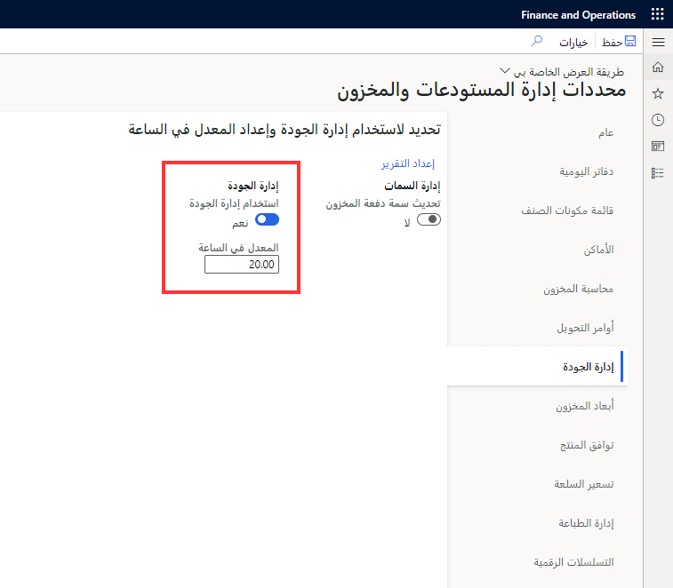
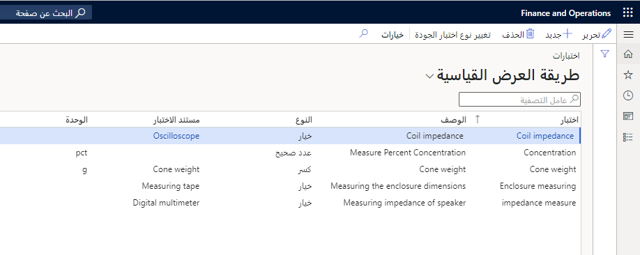
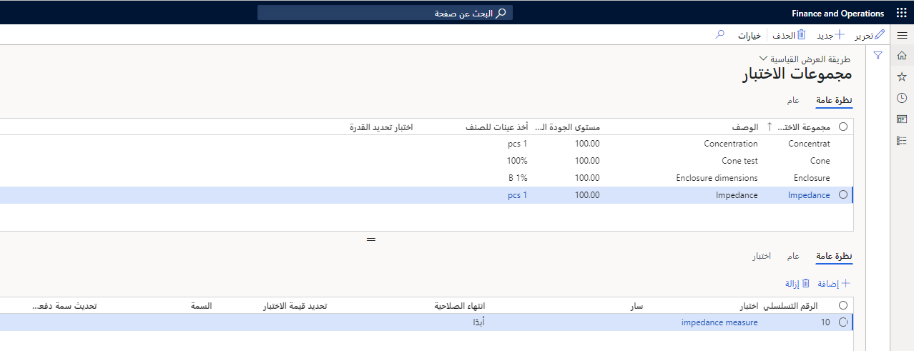
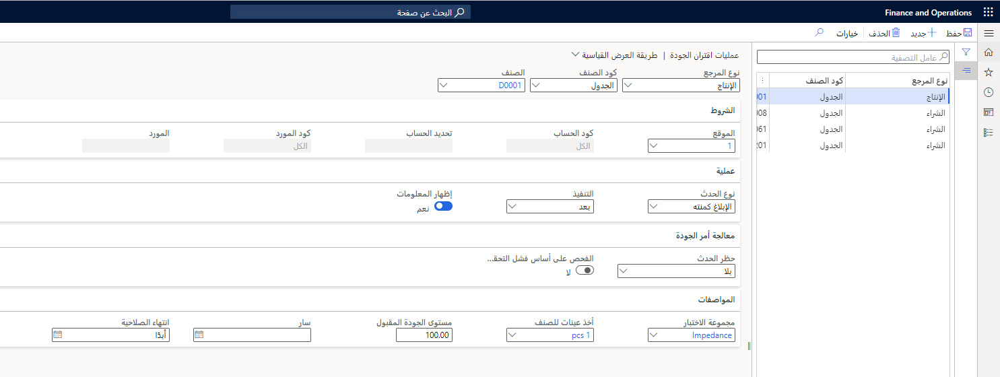
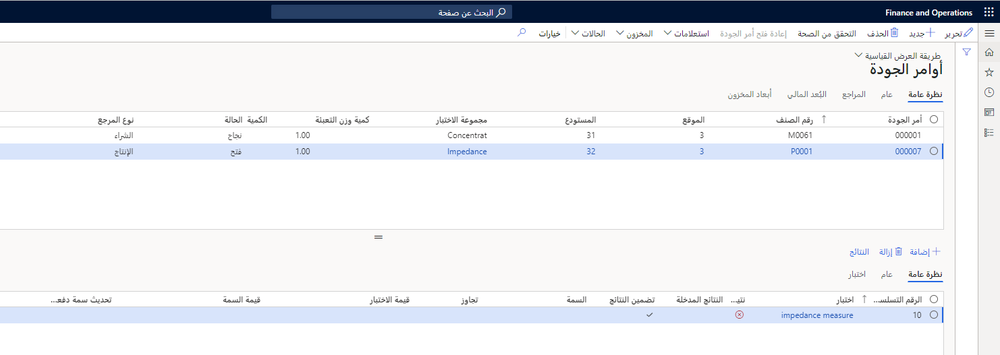
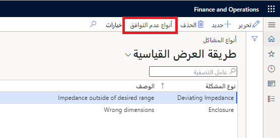
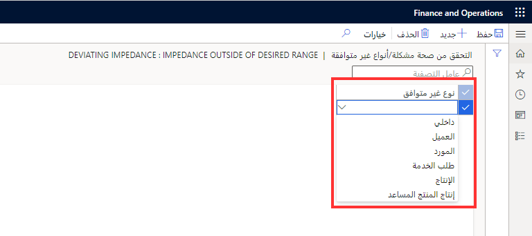
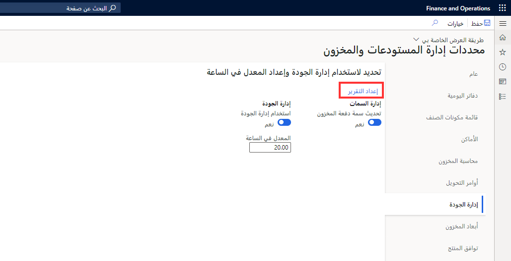
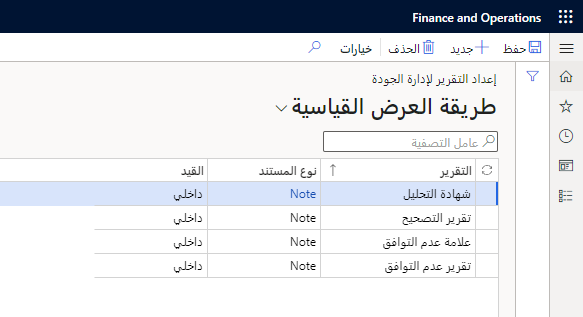

يوفر مكون التحكم في الجودة في Supply Chain Management الوصول إلى المعلمات المطلوبة لإعداد متطلبات اختبار الجودة الخاصة بإحدى الشركات وإدارتها.

تُعرِّف أوامر الجودة مجموعة من اختبار واحد أو أكثر لتنفيذها على أحد الأصناف وتعد مكوناً أساسياً في إدارة الجودة في Finance and Operations. يحدد أمر الجودة مواصفات الجودة، **مستوى الجودة المقبول** (AQL) وآلية الاختبار القابلة للتطبيق والمستندات التي تصف الاختبار والعديد من العوامل الأخرى لكل اختبار.

مع ذلك، قبل إنشاء أوامر الجودة، يجب تكوين العديد من مكونات الإعداد الاختيارية والمطلوبة.  

لإجراء الإعداد الأولي لإدارة الجودة، يجب تعيين معلمتين:

-   **إدارة جودة الاستخدام** - لتمكين وظيفة إدارة الجودة، ويجب تحديدها قبل توفر أي ميزات لإدارة الجودة. تذكر أن هذا الخيار خاص بالكيان القانوني ولا يمكن مشاركته عبر المؤسسة مع الكيانات القانونية الأخرى.

-   **الأجر بالساعة** - يتم استخدام هذا الحقل الاختياري لحساب الوقت الذي قضاه الموظف في الأنشطة المتعلقة بعمل الجودة. لا يتم استخدام هذه القيمة تلقائياً لأنه سيتم تجاوزها غالبا بواسطة اتفاقية تجارية أو قائمة أسعار من الوحدة النمطية لإدارة المشاريع والحسابات.

يتم العثور على هاتين المعلمتين في **إدارة المخزون > الإعداد > معلمات إدارة المخزون والمستودع** وعلامة تبويب **إدارة الجودة**.

## آلية الاختبار 

يمكنك استخدام آليات الاختبار لتحديد المعدات المطلوبة لتنفيذ الاختبار. تقوم آلية الاختبار بتخصيص وحدة قياس تعكس القياس المرتبط ودقته العشرية.

تعد آليات الاختبار إعداداً اختيارياً، والذي يمكنك العثور عليه عن طريق الانتقال إلى **إدارة المخزون > الإعداد > التحكم في الجودة > آليات الاختبار**.

## الاختبار 

ويكون الاختبار كمياً، ما يعني أنه يجري التعبير عن المواصفات ونتائج الاختبار كقيم لوحدة قياس محددة. بدلاً من ذلك، يمكن أن يكون الاختبار نوعياً، ما يعني أنه يجري التعبير عن المواصفات ونتائج الاختبار باعتبارها نتائج محددة من قبل المستخدم تعكس النجاح أو الفشل.

تتم إضافة الاختبارات أو تغييرها أو حذفها في أمر الجودة.

بالنسبة لمجموعة الاختبارات، يحدد أمر الجودة مستوى الجودة المقبول بالكامل، وخطة أخذ العينات وكمية الاختبار المرتبطة، والحاجة إلى اختبارات تحديد القدرة وتسلسل الاختبارات.

بعد الإبلاغ عن نتائج الاختبار لكل اختبار في أمر الجودة، قم ببدء عملية التحقق من الصحة لتعيين حالة النجاح أو الفشل (استنادا إلى تلبية مستوى الجودة المقبول الكلي). في النهاية، يجب عليك إغلاق أمر الجودة.

كجزء من عملية إنشاء الاختبار، يلزمك تحديد عمليات الأعمال المسموح بها أثناء التحقق من صحة أمر الجودة وبعده.

على سبيل المثال، يمكنك حظر تحديث الفاتورة لأمر الشراء الذي يحتوي على مخزون مرتبط في عملية الفحص.

اختيارياً، يتم إنشاء عدم المطابقة عندما يتعرف أمر الجودة على مواد معيبة. ويوفر عدم المطابقة الأساس لمزيد من الاستقصاء بعد جدولة مهام التصحيح وتسجيل إجراءات التصحيح.

انتقل إلى **إدارة المخزون > الإعداد > التحكم في الجودة > الاختبارات** لإنشاء الاختبارات والاحتفاظ بها.

## أخذ عينات للصنف 

يشير أخذ عينات الصنف إلى كمية صنف العينة التي يتم فحصها أثناء الاختبار. تكون الكمية المحددة إما مقداراً ثابتاً أو نسبة مئوية. يتم استخدام أخذ عينات أصناف مع مجموعات الاختبار واقترانات الجودة.

على سبيل المثال، لنفترض أنك تختبر كمية من الأصناف التي أخذت عينة لها. تتطلب إرشادات الشركة فحصاً عشوائياً لـ 50 قطعة على الأقل في كل شحنة يتم استلامها من مورد جديد خلال أول 90 يوماً من العلاقة. لاستيعاب هذا المتطلب، ستقوم بإعداد عينة الصنف بقيمة كمية ثابتة 50.

انتقل إلى **إدارة المخزون > الإعداد > التحكم في الجودة > أخذ عينات للصنف** لتحديد الكمية الثابتة أو النسبة المئوية للأصناف المطلوب حجزها لاختبارات أوامر الجودة.

## مجموعات الاختبار

تعد صفحة **مجموعات الاختبار** هي المكان الذي تقوم فيه بإعداد وتحرير وعرض مجموعات الاختبار والاختبارات الفردية التي يتم تعيينها لها. تحدد مجموعة الاختبار في أمر الجودة الاختبارات المعينة.

عند التنفيذ، تحدد هذه الاختبارات ما إذا كان العنصر يجتاز مراقبة الجودة أم يفشل فيها.

انتقل إلى **إدارة المخزون > الإعداد > التحكم في الجودة > مجموعات الاختبار** لإنشاء مجموعات الاختبار.

## عمليات اقتران الجودة

يتم إنشاء أوامر الجودة تلقائياً، استناداً إلى القواعد التي يتم تحديدها في صفحة **عمليات اقتران الجودة**. تتضمن القواعد الأخرى في صفحة **عمليات اقتران الجودة** إنشاء أمر جودة لأوامر الشراء وأوامر العزل وأوامر المبيعات وأوامر الإنتاج.

يتم استخدام صفحة **إدارة المخزون > الإعداد > التحكم في الجودة > عمليات اقتران الجودة** لإنشاء عمليات اقتران الجودة لإنشاء أوامر الجودة وتعقبها تلقائياً.

قبل إعداد عمليات اقتران الجودة، خذ بعين الاعتبار إنشاء مجموعات جودة الأصناف واربط أصناف متعددة بها، والتي تتيح لك تجميع الأصناف المتشابهة منطقياً لغرض الاختبار.

تُستخدم عمليات اقتران الجودة لتحديد:

-   حدث الحركة.
-   مجموعة الاختبارات التي يجب إجراؤها على الأصناف.
-   مستوى الجودة المقبول (AQL).
-   خطه أخذ العينات لأمر الجودة الذي يتم إنشاؤه بواسطة النظام.

يجب تحديد عملية اقتران جودة لكل تباين في عملية الأعمال التي تتطلب الإنشاء التلقائي لأمر الجودة. في عملية الأعمال، يمكن للنظام إنشاء أمر الجودة لأوامر الشراء وأوامر العزل وأوامر المبيعات وأوامر الإنتاج.

تدعم صفحة **عمليات اقتران الجودة** ميزة المواقع المتعددة. في حالة تحديد موقع، فإن مشغل الإنشاء التلقائي لأمر الجودة يقتصر على هذا الموقع فقط.

ويمكن ربط عملية الأعمال التي تستخدم اقتران الجودة بالعديد من مستندات المصدر، مثل أوامر الشراء أو أوامر المبيعات أو أوامر الإنتاج.

على سبيل المثال، يمكنك إعداد اقتران جودة يقوم بإنشاء أمر جودة عند تحديث إيصال تعبئة أمر الشراء. قد يتم حظر عملية التشغيل في حالة وجود أمر جودة مفتوح أو العمليات التالية، مثل فوترة أمر الشراء.

في حالة وجود أوامر جودة مفتوحة، يتم حظر إصدار الكميات المخزنية تلقائياً، والتي تم إعدادها من خلال الإعداد **الحظر الكامل** في صفحة **أخذ عينات للصنف**. تكون الكمية إما الكمية الموجودة في أمر الجودة أو الكمية الموجودة ببند المستند المصدر.

بالنسبة لعملية الأعمال المقدمة، يحدد سجل اقتران الجودة الحدث والشروط التي يتم إنشاء أمر الجودة لها. ويمكن أن تكون الشروط خاصة بأحد المواقع أو أحد الكيانات القانونية. يمكن إنشاء أمر الجودة الذي يتضمن اختبارات تحديد القدرة فقط عندما يكون المخزون الفعلي موجوداً للحدث.

شاهد الفيديو التالي لرؤية عرض توضيحي لعمليات اقتران الجودة.

&nbsp;

> [!VIDEO https://www.microsoft.com/videoplayer/embed/RE4aILs] 

## إنشاء أمر جودة يدوياً 

يمكنك استخدام صفحة **إدارة المخزون > المهام الدورية > إدارة الجودة > أوامر الجودة** لإنشاء أمر جودة يدوياً لمخزون صنف محدد وكمية الاختبار. كما تقوم أيضاً بتشغيل الاختبارات داخل مجموعة الاختبار المحددة.
 

يتم أيضاً استخدام صفحة **أوامر الجودة** لإنشاء أمر الجودة يدوياً لأمر الشراء أو أمر الإنتاج أو المخزون الفعلي. ويتم أيضاً تضمين كمية الاختبار ومجموعة الاختبار. يجب إنشاء أمر جودة يدوياً لكمية المخزون الخاصة بالصنف. يوفر سجل اقتران الجودة قيمة افتراضية لمستوى الجودة المقبول (AQL).

**السيناريو**: جاميس، عامل مستودع في Adventure Works Cycles، وقام بتفريغ صناديق المورد في المستودع الوارد ولاحظ أن أحد الصناديق يبدو معطوباً.

تنص سياسة الشركة أنه يجب إجراء اختبار جودة للأصناف المشتبه في تلفها. بالتالي، قام جاميس يدوياً بإنشاء أمر جودة لفحص المنتجات الموجودة في الصندوق.

## عدم المطابقة 

يصف عدم المطابقة المنتجات والأصناف التي لا تتوافق مع معايير الأداء أو الجودة المحددة مسبقاً. بعبارة أخرى، يصف الصنف الذي به مشكلة في الجودة. ينطبق عدم المطابقة أيضاً على خدمة العملاء أو المشاكل الداخلية، مثل شكاوى العملاء أو مشكلات الإنتاج.

يُطلق على مصدر المشكلة **نوع عدم المطابقة**. يمكنك تعيين نوع **عدم المطابقة**، ومعلومات المصدر التفصيلية له، ونوع المشكلة المقترنة عند إنشائه.

وترتبط حالات عدم المطابقة بنوع **المشكلة**، والذي يتم تحديده في صفحة  **إدارة المخزون > الإعداد > إدارة الجودة > أنواع المشاكل** . في هذه الصفحة، يمكنك تحديد أنواع المشكلات التي يمكن إقرانها بكل نوع من **عدم المطابقة**.

حدد زر **أنواع عدم المطابقة** لإقران نوع **عدم المطابقة** لضمان الجودة.

يمكنك تحديد تصنيف لأنواع المشكلات لتحليل المواد غير المطابقة بسهولة أكبر.

تتيح لك عملية عدم المطابقة إنشاء أمر عدم مطابقة يصف كمية المواد غير المطابقة ومصدر المشكلة ونوع المشكلة والملاحظات التوضيحية.

على سبيل المثال، قد تعكس أنواع المشكلات الخاصة بحالات بعدم المطابقة من نوع  **طلب الخدمة**  تصنيفاً لشكاوى العملاء، بينما قد تمثل أنواع المشكلات الخاصة بحالات عدم المطابقة من نوع **داخلي** تصنيفاً لأكواد العيوب.

توضح القائمة التالية أنواع **عدم المطابقة** والمعلومات التي يجب تسجيلها لكل نوع:

-   **العميل** - يتضمن هذا النوع رقم حساب العميل أو رقم أمر المبيعات أو رقم اللوط الخاص بحركة أمر المبيعات. على سبيل المثال، قد يرتبط عدم المطابقة بشحنة أمر مبيعات معينة أو بملاحظات العميل حول جودة المنتج.
-   **طلب الخدمة** - يتضمن هذا النوع رقم حساب العميل أو رقم أمر المبيعات أو رقم اللوط الخاص بحركة أمر المبيعات. على سبيل المثال، قد يرتبط عدم المطابقة بشحنة أمر مبيعات معينة أو بشكوى العميل بشأن جودة الصنف.
-   **المورد** - يتضمن هذا النوع رقم حساب المورد أو رقم أمر الشراء أو رقم اللوط الخاص بحركة أمر الشراء. على سبيل المثال، قد يكون عدم المطابقة مرتبطاً بإيصال أمر شراء أو بمخاوف المورد بشأن جزء من وارداته.
-   **الإنتاج** - يتضمن هذا النوع رقم أمر الإنتاج أو رقم اللوط الخاص بحركة أمر الإنتاج. على سبيل المثال، قد يرتبط عدم المطابقة بمجموعة معينة تم إنتاجها.
-   **داخلي** - يتضمن هذا النوع رقم أمر الجودة أو رقم اللوط الخاص بحركة أمر جودة. على سبيل المثال، قد يرتبط عدم المطابقة بالاختبارات التي يتم إجراؤها كجزء من أمر جودة أو بمخاوف الموظف بشأن جودة المنتج.
-   **إنتاج منتج مشترك** - يتضمن هذا النوع عدم المطابقة لأمر إنتاج منتج مشترك يرتبط بأوامر إنتاج المجموعة.

عند إنشاء عدم المطابقة، حدد نوع **عدم المطابقة** ونوع **المشكلة**. حالة الموافقة المبدئية هي **جديد**، والتي تمثل طلباً لاتخاذ إجراء.
 

الخطوة التالية هي تغيير حالة الموافقة إلى **موافق عليه** أو **مرفوض**،للإشارة إلى ما إذا كنت ستتصرف بشأن عدم المطابقة. يمكنك أيضاً إغلاق عدم المطابقة للإشارة إلى أنك قد انتهيت منها، أو يمكنك إعادة فتح عدم المطابقة للإشارة إلى وجود اعتبارات إضافية مطلوبة.

يمكنك أيضاً طباعة علامة **عدم المطابقة** وتقرير **عدم المطابقة** لتوجيه التخلص من المواد غير المطابقة.

تعرض علامة **عدم المطابقة** معلومات متشابهة وتتضمن نوع ومنطقة العزل (مثل  **محظور الاستخدام** أو   **غير قابل للاستخدام**) الذي تقوم بتعيينه إلى حالة عدم المطابقة للمساعدة في توجيه التخلص من المواد المعيبة.

على سبيل المثال، قد تشير العلامة والتقرير إلى حالة  **غير قابلة للاستخدام** أو  **الاستخدام محظور** كقيمة لحقل **نوع العزل**.
 

يمكنك بعد ذلك استخدام صفحة **إعداد التقرير** لتحديد ما إذا كان يجب طباعة تعليقات لنوع المستند هذا على تقرير عدم المطابقة وعلامة عدم المطابقة أم لا.

يمكنك تحديد أكثر من سجل واحد لطباعة أنواع مستندات مختلفة في التقرير أو لطباعة ملاحظات داخلية وخارجية. قد تجد أنه من المفيد استخدام صفحة **نوع المستند** لتحديد نوع مستند فريد لحالات عدم المطابقة ونوع مستند فريد للتصحيحات.

يمكنك إدخال تعليقات لعدم المطابقة عن طريق إرفاق مستند.

على سبيل المثال، قد ترغب في إدخال ملاحظات حول عدم المطابقة باستخدام نوع المستند الفريد لعدم المطابقة في خيارات التقرير.

يمكن أن يساعد تقرير **المطابقة** وعلامة **عدم المطابقة** في التخلص من المواد. يمكن إنشاء تقارير وعلامات، استناداً إلى معايير التحديد المقترنة بعدم المطابقة. تتضمن هذه المعايير رقم عدم المطابقة والصنف والعميل والمورد والحالة.

يعرض تقرير **عدم المطابقة** رقم عدم المطابقة، والصنف، ونوع المشكلة. واستناداً إلى سياسة إعداد التقرير، قد يعرض التقرير أيضاً ملاحظات متعلقة بعدم المطابقة.
