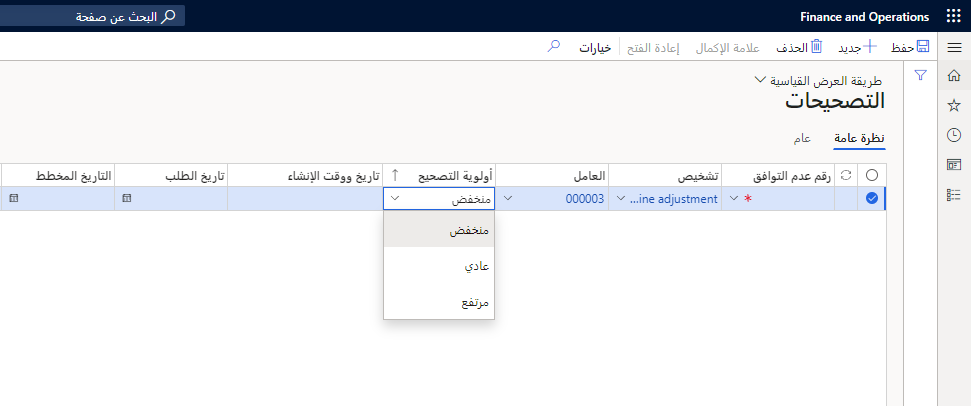
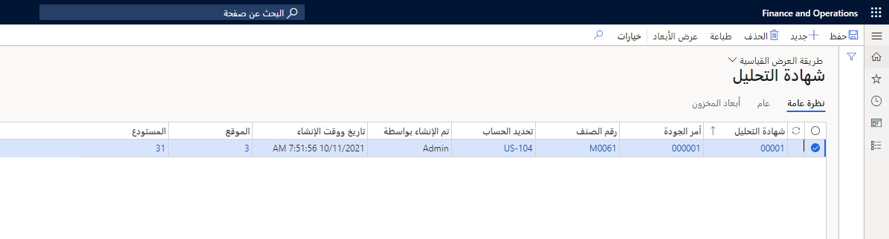

يُشار عادةً إلى عملية اختبار المنتجات بمراقبة الجودة وهي تستخدم أوامر الجودة. باستخدام وظيفة مراقبة الجودة، يمكنك تنفيذ المهام التالية:

-   تحديد الاختبارات التي يجب إخضاع المواد لها. وتشمل هذه الاختبارات مواصفات الجودة وأدوات الاختبارات القابلة للتطبيق والمستندات التي تصف الاختبار وخطة أخذ العينات ومستويات الجودة المقبولة (AQL).
-   إنشاء أمر جودة يعرّف الاختبارات التي يجب تشغيلها بالنسبة لأمر معين، مثل أمر شراء أو أمر إنتاج أو كمية مخزون معينة. يمكنك إنشاء أمر جودة يدوياً أو توليد أمر جودة تلقائياً بالاستناد إلى إرشادات الجودة.
-   تحديد إرشادات الجودة ذات الصلة بأوامر بالشراء أو العزل أو الإنتاج أو المبيعات في كل دورة عمل لتمكين التوليد التلقائي لأمر جودة يحدد متطلبات الاختبار للمواد الواردة أو الصادرة.
-   تسجيل نتائج الاختبار في أمر الجودة، والتحقق من صحة نتائج الاختبار في مقابل مستوى الجودة المقبول، وطباعة شهادة تحليل تظهر نتائج الاختبار.

## إنشاء أمر عدم مطابقة ومعالجته 

يمكن إنشاء أوامر عدم المطابقة ومعالجتها عند إعداد المكونات لعدم المطابقة.

يتم إنشاء عدم المطابقة في بادئ الأمر باستخدام حالة الموافقة **جديد**، مما يشير إلى أنه يمثل طلب اتخاذ إجراء. ويمكنك الموافقة على عدم المطابقة أو رفضه، مما يؤدي إلى تغيير حالة الموافقة إلى **موافق عليه** أو **مرفوض** للإشارة إلى الطريقة التي ستتبعها للعمل على عدم المطابقة.

يمكن أيضاً إغلاق عدم المطابقة (كما يشار إلى ذلك بعلامة اختيار منفصلة) للإشارة إلى أنك أنهيت العمل عليه. أو يمكنك إعادة فتح عدم المطابقة للإشارة إلى أنك تحتاج إلى المزيد من التفكير.

يمكنك تحديد عملية ذات صلة واحدة أو أكثر لعدم مطابقة موافق عليها. وتصف عملية ذات صلة العمل الذي يجب تنفيذه، وهي تحتوي على قائمة بعمليات الجودة التي قمت بتحديدها بالإضافة إلى نص وصفي حول سبب العمل.‬

بعد تحديد إحدى العمليات، يمكنك تحديد المصاريف المتنوعة والأصناف وساعات عمل الجدول الزمني المطلوبة لإنجاز العمل.
تظهر التكاليف المحسوبة للعملية ذات الصلة، ويظهر إجمالي التكاليف المحسوبة لعدم المطابقة.

تمثل التكلفة المحسوبة والتفاصيل الأساسية (حول الأصناف وساعات العمل والمصاريف المتنوعة) معلومات مرجعية، وتُستخدم فقط داخل وظيفة إدارة الجودة.

يمكنك إنشاء أمر جودة من عدم مطابقة عبر تنفيذ استعلام لأوامر الجودة أولاً ثم إنشاء أمر الجودة الجديد.
على سبيل المثال، بإمكان أمر الجودة أن يحدد الحاجة إلى إجراء اختبار (أو إعادة اختبار) للمواد المعيبة. يعرض أمر الجودة الذي تم إنشاؤه حديثاً الارتباط إلى عدم المطابقة الأصلي.

يمكنك إنشاء ارتباط بين عدم مطابقة وآخر، وإنشاء عدم مطابقة جديد من آخر موجود. على سبيل المثال، بإمكان الارتباط إظهار التداخل بين مشاكل الجودة.

## التعامل مع التصحيح 

لتنفيذ عملية تصحيح، يجب تعيين عدم المطابقة إلى **موافق عليه** في حقل **الموافقة**. تسمح لك صفحة **إدارة المخزون > المهام الدورية > إدارة الجودة > التصحيحات** بإنشاء قائمة بحالات عدم المطابقة التي يجب تصحيحها. يقترن كل صنف تصحيح بنوع التشخيص الذي تسبب في اكتشاف المشكلة.

تحتوي أيضاً صفحة **التصحيحات‬‏‫‏‎** على معلومات حول الجهة التي يجب عليها تنفيذ إجراء تصحيحي والوقت الذي يجب فيه تنفيذ هذا الإجراء. ويمكنك وصف تفاصيل المشكلة والإجراءات التصحيحية المطلوبة عن طريق إرفاق مستند بالتصحيح.‬ يمكنك إغلاق" صنف التصحيح عن طريق تحديد الخيار **مكتمل** بعد معالجة عدم المطابقة. يمكنك أيضاً الإشارة إلى أن الحل كان قصير الأجل.

ننصحك باستخدام صفحة **نوع المستند** لتحديد نوع مستند فريد للتصحيحات. ويمكنك بعد ذلك استخدام صفحة **إعداد التقرير** لتحديد ما إذا كانت التعليقات لنوع المستند هذا مطبوعة في تقرير التصحيح. يعرض تقرير التصحيح المطبوع معلومات حول عدم المطابقة والملاحظات ذات الصلة بعدم المطابقة. ويتضمن التقرير أيضاً معلومات حول التصحيح، مثل نوع التشخيص وملاحظات التصحيح ذات الصلة.

## إدارة تقارير الجودة 

تتوفر بعض التقارير لإدارة وظيفة إدارة الجودة في Supply Chain Management. تركّز هذه الوحدة على تقارير **عدم المطابقة** و **علامة عدم المطابقة** و **التصحيحات**.

-   يعرض تقرير **عدم المطابقة** معلومات تعريف تتعلق بعدم المطابقة مثل الرقم والصنف ونوع المشكلة. ويعرض التقرير الملاحظات ذات الصلة استناداً إلى سياسات إعداد التقرير. يتم إنشاء التقارير بشكل انتقائي استناداً إلى معايير التحديد، مثل رقم عدم المطابقة أو الصنف أو العميل أو المورّد أو الحالة المرتبطة بعدم المطابقة.
-   تعرض **علامة عدم المطابقة** معلومات تعريف تتعلق بعدم المطابقة مثل الرقم والصنف. وتعرض العلامة الملاحظات ذات الصلة استناداً إلى سياسات إعداد التقرير. وتعرض العلامة أيضاً منطقة العزل ونوعه (مثل الاستخدامات المقيدة أو الاستخدام في مقابل عدم قابلية الاستخدام) اللذين تم تعيينهما لعدم المطابقة لإرشاد عملية التخلص من المواد المعيبة.
-   يعرض تقرير **التصحيحات** معلومات تعريف حول عدم المطابقة وملاحظات عدم المطابقة ذات الصلة، بالإضافة إلى معلومات حول التصحيح، مثل التشخيص وملاحظات التصحيح ذات الصلة. ويعرض التقرير ملاحظات التصحيح ذات الصلة استناداً إلى سياسات إعداد التقرير.

## شهادة التحليل 

تُظهر شهادة التحليل أن المواد أو المنتجات قد خضعت للاختبار وتبيّن أنها متوافقة مع المواصفات أو المعايير المحددة مسبقاً.

تُستخدم أيضاً صفحة **إدارة المخزون > الاستعلامات والتقارير > إدارة الجودة > شهادة التحليل** لتحضير شهادة تحليل لأمر جودة بطريقة يدوية.

 
