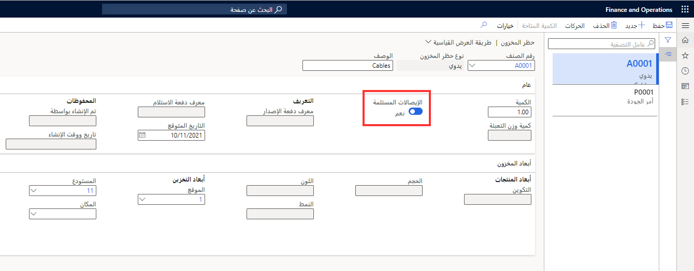

تساعد عملية حظر المخزون في منع معالجة الأصناف أو استهلاكها. يمكنك حظر أصناف المخزون بالطرق التالية:

-   يدوياً
-   عن طريق إنشاء أمر جودة
-   عن طريق استخدام عملية تُنشئ أمر جودة
-   عن طريق استخدام معلمة **حظر المخزون**

## حظر الأصناف يدوياً 

يمكنك حظر كمية من أحد الأصناف عن طريق إنشاء حركة في صفحة **حظر المخزون**. تجدر الإشارة إلى أنه يمكن إجراء حظر يدوي للأصناف المتوفّرة في المخزون الفعلي فقط.

وبالنسبة إلى الكميات التي يتم حظرها يدوياً، عليك تحديد ما إذا كان يجب أن تتضمن أنشطة التخطيط عمليات الاستلام المتوقعة ككمية فعلية متوقعة.
عمليات الاستلام المتوقعة هي أصناف محظورة تتوقع توفّرها كمخزون فعلي بعد اكتمال الفحص. ويمكنك الاحتفاظ بالتاريخ المتوقع.

يكون خيار **عمليات الاستلام المتوقعة** محدداً بشكل افتراضي للأصناف المحظورة من خلال أمر جودة. يمكنك إلغاء الحظر اليدوي لكمية معيّنة عن طريق حذف الحركة في صفحة **إدارة المخزون > مهام دورية > حظر المخزون**.

 

## حظر الأصناف عن طريق إنشاء أمر جودة

يمكنك تحديد أصناف يجب فحصها عن طريق إنشاء أمر جودة في صفحة **أوامر الجودة**. عند إنشاء أمر جودة، يتم حظر الكمية التي تحددها لأحد الأصناف. وتتحكم خطة أخذ العينات المقترنة بعناصر التحكم في أمر الجودة في كمية الأصناف التي يجب فحصها فقط، وليس في الكمية التي يتم حظرها.

ويُذكر أن الكمية التي يتم إدخالها في أمر الجودة هي الكمية المحظورة، بصرف النظر عن الكمية التي تحدد خطة أخذ العينات ضرورة إرسالها للفحص.

## حظر الأصناف عن طريق استخدام عملية تُنشئ أمر جودة 

إذا حددت عملية جودة ضرورة فحص أحد الأصناف، يتم حظر كمية من هذا الصنف تلقائياً. وبالتالي، عند إنشاء أمر جودة تلقائياً، تتحكم خطة أخذ عينات الصنف المقترنة بأمر الجودة في كمية الأصناف المحظورة والكمية التي يجب فحصها.

في حالة تحديد الخيار **حظر كامل** في صفحة **إدارة المخزون > الإعداد > التحكم في الجودة > أخذ عينات للصنف**، يتم على سبيل المثال حظر الكمية الكاملة لبند أمر الشراء خلال عملية الفحص، بصرف النظر عن كمية أخذ عينات الصنف.
 

**مثال**

يحدد اقتران للجودة ضرورة إنشاء أمر جودة عند ترحيل إيصال تعبئة أمر الشراء.

ويحدد إعداد أخذ عينات الصنف لأمر الجودة ضرورة فحص 10 بالمائة من الكمية الموجودة في بند أمر الشراء.

ولأن الخيار **حظر كامل** محدد في إعداد أخذ عينات الصنف، يجب حظر الكمية الكاملة لبند أمر الشراء خلال عملية الفحص، بصرف النظر عن الكمية التي يتم إرسالها للفحص.

عند ترحيل إيصال التعبئة، يتم إنشاء أمر جودة. يتم إرسال عشرة بالمائة من كمية أمر الشراء للصنف إلى الفحص. ويتم حظر الكمية الكاملة لبند أمر الشراء.

## حظر الأصناف عن طريق استخدام معلمة حظر المخزون 

يمكنك تحديد حالات المخزون التي تكون حالات حظر باستخدام معلمة **حظر المخزون** في صفحة **إدارة المستودعات > الإعداد > المخزون > حالات المخزون**.

لا يمكنك استخدام حالات المخزون كحالات حظر لأوامر الإنتاج أو أوامر المبيعات أو أوامر النقل أو حركات الصادر أو تكامل المشاريع. وبالنسبة إلى العمل الصادر، استخدم الأصناف بحالة المخزون "متوفر".

على سبيل المثال، إذا كانت الأصناف بالحالة **حظر**، ويتم تشغيل التخطيط الرئيسي على هذه الأصناف، تعتبر هذه الأصناف غير موجودة ويتم تزويد المخزون تلقائياً.
