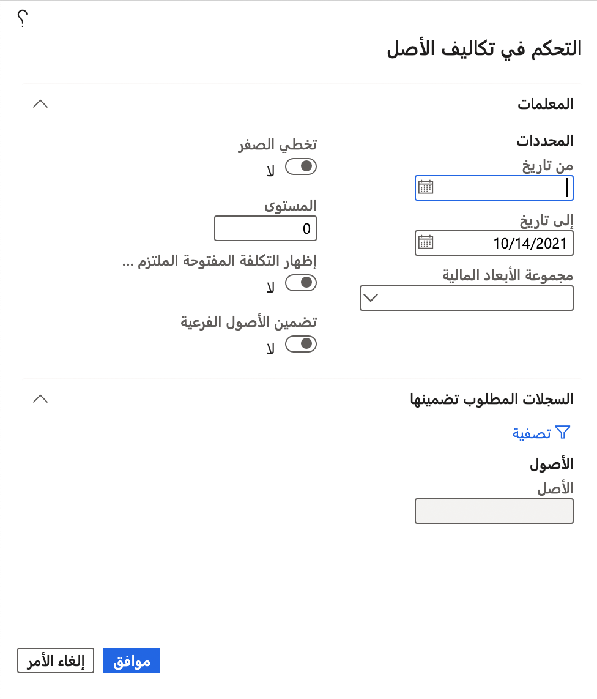

تُعتبر الحسابات التي يتم إجراؤها للأصول ومواقع العمل وأوامر العمل متطابقة تقريباً. الاختلاف الوحيد هو أنه بالنسبة للأصول ومواقع العمل، يمكنك أيضاً تضمين الأصول الفرعية والمواقع الفرعية في الحساب. التاريخ هو تاريخ الحركة الذي تم فيه التسجيل.

1.  حدد المسار بناءً على نوع التحكم في التكلفة الذي تريد الوصول إليه:
    - بالنسبة إلى النوع **التحكم في تكلفة الأصول**، انتقِل إلى **إدارة الأصول > الاستعلامات > الأصول > التحكم في تكلفة الأصول** 
    - بالنسبة إلى النوع **التحكم في تكلفة مواقع العمل**، انتقِل إلى **إدارة الأصول > الاستعلامات > الأصول > التحكم في تكلفة مواقع العمل**
    - بالنسبة إلى النوع **أوامر العمل**، انتقِل إلى **إدارة الأصول > الاستعلامات > أوامر العمل > التحكم في تكلفة أوامر العمل**
2.  بعد ذلك، يتم توفير مربع حوار بناءً على النموذج الذي تريد الوصول إليه. في مربع الحوار **التحكم في تكلفة الأصول** / **التحكم في تكلفة مواقع العمل** / **التحكم في تكلفة أوامر العمل**، حدد نطاقاً زمنياً ليتم حسابه، على سبيل المثال **1 أكتوبر 2019 – 31 ديسمبر 2019**.
3.  حدد **مجموعة الأبعاد المالية** المطلوب تضمينها في الحساب، مثل **بند الخدمة**.
4.  حدد **نعم** على زر التبديل **تخطي الصفر** إذا لم ترغب في رؤية أي قيم مدرجة بالمبلغ صفر.
5.  يعين حقل **المستوى** تفاصيل بنود التحكم في التكلفة التي تريدها لمواقع العمل.
    - **1** = ستتم إضافة جميع المواقع مع بعضها في موقع عمل متعدد المستويات ويتم عرضها في موقع عمل من المستوى الأعلى.
    - **0** = سيتم عرض جميع القيم التفصيلية لجميع البنود متعددة المستويات لموقع العمل.
6.  حدد **نعم** في زر التبديل **إظهار التكلفة الإلزامية المفتوحة** لتضمين التكاليف الإلزامية المفتوحة في الحساب.
7.  حدد **نعم** في زر التبديل **تضمين الأصول الفرعية** لعرض التكاليف المرتبطة بالأصول الفرعية كبنود منفصلة.
8.  لتقييد البحث، يمكنك تحديد أصول أو مواقع عمل أو أوامر عمل معينة في علامة التبويب السريعة **السجلات المطلوب تضمينها**.
9.  حدد **موافق** لبدء الحساب.

يظهر الشكل التالي مثالاً على مربع الحوار **التحكم في تكلفة الأصول**.
**إدارة الأصول > الاستعلامات > الأصول > التحكم في تكلفة الأصول**

 

في صفحة **التحكم في تكلفة الأصول**، يمكنك تجميع النتائج حسب التاريخ والأصل وموقع العمل وأمر العمل ونوع مهمة الصيانة. لتجميع النتائج، حدد الأزرار ضمن التجميع المقترن. على سبيل المثال، ضمن القسم الفرعي **تجميع حسب التاريخ**، يمكنك تحديد التجميع حسب **الشهر**. 

