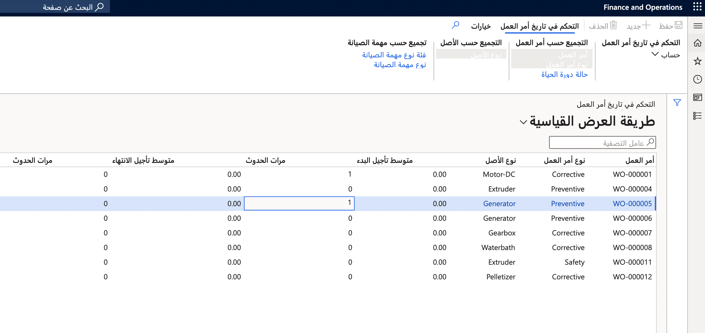

استخدم حساب **التحكم في تاريخ أمر العمل** للحصول على نظرة عامة حول تواريخ البدء والانتهاء المتوقعة مقارنة بتواريخ البدء والانتهاء الفعلية لأوامر العمل.

1.  حدد **إدارة الأصول > الاستعلامات > أوامر العمل > التحكم في تاريخ أمر العمل**.
2.  حدد **حساب**.
3.  في موقع العمل في الحقل **موقع العمل**.
4.  اختر تواريخ الحساب من خلال تحديد حقلي **تاريخ من** و **تاريخ إلى**. سيتم تضمين كافة أوامر العمل التي لها تاريخ بدء متوقع داخل النطاق.
5.  حدد **موافق**.
6.  حدد أزرار **تجميع حسب** لإظهار مستوى التفاصيل المطلوب للعملية الحسابية. يتم تمييز أزرار **تجميع حسب** المحددة. حدد زراً لتنشيطه أو إلغاء تنشيطه.

**إدارة الأصول > الاستعلامات > أوامر العمل > التحكم في تاريخ أمر العمل**

 

