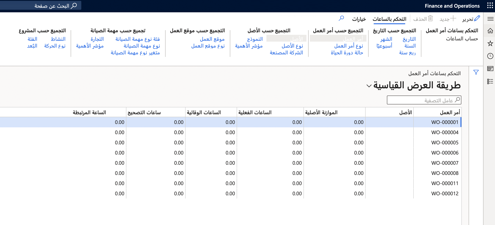

يمكنك حساب الساعات للحصول على نظرة عامة على الساعات الفعلية مقارنة بالساعات المدرجة في الموازنة على الأصول أو مواقع العمل أو أوامر العمل. وتعتمد الساعات الفعلية على المعاملات المرحلة.

## إنشاء عنصر تحكم في ساعة أمر العمل للأصول ومواقع العمل وأوامر العمل
تُعتبر الحسابات التي يتم إجراؤها للأصول ومواقع العمل وأوامر العمل متطابقة تقريباً. الاختلاف الوحيد هو أنه بالنسبة للأصول ومواقع العمل، يمكنك أيضاً تضمين الأصول الفرعية والمواقع الفرعية في الحساب. التاريخ هو تاريخ الحركة الذي تم فيه التسجيل.

1.  حدد المسار استناداً إلى نوع عنصر التحكم في الساعة الذي ترغب في الوصول إليه:
    - بالنسبة لنوع **التحكم في ساعة الأصل**، انتقل إلى **إدارة الأصول > الاستعلامات > الأصول > التحكم في ساعة الأصل** 
    - بالنسبة لنوع **التحكم في ساعة موقع العمل**، انتقل إلى **إدارة الأصول > الاستعلامات > الأصول > التحكم في ساعة موقع العمل**
    - بالنسبة لنوع **التحكم في ساعة أمر العمل**، انتقل إلى **إدارة الأصول > الاستعلامات > أوامر العمل > التحكم في ساعة أمر العمل**
2.  في مربع الحوار **التحكم في ساعة الأصل** أو **التحكم في ساعة موقع العمل** أو **التحكم في ساعة أمر العمل**، حدد الفترة التي سيتم حسابها في الحقلين **تاريخ البدء** و **تاريخ الانتهاء**.
3.  حدد مجموعة أبعاد مالية لتضمينها في الحساب.
4.  حدد **نعم** في زر التبديل **تخطي التكلفة الصفرية** إذا لم ترغب في عرض النتائج مع تضمين ساعات صفرية.
5.  حقل **المستوى** يقوم بتعيين مدى تفاصيل بنود التحكم في الساعة التي تريدها لمواقع العمل.
    - **1** = ستتم إضافة جميع المواقع مع بعضها في موقع عمل متعدد المستويات ويتم عرضها في موقع عمل من المستوى الأعلى.
    - **0** = سيتم عرض جميع القيم التفصيلية لجميع البنود متعددة المستويات لموقع العمل.
6.  حدد **نعم** في زر التبديل **تضمين الأصول الفرعية** لعرض التكاليف المرتبطة بالأصول الفرعية كبنود منفصلة.
7.  لتقييد نطاق البحث، يمكنك تحديد أصول محددة أو مواقع عمل أو أوامر عمل في علامة التبويب السريعة **السجلات المطلوب تضمينها**.
8.  حدد **موافق** لبدء الحساب.
9.  تتكون علامة التبويب **التحكم في الساعة** من الأقسام الفرعية التي تتيح لك تجميع البيانات حسب **تجميع حسب التاريخ** و **تجميع حسب أمر العمل** و **تجميع حسب الأصل** و **تجميع حسب موقع العمل**. حدد الخيار المتاح ضمن الأزرار **تجميع حسب** لإظهار مستوى تفاصيل العملية الحسابية التي تريدها، مثل **تجميع حسب التاريخ** ثم حدد **ربع السنة**.

    **إدارة الأصول > الاستعلامات > أوامر العمل > التحكم في ساعة أمر العمل**.
 
    

توضح الخطوات التالية طريقه أخرى لإجراء حساب ساعة:

1.  حدد أصولاً متعددة في **كل الأصول** أو **الأصول النشطة**. 
2.  حدد الزر **التحكم في الساعة** في علامة التبويب السريعة **عام**. يتم إدراج الأصول المحددة تلقائياً في حقل **الأصل** في علامة التبويب السريعة **السجلات المطلوب تضمينها**. 
3.  حدد **موافق** في مربع الحوار **التحكم في ساعة الأصل**؛ سيتم عرض حساب الأصول المحددة. 

> [!NOTE]
> يمكن تنفيذ نفس الإجراء لمواقع العمل في **كل مواقع العمل** أو **مواقع العمل النشطة** ولأوامر العمل في **كل أوامر العمل** أو **أوامر العمل النشطة**.

