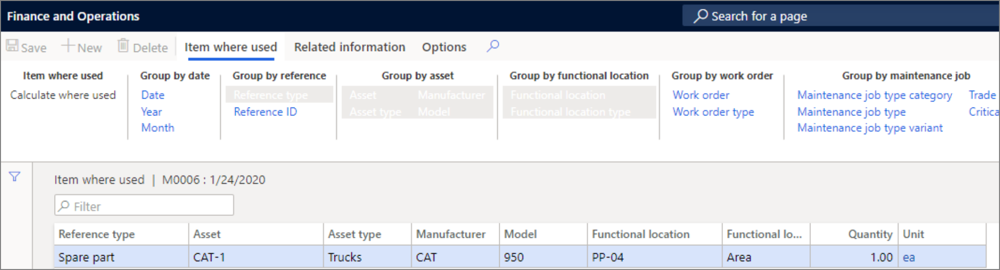

توفر العملية الحسابية **مكان استخدام الصنف** نظرة عامة على مكان استخدام الصنف في إدارة الأصول وتتضمن كيفية استخدام الصنف في أثناء مدة بقائه. يمكن فتح صفحة **مكان استخدام الصنف** من قائمة إدارة الأصول الرئيسية، كما يمكن الوصول إليها من الصفحات الآتية:

- **‏‫قوائم مكونات الأصناف (BOM)‬‬ الخاصة بالأصول**
- **الأجزاء الاحتياطية** في الإعدادات الافتراضية لنوع الأصل‬
- **فئات أنواع مهام الصيانة** و **أنواع مهام الصيانة** و **متغيرات أنواع مهام الصيانة** و **‏‫العمليات التجارية المرتبطة بأنواع مهام الصيانة‬** و **قوائم فحص الصيانة**
- **التنبؤ بمتطلبات الصيانة**
- **المشتريات**
- **شراء أمر العمل**

لإنشاء العملية الحسابية "مكان استخدام الصنف"، اتبع الخطوات الآتية:

1.  انتقل إلى **إدارة الأصول > الاستعلامات > مكان استخدام الصنف** أو حدد زر **مكان استخدام الصنف** في إحدى الصفحات المذكورة سابقاً.
2.  في مربع حوار **مكان استخدام الصنف**، حدد الصنف الذي ترغب في إجراء عملية حسابية له في حقل رقم الصنف، مثل **A0001**.
3.  يعمل حقل **المستوى** على تعيين مدى تفاصيل سطور الصنف التي تريدها لأماكن العمل.
    - **1** = ستتم إضافة جميع المواقع مع بعضها في موقع عمل متعدد المستويات ويتم عرضها في موقع عمل من المستوى الأعلى.
    - **0** = سيتم عرض جميع القيم التفصيلية لجميع البنود متعددة المستويات لموقع العمل.
4.  في قسم **تضمين**، حدد **نعم** في أزرار التبديل التي تريد تضمينها في العملية الحسابية.
5.  حدد **موافق** لبدء الحساب.
6.  في علامة التبويب **مكان استخدام الصنف**، حدد زر **تصنيف حسب** لإظهار مستوى التفاصيل المطلوب للعملية الحسابية. يتم تمييز أزرار **تجميع حسب** المحددة. حدد زراً لتنشيطه أو إلغاء تنشيطه.
7.  إذا كنت ترغب في عرض الأبعاد المرتبطة بالصنف، فحدد **أبعاد العرض** ثم حدد الأبعاد التي سيتم عرضها.

**إدارة الأصول > الاستعلامات > مكان استخدام الصنف**
 

 

