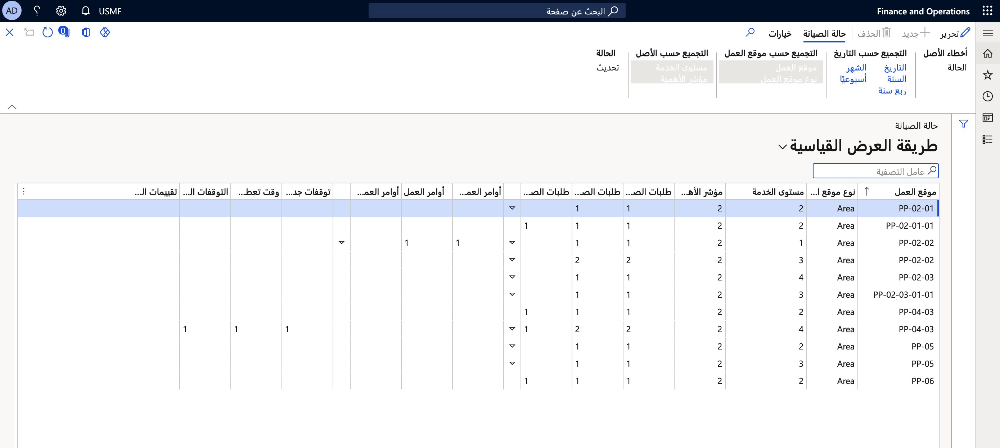

في إدارة الأصول، يمكنك إجراء عمليات حسابية توفر مراجعة محددة بفترة معينة لطلبات الصيانة الجديدة والنشطة والمكتملة وأوامر العمل وأنشطة وقت تعطل الصيانة. يمكنك أيضاً رؤية عدد تقييمات الحالات المكتملة للفترة نفسها. 

استخدم العملية الحسابية الآتية للحصول على نظرة عامة حول حمل العمل الخاص بطلبات الصيانة الواردة والمكتملة وأوامر العمل.

لإجراء عملية حسابية لحالة الصيانة، اتبع الخطوات الآتية:

1.  انتقل إلى **إدارة الأصول > الاستعلامات > حالة الصيانة**.
2.  في مربع حوار **حالة العملية الحسابية**، حدد النطاق الزمني الذي تريد إجراء العملية الحسابية خلاله في الحقلين **تاريخ البدء** و **تاريخ الانتهاء**.
4.  حقل **المستوى** يقوم بتعيين مدى تفاصيل بنود الصيانة التي تريدها لأماكن العمل.
    - **1** = ستتم إضافة جميع المواقع مع بعضها في موقع عمل متعدد المستويات ويتم عرضها في موقع عمل من المستوى الأعلى.
    - **0** = سيتم عرض جميع القيم التفصيلية لجميع البنود متعددة المستويات لموقع العمل.
3.  حدد **موافق** لبدء الحساب.
4.  يسمح لك زر **تجميع حسب** بتحديد مستوى التفاصيل المطلوب. يتضمن زر **تجميع حسب** المحدد **تجميع حسب التاريخ** و **تجميع حسب موقع العمل** و **وتجميع حسب الأصل**. ضمن كل زر، يمكنك اختيار كيفية تحديدها. على سبيل المثال، ضمن **تجميع حسب التاريخ**، يمكنك تحديد تجميع حسب **الأسبوع**.
5.  حدد زر **تحديث** لتحديث العملية الحسابية في كل مرة تقوم فيها بإجراء تغييرات عن طريق تنشيط أو إلغاء تنشيط أزرار **تجميع حسب** أو بإجراء عملية حسابية لفترة جديدة.
6.  حدد **الحالة** إذا كنت تريد إنشاء عملية حسابية لحالة صيانة جديدة. 

**إدارة الأصول > الاستعلامات > حالة الصيانة**.
 

> [!NOTE]
> النتائج التي يتم عرضها في مساحة **حالة الصيانة** تتضمن فقط طلبات الصيانة وأوامر العمل التي لها بداية فعلية ووقت محدد. قد يكون الحقلين **تاريخ الانتهاء** و **وقت الانتهاء** فارغين.