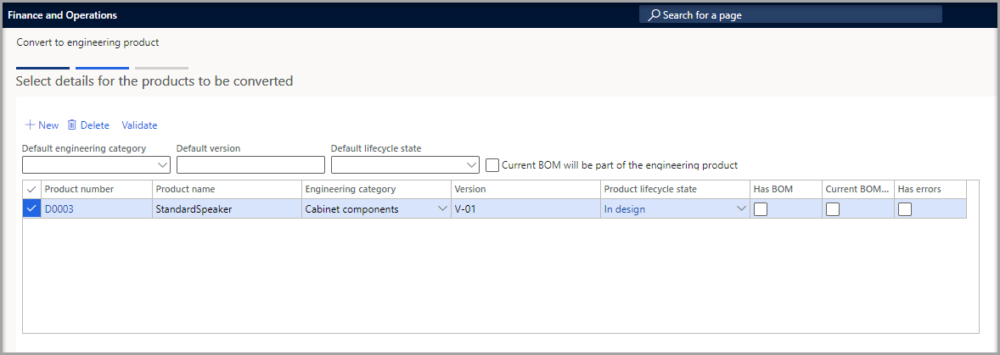

يساعدك معالج **التحويل إلى منتج هندسي** على تحويل المنتج (المنتجات) الحالي إلى منتجات هندسية. عندما يتم تحويل المنتج، ستتمكن من إدارة هذه المنتجات باستخدام الوظيفة الإضافية لإدارة التغيير الهندسي لـ Microsoft Dynamics 365 Supply Chain Management. 

سيقوم المعالج بتحويل المنتج إلى منتج هندسي، منتج ذو إصدار حيث لا يتم تعقب الإصدار في المعاملات (لا يتم استخدام بُعد الإصدار). 

> [!NOTE]
> التحويل دائم؛ لذا لن تتمكن من عكسه لاحقاً.

لتحويل المنتجات إلى منتجات هندسية، اتبع الخطوات التالية:

1.  انتقل إلى  **إدارة معلومات المنتج > المنتجات > المنتجات الصادرة**.

1.  في الشبكة، حدد خانة الاختيار لكل منتج تريد تحويله.

1.  في جزء الإجراءات، في علامة التبويب  **المهندس** ، في مجموعة  **إدارة التغيير الهندسي** ، حدد  **التحويل إلى منتج هندسي** لفتح المعالج.

1.  تعرض صفحة  **تحديد تفاصيل المنتجات المراد تحويلها**  كل منتج حددته قبل فتح المعالج. افحص القائمة.

1.  يمكنك استخدام الحقول التالية في الجزء العلوي من الشبكة لتعيين قيم افتراضية لكل منتج مسجل. لن يتم تعيين القيم الافتراضية للمنتجات حيث تم بالفعل تعيين قيمة ذات صلة.

    -   **فئة الهندسة الافتراضية**  - حدد فئة منتج هندسي مبدئي لتعيينها لكل منتج مسجل.

    -   **الإصدار الافتراضي**  - أدخل إصدار المنتج الأولي لتعيينه لكل منتج مسجل.

    -   **حالة دورة الحياة الافتراضية**  - حدد حالة دورة حياة المنتج الأولي لتعيينها لكل منتج مسجل.

    -   **ستكون قائمة مكونات الصنف الحالية جزءاً من المنتج الهندسي** - حدد خانة الاختيار هذه إذا كان يجب استخدام قائمة مكونات الصنف الحالية لكل منتج مدرج كقائمة مكونات صنف للمنتج الهندسي.

1.  راجع كل منتج مدرج في الشبكة، ثم قم بتقييم مدى تطبيق القيم الافتراضية التي قمت بتعيينها عليه.

    -   **رقم المنتج** - رقم المنتج.

    -   **اسم المنتج** - اسم المنتج.

    -   **الفئة الهندسية**  - حدد فئة المنتج الهندسي التي يجب أن ينتمي إليها المنتج بعد تحويله.

    -   **الإصدار**  - أدخل إصدار المنتج لتعيينه للمنتج بعد تحويله.

    -   **حالة دورة حياة المنتج**  - حدد حالة دورة حياة المنتج التي يجب أن يكون المنتج فيها بعد تحويله. تتيح لك حالة دورة حياة المنتج التحكم في الحركات المسموح بها لإصدار هندسي معين. لمزيد من المعلومات، راجع  [حالات دورة حياة المنتج والحركات](/dynamics365/supply-chain/engineering-change-management/product-lifecycle-state-transactions/?azure-portal=true).

    -   **يحتوي على قائمة مكونات الصنف** - إذا تم تحديد خانة الاختيار هذه، فإنها تشير إلى أن المنتج يحتوي على قائمة مكونات الصنف.

    -   **ستكون قائمة مكونات الصنف الحالية جزءاً من المنتج الهندسي** - حدد خانة الاختيار هذه إذا كان يجب استخدام قائمة مكونات الصنف الحالية كقائمة مكونات صنف للمنتج الهندسي. بعد ذلك، ستتم إدارة قائمة مكونات الصنف بواسطة إدارة التغيير الهندسي. إذا لم يكن المنتج يحتوي على قائمة مكونات الصنف، أو إذا كنت تفضل إنشاء قائمة مكونات الصنف يدوياً للمنتج المحول لاحقاً، فقم بإلغاء تحديد خانة الاختيار هذه.

    -   **يحتوي على أخطاء** - إذا تم تحديد خانة الاختيار هذه، فإنها تشير إلى أن إعداد المنتج به خطأ واحد أو أكثر. على سبيل المثال، قد لا يتطابق نوع المنتج أو مجموعة الأبعاد مع الفئة. سيتم تخطي المنتجات التي تحتوي على أخطاء ولن يتم تحويلها.

    > [!div class="mx-imgBorder"]
    > 

1.  عند الانتهاء، حدد  **التحقق من الصحة**  على شريط الأدوات للتحقق إعداد المنتج. بالنسبة لكل صف، سيتم تحديث خانة الاختيار  **يحتوي على أخطاء**  للإشارة إلى حالة المنتج. اضبط القيم حتى يخلو إعداد كل منتج من الأخطاء.

1.  عند إعداد جميع المنتجات بشكل صحيح، حدد  **التالي** للمتابعة. تعرض صفحة  **تأكيد التحديد**  عدد المنتجات التي لا تحتوي على أخطاء في إعدادها وبالتالي فهي جاهزة للتحويل. كما يعرض أيضاً عدد المنتجات التي سيتم تخطيها بسبب الأخطاء.

1.  لتشغيل التحويل كوظيفة دُفعية، قم بتعيين  **تشغيل في دُفعة**  إلى  **نعم**.

1. حدد  **إنهاء**.

> [!NOTE]
> إذا تم إعداد نظامك لقبول المنتجات يدوياً قبل إصدارها، فتأكد من قبول كل منتج تم تحويله باستخدام  **فتح إصدارات المنتج** في الشركات المناسبة. لمزيد من المعلومات، راجع قسم **مراجعة المنتج وقبوله قبل طرحه في الشركة المحلية** في صفحة [‏‫الإرشادات التفصيلية حول ميزة إدارة التغيير الهندسي‬](/dynamics365/supply-chain/engineering-change-management/engineering-scenarios?azure-portal=true#accept).
