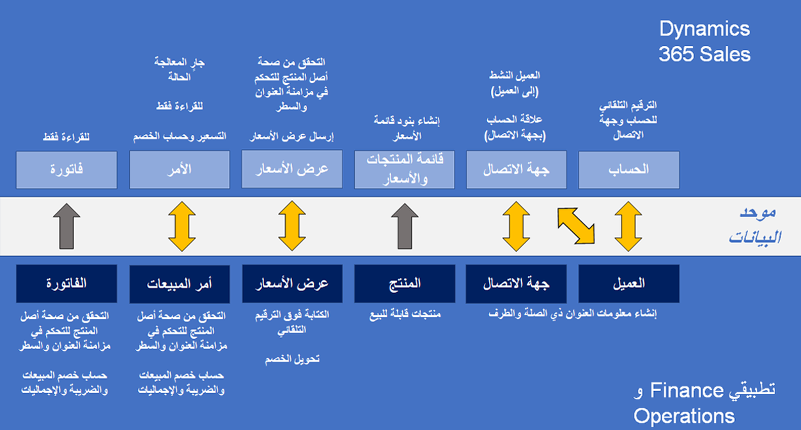

يعد تحويل العملاء المتوقعين إلى عملاء والحفاظ على اتصال الأعمال طويل الأجل مع هؤلاء العملاء هدفاً أساسياً لمعظم الشركات. تحدث عملية العميل المتوقع إلى النقد في تطبيقات 365 Microsoft Dynamics من خلال عروض الأسعار أو سير عمل معالجة الطلبات، وتتم تسوية البيانات المالية والتعرف عليها. عندما تجمع بين العميل المتوقع إلى النقد والكتابة المزدوجة، فإنك تقوم بإنشاء عملية تقبل عرض الأسعار والأمر إما من 365 Sales Microsoft Dynamics أو Microsoft Dynamics 365 Supply Chain Management ثم جعلهما متاحين في كلا التطبيقين.

يمكنك الاطلاع على حالات المعالجة في الوقت الحقيقي ومعلومات الفواتير في واجهات التطبيق. نتيجة لذلك، بدون الحاجة إلى إعادة إنشاء عروض الأسعار والأوامر، يمكنك إدارة العمليات بشكل أكثر كفاءة مثل تخزين المنتجات ومعالجة المخزون والتنفيذ في Supply Chain Management.

يوضح الرسم التالي تدفق بيانات العميل بين Dynamics 365 Sales وتطبيقات التمويل والعمليات. العملاء عبارة عن مفاهيم معرفة جيداً عبر تطبيقات Dynamics 365. لذا فإن تكامل بيانات العميل هو مسألة مزامنة التطبيقات. تُظهر الرسومات وحدة تكامل البيانات التي تقوم بمزامنة بيانات العميل بين التطبيقات، ويمكنك رؤية تعيينات **العملاء** على **الحساب** وتعيينات **جهة الاتصال** على **جهة الاتصال**، وما إلى ذلك.

> [!div class="mx-imgBorder"]
> 

لمزيد من المعلومات حول تكامل العملاء وجهات الاتصال، راجع [مدير العميل المتكامل.](/dynamics365/fin-ops-core/dev-itpro/data-entities/dual-write/customer-mapping/?azure-portal=true)

للحصول على معلومات حول تكامل المنتج، راجع [تجربة المنتج الموحدة](/dynamics365/fin-ops-core/dev-itpro/data-entities/dual-write/product-mapping/?azure-portal=true).

> [!NOTE]
> في Dynamics 365 Sales، يشير كل من العميل المحتمل والعميل إلى سجل في جدول **الحساب** حيث يكون العمود **نوع العلاقة** إما عميل **متوقع** أو **عميل**. إذا كان منطق عملك يتضمن عملية تأهيل **الحساب** حيث يتم إنشاء سجل **الحساب** وتأهيله باعتباره عميلاً محتملاً أولاً ثم عميلا حقيقيا، تتم مزامنة هذا السجل مع تطبيق التمويل والعمليات فقط عندما يكون عميلاً حقيقيا (نوع_العلاقة = عميل). إذا كنت تريد مزامنة صف **الحساب** كعميل متوقع، فأنت بحاجة إلى مخطط مخصص لدمج بيانات العميل المتوقع
