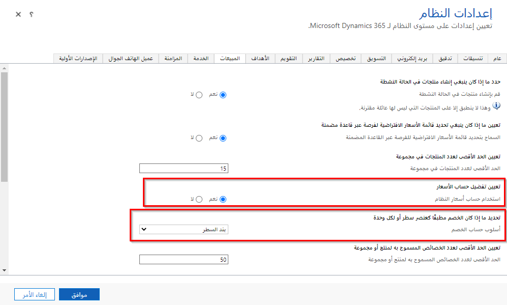
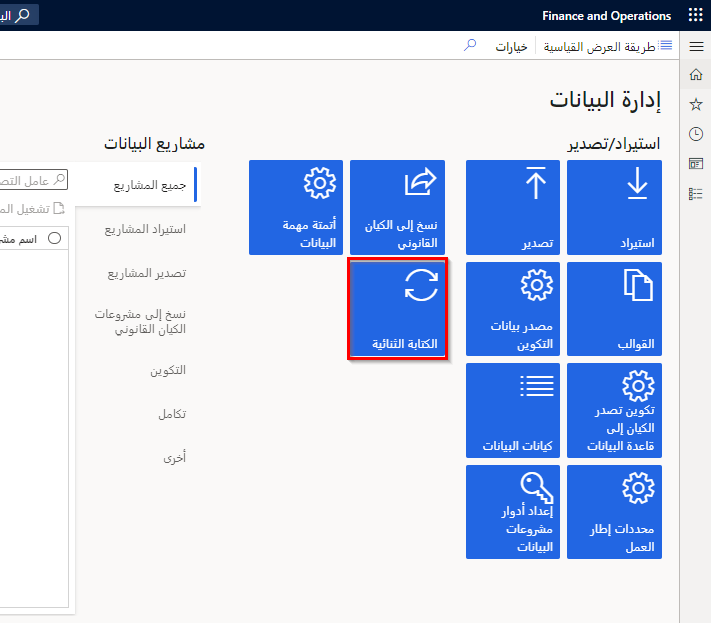

قبل البدء في استخدام الخدمات المتكاملة لمزايا العميل المتوقع إلى النقدي و‏‫مزايا الكتابة المزدوجة، يتعين عليك أولاً مراعاة المتطلبات الأساسية المختلفة ومتطلبات التعيين.

## الإعداد في المبيعات

قبل المتابعة، تأكد من أن الإعدادات التالية نشطة وتم تكوينها. تحقق من التعليمات ولقطات الشاشة في الأقسام التالية.

للبدء، في Dynamics 365 Sales، انتقل إلى **الإعدادات > الإدارة > إعدادات النظام > المبيعات** وقم بإجراء تغييرات على المواقع التالية.

- قم بتعيين خيار **استخدام حساب تسعير النظام** إلى **نعم**.

- قم بتعيين عمود **أسلوب حساب الخصم** إلى **أصناف البنود**.

> [!div class="mx-imgBorder"]
> 

## التعيين في Supply Chain Management

لاستخدام الكتابة المزدوجة وتكوينها، يمكن البدء بربط بيئة Supply Chain Management بـ Microsoft Dataverse باستخدام معالج **الكتابة المزدوجة** ثم تمكين خرائط الكيانات.

لتكوين الكتابة المزدوجة في Supply Chain Management، اتبع الخطوات التالية:

1. قم بتسجيل الدخول إلى Supply Chain Management.

1. انتقل إلى مساحة عمل **إدارة البيانات**.

1. من مساحة عمل **إدارة البيانات** حدد **الإطار المتجانب** للكتابة المزدوجة.

    > [!div class="mx-imgBorder"]
    > 

1. حدد **ارتباط جديد للبيئة**، والذي سيطلق **إعداد ارتباط إلى معالج Dataverse**. 

1. في صفحة **اختيار البيئة** ، حدد البيئة التي تريد الارتباط بها. ستعرض هذه الصفحة جميع بيئات Dataverse التي يعد المستخدم الذي سجل الدخول إليها مسؤولاً عنها.

1. حدد الكيانات القانونية الخاصة بك المراد ربطها. سيتم بعد ذلك إجراء التحقق من السلامة للتحقق من أن نظامك يفي بمتطلبات تمكين الكتابة المزدوجة.

1. سيتم عرض ملخص. مراجعة إشعار الخصوصية والمحتوى ثم تحديد **إنشاء**. يتم الآن إنشاء ارتباط بين Supply Chain Management وبيئة Dataverse.

1. تطبيق حل تزامن تطبيق الكتابة المزدوجة.

1. في صفحة **الكتابة المزدوجة** في Supply Chain Management، حدد **تطبيق الحل** لتطبيق خرائط الكيانات التي قمت بتنزيلها عند إنشاء الارتباط بين البيئات.

1. بعد تطبيق الحل، سترى خرائط الكيانات الافتراضية منشورة.

## المواقع والمستودعات

الأعمدة الخاصة بـ **الموقع** و **المستودع** مطلوبة في Supply Chain Management لبنود عروض الأسعار وبنود الأمر على التوالي. ستتم ملء أعمدة الموقع والمستودع تلقائياً عند إضافة منتج إلى بند عرض الأسعار أو سطر الأمر إذا تم تكوين إعدادات الأمر الافتراضية للقيام بذلك.

## التسلسلات الرقمية لعروض الأسعار والأوامر

عند إجراء عروض الأسعار والأوامر ومزامنتها في المبيعات وSupply Chain Management، لا يتم ربط التسلسلات الرقمية لـ Supply Chain Management والمبيعات. عند مزامنة أمر المبيعات الذي تم إنشاؤه في المبيعات لـ Supply Chain Management، يكون له نفس رقم أمر المبيعات في كلا المكانين. يمكن تطبيق أنظمة تسلسل رقمي مختلفة في التطبيقين للمساعدة في ضمان عدم تكرار رقم أمر المبيعات.

على سبيل المثال، يبدأ التسلسل في Supply Chain Management بالرقم **1**، ثم **2**، **3**، **4**، **5** (وهكذا)، لكن السلسلة في المبيعات تبدأ بالرقم **100**، ثم **99**، **98**، **97** (وهكذا). سيتم إنشاء رقم الأمر في Supply Chain Management لأنك إذا قمت بإنشاء 100 أمر مبيعات في المبيعات، فسيتم إنشاء رقم الأمر. بشكل أساسي، نظراً لوضع أوامر المبيعات في Supply Chain Management والمبيعات، سيتداخل التسلسلان الرقميان في النهاية. استخدم تسلسلاً رقمياً في Supply Chain Management، مثل **F1** و **F2** و **F3** (وهكذا)، وتسلسل رقمي في المبيعات، مثل **C1 وC2 وC3** (وهكذا). لن تكون أرقام أوامر المبيعات التي تم إنشاؤها بواسطة هذه الأرقام التسلسلية مكررة أبداً.

## القوالب

تتضمن ميزة "‏‫العميل المتوقع إلى النقدية" مجموعة من خرائط الجدول الأساسية التي تعمل معاً أثناء تفاعل البيانات. راجع [تحويل العميل المحتمل إلى نقود في كتابة مزدوجة> قوالب](/dynamics365/fin-ops-core/dev-itpro/data-entities/dual-write/dual-write-prospect-to-cash?azure-portal=true#templates) لعرض قائمة خرائط الجدول في تطبيقات التمويل والعمليات وتطبيقات تفاعل العملاء.
