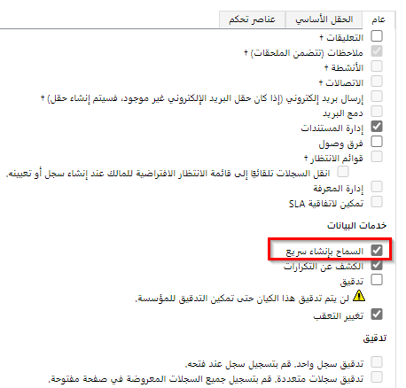

يمكنك إنشاء عروض أسعار للمبيعات في Sales أو Supply Chain Management. عند إنشاء عرض أسعار في Sales، تتم مزامنته مباشرة مع Supply Chain Management. وبطريقة مماثلة، عند إنشاء عرض أسعار في Supply Chain Management، تتم مزامنته مع Sales في الوقت الحقيقي تقريبًا.

- في عرض الأسعار، يمكنك إضافة خصم إلى المنتج. وستتم مزامنة الخصم مع Supply Chain Management في هذه الحالة. يتحكم تكوين Supply Chain Management في أعمدة **الخصم** و **الرسوم** و **الضريبة** في رأس الصفحة. لا يسمح هذا التكوين بتعيين التكامل. وبدلاً من ذلك، يعمل Supply Chain Management على إدارة أعمدة **السعر** و **الخصم** و **الرسوم** و **الضريبة** والاحتفاظ بها.

- في رأس عرض أسعار المبيعات، تكون أعمدة **النسبة المئوية للخصم** و **الخصم** و **مبلغ الشحن** متاحة للقراءة فقط.

- التعيينات الافتراضية لا تتضمن أعمدة **شروط الشحن** و **شروط التسليم** و **طريقة الشحن** و **وضع التسليم**. لتعيين هذه الأعمدة، قم بإنشاء تعيين قيمة مخصص للبيانات في المؤسسات التي تتم مزامنة قاعدة البيانات معها.

إذا كنت تستخدم Microsoft Dynamics 365 Field Service أيضًا، فتأكد من تمكين معلمة **الإنشاء السريع لبنود عرض الأسعار** مرة أخرى. تتيح لك إعادة تمكين الخيار متابعة إنشاء بنود عرض الأسعار باستخدام وظيفة "الإنشاء السريع" بعد تعطيلها. راجع الخطوات الآتية للتحقق من تمكين معلمة **الإنشاء السريع لبنود عرض الأسعار**.

1. انتقل إلى تطبيق Dynamics 365 Sales.

1. حدد أيقونة الإعدادات في شريط التنقل العلوي.

1. حدد **الإعدادات المتقدمة**.

1. حدد خيار **تخصيص النظام**.

1. حدد صنف قائمة **بند عرض الأسعار**.

1. انتقل إلى قسم **خدمات البيانات** ، ثم حدد خانة الاختيار **السماح بالإنشاء السريع**.

> [!div class="mx-imgBorder"]
> 

شاهد مقطع الفيديو الوارد أدناه للتعرف على المزامنة بين Supply Chain Management وSales.

> [!VIDEO https://www.microsoft.com/videoplayer/embed/RWMLRD]
