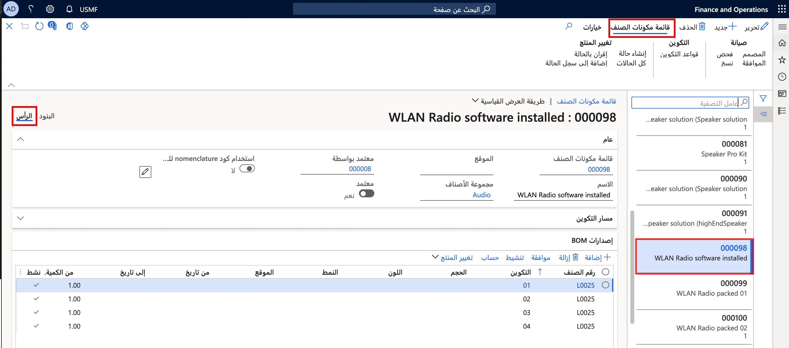
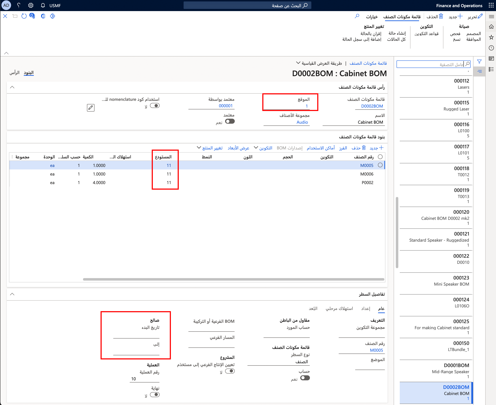

لربط قائمة مكونات الصنف أو معادلة محددة بمتغير منتج يمكن إنتاجه، ستحتاج إلى إنشاء إصدار قائمة مكونات الصنف أو إصدار معادلة. 

يمكن تقييد صلاحية إصدارات قائمة مكونات الصنف وإصدارات المعادلة بواسطة:

- الفترة
- الكمية
- الموقع
- أبعاد المنتج المحددة
- معايير أخرى 

تحتوي إصدارات المعادلة على سمات هامة إضافية، مثل:

- العائد
- تحديدات المنتج المساعد والمنتج الثانوي
- إرشادات توزيع التكلفة للمعادلة.

**إدارة معلومات المنتج > قوائم مكونات الصنف والصيغ > قوائم مكونات الصنف** (حدد منتجاً) > **رأس العنوان**

## اعتماد إصدارات الصيغة وقائمة مكونات الصنف

يجب اعتماد إصدار قائمة مكونات الصنف حتى تتمكن من استخدامها في عملية التخطيط أو التصنيع. عند اعتماد إصدار قائمة مكونات الصنف، يمكن أيضاً اعتماد قائمة مكونات الصنف المرتبطة، اعتماداً على التحديد الخاص بالمستخدم وحقوق المصادقة. لاحظ أنه لا يمكن اعتماد إصدار قائمة مكونات الصنف إلا إذا تم اعتماد قائمة مكونات الصنف المرتبطة.

## تنشيط قائمة مكونات الصنف أو إصدار الصيغة الافتراضي

لتعيين قائمة مكونات الصنف أو صيغة محددة كإصدار قائمة مكونات الصنف الافتراضي أو إصدار الصيغة الذي سيتم استخدامها بواسطة التخطيط الرئيسي أو المستخدم لإنشاء أوامر الإنتاج، يجب تنشيط الإصدار. عندما يتم تنشيط الإصدار، يتم التحقق من تفرد الإصدار الخاص بالقيود المحددة (على سبيل المثال، الفترة أو الموقع أو الكمية). إذا كان الإصدار الذي تحاول تنشيطه يتعارض مع إصدار نشط بالفعل، ستتلقى رسالة خطأ. في حالة حدوث ذلك، ستحتاج إما إلى إلغاء تنشيط الإصدار المتعارض أو تعديل قيود الإصدار (غالباً ما تكون الفترة) لمنع التنشيط الغامض.

## تغيير المنتج مع إدارة الحالة

توفر حالة تغيير المنتج للموافقة وتنشيط قائمة مكونات الصنف الجديدة أو المتغيرة وإصدارات قائمة مكونات الصنف طريقة بسيطة للاطلاع على النظرة العامة حول قيود إصدار شجرة المواد. كما يمكن اعتماد كافة قوائم مكونات الأصناف والصيغ المرتبطة بتغيير معين وتنشيطها لأحد تواريخ التنشيط.

## إصدارات قائمة مكونات الصنف البديلة

في بعض الأحيان، يجب عدم استخدام إصدار قائمة مكونات الصنف النشط أو إصدار الصيغة في التنبؤات أو المبيعات أو المنتج الأصلي. في هذه الحالة، يمكنك تحديد قائمة مكونات الصنف معتمدة محددة كجزء من المتطلب (بند التنبؤ أو بند المبيعات أو بند قائمة مكونات الصنف) في حالة وجود إصدار قائمة مكونات الصنف معتمد أو إصدار صيغة لقائمة مكونات الصنف أو الصيغة البديلة.

عند إنشاء الأوامر المخططة أو أوامر الإنتاج أو بطاقات كانبان، يمكن لمشرف حالة الإنتاج أو المتجر استخدام أي إصدار من إصدارات قائمة مكونات الصنف المعتمدة والذي يكون صالحاً في تاريخ الإنتاج المخطط المطلوب التخطيط له أو إنتاج منتج معين. لا يجب تنشيط إصدار قائمة مكونات الصنف المستخدم على أنه إصدار قائمة مكونات الصنف الافتراضي.

**معلومات المنتج وإدارته > قوائم مكونات الصنف والمعادلات > قوائم مكونات الصنف** (حدد منتجاً) **> البنود**

يسمح تحكم إصدار قائمة مكونات الصنف (BOM) بإدخال تغييرات مستمرة على الصنف وباستخدام تكوينات مختلفة وفقاً لظروف التصنيع. يدعم التحكم في الإصدار أيضاً الإيقاف التدريجي للمكونات القديمة لتمكين إنتاج مكونات جديدة أو شرائها.

تتيح لك أساليب التحكم في الإصدار بدء إنتاج إصدارات محددة من قائمة مكونات الصنف (BOM) وإيقاف إنتاجها. يوجد تاريخ انتهاء صلاحية لجميع إصدارات قائمة مكونات الصنف (BOM).
ومع ذلك، يمكن منع هذا التاريخ إذا قمت بالموافقة على الإصدار الجديد وتنشيطه. عندئذٍ، يبدأ النظام على الفور بالتخطيط والشراء بالاستناد إلى المعلومات الموجودة في إصدار قائمة مكونات الصنف (BOM) الجديد النشط.

على سبيل المثال، تقرر إحدى الشركات بدء إنتاج أحد منتجاتها الأكثر مبيعاً، طراز مضخم الصوت، في موقعها التشغيلي الثاني. ونتيجة لذلك، يتم إنشاء إصدار جديد لقائمة مكونات الصنف (BOM) لنموذج مضخم الصوت هذا، وتتم الموافقة عليه وتنشيطه. يكون هذا الإصدار مماثلاً للإصدار الرئيسي ولكنه لموقع مختلف.

بالإضافة إلى جعل أحد الإصدارات نشطاً أو غير نشط، تقدم Supply Chain Management الكثير من الطرق الأخرى للتحكم في إصدار قائمة مكونات الصنف (BOM) المستخدم في الإنتاج. تشمل هذه الأساليب ما يلي:

-   التاريخ والكمية
-   عنصر تحكم الموقع

بإمكان الكيانات القانونية إنشاء إصدارات متعددة لقائمة مكونات الصنف (BOM) (مماثله من حيث الكمية والتواريخ) التي يتم إنتاجها في مواقع مختلفة. وفي هذه الحالة، يمكنك إنشاء إصدار قائمة مكونات الصنف (BOM) في صفحة **بند قائمة مكونات الصنف** وتحديد الموقع الذي يكون إصدار قائمة مكونات الصنف صالحاً له في حقل **الموقع**. (إذا لم يتم تحديد أي موقع، فإن إصدار قائمة مكونات الصنف يكون صالحاً لجميع المواقع.)

يسمح لك التحكم في الإصدار المستند إلى الموقع بالتحكم في إصدارات قائمة مكونات الصنف (BOM) الجاهزة للإنتاج، بالاستناد إلى الموقع حيث يتم إنتاجها.

بإمكان الكيانات القانونية تعيين قائمة مكونات صنف (BOM) لمنتجات أو إصدارات متعددة، وفقاً لمصدرها وما إذا كان من الضروري أن يمر المنتج عبر عمليات تصنيع مختلفة. على سبيل المثال، قد تتم معالجة المنتج بواسطة موارد مختلفة أو قد تكون لديه مسارات مختلفة.

من الممارسات الشائعة في المجال أن تستخدم الكيانات القانونية المعرف نفسه لإنشاء منتج في مواقع مختلفة باستخدام مسارات مختلفة. ولدعم هذه الحالة، يمكنك تحديد إصدار عام لقائمة مكونات الصنف (BOM) لا يحدد موقعاً أو مستودعاً معيناً.

## نسخ إصدارات قائمة مكونات الصنف

عندما تكون قوائم مكونات الأصناف متشابهة في Supply Chain Management، يمكن لوظيفة النسخ تبسيط إنشاء الإصدارات الجديدة. يمكنك نسخ قوائم مكونات الأصناف الموجودة في صفحة **نسخ قائمة مكونات قائمة الصنف/المسار**. بعد نسخ أصناف قائمة مكونات الصنف، يمكنك تغيير أو حذف بنود قائمة مكونات الصنف التي لا تتوافق مع الإصدار الجديد ثم إدراج بنود جديدة.

إذا كانت قائمة مكونات الصنف الموجودة تحتوي على تكوينات، فسيقوم النظام أيضاً بنسخ التكوينات، جنباً إلى جنب مع قواعدها ومساراتها إلى قائمة مكونات الصنف الجديدة.

## تغيير إصدارات قائمة مكونات الصنف

يمكن إجراء تغييرات على إصدارات قائمة مكونات الصنف في حالة تغيير المكونات أو في حالة تغيير المورد المرتبط بإصدار قائمة مكونات الصنف. كما يمكن تغيير إصدارات قائمة مكونات الصنف إذا نفد الصنف الأصلي من المخزون أو كان بحاجة للترقية.

تلخص الخطوات التالية كيفية إجراء تغييرات على إصدار قائمة مكونات الصنف:

1.  إنشاء قائمة مكونات الصنف وإصدار قائمة مكونات الصنف.
2.  اعتماد الإصدار الجديد.
3.  تحديد التواريخ/الموقع الخاص بالوقت والمكان الذي يكون فيه هذا الإصدار نشطاً وتنشيط الإصدار.
4.  نسخ قائمة مكونات الصنف من إصدار قائم.
5.  إجراء أي تغييرات على الصنف أو الأصناف المطلوبة في الإصدار الجديد.

 
