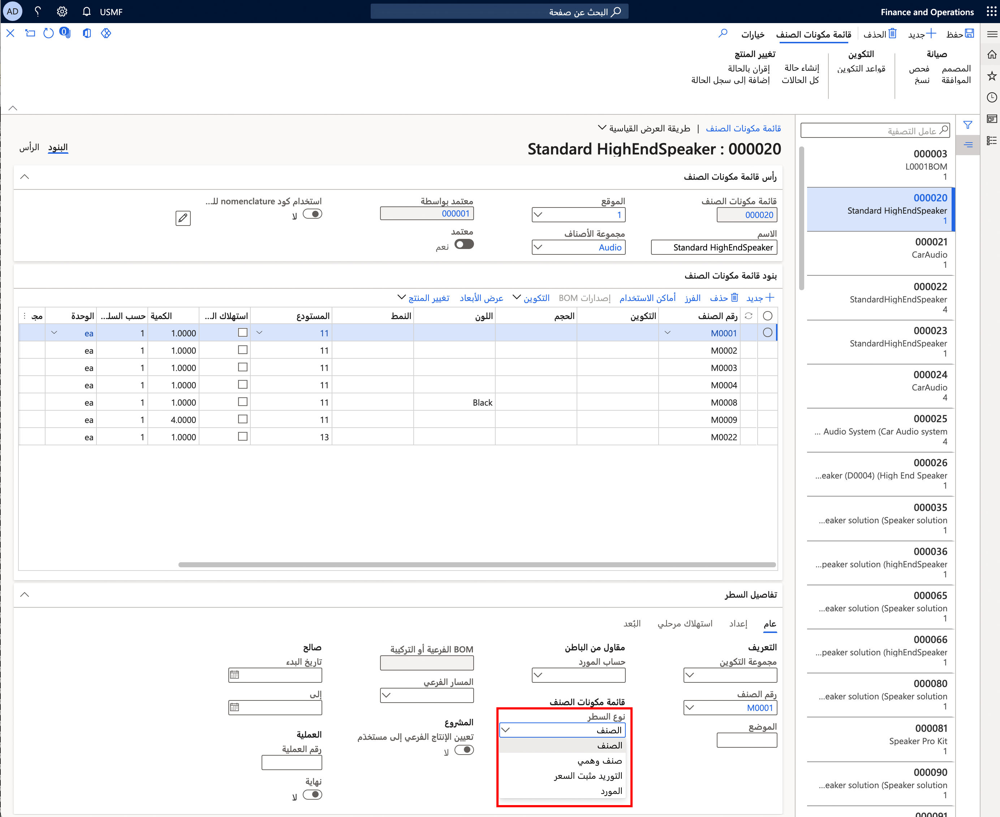

تقدم Supply Chain Management أنواع متعددة من بنود قائمة مكونات الصنف:

-   **الصنف** - حدد نوع بند الصنف للمواد أو الخدمات التي يتم استهلاكها مباشرةً، والتي لا تحتاج إلى عملية تحديد إضافية لإجمالي المكونات المطلوبة‬ أو توريد مثبت سعر.

-   **التوريد مثبت السعر‬** - حدد نوع بند التوريد مثبت السعر‬ عندما ترغب في إنشاء إنتاج فرعي أو كانبان لحدث بند قائمة مكونات الصنف، أو أمر شراء مباشر لأي متغير منتج يشير إليه بند قائمة مكونات الصنف.
    يتم إنشاء الإنتاج الفرعي أو كانبان الحدث أو أمر الشراء عند تقدير أمر الإنتاج. يتم حجز كميات الأصناف المطلوبة تلقائياً لأمر الإنتاج الذي يتم استهلاكه.

-   **وهمي** - حدد نوع بند الصنف الوهمي عندما ترغب في تحديد إجمالي المكونات المطلوبة لأي صنف منخفض المستوى من أصناف قائمة مكونات الصنف (BOM) الموجودة في بند قائمة مكونات الصنف (BOM). عند استخدام بنود قائمة مكونات صنف من نوع وهمي، يتم استبدال بند قائمة مكونات الصنف الأصل الذي يشير إلى متغير المنتج الذي يتضمن قائمة مكونات صنف وهمية بأصناف مكونات يتم سردها كبنود قائمة مكونات صنف في قائمة مكونات الصنف هذه. يتم تحديد ذلك بواسطة إصدار قائمة مكونات الصنف النشطة المعمول بها لمتغير المنتج هذا. وإذا كان متغير المنتج يتضمن مساراً نشطاً قابلاً للتطبيق، فيتم دمج عمليات هذا المسار في المسار الأصلي.

    لاحظ أنه يتم استخدام القوائم الوهمية عادةً لتبسيط العملية الهندسية. يؤثر الاستخدام المكثف لقوائم مكونات الصنف الوهمية على مستويات متعددة على الأداء، وتحديداً في سيناريوهات التصنيع المتكررة. لتحسين الأداء، يجب عليك تجنب التدرجات الهرمية العميقة لقوائم مكونات الصنف الوهمية. بدلاً من ذلك، استخدم مسارات وقوائم مكونات الصنف (BOM) الخاصة بالإنتاج التي تم تحديد إجمالي مكوناتها بشكل مسبق.

-   **المورد** - حدد نوع بند المورد إذا كانت عملية الإنتاج تستخدم مقاول من الباطن وأنت تريد أن يتم إنشاء إنتاج فرعي أو أمر شراء تلقائياً للمقاول من الباطن.

    **إدارة معلومات المنتج > ‏‫قوائم مكونات الصنف والمعادلات‬ > قوائم مكونات الصنف**
    

