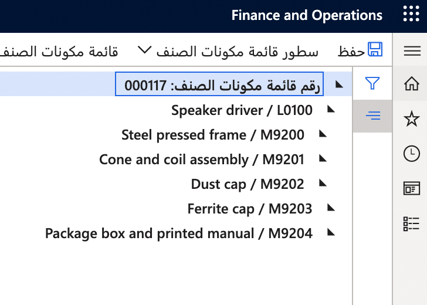
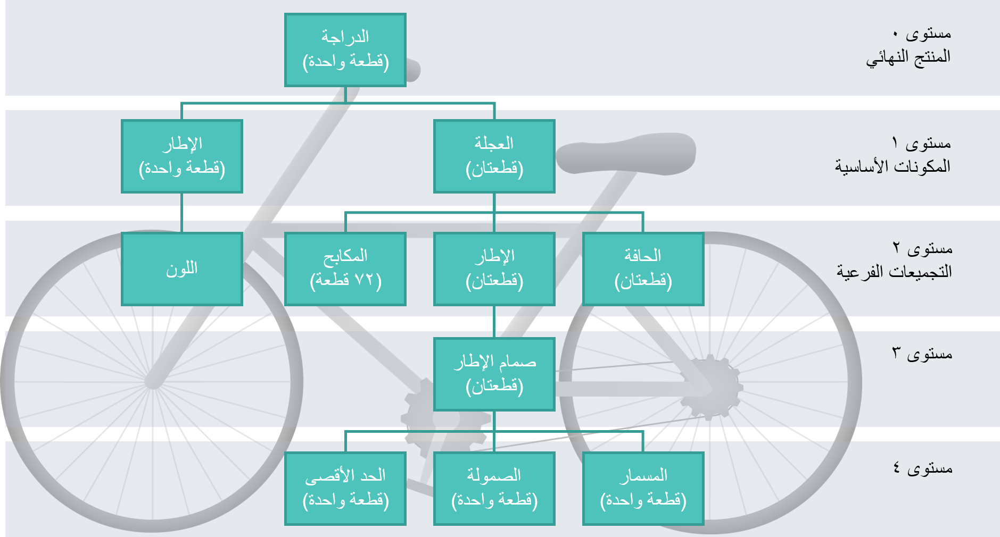

تتكوّن قائمة مكونات الصنف (BOM) أحادية المستوى من مكونات تابعة بشكل مباشر تُعد ضرورية لصناعة المنتج. إنها لا تحتوي على "مكونات المكونات".

عندما تحتوي قائمة مكونات الصنف (BOM) على قائمة مكونات صنف أخرى كمكون لها، فإنها تُعرف باسم قائمة مكونات صنف (BOM) متعددة المستويات، حيث يُشار إلى قائمة مكونات الصنف (BOM) الفرعية على أنها المستوى الأول ويُشار إلى مكوناتها على أنها المستوى الثاني. بإمكان قوائم مكونات الصنف (BOM) أن تتكوّن من العدد المطلوب من المستويات، بحسب نوع المنتج الجاري إنتاجه.

**إدارة معلومات المنتج > قوائم مكونات الصنف والمعادلات > قائمة مكونات الصنف >** (حدد المنتج) **> صيانة > المصمم**

## مثال عن قائمة مكونات صنف (BOM) متعددة المستويات

تتكوّن دراجات البالغين من عجلتين ومقعد ومقاود واطار.
وتظهر جميع هذه المكونات في قائمة مكونات الصنف (BOM) الخاصة بالدراجة. ومع ذلك، يتكوّن الإطار أيضاً من عدة عناصر منفصلة (ثلاثة أو أربعة أنابيب ملحومة معاً). وبالتالي، تتوفر لدى الإطار قائمة مكونات صنف (BOM) خاصة به. تُعرف قائمة مكونات الصنف (BOM) الخاصة بالإطار على أنها قائمة مكونات صنف فرعية، أي قائمة مكونات صنف داخل قائمة مكونات صنف للمنتج النهائي، الدراجة.

لنفترض أنه تم إنشاء قائمة مكونات صنف (BOM) لتجميع الدراجات. تم إعداد الأصناف التالية كنوع المنتج. يتم استخدام أنواع المنتجات في قائمة مكونات الصنف (BOM) ولا تحتاج إلى تجميع.

-   العجلات
-   المقعد
-   المقاود

يتم تجميع اطار الدراجة في الإنتاج. يتم إعداد هذا الجزء من العملية كقائمة مكونات صنف (BOM) فرعية تتضمن الأصناف التالية:

-   الأنابيب
-   سلك التلحيم
-   الدعامات أو الحامل

 

في أغلب الأحيان، تحتوي أصناف قائمة مكونات الصنف (BOM) المعقدة على قوائم مكونات صنف (BOM) فرعية متعددة. يتوقف عدد المستويات، أو قوائم مكونات الصنف (BOM) الفرعية، على كيفية إدارة الصنف.

بشكل عام، يحتاج الصنف إلى مستواه الخاص في قائمة مكونات الصنف (BOM)، إذا كان من الضروري أن يكون الصنف، في مرحلة ما:

-   متعقّباً
-   مخزّناً
-   مُباعاً

