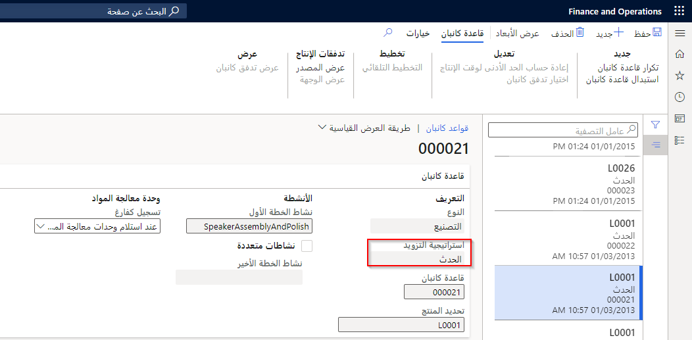
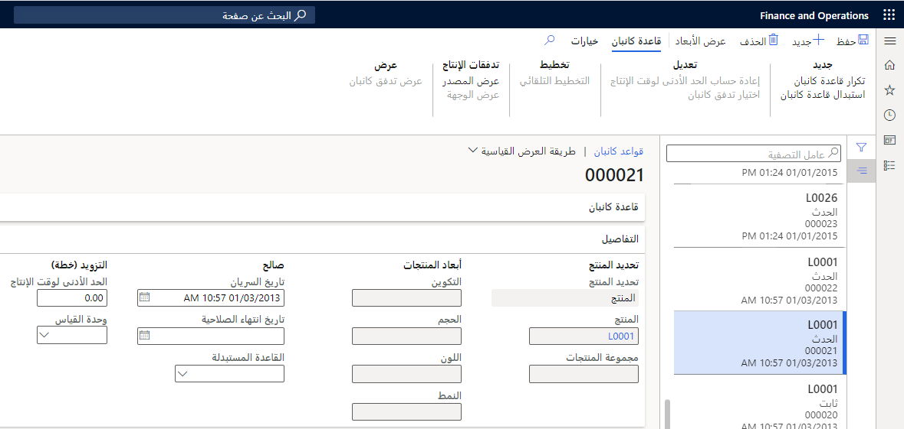
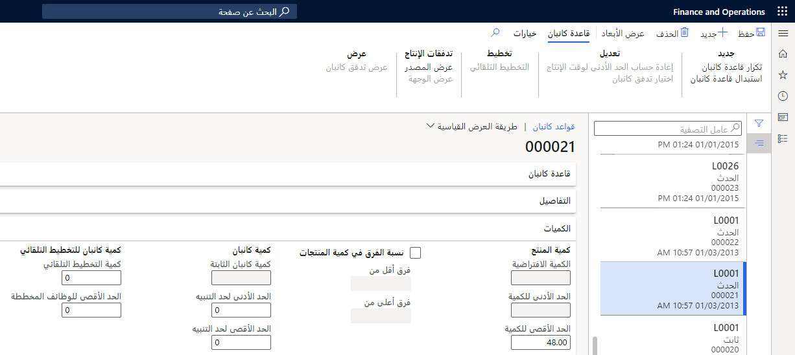
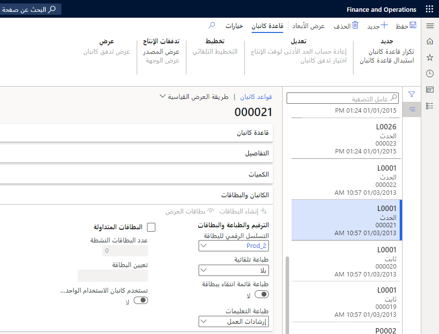
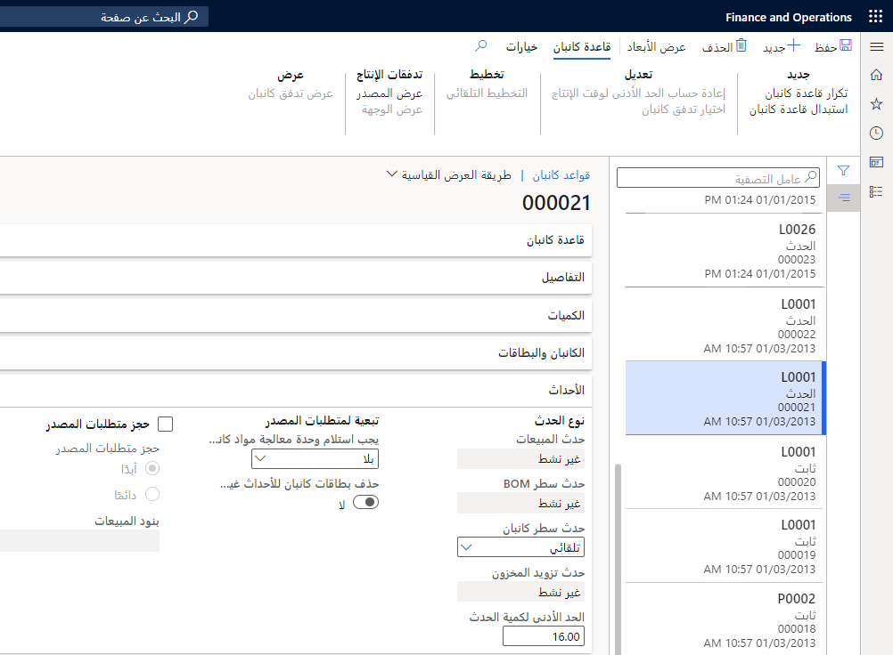

قاعدة كانبان هي سياسة تخطيط وتزويد بالمواد تتحكم في أنشطة المعالجة والتحويل التي تستند إلى بطاقات كانبان. تحدد قاعدة كانبان الطريقة التي يتم بها إنتاج أحد الأصناف أو نقله وتربط الصنف بالأنشطة داخل تدفق الإنتاج.

تحدد قواعد كانبان للأحداث الحدث الذي يقوم بتشغيل كانبان وتحت أي شروط يجب إنشاء كانبان للحدث.

عند انتهاء صلاحية قاعدة كانبان، يتم حساب وحدات كانبان النشطة للقاعدة منتهية الصلاحية كوحدات كانبان للقاعدة المستبدلة. عند تسجيل وحدة معالجة كانبان لقاعدة كمية ثابتة منتهية الصلاحية على أنها مفرغة، يتم استخدام كانبان جديد للقاعدة المستبدلة. ويتم ميراث البطاقات المتداولة الخاصة بالقاعدة المستبدلة إلى القاعدة البديلة بشكل مماثل.

انتقل إلى **إدارة معلومات المنتج > Lean manufacturing > قواعد كانبان** لإنشاء قواعد كانبان حدث جديدة.

شاهد الفيديو التالي لمشاهدة عرض توضيحي حول كيفية إعداد قواعد كانبان للحدث.

> [!VIDEO https://www.microsoft.com/videoplayer/embed/RE3Zgu4]

تصف القائمة التالية الحقول الموجودة ضمن علامة التبويب السريعة **قاعدة كانبان**:

-   **النوع**: يحدد ما إذا كان كانبان هو كانبان تصنيع والذي يقوم بإنشاء وظيفة معالجة كانبان أم كانبان سحب والذي يقوم بإنشاء وظيفة نقل كانبان.

-   **استراتيجية التزويد**: حدد **حدث** عند إنشاء قاعدة كانبان للحدث.

-   **قاعدة كانبان** - رقم يتم تعيينه تلقائياً يحدد قاعدة كانبان.

-   **تحديد المنتج**: تعريف تحديد المنتج لقاعدة كانبان.

-   **نشاط الخطة الأول** - تحديد النشاط الأول لقاعدة كانبان. يربط هذا الخيار كانبان بنشاط إصدار تدفق الإنتاج.
    يجب أن يكون النشاط الأول لقاعدة كانبان التصنيع عبارة عن نشاط معالجة. ويجب أن يكون النشاط الأول والوحيد لقاعدة كانبان السحب عبارة عن نشاط نقل.

-   **أنشطة متعددة** - حدد خانة الاختيار هذه لتكوين أنشطة متعددة لقاعدة كانبان. يمكن فقط لوحدات كانبان التصنيع أن تتضمن أنشطة متعددة.

-   **نشاط الخطة الأخير**: عند تحديد خانة الاختيار **أنشطة متعددة**، حدد النشاط الأخير لقاعدة كانبان. عند تحديد **أنشطة متعددة**، يمكن اختيار تدفق النشاط المستند إلى علاقات نشاط تدفق الإنتاج لإنتاج التدفق الخاص بكانبان. تعرض صفحة البحث كافة الأنشطة التي يتم عرضها في اتجاه النشاط الأول في نفس إصدار تدفق الإنتاج.

-   **تسجيل كفارغ**: حدد هذا الخيار لتحديد متى يتم تسجيل وحدات معالجة المواد كفارغة. الخيارات الموجودة في هذا الحقل هي:

    -   **عند استلام وحدات معالجة المواد** - عند اكتمال الوظيفة الأخيرة في كانبان، يتم تسجيل وحدات كانبان على أنها فارغة وتختفي من عروض النظرة العامة لكمية كانبان. يكون هذا الخيار هو الإعداد الافتراضي لبطاقات كانبان المجدولة، ويمكن استخدامه أيضاً لاستراتيجيات التزويد الأخرى. عند استخدام هذا الخيار مع استراتيجية الكمية الثابتة، يتم إنشاء كانبان جديد في كل مرة يتم فيها إكمال الوظيفة الأخيرة من كانبان السابق. 

    -   **‏‫عند تسجيل متطلبات المصدر‬**: عند استهلاك المنتجات التي توفرها وظائف كانبان الأحداث بواسطة مصدر الطلب، يتم تسجيل وظائف كانبان على أنها فارغة وتختفي من النظرة العامة على كمية كانبان في لوحات كانبان. 

    -   **يدوي (بما في ذلك فحص الفارغ)** -يجب تسجيل وحدات كانبان بشكل صريح على أنها فارغة. استخدم هذا الإعداد عند تخزين المنتجات في السوبر ماركت قبل استهلاكها أو شحنها.
        يعد هذا الخيار هو الإعداد الافتراضي لوحدات كانبان الكمية الثابتة.

    

تصف القائمة التالية الحقول الموجودة في علامة التبويب السريعة **التفاصيل**:

-   **تحديد المنتج**: يمكن لقواعد كانبان الحدث تعيين تحديد منتج من النوع **المنتج** أو **مجموعة منتجات** أو **الكل**.

    -   **المنتج**: تكون قاعدة كانبان صالحة لرقم صنف واحد.
        بالنسبة للأصناف ذات أبعاد المنتج، يمكن أن تكون قاعدة كانبان صالحة لبُعد معين أو لجميع قيم بُعد المنتج. تكون قاعدة كانبان صالحة لجميع قيم أبعاد المنتج عن طريق ترك بُعد المنتج الخاص بقاعدة كانبان فارغاً.

    -   **مجموعة المنتجات**: تكون قاعدة كانبان صالحة لكافة الأصناف وأبعاد المنتج المرتبطة التي يتم تعيينها لمفتاح تخصيص صنف مفرد.

    -   **الكل**: تكون قاعدة كانبان صالحة لكافة المنتجات التي يتم توفيرها بواسطة النشاط الأخير لقاعدة كانبان.

-   **المنتج**: عند تحديد هذا الخيار، حدد الصنف من قائمة البحث. إذا كان المنتج يحمل أبعاد منتج، فسيتم تنشيط حقول **أبعاد المنتج** ولكنها ليست إلزامية.

-   **مجموعة المنتجات**: عند تحديد هذا الخيار، حدد مفتاح تخصيص الصنف من قائمة البحث.

-   **الصلاحية - تواريخ السريان والانتهاء** - تحديد التواريخ التي تصبح فيها قاعدة كانبان سارية ومتى تنتهي صلاحيتها.

-   **وقت الإنتاج** - عرض وقت الإنتاج المطلوب لتزويد كانبان. وقت الإنتاج هو وقت الإنتاج الفعلي المتفق عليه لتزويد كانبان في السوبر ماركت عندما تكون وحدة معالجة المواد فارغة.
    من المحتمل أن يكون وقت الإنتاج الفعلي أطول من وقت الإنتاج المحسوب.

-   **وحدة القياس** - وحدة القياس المستخدمة في وقت الإنتاج. عند تغيير وحدة القياس، تتم إعادة حساب وقت الإنتاج وفقاً للتحويل المحدد لوحدات القياس القديمة والجديدة. يمكن استخدام وحدات القياس لوقت الفئة فقط.

    

تصف القائمة التالية الحقول الموجودة في علامة التبويب السريعة **الكميات**:

-   **الحد الأقصى للكمية**: لقواعد كانبان الحدث، أدخل الحد الأقصى لكمية المنتجات لاستخدامه لكل كانبان. القيمة التي يتم إدخالها في إعدادات الأوامر الافتراضية وكمية المخزون والحد الأقصى. يتم استخدام إعداد كمية الأمر كقيمة افتراضية. سيتجاوز حقل **الحد الأقصى للكمية** القيمة الافتراضية، ولكن لا يمكن أن يكون أكبر من إعداد كميه المخزون.

-   **نسبة الفرق في كمية المنتج**: عند إكمال وظيفة كانبان، يمكن إعداد نسبة الفرق في الكمية لكل كانبان. حدد خانة الاختيار هذه للسماح لكمية المنتج المنتهية بالاختلاف عن كمية المنتج المحددة لكل مثيل لوظيفة كانبان التي تشير إلى قاعدة كانبان.

    -   **نسبة فارق أقل** - أدخل الكمية التي يمكن أن تكون كمية المنتج المنتهية أقل من كمية المنتج المحددة.

    -   **نسبة فارق أكبر** - أدخل الكمية التي يمكن أن تكون كمية المنتج المنتهية وفقها أكبر من كمية المنتج المحددة.

-   **الحد الأدنى للتنبيه** - يمكن إعداد تنبيه مرئي لوحدات كانبان لإظهار المكان الذي تكون فيه وحدات كانبان المخططة أقل من مستوى محدد. أدخل عدد وحدات كانبان لتحديد الحد الأدنى لكمية كانبان لكل خلية عمل أو سوبرماركت. عندما لا يتوافق عدد مهام كانبان النشطة التي يتم تخطيطها مع الحد الأدنى المحدد لكمية التنبيه، يصبح لون الخلفية أحمر بدلاً من الأخضر. يمكن أن تتضمن بطاقات كانبان النشطة أي حالة لوحدة معالجة المواد باستثناء **فارغة**. يتم فرز قواعد كانبان حسب أهمية التخطيط استناداً إلى الحد الأدنى للتنبيه.

-   **الحد الأقصى للتنبيه** - أدخل عدد وحدات كانبان لتحديد الحد الأقصى لكمية كانبان لكل خلية عمل أو سوبرماركت. يساعد هذا الحد في تمثيل المخزون الزائد بصرياً في السوبر ماركت. كما يعطي إشارة مرئية عند إنشاء كانبان جدولة أو كانبان حدث أكثر من المتوقع لقاعدة كانبان.

-   **كمية التخطيط التلقائي**: لتخطيط كانبان تلقائياً بدلاً من تحميلها يدوياً على خلية العمل، يمكنك تعيين كمية التخطيط التلقائي. أدخل عدد الوظائف غير المخططة التي تتسبب في حدوث تخطيط تلقائي. وتكون وظيفة كانبان غير المخططة بالحالة غير مخططة.
    
    **مثال:** ستؤدي كمية التخطيط التلقائي **1** إلى تخطيط كل وظيفة غير مخططة. سوف تنتظر كمية التخطيط التلقائي **5** إلى خمس مهام غير مخططة، كما سيتم حينئذ تخطيط كافة وظائف كانبان الخمسة. يجب أن يتم تخطيط كمية التخطيط ذات القيمة صفر يدوياً في لوحة جدول كانبان.

-   **‏‫الحد الأقصى للوظائف المخططة‬**: عندما تستخدم التخطيط التلقائي لوظائف كانبان غير المخططة، أدخل الحد الأقصى لعدد وظائف كانبان المخططة لقاعدة كانبان محددة. استخدم هذا الحد لتجنب التحميل الزائد لخلية عمل بطاقات كانبان المجدولة والأحداث.

    قد يحدث هذا الموقف نتيجة لطلب خطا أو طلبات العملاء الكبيرة بشكل استثنائي. نوصي باستخدام هذا الإعداد وإعداد الحد الأقصى لكمية أمر المبيعات لقواعد كانبان حدث المبيعات التي تستخدم المتاح للتعهد (CTP) أو إنشاء كانبان التلقائي.
    قد تحد هذه الإعدادات من تأثير كميات الأوامر الخاطئة على أداء النظام.

    

تصف القائمة التالية الحقول الموجودة في علامة التبويب السريعة **كانبان والبطاقات**:

-   **تسلسل أرقام البطاقات**: التسلسل الرقمي لبطاقة كانبان الذي يتم تعيينه إلى قاعدة كانبان. عند إنشاء قاعدة كانبان، يتم استخدام التسلسل الرقمي الافتراضي من معلمات الإنتاج.

    ومن أفضل الممارسات المثبتة استخدام تسلسلات رقمية فريدة وقصيرة للبطاقات الثابتة المتداولة، مما يساعد على تحديد بطاقة محددة بشكل أكثر كفاءة.

-   **الطباعة التلقائية** - حدد الحدث الذي يتسبب في الطباعة التلقائية لبطاقات كانبان. الخيارات الموجودة في هذا الحقل هي:

    -   **بلا** - لا يتم استخدام الطباعة التلقائية. نوصي باستخدام هذا الإعداد عند استخدام البطاقات المتداولة أو معالجة كانبان الإلكترونية.

    -   **الإنشاء** - طباعة وحدات الكانبان عند إنشاء الكانبان. نوصي باستخدام هذا الإعداد عند استخدام لوحة تخطيط فعلية لوحدات كانبان الأحداث ولا يمكن استخدام البطاقات المتداولة.

    -   **الخطة** - طباعة وحدات كانبان عند تخطيط الوظيفة الأولى في كانبان. نوصي باستخدام هذا الإعداد عندما تقوم بطاقة كانبان المطبوعة بتشغيل معالجة وظائف كانبان في صالة المتجر.

    -   **تجهيز** - طباعة وحدات كانبان عند تسجيل المهمة الأولى في تدفق كانبان على أنها جاهزة.

    -   **البدء** - طباعة وحدات كانبان عند تسجيل المهمة الأولى في تدفق كانبان على أنها قيد التقدم.

    -   **استلام** - طباعة وحدات كانبان عند تسجيل المهمة الأولى في تدفق كانبان على أنها مكتملة. يُستخدم هذا الخيار غالباً إذا كانت المجموعة أو الأرقام المسلسلة للأصناف المنتهية مطبوعة على بطاقة كانبان

-   **طباعة قائمة الانتقاء مع البطاقة**: تعيين شريط التمرير هذا على **نعم** لطباعة قائمة الانتقاء مع بطاقة كانبان.

-   **إرشادات الطباعة**: حدد المعلومات المطلوب طباعتها على بطاقة كانبان. الخيارات الموجودة في هذا الحقل هي:

    -   **إرشادات العمل** - طباعة مستند إرشادات الإنتاج المرفقة بكانبان.

    -   **إرشادات الشحن**: قم بطباعة عنوان الشحن الكامل ومعلومات التتبع، بما في ذلك المجموعة والأرقام المسلسلة على بطاقة كانبان.

-   **البطاقات المتداولة** - حدد خانة الاختيار هذه لاستخدام البطاقات المتداولة مع قاعدة الكانبان الحالية.

-   **عدد البطاقات النشطة** - أدخل عدد البطاقات المتداولة النشطة التي تكون قيد التداول في وقت معين لقاعدة كانبان.

-   **تعيين البطاقة** - حدد طريقة تعيين البطاقات المتداولة. الخيارات الموجودة في هذا الحقل هي:

    -   **تلقائي** - عند إنشاء كانبان، يتم تعيين البطاقة تلقائياً عند تحقق هذه الشروط: وجود كانبان نشط غير معين ووجود بطاقة نشطة غير معينة لقاعدة كانبان. يكون هذا الخيار هو الإعداد الافتراضي.

        عند إنشاء وحدات كانبان قبل إنشاء البطاقات المتداولة، يتم تعيين البطاقات تلقائياً عند إنشاء البطاقات.
        إذا كان هناك نقص في البطاقات، فعند تسجيل كانبان على أنه فارغ، يتم تعيين البطاقة تلقائياً إلى كانبان جديد. وهذا الأسلوب مفيد بشكل خاص عندما تتوافق البطاقات المتداولة مع عدد محدود من الناقلات، أو الحوامل، أو الصناديق.

    -   **يدوي**: يجب عليك تعيين بطاقة يدوياً على لوحة جدولة كانبان.
        يمكنك إكمال التعيين اليدوي عند إعداد مهمة كانبان.

- **وحدات كانبان للاستخدام الواحد تستخدم بطاقات متداولة**: بالنسبة لقواعد كانبان الكمية الثابتة، حدد شريط التمرير هذا لاستخدام البطاقات المتداولة مع وحدات كانبان للاستخدام الواحد. في حالة عدم تعيين شريط التمرير إلى **نعم**، يتم إنشاء بطاقات كانبان للاستخدام الواحد لبطاقات كانبان للاستخدام الواحد.
        ثم يتم حجز البطاقات المتداولة للاستخدام مع وحدات كانبان التي لم يتم إنشاؤها للاستخدام الواحد.

    

تصف القائمة التالية الحقول الموجودة في علامة التبويب السريعة **الأحداث**:

-   **حدث المبيعات**: يحدد هذا الحقل أنه قد تم إيقاف تشغيل قاعدة كانبان في حدث بند المبيعات. يتم استخدام هذا الإعداد لتكوين قواعد كانبان التي تفي بالمتطلبات مباشرةً من أوامر المبيعات. حدد أحد الخيارات التالية لتحديد كيفية إنشاء الكانبان:

    -   **‏‫غير نشط‬**: لم يتم إنشاء وحدات كانبان لأحداث المبيعات.

    -   **يدوي**: يمكنك إنشاء بطاقات كانبان يدوياً لأحداث المبيعات.

    -   **الدفعة**: يتم إنشاء بطاقات كانبان خلال معالجة الدفعة لأحداث المبيعات.

    -   **تلقائي**: يتم إنشاء بطاقات كانبان التلقائية عند حدوث أحداث المبيعات.

-   **حدث بند قائمة مكونات الصنف**: يحدد هذا الحقل أنه قد تم إيقاف تشغيل قاعدة كانبان في حدث بند قائمة مكونات الصنف. يستخدم هذا الإعداد لتكوين قواعد كانبان التي تقوم بتجديد قوائم الانتقاء التي تستند إلى أوامر الإنتاج. حدد أحد الخيارات التالية لتحديد كيفية إنشاء الكانبان:

    -   **‏‫غير نشط‬**: لم يتم إنشاء وحدات كانبان لأحداث بند قائمة مكونات الصنف.

    -   **تلقائي**: يتم إنشاء بطاقات كانبان التلقائية عند حدوث أحداث بند قائمة مكونات الصنف.

-   **حدث بند كانبان**: يحدد هذا الحقل أنه قد تم إيقاف تشغيل قاعدة كانبان في حدث بند كانبان. يستخدم هذا الإعداد لتكوين قواعد كانبان التي تقوم بتجديد المواد المطلوبة لنشاط عملية انتقال البيانات. حدد أحد الخيارات التالية لتحديد كيفية إنشاء الكانبان:

    -   **‏‫غير نشط‬**: لم يتم إنشاء وحدات كانبان لأحداث بند كانبان.
    
    -   **يدوي**: يمكنك إنشاء بطاقات كانبان يدوياً لأحداث بند كانبان.
    
    -   **الدفعة**: يتم إنشاء بطاقات كانبان خلال معالجة الدفعة لأحداث بند كانبان.
    
    -   **تلقائي**: يتم إنشاء بطاقات كانبان التلقائية عند حدوث أحداث بند كانبان.

-   **حدث تزويد المخزون**: يحدد هذا الحقل أنه قد تم إيقاف تشغيل قاعدة كانبان في حدث تزويد المخزون. يتم استخدام هذا الإعداد لتكوين قواعد كانبان التي تقوم بتزويد مستويات المخزون الدنيا.
    حدد أحد الخيارات التالية لتحديد كيفية إنشاء الكانبان:

    -   **‏‫غير نشط‬**: لم يتم إنشاء وحدات كانبان لأحداث تزويد المخزون.

    -   **الدفعة**: يتم إنشاء بطاقات كانبان خلال معالجة الدفعة لأحداث تزويد المخزون.

-   **الحد الأدنى لكمية الحدث**: يحدد هذا الحقل الحد الأدنى للكمية المطلوبة في متطلبات المصدر لإنشاء بطاقات كانبان الحدث للقاعدة. يتم إنشاء بطاقات كانبان للحدث عندما تكون كمية متطلبات المصدر مساوية لهذا الحقل أو أكبر منه.
    - على سبيل المثال، سيتم تعيين الحد الأدنى للكمية مقابل حدث بند المبيعات لتحديد الكمية التي تمثل أمراً استثنائياً. لن تؤدي بنود أمر المبيعات التي يتم إدخالها لأي شيء ضمن هذه الكمية إلى إنشاء كانبان للحدث. ستنشئ بنود أمر المبيعات الكبيرة بشكل استثنائي كانبان حدث أو عدة بطاقات كانبان للحدث.

-   **يجب استلام وحدة معالجة مواد كانبان للحدث**: تحديد حالة متطلبات المصدر (على سبيل المثال، بند المبيعات أو وظيفة كانبان أو أمر الإنتاج) الذي يحدد متى يجب استلام وحدات معالجة المواد الخاصة ببطاقات كانبان الخاصة بالأحداث المُشار إليها. الخيارات الموجودة في هذا الحقل هي:

    -   **لا شيء**: في حالة توفر المخزون الفعلي الكافي، فلن تحتاج إلى استلام وحدات معالجة المواد.

    -   **انتقاء**: يجب استلام وحدات معالجة المواد قبل أن يتم إعداد متطلبات المصدر. بالنسبة لأحداث المبيعات، يعني هذا أنه لا يمكن ترحيل إيصال التعبئة إلا عند استلام كانبان لأحداث المبيعات.

    -   **بدء**: يجب استلام وحدات معالجة المواد قبل بدء مهمة كانبان أو أمر الإنتاج.

    -   **إنهاء**: يجب استلام وحدات معالجة المواد قبل أن يتم الإبلاغ عن أمر الإنتاج كمنتهٍ.

    -   **إنهاء**: يجب استلام وحدات معالجة المواد قبل إتمام مهمة كانبان أو أمر الإنتاج.

    

-   **حذف بطاقات كانبان للأحداث غير المستخدمة**: قم بتمكين هذا الخيار لحذف الأحداث المشار إليها تلقائياً والتي لها حالة وحدة معالجة **غير معينة** عند تسجيل متطلبات المصدر كمنتهية. يتم استخدام هذا الإعداد عند تعيين الحقل **يجب استلام وحدة معالجة مواد كانبان للحدث** إلى **لا شيء**.

-   **حجز متطلبات المصدر**: حدد خانة الاختيار هذه لتجاوز إعدادات حجز المخزون الحالي لمتطلبات مصدر الطلب مثل بنود أمر المبيعات وبنود قائمة مواد الإنتاج. مع هذا الإعداد، يمكن لقاعدة كانبان فرض حجز متناسق، على سبيل المثال، للتأكد من أن المكونات التي يتم توفيرها بواسطة بطاقات كانبان للحدث محجوزة تلقائياً لمصدر الطلب (أمر الإنتاج أو أمر المبيعات). 
    

