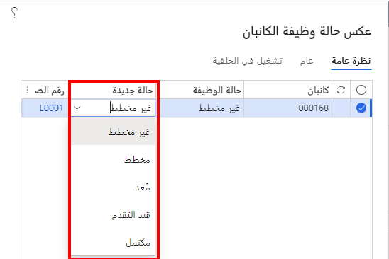
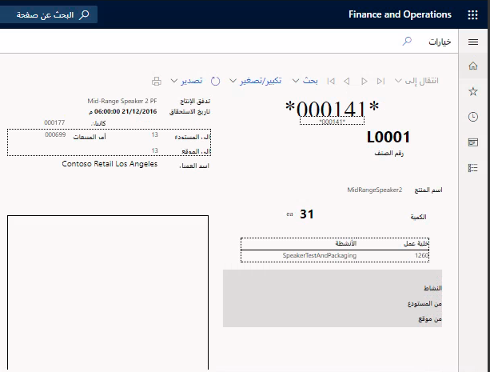

## إجراءات المعالجة

لا يمكن تنفيذ إجراءات المعالجة من التحضير والبدء والإكمال إلا عندما يتم التخطيط لوظيفة معالجة. يجب أن تحتوي وظائف المعالجة التي لم يتم التخطيط لها بشكل صريح على الحقل **كمية التخطيط التلقائي** في صفحة **قاعدة كانبان** الذي تم تعيينه بالقيمة **1**. يتم تخطيط كافة وظائف المعالجة غير المخططة المرتبطة بهذه القاعدة تلقائياً عند إنشائها، ويمكن الآن إعدادها أو بدؤها أو إكمالها.

## التخطيط التلقائي لبطاقات كانبان

يتم تحديد معلمات القدرة الإنتاجية للتخطيط التلقائي لجدولة كانبان في قاعدة كانبان ونموذج تدفق الإنتاج محدود الفاقد المرتبط بالقدرة الإنتاجية لخلية العمل.

يتم تخطيط وظائف معالجة كانبان تلقائياً عند وصول عدد الوظائف غير المخطط لها المرتبطة بقاعدة كانبان إلى كمية التخطيط التلقائي. أي قيمة تبلغ 1 أو أكبر موضوعة في هذا الحقل ستؤدي إلى تخطيط وظائف كانبان تلقائياً. إذا كانت كمية التخطيط التلقائي أكبر من 1، يتم تخطيط بطاقات كانبان التي تم تشغيلها معاً بشكل تسلسلي.

## الحد الزمني للتخطيط

عندما يكون الحد الزمني للتخطيط في نموذج تدفق الإنتاج هو 1، تتم إضافة وظائف كانبان إلى نهاية فترة التخطيط لجدول خلية العمل. إذا تم تحميل فترة واحدة، فسيتم فتح الفترة التالية تلقائياً. يمكنك تعيين وظائف كانبان كأولوية من خلال تعيينها على هذا النحو في لوحة جدول الكانبان.

عند تحديد أكثر من فترة واحدة في نموذج تدفق الإنتاج، يتم تحديد آخر فترة بدء ممكنة لكل وظيفة كانبان بالمعادلة التالية:

> **تاريخ البدء = تاريخ الاستحقاق - دورة EPE**

يتم تكوين دورة EPE في نموذج تدفق الإنتاج.

## الاستجابة للعجز في القدرة الإنتاجية

إذا كان تاريخ البدء المحسوب واقعاً في الماضي، فسيتم تعيين تاريخ البدء على اليوم. يقوم التخطيط التلقائي بمحاولة تحميل وظائف كانبان في الفترة المرتبطة بهذا التاريخ. إذا لم تكن هذه المعالجة ممكنة، فسيتم التخطيط التلقائي وفقاً لإعداد ‏‫الاستجابة للعجز في القدرة الإنتاجية‬ في نموذج تدفق الإنتاج محدود الفاقد. تتمثل الإعدادات الممكنة للاستجابة للعجز في القدرة الإنتاجية‬ فيما يلي:

-   **تأجيل** - يتم تأجيل الوظيفة حتى يوم توفر الإنتاجية.

-   **إلغاء** - يتم إلغاء التخطيط التلقائي لوظيفة كانبان، وتظهر رسالة تشير إلى أنه لا يمكن التخطيط للوظيفة.

-   **إضافة إلى الفترة المطلوبة** - تتم إضافة الوظيفة إلى الفترة المجدولة للتاريخ المطلوب. وتكون النتيجة هي زيادة تحميل خلية العمل خلال الفترة المجدولة.

-   **توزيع** - يتم توزيع بطاقات كانبان لحدث واحد على فترات الإنتاج المتاحة، بدءاً من أول فترة متاحة.

إن المثال على الاستجابة للعجز في القدرة الإنتاجية سيكون كالآتي: إذا كانت كمية التخطيط التلقائي هي 3، فسيبحث التخطيط التلقائي عن فترة ذات قدرة إنتاجية كافية لبطاقات كانبان الثلاث التي تم تشغيلها.

## أسلوب التوزيع

إذا كانت القدرة الإنتاجية التي يتم طلبها بواسطة بطاقات كانبان التي تم تشغيلها أعلى من القدرة الإنتاجية اليومية للخلية، فسيتم تطبيق أسلوب *التوزيع* تلقائياً (لأنه لم يتم العثور على أجزاء مجانية إطلاقاً).

بدءاً من الفترة المرتبطة بتاريخ البدء، تتم مراجعة الفترات من خلال الانتقال للخلف في الوقت حتى الفترة الفعلية (اليوم). إذا لم يتم العثور على فترة زمنية قبل تاريخ الاستحقاق، فسيستمر البحث بعد تاريخ الاستحقاق ويستمر في المستقبل ما لم يتم العثور على فترة ذات قدرة إنتاجية كافية.

يحدد الحد الزمني للتخطيط عدد الفترات المتاحة للتخطيط، بدءاً من الفترة المرتبطة باليوم الفعلي. في حالة عدم العثور على قدرة إنتاجية متوفرة لإدراجها في كافة الفترات المتاحة، فسيتم إلغاء التخطيط التلقائي ويتم عرض رسالة خطأ.

## تحميل وظائف كانبان على جدول كانبان 

يتكون جدول كانبان لكل خلية عمل من فترات تتوافق مع الإعدادات في نموذج تدفق الإنتاج محدود الفاقد. قد تكون الفترات يومية أو أسبوعية.

يتم تحديد مدى توفر كل فترة بالساعات من خلال وقت العمل للفترة المخصصة للتقويم. إذا كان نموذج القدرة الإنتاجية هو **الإنتاجية**، وكان نوع الفترة هو **يوم عمل قياسي**، فسيتم حساب القدرة على النحو التالي:

> **القدرة = الإنتاجية (يوم قياسي) * وقت العمل (الفترة) ÷ طول اليوم القياسي (التقويم)**

يتم حساب حمل العمل لكل بطاقة كانبان استناداً إلى نسبة الإنتاجية للصنف المرتبط بخلية العمل في إعداد مجموعة الجداول محدودة الفاقد. يعتمد الحساب على نموذج القدرة الإنتاجية.

بالنسبة لصافي الإنتاجية، يتم حساب حمل العمل على النحو التالي:

> **القدرة الإنتاجية = معدل الإنتاجية * كمية كانبان * عامل تصحيح الوحدة**

بالنسبة للساعات، يتم حساب حمل العمل على النحو التالي:

> **القدرة الإنتاجية = زمن الدورة (النشاط) * معدل الإنتاجية * تصحيح الكمية (كمية الوظائف) * عامل تصحيح الوحدة**

يُضاف حمل عمل كل بطاقة كانبان مخطط لها لكل فترة لتحديد حمل عمل الفترة. يتم حساب القدرة الإنتاجية لوظيفة معالجة كانبان عندما يتم تخطيط وظيفة معالجة كانبان للمرة الأولى.
يتم استخدام عوامل تصحيح الوحدة في المثيل الذي تختلف فيه وحدة قياس الوظيفة عن وحدة قياس قدرة خلية العمل. يتم استخدام تصحيح الكمية إذا كانت كمية الوظيفة تختلف عن كمية النشاط أو كمية زمن الدورة.

## مجموعات الجداول محدودة الفاقد

تسمح الصفحة التي يتم الوصول إليها من خلال **إدارة معلومات المنتج > مجموعات الجداول محدودة الفاقد** للمستخدمين بإمكانية تعيين نسب الإنتاجية والألوان لجدولة كانبان للأصناف أو مجموعات الأصناف. يمكن تنفيذ هذه العملية بشكل عام أو خاص لخلية العمل. يمكن استخدام الألوان لفهم الخصائص المختلفة للأصناف التي يتم إنتاجها في الخلية لأغراض الجدولة بشكل مرئي.

## أصناف الجداول محدودة الفاقد

يمكن تعيين أصناف أو مجموعات أصناف معينة إلى مجموعة جداول محدودة الفاقد بنسبة إنتاجية معينة باستخدام الصفحة **أصناف الجداول محدودة الفاقد**.

## لوحة جدول الكانبان

تعرض **التحكم بالإنتاج > كانبان > لوحة جدول الكانبان** وظائف كانبان المجدولة أثناء الحد الزمني للتخطيط الذي تم تحديده في خلية العمل. يمكن جدولة بطاقات كانبان فقط في هذا الحد الزمني للتخطيط.

## جدولة وظيفة كانبان

في الصفحة **التحكم بالإنتاج > كانبان > جدولة وظيفة كانبان**، في علامة التبويب **الخطة**، يمكن إعادة تعيين حالات وظائف مختلفة إلى حالات أخرى عن طريق استخدام الزر **إرجاع حالة المهمة**. تعمل وظيفة إعادة الضبط على عكس الإجراءات التي تمت معالجتها مسبقاً للوصول إلى الحالة المتوافقة. إذا كان يجب إعادة تعيين أكثر من حالة واحدة، فسيتم تنفيذ جميع الإجراءات العكسية خطوة بخطوة.

## حالة وظيفة كانبان لوظائف المعالجة

تكون حالة وظيفة كانبان مهمة لفهم عملية التخطيط لبطاقات كانبان. بإمكان وظيفة كانبان من النوع "معالجة" أن تكون بالحالات التالية:

-   **غير مخطط**

-   **مخطط**

-   **مُعد**

-   **قيد التقدم**

-   **مكتمل**

تعرض الصورة التالية الخيارات التي يتم عرضها في صفحة **عكس حالة وظيفة الكانبان** في **التحكم بالإنتاج > كانبان > جدولة وظيفة كانبان**.

في صفحة **التحكم بالإنتاج > كانبان > لوحة كانبان لوظائف المعالجة**، يتم تنشيط الأزرار الخاصة بمعالجة أنشطة معينة لوظيفة كانبان هذه (على سبيل المثال، **إعداد/بدء**) استناداً إلى حالة وظيفة كانبان.

## تغيير حالات وظيفة كانبان: شروط مسبقة

يتم شرح الشروط المسبقة المتنوعة والنتائج المختلفة لإعادة تعيين وظائف كانبان في الجدول التالي.

| حالات العكس | الشروط المسبقة | النتيجة |
| :------------------- | :------------------- |:----------------|
| مكتمل إلى قيد التقدم | لا تتم معالجة المعاملات المالية ذات الصلة (إن وجدت). يجب أن تكون هناك حركات كافية في متناول اليد لعكس الحركات الفعلية. بطاقة كانبان ذات الصلة ليست بالحالة "فارغ". | عكس الحركات الفعلية (الاستلام والإصدارات). إذا كانت هذه هي آخر وظيفة في الكانبان، فأعد تعيين حالة الكانبان إلى **قيد التقدم**. |
| مخطط إلى غير مخطط | إذا تم تعيين كمية التخطيط التلقائي إلى **1**، فلن يتم تنفيذ هذه الخطوة على إعادة التعيين؛ وتظل الوظيفة بالحالة "مخطط". | يزيل تاريخ البدء المخطط له والتسلسل المرتبط به. |
| معد إلى مخطط | بلا | قم بعكس معاملات إصدار التدفق الأمامي، إن وجدت. إذا كانت البطاقات المتداولة مستخدمه وكانت طريقه التعيين **يدوية**، سيتم حجز تعيين البطاقة. إذا كانت هذه هي الوظيفة الأولى في كانبان، فقم أيضاً بإعادة تعيين حالة كانبان إلى **غير مخطط**. |
| قيد التقدم إلى معد | بلا | يقوم بإعادة تعيين حالة الوظيفة إلى **معد**. |

بعد إعادة التعيين إلى حالة معينة، لا يتم تشغيل التخطيط التلقائي تلقائياً. إذا كان يجب تشغيل التخطيط التلقائي مرة أخرى لكانبان، يجب بدء التخطيط التلقائي يدوياً لقاعدة كانبان.

تتوفر لديك أيضاً الخيارات التالية عند تغيير حالة وظيفة كانبان:

-   **تخطيط شجرة تثبيت السعر بالكامل** - عند التخطيط لوظيفة كانبان ذات أنشطة متعددة، يخطط هذا الخيار لوظائف كانبان المتبقية في المراحل التمهيدية.

-   **استخدام قاعدة كانبان البديلة** - يستخدم قاعدة كانبان بديلة للإيفاء بالمتطلبات المحددة. يستخدم هذا الخيار حيث يمكن للمنتج المرور خلال نشاط بديل.

-   **حالة توريد شجرة تثبيت السعر** - يتحقق من حالة التوريد لجميع وظائف كانبان ذات المستوى الأدنى في شجرة تثبيت السعر.

## طباعة كانبان

لا يلزم طباعة بطاقات كانبان وقوائم الانتقاء، ولكن يمكن استخدامها للإشارة إلى العمليات الواقعة في صالة الإنتاج. يوفر Supply Chain Management عدة سيناريوهات لطباعة قوائم الانتقاء وبطاقات كانبان:

-   طباعة البطاقات المتداولة عند إنشاء البطاقات المتداولة

-   الطباعة اليدوية لبطاقات كانبان

-   الطباعة التلقائية لبطاقات كانبان

-   الطباعة اليدوية لقوائم الانتقاء

-   الطباعة التلقائية لقوائم الانتقاء مع بطاقة كانبان

-   تحديد الأولوية على بطاقات كانبان

يمكنك استخدام بطاقات كانبان المطبوعة لمسح تقدم كانبان والإبلاغ عنه باستخدام لوحات جدول الكانبان.

يمكن أن تتم الطباعة اليدوية لبطاقات كانبان من أي من الصفحات التالية:

-   لوحة كانبان لوظائف المعالجة

-   لوحة كانبان لمهام التحويل

-   جدولة وظيفة كانبان

-   قواعد كانبان 

-   تفاصيل كانبان 

## الطباعة التلقائية لبطاقات كانبان وقوائم الانتقاء

في بعض الحالات، قد ترغب في طباعة بطاقات كانبان تلقائياً. يمكن إعداد بطاقات كانبان لطباعتها تلقائياً عندما يصل كانبان إلى حالة معينة.

لتغيير هذه الإعدادات، انتقل إلى: **إدارة معلومات المنتج > Lean manufacturing> قواعد كانبان**.

تتمثل الخيارات الموجودة على صفحة **قواعد كانبان** فيما يلي:

-   **بلا**

-   **إنشاء**

-   **تخطيط**

-   **إعداد**

-   **البدء**

-   **استلام**

عندما يصل كانبان إلى الحالة المحددة التي تم إعدادها في صفحة **قاعدة كانبان**، تتم طباعة بطاقة كانبان تلقائياً. عند الرغبة، يمكنك طباعة قائمة انتقاء في نفس الوقت. 
