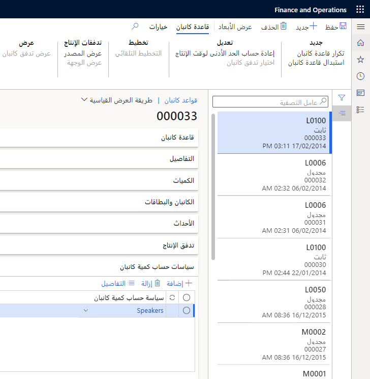

## سياسات حساب كمية كانبان

في Supply Chain Management، يتم استخدام سياسة حساب كمية كانبان لتعريف المعلمات لحساب كمية كانبان وتجميع قواعد كانبان التي يتم حسابها عادةً بالمعدل المنتظم نفسه مع المعلمات نفسها.

يتم بعد ذلك إقران سياسة حساب كمية كانبان بقواعد كانبان وتُستخدم لتنفيذ عملية حساب كانبان.

انتقل إلى **التحكم بالإنتاج > ‏‏مهام دورية > حساب كمية كانبان > سياسات حساب كمية كانبان** لإنشاء سياسة جديدة.

-   **الاسم** - هو تعريف لسياسة حساب كمية كانبان.

-   **الخطة الرئيسية** - يتم تحديد الطلب الفعلي من نتيجة خطة رئيسية. يجب تعيين الخطة الرئيسية أو خطة التنبؤ للاستخدام عند حساب كميات كانبان لهذه السياسة.

-   **الحد الأدنى لكمية كانبان** - هو العدد الإضافي من بطاقات كانبان المضاف إلى حساب كمية كانبان.

-   **عامل الأمان** - يُستخدم عامل الأمان في حساب كمية كانبان الثابتة، على سبيل المثال في حالة استخدام 0.1، تتم إضافة 10 بالمائة إلى الطلب المحسوب.

-   **تضمين المخزون الاحتياطي** - عندما لا يتم تحديد هذا الخيار، يُعتبر الطلب أثناء الحد الأدنى لوقت الإنتاج ثابتاً، لذلك لا يتم تضمين حساب المخزون الاحتياطي في العملية الحسابية. في هذه الحالة، تكون المعادلة كما يلي:

> **كمية كانبان = (متوسط الطلب * الحد الأدنى لوقت الإنتاج * (عامل الأمان +1)) ÷ (كمية المنتجات لكل وحدة معالجة مواد) + 1**

عند تحديد **تضمين المخزون الاحتياطي**، يجب تضمين التغيير في الطلب أثناء الحد الأدنى لوقت الإنتاج عن طريق حساب المخزون الاحتياطي وإضافته.

> **كمية كانبان = (متوسط الطلب * الحد الأدنى لوقت الإنتاج * (عامل الأمان +1) + المخزون الاحتياطي) ÷ (كمية المنتجات لكل وحدة معالجة مواد) + 1**

يتم حساب المخزون الاحتياطي مع مراعاة الطلب والفرق ومستوى الخدمة.

-   **مستوى الخدمة** - في حالة تحديد **تضمين المخزون الاحتياطي**، يجب تعريف مستوى خدمة. على سبيل المثال، في حالة استخدام القيمة **90**، يتم حساب كمية كانبان الثابتة استناداً إلى الافتراض أن احتمالية عدم نفاد المخزون هي 90 بالمائة.

-   **الفترة** - تُعرّف كود الفترة لحساب الطلب.
    في حالة تحديد هذا الحقل، يتم تمكين الحقلَين ذوي الصلة **الأيام المقبلة** و **الأيام السابقة** لتعريف فترة الحساب.

    -   **الأيام السابقة** - يستعرض هذا الحقل حركات المخزون أو وظائف كانبان في حالة عدم تحديث كانبان للمخزون.
        على سبيل المثال، في حالة شحن أمر مبيعات وإرسال فاتورة له 20 يوماً قبل تاريخ الحساب وكانت فترة الطلب 30، سيتم تضمين الطلب المنفّذ بالفعل من أمر المبيعات.

    -   **الأيام المقبلة** - الأيام المقبلة من تاريخ الحساب الذي سيتم تضمين الطلب منه في حساب كمية كانبان الثابتة. تعتمد النتيجة على الخطة المستخدمة. على سبيل المثال، إذا كان تاريخ الشحن المطلوب لأمر مبيعات 20 يوماً من تاريخ الحساب وكانت فترة الطلب 30، سيتم تضمين الطلب والطلبات المشتقة من أمر المبيعات.

-   **الموسم** - يعرّف كود الفترة لحساب الطلب.
    في حالة تحديد هذا الحقل، يتم تمكين الحقلَين ذوي الصلة **يوم وشهر البدء** و **يوم وشهر الانتهاء**.

-   **يوم وشهر البدء** - يحدد يوم بدء الموسم. سيكون هذا اليوم هو يوم بدء حساب الطلب المنفّذ من العام الحالي والطلب من العام القادم.

-   **يوم وشهر الانتهاء** - يحدد يوم انتهاء الموسم. سيكون هذا اليوم هو يوم انتهاء حساب الطلب المنفّذ من العام الحالي والطلب من العام القادم.

## المعادلة البسيطة لكمية كانبان

تقوم المعلمات المكونة في سياسة حساب كمية كانبان بإنشاء المعادلة التي سيتم استخدامها عند حساب كميات كانبان. يتضمن أي مثال على معادلة بسيطة متوسط الطلب اليومي فقط ولا يتضمن عامل الأمان أو المخزون الاحتياطي. هذا الأسلوب مفيد في السيناريوهات التي يُعتبر فيها متوسط الطلب اليومي أثناء الحد الأدنى لوقت الإنتاج ثابتاً.

> **كمية كانبان = (متوسط الطلب اليومي * الحد الأدنى لوقت التزويد لقاعدة كانبان) ÷ (كمية المنتجات لكل وحدة معالجة مواد أو الحد الأدنى لكمية كانبان)**

## كمية كانبان مع تضمين المخزون الاحتياطي

في الحالات التي يشهد فيها الطلب خلال الحد الأدنى لوقت الإنتاج تغييراً كبيراً، من المستحسن تضمين المخزون الاحتياطي ومستوى خدمة في حساب كمية كانبان. تقوم هذه المعادلة بتضمين المخزون الاحتياطي في حساب كمية كانبان.

> **كمية كانبان = (متوسط الطلب اليومي * الحد الأدنى لوقت الإنتاج لقاعدة كانبان + المخزون الاحتياطي) ÷ (كمية المنتجات لكل وحدة معالجة مواد أو الحد الأدنى لكمية كانبان) + 1**

## كمية كانبان مع تضمين عامل الأمان والمخزون الاحتياطي

يمكن تطبيق عامل أمان على نوعَي المعادلات. ويمكن استخدامه أيضاً كبديل للمخزون الاحتياطي في العملية الحسابية. يتم تكوين عامل الأمان في سياسة حساب كمية كانبان ويضيف نسبة معيّنة إلى الطلب المحسوب.

> **كمية كانبان = (متوسط الطلب اليومي * الحد الأدنى لوقت الإنتاج لقاعدة كانبان * (عامل الأمان + 1) + المخزون الاحتياطي) ÷ (كمية المنتجات لكل وحدة معالجة مواد أو الحد الأدنى لكمية كانبان) + 1**

## إقران سياسة كانبان بقاعدة كانبان

يتم إقران سياسة حساب كمية كانبان بقاعدة كانبان لتعريف المعلمات التي سيتم استخدامها عند حساب كمية كانبان. يتم إجراء هذه العملية على علامة التبويب السريعة **سياسات حساب كمية كانبان** في صفحة **قاعدة كانبان** في **إدارة معلومات المنتج > Lean manufacturing > قواعد كانبان**

## سيناريو لسياسات حساب كمية كانبان

كانت شركة **USMF** تواجه صعوبة في تعريف كمية كانبان المناسبة لخلايا عمل كانبان. وقد أدت هذه الصعوبة إلى تكرار نفاد المخزون في خلايا العمل أو حدوث تراكم غير ضروري لمخزون كانبان. وقد قررت الشركة حساب كمية كانبان بطريقة منظمة وتصنيف قواعد كانبان في سياسات مختلفة لحساب كانبان.

يحدث تغيير كبير في الطلب على منتجات Contoso بين النصفَين الأول والثاني من العام. في الأشهر الستة الأولى من العام، يكون الطلب ثابتاً. أمّا في النصف الثاني من العام، فيكون الطلب غير ثابت وتشهد خلايا عمل كانبان تكرار نفاد المخزون.

يتمثل هدف Pierre في تعريف سياسات حساب كمية كانبان للنصفَين الأول والثاني من العام بمعلمتَي تحديد لحساب كميات كانبان المناسبة. في هذا السيناريو، يتخذ Pierre الخطوات التالية:

1.  يقوم بإنشاء سياسة حساب كمية كانبان للنصف الأول من العام. يقوم Pierre بإعداد فترة من 1 يناير إلى 30 يونيو. ولأن الطلب ثابت في النصف الأول من العام، لا يحدد Pierre تضمين حساب المخزون الاحتياطي في السياسة.

2.  ويقوم بإنشاء سياسة حساب كمية كانبان للنصف الثاني من العام. يقوم Pierre بإعداد فترة من 1 يوليو إلى 31 ديسمبر. ولأن الطلب غير ثابت في النصف الثاني من العام، يحدد Pierre تضمين حساب المخزون الاحتياطي في السياسة.

3.  ويقوم بإقران سياسات حساب كمية كانبان بقواعد كانبان.

## حساب كميات كانبان

لحساب كميات كانبان لقواعد كانبان، يتم إنشاء حساب كمية كانبان وإقرانه بسياسة حساب كمية كانبان. تشمل عملية إجراء العملية الحسابية إنشاء قائمة بقواعد كانبان المقترنة بسياسة حساب كمية كانبان، وحساب قواعد كانبان، ثم تحديث قواعد كانبان.

عند إنشاء حساب كمية كانبان، يتم إقران سياسة حساب كمية كانبان بالعملية الحسابية. يتم إعداد فترات حساب كمية كانبان بشكل مسبق استناداً إلى سياسة حساب كمية كانبان ويمكن استبدالها يدوياً قبل إجراء العملية الحسابية.
لإنشاء عملية حسابية جديدة لكمية كانبان، انتقل إلى **التحكم بالإنتاج > مهام دورية > حساب كمية كانبان** ثم حدد **جديدة**.

-   **الاسم** - هو تعريف لعملية حساب كانبان.

-   **السياسة** - يتضمن هذا الحقل مرجعاً لسياسات حساب كانبان. سيتم حساب كمية كانبان استناداً إلى المعلمات المحددة التي تم إعدادها في السياسة المختارة. سيتم تضمين قواعد كانبان الكمية الثابتة المقترنة بالسياسة المختارة فقط في العملية الحسابية. يجب أن يكون هذا الحقل إلزامياً.

-   **الحالة** - يمكن أن يكون حساب كمية كانبان بالحالات الثلاثة التالية:

    -   **تم الإنشاء** - الحالة الأولية، عند إنشاء البنود.

    -   **محسوب** - عندما يحسب المستخدم البنود للمرة الأولى.

    -   **محدث** - عندما يختار المستخدم استبدال قواعد كانبان التي تم إنشاؤها من حالة كانبان من **محسوب** إلى **محدث**.

-   **تاريخ سريان القاعدة** - عندما يختار المستخدم استبدال قواعد كانبان التي تم إنشاؤها من عملية حساب كانبان، ستصبح القواعد الجديدة نشطة في التاريخ المحدد لسريان القاعدة.

-   **تاريخ سريان القاعدة** - يحدد قواعد كانبان الثابتة التي سيتم تحديدها عند إنشاء بنود حساب كانبان. سيتم إنشاء القواعد النشطة في التاريخ المحدد فقط. يتم ضبط هذا التاريخ كإعداد افتراضي باستخدام تاريخ سريان القاعدة.

-   **تاريخ بدء فترة الطلب المنفذة** - يحدد تاريخ بدء تضمين الحركات، التي تمثل الطلب المنفّذ، في العملية الحسابية لكمية كانبان الثابتة.

-   **تاريخ انتهاء فترة الطلب المنفذة** - يحدد تاريخ انتهاء تضمين الحركات، التي تمثل الطلب المنفّذ، في العملية الحسابية لكمية كانبان الثابتة.

-   **تاريخ بدء فترة الطلب** - يحدد تاريخ بدء تضمين الحركات، التي تمثل الطلب، في العملية الحسابية لكمية كانبان الثابتة. 

-   **تاريخ انتهاء فترة الطلب** - يحدد تاريخ انتهاء تضمين الحركات، التي تمثل الطلب، في العملية الحسابية لكانبان الكمية الثابتة.

## حساب اقتراحات كمية كانبان

بعد إنشاء قائمة قواعد كانبان، يمكنك استخدام الزر **حساب** لإجراء العملية الحسابية لكمية كانبان. تؤدي النتائج إلى تحديث اقتراحات كمية كانبان لقواعد كانبان. عند حساب بنود حساب كانبان للمرة الأولى، تتغيّر حالة حساب كانبان من **تم الإنشاء** إلى **محسوب**. يمكن أيضاً تكوين العملية الحسابية لإجراء وظيفة دفعية.

-   **الطلب** - يتم تعريفه على أنه "طلب" العميل على المنتج أو الخدمات من الجهة المُصنّعة. المتوسط المحسوب للطلب المستقبلي في الفترة المعرّفة للطلب ضمن العملية الحسابية لكانبان.
        
-   **طلب منفّذ** - يمكن أن تعمل مؤسسة تصنيع على "تنفيذ طلب" من خلال إنشاء منتجات حسب المواصفات أو الشراء من جهة مُصنّعة أخرى ثم شحنها إلى العميل. يتم تطبيق المتوسط المحسوب للطلب المنفّذ يومياً في الفترة المعرّفة للطلب المنفّذ على العملية الحسابية لكانبان.

-   **المخزون الاحتياطي** - المخزون الاحتياطي المحسوب في الفترة المعرّفة.
    لا يتم حساب المخزون الاحتياطي إلا إذا كان ذلك مكوناً في سياسة العملية الحسابية لكانبان. الفترة المعرّفة لحساب المخزون الاحتياطي من: الطلب المنفّذ والمستقبلي في تاريخ بدء الفترة إلى تاريخ انتهاء فترة الطلب.

-   **كمية المنتج** - يتم استخدام العملية الحسابية لكانبان من قاعدة كانبان المرتبطة كإعداد افتراضي لكمية المنتج. ومن الممكن تغيير القيمة في البند، وفي هذه الحالة، يتم حساب قيمة جديدة لكمية كانبان. يمكن فقط تحرير القيمة إذا كانت حالة العملية الحسابية لكانبان هي **محسوب**.

-   **كمية كانبان** - يتم حساب كمية كانبان من خلال العملية الحسابية لكانبان لكن يتم تقريبها. ومن الممكن تغيير قيمة كمية كانبان، وفي هذه الحالة، يتم حساب قيمة جديدة لكمية المنتج. يمكن فقط تحرير القيمة إذا كانت حالة العملية الحسابية لكانبان هي **محسوب**.

-   **رقم غير صحيح** - يعرض هذا الحقل القيمة المحسوبة غير المقربة لكمية كانبان.

يتم إنشاء اقتراحات حساب كمية كانبان ضمن علامة التبويب السريعة **اقتراحات كمية كانبان** من صفحة **حساب كمية كانبان**. لإنشاء قائمة بجميع قواعد كانبان التي تنطبق على سياسة حساب كمية كانبان، حدد الزر **إنشاء**.

ستقوم عملية الإنشاء بالبحث عن قواعد كانبان في ضوء السياسات التالية وإنشاء قائمة بقواعد كانبان التي تنطبق في بنود حساب كمية كانبان.

يجب أن تتطابق سياسة حساب كمية كانبان لعملية حساب كانبان مع سياسة حساب كمية كانبان المقترنة بقاعدة كانبان.

يجب أن تشتمل قواعد كانبان على تاريخ نشط قبل أو في التاريخ ضمن حقل **تاريخ سريان القاعدة** في حساب كمية كانبان. يُذكر أنه سيتم تحديد القواعد التي ستكون نشطة في هذا التاريخ فقط.

يمكن إضافة قواعد كانبان أخرى إلى حساب كانبان عن طريق تحديد الزر **إضافة**. ويمكن إزالة قواعد كانبان من حساب كانبان عن طريق تحديد الزر **إزالة**.

## حساب المخزون الاحتياطي

في المعادلة العامة لحساب المخزون الاحتياطي، يُفترض عدم ثبات الحد الأدنى لوقت الإنتاج وطلبات المواد واختلافهما بمرور الوقت، وأن الاختلاف في هذه الأحجام سيتبع توزيعاً عادياً.

في Supply Chain Management، يُفترض عدم اختلاف الحد الأدنى لوقت الإنتاج بمرور الوقت، وبالتالي فانحراف الحد الأدنى لوقت الإنتاج سيكون صفر.

يتم حساب عامل الخدمة من مستوى خدمة الدورة المختارة المخصصة لسياسة حساب كمية كانبان.

على سبيل المثال، يؤدي مستوى خدمة 90 بالمائة إلى عامل خدمة (ع) بقيمة 1.29. كلما ارتفع (ع)، انخفض خطر نفاد المخزون، وارتفع متوسط مستوى المخزون.

## حساب متوسط الطلب اليومي

يتم حساب متوسط الطلب اليومي للفترات في حساب كانبان لكلٍ من قواعد كانبان التي يخضع فيها المخزون للتحكم والتي لا يخضع فيها للتحكم. تضع هذه القواعد في الاعتبار الطلب المنفّذ والمستقبلي.

> **متوسط الطلب اليومي = Σ الطلب (الفترة) / عدد أيام العمل في هذه الفترة**

بالنسبة إلى وظائف كانبان التي يخضع فيها المخزون للتحكم (يؤدي آخر نشاط لقاعدة كانبان إلى تحديث المخزون):

-   يتم حساب الطلب المنفّذ من جدول حركات المخزون.

-   يتم حساب الطلب من الحركات المطلوبة وفقاً للخطة التي يتم توفيرها في سياسة حساب كمية كانبان. وفي حالة عدم توفّر أي خطة، يتم تحديد الطلب من جدول حركات المخزون.

وبالنسبة إلى وظائف كانبان التي لا يخضع فيها المخزون للتحكم:

-   يتم حساب الطلب المنفّذ من وظائف كانبان بحالة الوظيفة **مكتملة**.

-   يتم حساب الطلب من وظائف كانبان عندما تكون حالة الوظيفة أقل من **مكتملة**.

## تحديث قواعد كانبان

لتحديث قواعد كانبان، حدد قواعد كانبان المطلوب تحديثها وحدد الزر **تحديث**. يمكن فقط تحديث قواعد كانبان عندما تكون العملية الحسابية بالحالة "محسوب". عند تحديث القواعد، تتغير العملية الحسابية لكانبان من الحالة **محسوب** إلى الحالة **محدث**. يمكن أيضاً تكوين التحديث لإجراء وظيفة دفعية.

حاول خفض كمية كانبان أو تغيير الحد الأدنى لوقت الإنتاج في قاعدة كانبان وإعادة الحسابات للخروج بنتائج مختلفة.

## البطاقات المتداولة وبطاقات الاستخدام الواحد

بالنسبة لبطاقة كانبان المتداولة، تجري إعادة استخدام البطاقات المطبوعة ويتم تداولها فعلياً بين أصل الصنف ونقطة الاستهلاك. وبعد تحديد كمية كانبان، تتم طباعة البطاقات المطلوبة مرة واحدة. يمكن أن تنقل البطاقات المتداولة الثابتة بين أصل الصنف ونقطة الاستهلاك عده مرات في اليوم.

غالباً ما يتم تطبيق استراتيجية التزويد هذه بين الخلايا في أحد المواقع وتكون متقاربة فعلياً؛ على سبيل المثال، يمكن تزويد سوبر ماركت خلية من مستودع المواد الرئيسي.

يمكن استخدام وحدات كانبان التي تم إنشاؤها للاستخدام الواحد لتغطية الطلب الإضافي لاستيفاء مستوى خاص من طلب استثنائي. تستند كانبانات الاستخدام الواحد فقط (ودائماً) إلى قواعد الكمية الثابتة ولا يلزم إنشاء قواعد محددة لهذا النوع من السحب. وبدلاً من ذلك، تحتوي وحدات الكانبان على علامة لتمييزها على أنها للاستخدام الواحد. يمكنك أيضاً استخدام وحدات كانبان الخاصة بالحدث مع طلب استثنائي أعلى من كمية معينة للمحافظة على المخزن المؤقت الخاص بكانبان كمية ثابتة. 
