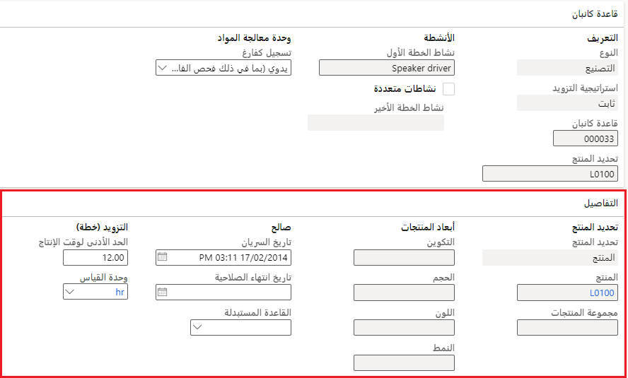
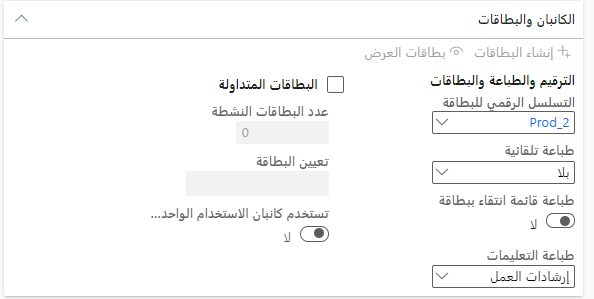

## إعداد قاعدة كانبان

تمثل قاعدة كانبان سياسة توريد المواد التي تحكم أنشطة المعالجة والتحويل التي تعتمد على وحدات كانبان. تحدد قاعدة كانبان الطريقة التي يتم بها إنتاج أحد الأصناف أو نقله وتربط الصنف بالأنشطة داخل تدفق الإنتاج.

استناداً إلى أفق الشركة للتنبؤ بالتوريد أو الطلب الفعلي من أوامر المبيعات أو الإنتاج، يقوم التخطيط الرئيسي تلقائياً بإنشاء بطاقات كانبان اللازمة لتغطية المشكلات ذات الصلة. يتم إجراء الإنشاء استناداً إلى قاعدة كانبان للأفق المؤكد. يمكن للمخطط أيضاً إنشاء أوامر مخططة يدوياً من نوع كانبان وتأكيدها في بطاقات كانبان المجدولة.

انتقل إلى **إدارة معلومات المنتج> Lean manufacturing> قواعد كانبان** لإنشاء قواعد كانبان المجدولة الجديدة.

تصف القائمة التالية الحقول في علامة التبويب السريعة **قاعده كانبان** (الوصول إلى علامة التبويب السريعة من خلال تحديد قاعدة كانبان):

-   **النوع**: يحدد ما إذا كان كانبان هو كانبان تصنيع والذي يقوم بإنشاء وظيفة معالجة كانبان أم كانبان سحب والذي يقوم بإنشاء وظيفة نقل كانبان.

-   **استراتيجية التزويد** - حدد **مجدول** عند إنشاء قاعدة كانبان المجدولة. يتم إنشاء بطاقات كانبان المجدولة أثناء التخطيط الرئيسي بناءً على الطلب الفعلي أو التنبؤ أو مستويات المخزون الأدنى التي تشير إلى الطلب. يمكن أيضاً إنشاء بطاقات كانبان المجدولة يدوياً.

-   **قاعدة كانبان** - رقم يتم تعيينه تلقائياً يحدد قاعدة كانبان.

-   **تحديد المنتج**: تعريف تحديد المنتج لقاعدة كانبان.

-   **نشاط الخطة الأول** - تحديد النشاط الأول لقاعدة كانبان. يربط هذا التحديد كانبان بنشاط إصدار تدفق الإنتاج.
    يجب أن يكون النشاط الأول لقاعدة كانبان التصنيع عبارة عن نشاط معالجة. ويجب أن يكون النشاط الأول والوحيد لقاعدة كانبان السحب عبارة عن نشاط نقل.

-   **أنشطة متعددة** - حدد خانة الاختيار هذه لتكوين أنشطة متعددة لقاعدة كانبان. يمكن فقط لوحدات كانبان التصنيع أن تتضمن أنشطة متعددة. يجب أن تنتهي قواعد كانبان المجدولة بنشاط يقوم بتحديث المخزون؛ وإلا، سيكون تحديد النشاط غير صالح.

-   **نشاط الخطة الأخير** - عند تحديد خانة الاختيار **أنشطة متعددة**، يمكنك تحديد النشاط الأخير لقاعدة كانبان. عند تحديد **أنشطة متعددة**، يمكنك اختيار تدفق النشاط المستند إلى علاقات نشاط تدفق الإنتاج لإنتاج التدفق الخاص بكانبان. تعرض صفحة البحث كافة الأنشطة التي يتم عرضها في اتجاه النشاط الأول في نفس إصدار تدفق الإنتاج.

-   **تسجيل كفارغ** - حدد خياراً لتحديد متى يتم تسجيل وحدات معالجة المواد كفارغة. الخيارات الموجودة في هذا الحقل هي:

    -   **عند استلام وحدات معالجة المواد** - عند اكتمال الوظيفة الأخيرة في كانبان، يتم تسجيل وحدات كانبان على أنها فارغة وتختفي من عروض النظرة العامة لكمية كانبان. يكون هذا الخيار هو الإعداد الافتراضي لبطاقات كانبان المجدولة، ويمكن استخدامه أيضاً لاستراتيجيات التزويد الأخرى. عند استخدام هذا الخيار مع استراتيجية الكمية الثابتة، يتم إنشاء كانبان جديد في كل مرة يتم فيها إكمال الوظيفة الأخيرة من كانبان السابق.

    -   **عند تسجيل متطلبات المصدر** - عند استهلاك المنتجات التي تم توريدها بواسطة وحدات كانبان الحدث من خلال مصدر الطلب، يتم تسجيل وحدات كانبان على أنها فارغة. وتختفي بطاقات كانبان من النظرة العامة لكمية كانبان في لوحات كانبان.

    -   **يدوي (بما في ذلك فحص الفارغ)** -يجب تسجيل وحدات كانبان بشكل صريح على أنها فارغة. استخدم هذا الإعداد عند تخزين المنتجات في السوبر ماركت قبل استهلاكها أو شحنها.
        يعد هذا الخيار هو الإعداد الافتراضي لوحدات كانبان الكمية الثابتة.

تصف القائمة التالية الحقول الموجودة في علامة التبويب السريعة **التفاصيل**:

-   **تحديد المنتج** - يمكن لقواعد كانبان المجدولة تعيين تحديد منتج من النوع **المنتج** أو **مجموعة منتجات** أو **الكل**.

    -   **المنتج**: تكون قاعدة كانبان صالحة لرقم صنف واحد.
        بالنسبة للأصناف ذات أبعاد المنتج، يمكن أن تكون قاعدة كانبان صالحة لبُعد معين أو لجميع قيم بُعد المنتج. يمكنك التأكد من أن قاعدة كانبان صالحة لجميع قيم أبعاد المنتج عن طريق ترك بُعد المنتج الخاص بقاعدة كانبان فارغاً.

    -   **مجموعة المنتجات**: تكون قاعدة كانبان صالحة لكافة الأصناف وأبعاد المنتج المرتبطة التي يتم تعيينها لمفتاح تخصيص صنف مفرد.

    -   **الكل**: تكون قاعدة كانبان صالحة لكافة المنتجات التي يتم توفيرها بواسطة النشاط الأخير لقاعدة كانبان. بعبارة أخرى، تكون قاعدة كانبان صالحة لجميع أصناف كانبان من نوع الأمر المخطَط التي بها مشاكل تتعلق بالموقع المحدد (الموقع، المستودع) لقاعدة كانبان.

-   **المنتج** - عند تحديد هذا الخيار في الحقل **تحديد المنتج**، حدد الصنف من قائمة البحث. إذا كان المنتج يحمل أبعاد منتج، فسيتم تنشيط حقول أبعاد المنتج ولكنها ليست إلزامية.

-   **مجموعة منتجات** - عند تحديد هذا الخيار في الحقل **تحديد المنتج**، حدد مفتاح توزيع الصنف من قائمة البحث.

-   **الصلاحية - تاريخ السريان** وكذلك **تاريخ انتهاء الصلاحية** - حدد التواريخ التي تصبح فيها قاعدة كانبان سارية ومتى تنتهي صلاحيتها.

-   **وقت الإنتاج** - عرض وقت الإنتاج المطلوب لتزويد كانبان. ووقت الإنتاج هو وقت الإنتاج الفعلي المتفق عليه لتزويد كانبان في السوبر ماركت عندما تكون وحدة معالجة المواد فارغة.
    من المرجح أن يكون وقت الإنتاج الفعلي أطول من وقت الإنتاج المحسوب.

-   **وحدة القياس** - وحدة القياس المستخدمة في وقت الإنتاج. عند تغيير وحدة القياس، تتم إعادة حساب وقت الإنتاج وفقاً للتحويل المحدد لوحدات القياس القديمة والجديدة. يمكن استخدام وحدات القياس لوقت الفئة فقط.

تصف القائمة التالية الحقول الموجودة في علامة التبويب السريعة **الكميات**:

-   **الكمية الافتراضية** - لقواعد كانبان المجدولة، أدخل كمية المنتج الافتراضية لاستخدامها لكل كانبان. القيمة الموجودة في هذا الحقل غير مطلوبة لقواعد الكمية المجدولة.

-   **الحد الأدنى للكمية** - لقواعد كانبان المجدولة، أدخل الحد الأدنى لكمية المنتجات لاستخدامه لكل كانبان. القيمة التي يتم إدخالها في إعدادات الأوامر الافتراضية وكمية المخزون والحد الأدنى. يتم استخدام إعداد كمية الأمر كقيمة افتراضية. يمكنك تغييرها، لكن لا يمكن أن تكون أقل من الحد الأدنى لكمية الأمر للمخزون.

-   **الحد الأقصى للكمية** - لقواعد كانبان المجدولة، أدخل الحد الأقصى لكمية المنتجات لاستخدامه لكل كانبان. القيمة التي يتم إدخالها في إعدادات الأوامر الافتراضية وكمية المخزون والحد الأقصى. يتم استخدام إعداد كمية الأمر كقيمة افتراضية. سيتجاوز الحد الأقصى للكمية القيمة الافتراضية، ولكن لا يمكن أن يكون أكبر من إعداد كميه المخزون.

-   **نسبة الفرق في كمية المنتجات** - حدد خانة الاختيار هذه للسماح لكمية المنتج المنتهية بالاختلاف عن كمية المنتج المحددة لكل مثيل لوظيفة كانبان التي تشير إلى قاعدة كانبان.

    -   **نسبة فارق أقل** - أدخل الكمية التي يمكن أن تكون كمية المنتج المنتهية أقل من كمية المنتج المحددة.

    -   **نسبة فارق أكبر** - أدخل الكمية التي يمكن أن تكون كمية المنتج المنتهية وفقها أكبر من كمية المنتج المحددة.

-   **الحد الأدنى لحد التنبيه** - أدخل عدد بطاقات كانبان لتحديد الحد الأدنى لكمية كانبان لكل خلية عمل أو سوبرماركت. يظهر مستوى كانبان هذا في نظرة عامة على كمية كانبان للوحات كانبان. ويكون للحد الأدنى لحد التنبيه التأثيرات التالية:

    -   عندما لا يتوافق عدد مهام كانبان النشطة التي يتم تخطيطها مع الحد الأدنى المحدد لكمية التنبيه، يصبح لون الخلفية أحمر بدلاً من الأخضر. يمكن أن تتضمن بطاقات كانبان النشطة أي حالة لوحدة معالجة المواد باستثناء "فارغة".

    -   يتم فرز قواعد كانبان حسب أهمية التخطيط، والتي يمكنك حسابها في بطاقات كانبان النشطة باستخدام الصيغة التالية:

    > **الحد الأدنى لحد التنبيه – عدد الوظائف التي لها الحالة = المخططة**

    -   لا يتم عرض قواعد كانبان المجدولة والأحداث في نظرة عامة على كمية كانبان إذا تحققت الشروط التالية:

        -   الحد الأدنى لحد التنبيه = صفر

        -   لا توجد أي بطاقات كانبان نشطة

-   **الحد الأقصى لحد التنبيه** - أدخل عدد بطاقات كانبان لتحديد الحد الأقصى لكمية كانبان لكل خلية عمل أو سوبرماركت. يساعدك هذا الحد على تمثيل المخزون الزائد بصرياً في السوبر ماركت. كما يعطي إشارة مرئية عند إنشاء كانبان جدولة أو كانبان حدث أكثر من المتوقع لقاعدة كانبان.

    يظهر مستوى كانبان في نظرة عامة على كمية كانبان للوحات كانبان. عندما يكون عدد الوظائف المكتملة لبطاقات كانبان النشطة أكبر من الحد الأقصى المحدد لكمية التنبيه، يصبح لون الخلفية أحمر بدلاً من الأخضر. يمكن أن تتضمن بطاقات كانبان النشطة أي حالة لوحدة معالجة المواد باستثناء "فارغة".

-   **كمية التخطيط التلقائي** - لتخطيط كانبان تلقائياً بدلاً من تحميلها يدوياً على خلية العمل، يمكنك تعيين كمية التخطيط التلقائي. أدخل عدد الوظائف غير المخططة التي تتسبب في حدوث تخطيط تلقائي. وتكون وظيفة كانبان غير المخططة بالحالة غير مخططة.

-   **‏‫الحد الأقصى للوظائف المخططة‬**: عندما تستخدم التخطيط التلقائي لوظائف كانبان غير المخططة، أدخل الحد الأقصى لعدد وظائف كانبان المخططة لقاعدة كانبان محددة. استخدم هذا الحد لتجنب التحميل الزائد لخلية عمل بطاقات كانبان المجدولة والأحداث. قد يحدث هذا الموقف نتيجة لطلب خطا أو طلبات العملاء الكبيرة بشكل استثنائي.

تصف القائمة التالية الحقول الموجودة في علامة التبويب السريعة **كانبان والبطاقات**:

-   **تسلسل أرقام البطاقات**: التسلسل الرقمي لبطاقة كانبان الذي يتم تعيينه إلى قاعدة كانبان. عند إنشاء قاعدة كانبان، يتم استخدام التسلسل الرقمي الافتراضي من معلمات الإنتاج.

    إنها أفضل ممارسة مثبتة لاستخدام تسلسلات رقمية فريدة وقصيرة للبطاقات المتداولة الثابتة. يساعد هذا الأسلوب على تحديد بطاقة معينة بشكل أكثر كفاءة.

-   **الطباعة التلقائية** - حدد الحدث الذي يتسبب في الطباعة التلقائية لبطاقات كانبان. الخيارات الموجودة في هذا الحقل هي:

    -   **بلا** - لا يتم استخدام الطباعة التلقائية. نوصي باستخدام هذا الإعداد عند استخدام البطاقات المتداولة أو معالجة كانبان الإلكترونية.

    -   **الإنشاء** - طباعة وحدات الكانبان عند إنشاء الكانبان. نوصي باستخدام هذا الإعداد عند استخدام لوحة تخطيط فعلية لوحدات كانبان الأحداث ولا يمكن استخدام البطاقات المتداولة.

    -   **الخطة** - طباعة وحدات كانبان عند تخطيط الوظيفة الأولى في كانبان. نوصي باستخدام هذا الإعداد عندما تقوم بطاقة كانبان المطبوعة بتشغيل معالجة وظائف كانبان في صالة المتجر.

    -   **تجهيز** - طباعة وحدات كانبان عند تسجيل المهمة الأولى في تدفق كانبان على أنها جاهزة.

    -   **البدء** - طباعة وحدات كانبان عند تسجيل المهمة الأولى في تدفق كانبان على أنها قيد التقدم.

    -   **استلام** - طباعة وحدات كانبان عند تسجيل المهمة الأولى في تدفق كانبان على أنها مكتملة. يُستخدم هذا الخيار غالباً إذا كانت المجموعة أو الأرقام المسلسلة للأصناف المنتهية مطبوعة على بطاقة كانبان.

-   **طباعة قائمة الانتقاء مع البطاقة** - تعيين شريط التمرير هذا على **نعم** لطباعة قائمة الانتقاء مع بطاقة كانبان.

-   **إرشادات الطباعة**: حدد المعلومات المطلوب طباعتها على بطاقة كانبان. الخيارات الموجودة في هذا الحقل هي:

    -   **إرشادات العمل** - طباعة مستند إرشادات الإنتاج المرفقة بكانبان.

    -   **إرشادات الشحن**: قم بطباعة عنوان الشحن الكامل ومعلومات التتبع، بما في ذلك المجموعة والأرقام المسلسلة على بطاقة كانبان.

-   **البطاقات المتداولة** - حدد خانة الاختيار هذه لاستخدام البطاقات المتداولة مع قاعدة الكانبان الحالية.

-   **عدد البطاقات النشطة** - أدخل عدد البطاقات المتداولة النشطة التي تكون قيد التداول في وقت معين لقاعدة كانبان.

-   **تعيين البطاقة** - حدد طريقة تعيين البطاقات المتداولة. الخيارات الموجودة في هذا الحقل هي:

    -   **تلقائي** - عند إنشاء كانبان، يتم تعيين البطاقة تلقائياً عند تحقق هذه الشروط: وجود كانبان نشط غير معين ووجود بطاقة نشطة غير معينة لقاعدة كانبان. يكون هذا الخيار هو الإعداد الافتراضي.

        عند إنشاء وحدات كانبان قبل إنشاء البطاقات المتداولة، يتم تعيين البطاقات تلقائياً عند إنشاء البطاقات. إذا كان هناك نقص في البطاقات، فعند تسجيل كانبان على أنه فارغ، يتم تعيين البطاقة تلقائياً إلى كانبان جديد. وهذا الأسلوب مفيد بشكل خاص عندما تتوافق البطاقات المتداولة مع عدد محدود من الناقلات، أو الحوامل، أو الصناديق.

    -  **يدوي** - يجب عليك تعيين بطاقة يدوياً في لوحة كانبان.
        يمكنك القيام بهذه العملية عند إعداد وظيفة كانبان.

- **وحدات كانبان للاستخدام الواحد تستخدم بطاقات متداولة** - بالنسبة لقواعد كانبان الكمية الثابتة، حدد خانة الاختيار هذه لاستخدام البطاقات المتداولة مع وحدات كانبان للاستخدام الواحد. في حالة عدم تحديد شريط التمرير، يتم إنشاء بطاقات كانبان للاستخدام الواحد لبطاقات كانبان للاستخدام الواحد.
        ثم يتم حجز البطاقات المتداولة للاستخدام مع وحدات كانبان التي لم يتم إنشاؤها للاستخدام الواحد.

## مجموعة المنتجات ومفاتيح توزيع الأصناف

يمكن إعداد قواعد كانبان في مقابل مجموعات المنتجات، مثل تلك الأصناف الموجودة في مجموعة المنتجات التي يتم تمثيلها بواسطة قاعدة كانبان. باستخدام بطاقات كانبان المجدولة، يمكن أن تكون هذه القواعد مفيدة لأن مجموعة المنتجات يتم تمثيلها بواسطة مفتاح توزيع الصنف. يمكن استخدام مفاتيح توزيع الأصناف بحيث يتم توزيع إجمالي كمية التنبؤ وصولاً إلى الصنف أو أبعاد الصنف بناءً على النسب المئوية.

على سبيل المثال، يتم إنشاء سطر توقعات المبيعات المكون من 100 قطعة في مفتاح توزيع الصنف. يحتوي المفتاح على صنفين بنسبة 45 بالمائة و55 بالمائة على التوالي. أثناء تخطيط التنبؤ، يتم إنشاء سطر متطلب لكل رقم صنف مكون من 45 و55 قطعة على التوالي.

**التخطيط الرئيسي > إعداد > التنبؤ بالطلب > مفاتيح توزيع الأصناف**

## اعتبارات مخزون بطاقات كانبان المجدولة

ينتهي كانبان المجدول حسب التعريف دائماً في موقع يتحكم فيه المخزون. لذلك، يجب أن تتضمن قاعدة كانبان المجدولة نشاطاً أخيراً يقوم بتحديث المخزون الفعلي. عند محاولة تحديد نشاط أخير لا يتحكم فيه المخزون، يتم عرض رسالة خطأ.
