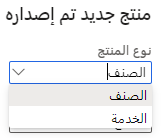
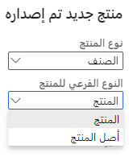

يتكون *المنتج* في Supply Chain Management من تعريف منتج أساسي. ويتم تعريف هذا المنتج بشكل مستقل عن المؤسسة حيث يتم استخدامه. عندما يتم تخويل استخدام المنتج في كيان قانوني، يتم إعداد التفاصيل التنظيمية الإضافية التابعة، مثل التكلفة وخطط التغطية والمعلومات الضريبية والموردين المفضلين لتزويد المنتج وغير ذلك الكثير، في الكيانات القانونية.

يتم إنشاء *تعريفات المنتج* بشكل مستقل عن كيان قانوني.
لذلك، تتم مشاركة القيم الأساسية، مثل رقم المنتج ونوعه واسمه. بإمكان كيان قانوني تجاوز بعض القيم الرئيسية، مثل اسم البحث، بينما يتم الاحتفاظ بالقيم الأخرى كسمات تعريفات أساسية، وبالتالي لا يمكن تغييرها إلا على تعريف المنتج الفعلي.

يتم دعم عملية التخويل من خلال وظيفة الإصدار. تسمح هذه الوظيفة للمستخدمين بتحديد المنتجات التي تتضمن متغيرات وإتاحتها في كيان قانوني واحد أو أكثر.

من عملية لامركزية، بإمكان المستخدمين إنشاء المنتجات والاحتفاظ بها مباشرةً من صفحة قائمة **المنتجات الصادرة** في الوحدة النمطية "إدارة معلومات المنتج"، لأن المستخدم لديه دور الأمان لاتباع هذه الخطوات. يتم تضمين هذه المهام في دوري "مصمم المنتج" و"مدير تصميم المنتج". عند إنشاء المنتج في كيان قانوني، يتم إنشاء تعريف المنتج الأساسي تلقائياً في مستودع المنتجات المشتركة.

يمكنك الاختيار من بين ثلاث تقنيات تكوين:

-   **المتغيرات المعرفة مسبقاً** - يتم تعريفها بواسطة أبعاد المنتج المعرفة مسبقاً. يتضمن تعريف المتغير تعريف مجموعة صالحة من الأبعاد، مثل اللون والنمط والحجم.
    تنتج كل مجموعة متغير منتج مميزاً.
-   **التكوين المستند إلى بعد** - يُستخدم عادةً في سيناريوهات التصنيع، ويتيح لك استخدام بُعد التكوين في تعريف قائمة مكونات الصنف. بعد تحديد التكوين، يستخدم النظام المجموعة الفرعية لبنود قائمة مكونات الصنف (BOM) الصالحة لهذا التكوين للتخطيط والإنتاج. يعرف هذا المفهوم أيضاً باسم *قائمة مكونات الصنف (BOM) العامة*، لأنه يتم استخدام قائمة مكونات الصنف المشتركة لجميع تكوينات المنتج.
-   **تكوين مستنِد إلى قيد** - يستخدم نموذج تكوين المنتج لوصف جميع السمات والمكونات الممكنة المطلوبة لوصف جميع المتغيرات المحتملة لمنتج ما في نموذج واحد. يمكنك وصف قيود مجموعات السمات من خلال التعبيرات العادية أو القيود المستندة إلى الجدول.
    تصبح نماذج التكوين والمكوِّنات أكثر أهمية في إدارة معلومات المنتج، ويتم استخدامها في جميع الصناعات.

عند التخطيط لتطبيق Supply Chain Management، فمن الجدير بالأهمية أن تحدد تقنية التكوين الصحيحة لعملية الأعمال. يتعذر تحويل منتج من نموذج إلى آخر بعد التنفيذ.

فيما يلي نوعان من المنتجات:

-   **الصنف** - يتم شراء هذه المنتجات، ويمكنك استخدامها للاستهلاك والتوزيع وإعادة البيع، ويمكنك تضمينها في إنتاج الأصناف المصنعة (BOM).
-   **الخدمة** - يتم استخدام هذه المنتجات لتحديد كمية الخدمات بالساعة، على سبيل المثال.

    

فيما يلي النوعان الفرعيان للمنتجات:

-   **المنتج** - المنتج هو منتج قابل للتعريف بشكل فريد. إنه يعمل كمنتج رئيسي لا يتغيّر؛ وبالتالي لا يمكن إقران أي بُعد من أبعاد المنتج بالتعريف.
-   **أصل المنتج** - يحتفظ أصل المنتج بالتعريف والقواعد التي تحدد كيفية وصف المنتجات المميزة وسلوكها في دورات العمل. بالاستناد إلى هذه التعريفات، يمكنك إنشاء منتجات مميزة.
    وتعرف هذه المنتجات المميزة باسم متغيرات المنتج.

    في Supply Chain Management، يرتبط أصل المنتج بمجموعة أبعاد المنتج وتقنية التكوين لتحديد قواعد العمل. أبعاد المنتج (اللون والحجم والنمط والتكوين) هي مجموعة محددة من السمات التي يمكن استخدامها في Supply Chain Management لتحديد السلوكيات المحددة للمنتجات ذات الصلة وتعقبها. تساعد هذه الأبعاد المستخدمين أيضاً في البحث عن المنتجات وتحديدها.

    تعمل أصول المنتجات كقوالب أو نماذج للمتغيرات. بإمكانك تعريف متغيرات أصل المنتج بشكل مسبق أو يمكنك إنشاء هذه المتغيرات في سيناريوهات البيع باستخدام أداة تكوين المنتج. يقترن أصل المنتج ببُعد واحد أو أكثر من أبعاد المنتج.

    

## متغيرات المنتجات

يستند متغير المنتج إلى اختيار تقنية التكوين. يمكنك تحديد المتغير مسبقاً باستخدام أبعاد المنتج الخاصة بأصله، أو يمكنك تكوينه باستخدام أداة تكوين المنتج.

