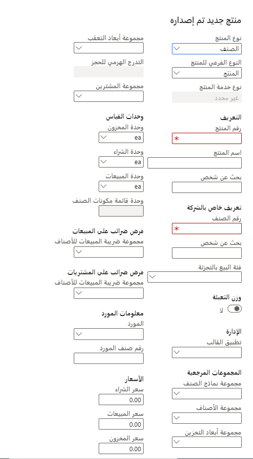
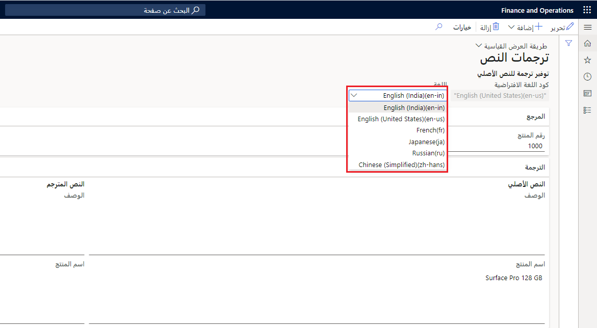
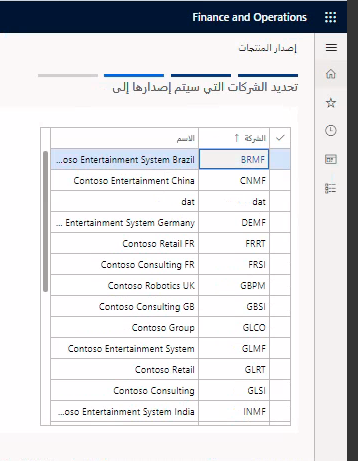
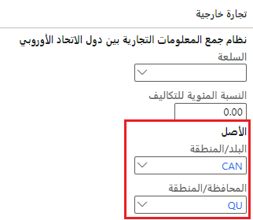
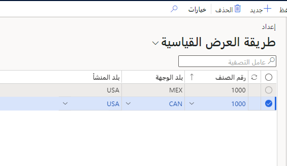
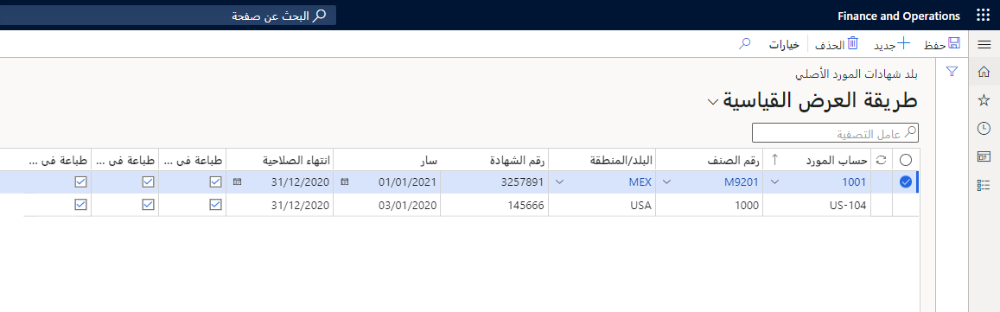
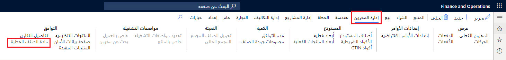
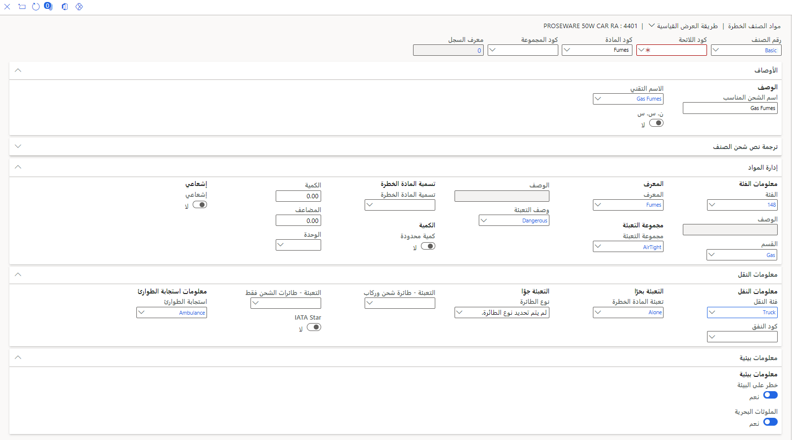
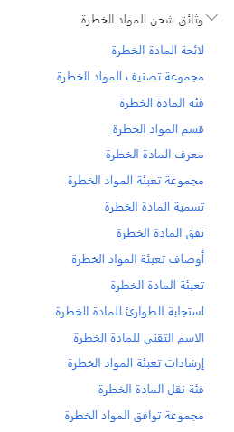
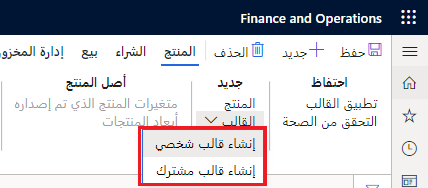

يتضمن إنشاء منتج جديد العملية التالية:

1.  إنشاء المنتج وتحديده.
2.  إصدار المنتجات إلى الكيانات القانونية.
3.  تعريف البيانات الخاصة بالكيان القانوني.

عندما تقوم بإنشاء تعريف منتج جديد، يُعد النوع والنوع الفرعي السمتين الرئيسيتين اللتين سيتم إدخالهما.

انتقل إلى **إدارة معلومات المنتج > المنتجات > المنتجات الصادرة**، لإنشاء منتجات صادرة.

يصنف نوع المنتج ما إذا كان المنتج ملموساً (صنفاً) أو غير ملموس (خدمة)، بينما النوع الفرعي هو التصنيف الفرعي للمنتج.

## ترجمة بيانات المنتج 

تتيح لك صفحة **ترجمات النص** الحصول على ترجمات لبيانات المنتج. في هذه الصفحة، يمكنك إدخال أوصاف وأسماء منتجات للغات متعددة.
ومع ذلك، يكون اسم المنتج ووصفه اختياريين؛ وحده رقم المنتج مطلوب. لفتح صفحة **ترجمات النص**، حدد الزر **ترجمات** في جزء الإجراءات الخاص بكافة صفحات المنتجات وصفحات القوائم.

 

يتم استخدام ترجمات المنتج بشكل رئيسي للإخراج على المستندات الخارجية، بينما يتم عرض قيم البيانات دائماً بلغة النظام، على سبيل المثال، عند فتح الصفحات المتعلقة بالمنتج وصفحات القوائم وعرضها.

في المستندات الخارجية، سيتم عرض اسم المنتج وفقاً للغة الشركة أو اللغة المفضلة للعميل أو المورّد.

## تخويل إعداد المنتج في كيان قانوني 

قبل أن تتمكن من استخدام أصل منتج في حركة، مثل أمر المبيعات أو أمر الشراء، عليك إصدار أصل المنتج وواحد أو أكثر من متغيراته إلى كل كيان قانوني، بمعنى أنه إذا تم تعيين تقنية التكوين إلى متغيرات محددة مسبقاً. عندما تقوم بإصدار المنتجات، يمكن إصدار العديد من مجموعات المنتجات وأصول المنتجات ومتغيرات المنتجات إلى كيان قانوني واحد أو أكثر:

-   منتج واحد أو منتجات متعددة
-   متغير منتج واحد أو متغيرات منتجات متعددة
-   كيان قانوني واحد أو كيانات قانونية متعددة

تتيح عملية إصدار المنتج للمستخدمين في مؤسسة إرسال تعريف المنتج إلى الكيانات القانونية المختلفة. ومن خلال إصدار منتج أو أصل منتج، يمكنك إقرانه بكيان قانوني وتخويل استخدام تعريف المنتج في الكيان القانوني.

انتقل إلى **إدارة معلومات المنتج‬‏‫ > المنتجات > جميع المنتجات وأصول المنتجات**، ثم حدد منتجاً أو أكثر من المنتجات التي ترغب في تخويلها لكيان قانوني واحد أو أكثر. تتيح لك هذه العملية استخدام المنتج في العمليات، مثل المخزون والشراء والمبيعات والإنتاج، عن طريق تحديد الزر **إصدار المنتجات**.

### السيناريو

تم تقديم منتج جديد في شركة USMF. أكمل مصمم المنتج إعداد للمنتج الجديد وأصدره إلى الكيان القانوني الخاص بالإنتاج **USMF** بحيث يمكن بدء الإنتاج. يتحدث مصمم المنتج مع مدير المبيعات ويتفقان على إصدار المنتجات الجديدة في الكيانات القانونية للمبيعات في **الولايات المتحدة** و **USRT** ولكن ليس في البلدان أو المناطق الأخرى في الوقت الحالي.

يريد مصمم المنتج التأكد من توفر كل متغير منتج في الكيانين القانونيين اللذين تم التوافق عليهما.

من صفحة **إصدار المنتجات**، يمكنك عرض كافة جلسات عمل إصدار المنتج المفتوحة، وعرض الخطأ إذا تم تعيين حقل **إظهار سجل المعلومات عند الفشل** إلى **نعم**، وتغيير جلسة العمل وبدء الإصدار. تُحذف جلسة العمل إذا لم يعد هناك أي أخطاء موجودة.

## إنجاز المنتجات الصادرة 

بعد إصدار منتج إلى كيان قانوني، عليك إكمال تعريفه قبل استخدامه في حركة، مثل أمر مبيعات أو أمر شراء. ويجب إكمال تعريف المنتج في كل كيان قانوني تم إصداره فيه. يمكنك تحديد زر **التحقق من الصحة** في جزء إجراءات **المنتجات** للتحقق من إنجاز المنتج.

تعتبر الحقول التالية ضرورية لإنجاز المنتج. يمكنك إدخال المعلومات يدوياً أو باستخدام قالب:

-   مجموعة نماذج الصنف
-   مجموعة الأصناف
-   مجموعة أبعاد التخزين (فقط في حالة عدم تحديدها في تعريف المنتج)
-   مجموعة أبعاد التعقب (فقط في حالة عدم تحديدها في تعريف المنتج)
-   وحدات المبيعات، الشراء، المخزون، وقائمة مكونات الصنف
-   التدرج الهرمي للحجز (في حالة استخدام عمليات إدارة المستودعات)
-   معرف مجموعة تسلسل الوحدة (في حالة استخدام عمليات إدارة المستودعات)

تتوفر علامات التبويب التالية في صفحة **تفاصيل المنتج**:

-   **عام** - إدخال معلومات إضافية حول المنتج المحدد أو عرضها.
-   **الشراء** - إدخال معلومات حول أوامر الشراء الافتراضية وتسعير أمر الشراء والخصومات أو عرضها.
-   **ترويج** - يُستخدم هذا القسم في وظيفة التجارة؛ حيث يمكنه منع إضافة المنتج إلى قسيمة.
-   **التسليم** - يمكنك تمكين معلمات مثل التسليم المباشر وتطبيق منطق التحويل إلى الكائن على المنتج.
-   **البيع** - إدخال معلومات حول أوامر المبيعات الافتراضية وتسعير أمر المبيعات والخصومات أو عرضها.
-   **التجارة الخارجية** - إدخال معلومات حول التجارة الخارجية، بما في ذلك نظام جمع المعلومات التجارية بين دول الاتحاد الأوروبي وأصل المنتج أو عرضها.‬
-   **إدارة المخزون** - إدخال معلومات حول قياسات المنتجات والأبعاد الفعلية والمعالجة والتعبئة أو عرضها.
-   **المهندس** - إدخال معلومات حول قائمة مكونات الصنف والإنتاج ومنشئ المنتجات أو عرضها.
-   **الخطة** - إدخال المعلومات أو عرضها حول مجموعة تغطية الخطة.
-   **إدارة المشاريع** - إدخال المعلومات حول فئة المشروع أو عرضها.
-   **إدارة التكلفة** - إدخال معلومات حول تكاليف المنتج، مثل سعر التكلفة ومجموعه التكلفة وعرضها.
-   **الأبعاد المالية** - الأبعاد المالية الافتراضية للحساب الرئيسي. عند تحديد قيمة بعد مالي، تعرض مجموعة حقول **البعد قيد الاستخدام** المكان الذي يتم فيه استخدام البعد في بنيات الحساب وبنيات القواعد المتقدمة.
-   **المستودع** - في علامة التبويب هذه، يمكن إعداد المعلمات إذا كان تخزين المنتج سيتم في موقع مُدار بواسطة المستودع، مما يعني أن إدارة المستودع تتم بواسطة الوحدة النمطية "إدارة المستودعات‬".
-   **البيع بالتجزئة** - يمكنك تمكين وتعيين قيم لهذا المنتج والتي يتم استخدامها في الوحدة النمطية Retail.
-   **النقل** - يمكنك اختيار تمكين عملية إدارة النقل للمنتج.
-   **متغيرات المنتج** - ينطبق فقط على أصول المنتجات، ويمكنك تحديد قيم أبعاد المنتج الافتراضية مثل الحجم واللون والنمط والتكوين.

## بلد المنشأ

بالنسبة للشركات التي تقوم بالبيع عبر حدود البلد، غالباً ما تكون هناك متطلبات لتضمين معلومات حول بلد المنشأ للمنتجات التي تقوم بنقلها. يتضمن جدول **المنتجات الصادرة** حقلاً يشير إلى بلد المنشأ كما يظهر في **إدارة معلومات المنتج > المنتجات > المنتجات الصادرة** في علامة التبويب السريعة **التجارة الخارجية**:

تُظهر لقطة الشاشة التالية قاعدة تم تعيينها تحدد **وجهة** و **بلد المنشأ** لمنتج معين، يمكن الوصول إليهما من **إدارة معلومات المنتج > الإعداد > توافق المنتج > بلد المنشأ > قواعد بلد المنشأ**.
 

في بعض الأحيان، يوفر البائعون شهادة لعملائهم تتضمن تاريخ انتهاء الصلاحية ورقم الشهادة. بعد ذلك، سيستخدم العملاء هذه المعلومات الموثقة لإعداد وثائق الشحن حيث تكون مطلوبة. باستخدام هذه المعلومات، بإمكان العميل متابعة الأمر مع المورّدين عند انتهاء صلاحية الشهادة.
 

علاوةً على ذلك، بإمكان البائع، قبل إجراء عملية بيع، استخدام هذه المعلومات للتحقق من توفر تفاصيل حول ما إذا كان سيتم نقل منتج معين إلى بلد لديه متطلبات أو تعريفة معينة.  

## المواد الخطرة

تقوم بعض المؤسسات ببيع منتجات تحتوي على مواد خطرة. وفي هذه الحالات، تحتاج الشركات إلى اتخاذ تدابير وقائية خاصة. 

### إدارة معلومات المنتجات التي تحتوي على مواد خطرة

إذا قامت إحدى الشركات بتوزيع منتجات تحتوي على بضائع خطرة، فيجب أن تكون قادرة على تخزين معلومات إضافية حول تلك المنتجات. بإمكان هذه المعلومات الإضافية أن تساعدها على الالتزام بلوائح الشحن والتعامل مع المنتجات. توجد خيارات الإعداد الأخرى لهذا السيناريو في **إدارة معلومات المنتج‬‏‫ > المنتجات > المنتجات الصادرة** على علامة تبويب الإجراء **إدارة المخزون**.
 

### وثائق شحن المواد الخطرة

يمكنك إعداد الحقول التي كانت موجودة في شاشة **المنتجات الصادرة** عن طريق الانتقال إلى عنصر القائمة **وثائق شحن المواد الخطرة**، كما يظهر في لقطة الشاشة التالية.

الحقول الأساسية في قائمة **وثائق شحن المواد الخطرة** هي:

- **ملصق المواد الخطرة** - يشير إلى المعلومات المطبوعة على بطاقة الشحن

- **تعريف المواد الخطرة** - تعريف المواد.

- **استجابة الطوارئ** - الإشارة إلى الاستجابة المناسبة عندما تلامس المواد شخصاً أو أصناف أخرى.

- **إرشادات تعبئة المواد الخطرة** - إرشادات تعبئة خاصة ذات صلة بالمواد.

### السيناريو

يجب أن يقوم مصمم المنتج بإنجاز الإعداد الخاص بعناصر واجهة المستخدم الجديدة التي قاموا بإصدارها في شركة USMF. وهو يريد أن يتأكد من أن عناصر واجهة المستخدم تتضمن الإعداد الإلزامي للمنتج المطلوب استخدامه في الحركة.

عند الانتهاء من عملية الإعداد، يحدد مصمم المنتج **التحقق من الصحة** في صفحة **المنتجات الصادرة** لضمان تعبئة الحقول الإلزامية. سيقوم النظام بالتحقق من السمات وسيصدر خطأ في حالة عدم وجود أي قيمة. ومع ذلك، لن يقوم النظام بحظر استخدام المنتج؛ إنه مجرد فحص للإعداد.

## قوالب المنتج 

تتطلب معظم الشركات الإعداد الإضافي لأحد المنتجات قبل التمكن من إكمال تعريف المنتج. في حالة وجود أوجه تشابه كثيرة بين عمليات إعداد منتجات متعددة، من المستحسن باستخدام قالب.

[

يمكنك استخدام قوالب المنتجات لنسخ المعلومات من منتج صادر إلى منتجات صادرة محددة أخرى. تساعد قوالب المنتجات في تسهيل عملية إعداد البيانات الخاصة بالكيان القانوني للمنتجات عند وجود قيم كثيرة هي نفسها من منتج إلى آخر.

يمكن إنشاء نوعين من القوالب: القالب الشخصي والقالب المشترك. يتوفر قالب شخصي فقط بواسطة المستخدم الذي قام بإنشاء القالب، بينما يمكن لأي مستخدم في النظام الوصول إلى القالب المشترك.

شاهد مقطع الفيديو التالي للاطلاع على عرض توضيحي حول كيفية إنشاء منتج جديد مباشرة في صفحة **المنتجات الصادرة**.

 > [!VIDEO https://www.microsoft.com/videoplayer/embed/RE4ayjQ]
