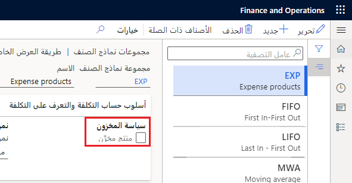

في Supply Chain Management، يمكن تعريف المنتجات على أنها مخزّنة أو غير مخزّنة.

إذا كان المنتج مخزّناً، يتم توفير مخزون فعلي ويتم الاحتفاظ بمخزون متاح.

إذا لم يكن المنتج مخزّناً، فلا يتم دعم الوظائف ذات الصلة بالمخزون، مثل دفاتر يومية التحويل والجرد، ولن يتم تعقب المخزون المتاح.

يتم تعريف المنتجات غير المخزّنة في صفحة **مجموعة نماذج الصنف**. إذا كانت خانة الاختيار **المنتج المخزّن** غير محددة، يتم اعتبار المنتجات المقترنة بمجموعة نماذج الصنف هذه غير مخزّنة.

المنتج غير المخزّن عبارة عن منتج لنوع الصنف أو الخدمة ولا يمكن تعقبه في المخزون لكن يمكن معالجته من خلال عملية الاستلام والشحن. بالإضافة إلى ذلك، لن يتضمن التخطيط الرئيسي المنتجات غير المخزّنة.

### السيناريو

تبيع شركة USMF خدمات استشارية للمساعدة في تركيب نظام مسرح منزلي. يتم إعداد الخدمات الاستشارية كمنتج خدمة ويكون غير مخزّن في المستودع.  يمكن لشركة USMF في هذه الحالة بيع ساعات الخدمات الاستشارية بدون أن تضطر إلى تعقب المخزون.
