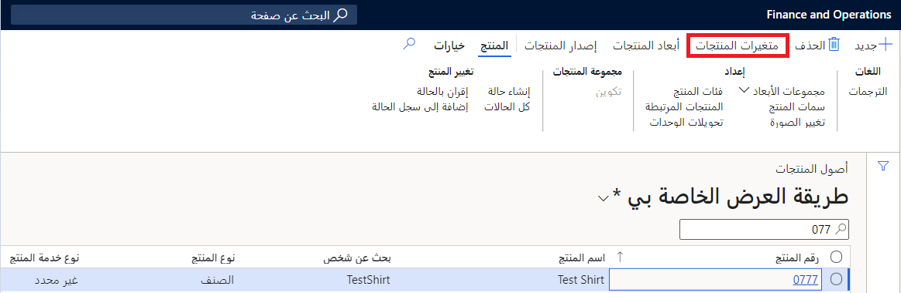
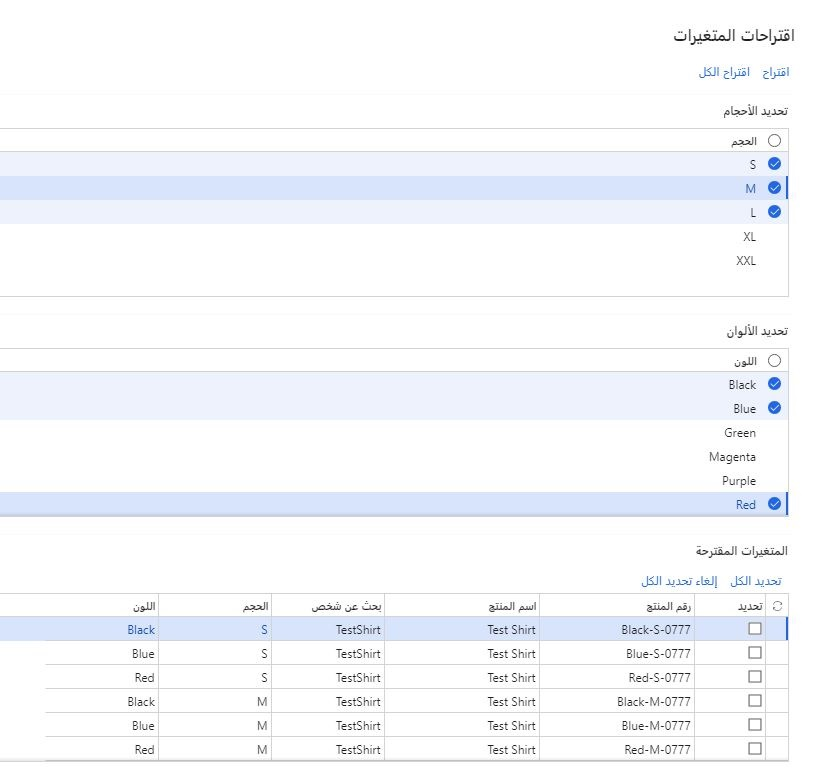

بالنسبة إلى المؤسسات التي تحتوي على العديد من مجموعات أبعاد المنتج في السوق، تعمل وظيفة التوصية بتباين المنتج على تحسين أداء المنتجات وقابليتها للاستخدام. كما أن الأسلوب المحسن يزيد من إنتاجية المستخدم عن طريق تصميم اقتراحات التباين التي تم إنشاؤها وفق الاحتياجات المحددة للمستخدم. 

يمكنك الحصول على الفوائد التالية باستخدام صفحة **اقتراحات المتغير**: 

- **الإنشاء المؤجل لاقتراحات المتغيرات** - بدلاً من إجراء اقتراحات دون تعليقات المستخدم، تتضمن صفحة اقتراحات المتغيرات تدفقا للمستخدمين لإرسال اقتراحات للنظام لمراعاتها قبل وضع اقتراحات. ومن خلال جعل العملية أكثر وضوحاً وأكثر تقدماً، يمكن زيادة ثقة المستخدم من خلال بناء الثقة في طريقة عمل العملية.

- **تحديد قيم الأبعاد** - بشكلٍ عام، عندما يتوفر لديك العديد من قيم الأبعاد، فإنك غالباً ما تكون مهتماً بإعداد مقترحات المتغيرات التي تتضمن مجموعة فرعية منها فقط (على سبيل المثال، عند تقديم مجموعة جديدة من الألوان أو الأنماط). نظراً إلى وجود واجهة تم تعديلها، فمن الممكن الآن تحديد قيم الأبعاد المستخدمة لإنشاء اقتراحات تباين المنتج. وهذا يعزز بشكل كبير من ملاءمة الخيارات المقترحة والأداء العام للنظام وإنتاجية مستخدميها.

## تشغيل ميزة تحسينات الصفحة الخاصة باقتراحات المتغيرات

لكي تتمكن من استخدام ميزة **تحسينات الصفحة الخاصة باقتراحات المتغيرات**، من المفترض أن يتم تمكين النظام. يمكن للمسؤولين استخدام [إعدادات إدارة الميزات](/dynamics365/fin-ops-core/fin-ops/get-started/feature-management/feature-management-overview/?azure-portal=true) للتحقق من حالة الميزة وتشغيلها. يتم إدراج الميزة في مساحة عمل **إدارة الميزات** بالطريقة التالية:

- **الوحدة النمطية** - إدارة معلومات المنتج
- **اسم الميزة** - تحسينات الصفحة الخاصة باقتراحات المتغيرات

## التعامل مع اقتراحات المتغيرات المحسنة

لإنشاء اقتراحات متغير المنتج عند تمكين ميزة **تحسينات الصفحة الخاصة باقتراحات المتغيرات**، اتبع الخطوات التالية:

1.  كما هو موضح في القسم السابق، افتح أو أنشئ أصل منتج وأضف أبعاد المنتج المطلوبة إليه.
2.  مع فتح أصل المنتج، حدد **متغيرات المنتج** في جزء الإجراءات.

    
3.  حدد **اقتراحات المتغيرات** في جزء الإجراءات.
4.  حدد القيم التي تود استخدامها لكل من الأبعاد.
5.  في شريط الأدوات، حدد **اقترح**.
6.  يُنشئ النظام قائمة بجميع المجموعات الممكنة للأحجام والألوان التي حددتها. في علامة التبويب السريعة **المتغيرات المقترحة**، حدد مربع الاختيار لكل مجموعة من أبعاد المنتج التي تود استخدامها أو **تحديد الكل** في شريط الأدوات لتحديدها بالكامل.
    
7.  حدد **إنشاء** لإضافة المتغيرات إلى أصل المنتج الحالي.

راجع هذا العرض التوضيحي القصير لكيفية إنشاء المتغيرات لأصل المنتج الحالي.

