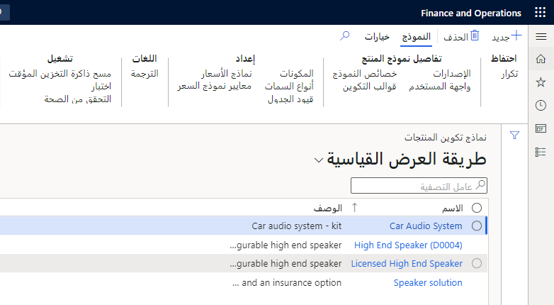
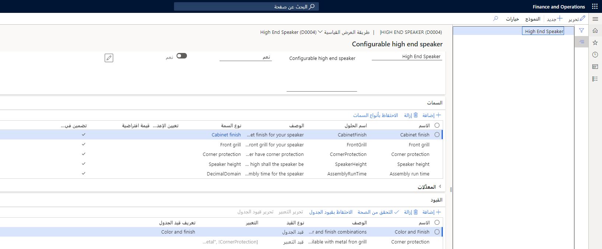

باختلاف سمات المنتج، تتيح لك أبعاد المنتج تعقب قيمها في جميع العمليات الرئيسية، مثل أغراض التكلفة والمخزون والتحليل. في حين أنه يمكن ربط سمات المنتج بالمنتجات وأصول المنتجات، لا يمكن استخدام أبعاد المنتجات إلا مع أصول المنتجات (باستثناء الأساسيات التي تم تكوينها باستخدام خيار **إنشاء تكوين مستند إلى قيد‬**). هذا لأنهم يشكلون تفرد اختلافات أصل المنتج.

يمكنك تحديد أبعاد المنتج الإلزامية لأصل منتج معين عن طريق تحديد مجموعة أبعاد المنتج المناسبة عند إنشاء أصل المنتج.

انتقل إلى صفحة **إدارة معلومات المنتج > الإعداد > مجموعات الأبعاد والمتغيرات > مجموعات أبعاد المنتج** لإنشاء مجموعات أبعاد المنتج.

نظراً لأن أبعاد المنتج توفر التفرد للتباين، يتم تطبيق القواعد التالية:

-   يجب تحديد البعد عند إنشاء حركات المنتج، على سبيل المثال عند إنشاء بند أمر الشراء أو المبيعات.
-   ينطبق البعد المحدد فقط على حركة المنتج. لا يمكنك تغيير قيمة البعد لحركات المخزون ذات الصلة كلياً أو جزئياً عند الإصدار أو الاستلام الفعلي.
-   المنتجات محجوزة دائماً لكل بُعد. لا يمكنك حجز منتجات لقيم أبعاد غير تلك المحددة في حركة منتج الإجراء.

## نمذجة المنتجات القابلة للتكوين 

يتيح لك إعداد المنتج **إدارة معلومات المنتج > المنتجات > المنتجات الصادرة > جديد** إمكانية نمذجة المنتجات القابلة للتكوين. عندما تتعامل مع أصول المنتجات، من المهم تحديد كيفية إنشاء تباينات رئيسية مختلفة. في كثير من الأحيان، يجب تحديد العديد من السمات الإلزامية لإنشاء تباين جديد.

تتحكم تقنية التكوين، التي تم إعدادها على المنتج الرئيسي الخاص بها، في كيفية تصميم هذا المتغير:

-   **متغير محدد مسبقاً** - يتيح هذا النوع تصميم المنتج بناءً على أبعاد المنتج ولونه وتكوينه وحجمه.
    هذا هو الخيار الوحيد الذي يمكن إعداده مباشرةً باستخدام متغيرات المنتجات. أي مجموعة من أبعاد المنتج مسموح بها.
-   **تكوين مستنِد إلى بُعد** - تقنية تكوين تُستخدم لإنشاء متغيرات المنتج عن طريق تحديد قيم لأبعاد المنتج. أي مجموعة من أبعاد المنتج مسموح بها.
-   **تكوين مستند إلى قيد** - يتيح هذا النوع استخدام المنتجات في مكون المنتج. لتحديد هذا النوع، يجب أن تحتوي مجموعة أبعاد المنتج على **تكوين** ممكّن، ولا يمكن تمكين أي أبعاد أخرى للمنتج.

    

## تحديد أصل المنتج ومتغيرات المنتج المحددة مسبقاً 

عند استخدامك تكنولوجيا تكوين **المتغير المحدد مسبقاً**، يعتمد التفرد المتغير على مجموعات من واحد أو أكثر من أبعاد المنتج المطبقة.

على سبيل المثال، تمتلك شركة USMF أجهزة تلفاز بألوان مختلفة. كل لون هو متغير منتج يحتوي على تفاصيل حول هذا المنتج.
يحتوي أصل المنتج على القيم الافتراضية لجميع طُرُز التلفاز.

في USMF، يمكنك إنشاء **منتج صادر** كمنتج أو أصل منتج وإعداد المتغيرات المحددة مسبقاً.

تحدد مجموعة الأبعاد التي تقوم بإرفاقها بأصل المنتج أبعاد المنتج الإلزامية عند تحديد متغير (متغيرات) المنتج. عند تحديد مجموعة أبعاد منتج وإنشاء أول متغير للمنتج أو قيم أبعاد معينة، لا يمكن تغييرها.

### السيناريو

قام مدير المبيعات في USMF بتقييم أحدث أرقام توقعات المبيعات لتلفاز LCD الجديد مقاس 60 بوصة وتلقى العديد من التعليقات، وخلص إلى أن أجهزة تلفاز LCD يجب أن تكون متوفرة بألوان متعددة.

جنباً إلى جنب مع مصمم المنتج ومدير الإنتاج، اتفقا على أن الألوان الجديدة ستكون سوداء وفضية. كما اتفقا على أن تكلفة أجهزة التلفاز السوداء والفضية ستكون نفس الشيء.

يريد مصمم المنتج التأكد من أن اللون هو خاصية إلزامية للمنتج عندما يبيع مندوب المبيعات المنتج. بالإضافة إلى ذلك، يجب أن يقتصر عرض الألوان على القائمة المتفق عليها.

## أصل المنتج ومتغيرات المنتج المكونة على أساس البعد 

كما هو الحال مع تقنية تكوين **المتغيرات المحددة مسبقاً**، يتطلب الخيار **تكوين مستند إلى بعد** منك استخدام واحد أو أكثر من أبعاد المنتج. تتمثل ميزة التكوين المستند إلى البعد في أنه يمكنك إنشاء قواعد التكوين والحفاظ على تكوينات قائمة مكونات الصنف لتسهيل تكوين منتج قائمة مكونات الصنف في أمر المبيعات على موظفي المبيعات.

   

## تكوين المنتجات المستند إلى الأبعاد 

يمثل تكوين المنتج المستند إلى البعد حلاً بسيطاً لإنشاء العديد من متغيرات المنتج من أصل منتج واحد وقائمة مكونات الصنف الخاصة به.

يعتمد تكوين المنتج المستند إلى البعد على المفاهيم الأساسية التالية:

-   أصول المنتجات
-   بعد منتج التكوين
-   مجموعات التكوين
-   قائمة مكونات الصنف (BOM)
-   مسار التكوين
-   قواعد التكوين

## أصول المنتجات 

يعد أصل المنتج نقطة البداية لأي عملية تكوين منتج. بالنسبة لتكوين المنتج المستند إلى البعد، أنت بحاجة إلى مدير منتج مع تقنية التكوين هذه ومجموعة أبعاد المنتج التي تتضمن بُعد منتج التكوين.

## بعد منتج التكوين

يتم استخدام بُعد منتج التكوين لتحديد متغيرات المنتج لأصل منتج باستخدام تقنية التكوين المستند إلى البعد. يتم إدخال قيمة أبعاد التكوين من قِبل المستخدم ويجب أن تساعد في تحديد متغيرات المنتج الفردية.

## مجموعات التكوين 

يتم تحديد مجموعات التكوين في مستودع مركزي ويمكن استخدامها لجميع نماذج تكوين المنتجات المستندة إلى الأبعاد. ترتبط مجموعات التكوين ببنود قائمة مكونات الصنف الفردية وتجمع معاً مجموعة من البنود المتعارضة. يعني هذا أنه يمكن تحديد بند واحد فقط في مجموعة لمتغير منتج واحد.

## قائمة مكونات الصنف  

تمثل قائمة مكونات الصنف (BOM) اللبنات الأساسية لتكوين منتج مستند إلى بعد. يجب أن تشمل جميع المنتجات المختلفة التي يمكن استخدامها في أي متغير منتج. يمكن أن يشير كل بند في قائمة مكونات الصنف إلى مجموعة تكوين. إذا كان البند لا يشير إلى مجموعة تكوين، فسيتم تضمينه في جميع متغيرات المنتج.

## مسار التكوين 

يحدد مسار التكوين تسلسل مجموعات التكوين حيث سيتم عرضها للمستخدم أثناء عملية تكوين المنتج.

## قواعد التكوين 

تمثل قواعد التكوين آلية لضمان أن المنتج المضمن في مجموعة تكوين واحدة في قائمة مكونات الصنف يفرض إما تضمين أو استبعاد منتج في مجموعة تكوين مختلفة في نفس قائمة مكونات الصنف.

بالنسبة للمنتجات التي تم تكوينها استناداً إلى الأبعاد، يتم تحديد اختيار وإنشاء متغير من أصل المنتج من خلال الاختيار الذي يسجله مسؤول أمر المبيعات، استناداً إلى قاعدة التكوين المحددة.

### السيناريو

تمتلك شركة USMF العديد من أنظمة المسرح المنزلي التي يتم إنتاجها بنفس الطريقة. تقدم هذه الأنظمة ميزات متنوعة قابلة للتبديل، على سبيل المثال، مشغلات DVD مختلفة الألوان والحجم ونماذج مضخم الصوت. عندما تستخدم معالجات الطلبات تكوينات الأبعاد، يجب عليهم فقط إعداد منتج واحد لمشغل DVD، ولا يزال بإمكانهم توفير المجموعات المتاحة من مشغلات DVD ومكبرات الصوت التي يريدها العملاء.

## تكوين المنتج 

نظراً لأن العديد من المنتجات أصبحت سلعاً (مثل السيارات وأجهزة التلفاز والأجهزة المنزلية والمزيد)، فقد نشأت الحاجة إلى التمييز بينها.
وجاءت الاستجابة الفورية للشركات المصنعة لهذا التحدي من خلال إنشاء متغيرات لكل منتج لكي يتوفر للعملاء المزيد من البدائل. أدت هذه الاستراتيجية إلى زيادة التحديات المتوقعة، وزيادة في تكلفة المخزون والمنتجات غير المباعة التي أصبحت قديمة.

من خلال اعتماد فلسفة التكوين حسب الأمر، يمكن للمصنعين تلبية طلب العملاء على المنتجات الفريدة مع تقليل أصناف المخزون القديمة أو التخلص منها. عندما يتم تحويل فلسفة التصنيع حسب المخزون إلى فلسفة التكوين حسب الأمر، يتمثل أحد التحديات الفورية في ضرورة موازنة الحاجة إلى فترات زمنية قصيرة مع مستويات المخزون المنخفضة.

مفتاح النجاح هو تحليل محفظة المنتجات بعناية، والبحث عن أنماط في كل من ميزات المنتج والعمليات. كما يتمثل الهدف في تحديد المكونات العامة التي يمكن تصنيعها بواسطة نفس المعدات واستخدامها في كافة المتغيرات.

تتضمن ميزة تكوين المنتج المعينة في Supply Chain Management واجهة مستخدم توفر نظرة عامة مرئية لهيكل نموذج تكوين المنتج، وبنية القيد التعريفي التي لا يلزم تجميعها. بالتالي، يمكن للشركات التي ترغب في دعم ممارسة التكوين الشروع في العمل بسهولة أكبر. كما توضح الوحدات التالية، لم يعد مصمم المنتج بحاجة إلى دعم المطور لبناء نموذج تكوين المنتج واختباره وإصداره إلى مؤسسة المبيعات.

### السيناريو

تقوم شركة USMF ببناء أنظمة مسرح منزلي مخصصة. تسمح أنظمة المسرح المنزلي هذه بالعديد من التكوينات، مثل لون النظام وحجم التلفاز ونوع نظام الصوت وعدد مكبرات الصوت.

يقوم مصمم المنتج بإعداد نظام المسرح المنزلي في Supply Chain Management، مع العديد من التكوينات بناءً على حجم الغرفة، ويريد إعادة استخدام إعداد التكوين من حجم غرفة إلى أخرى.

نظراً لعدد الخيارات لبناء نظام المسرح المنزلي وإمكانية إعادة استخدام المكونات والمجالات وقيود الجدول، يجب على مصمم المنتج إنشاء نموذج تكوين باستخدام صفحة **إدارة معلومات المنتج > المنتجات > نماذج تكوين المنتجات**.

باستخدام مكون المنتج، يمكنك إنشاء نماذج التكوين والاحتفاظ بها.

لمزيد من المعلومات، راجع [الشروع في العمل باستخدام تكوين المنتج في Dynamics 365 Supply Chain Management](/learn/modules/get-started-product-configuration-dyn365-supply-chain-mgmt/?azure-portal=true).

