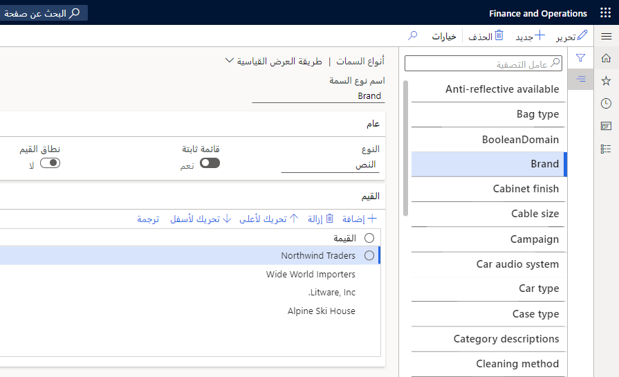
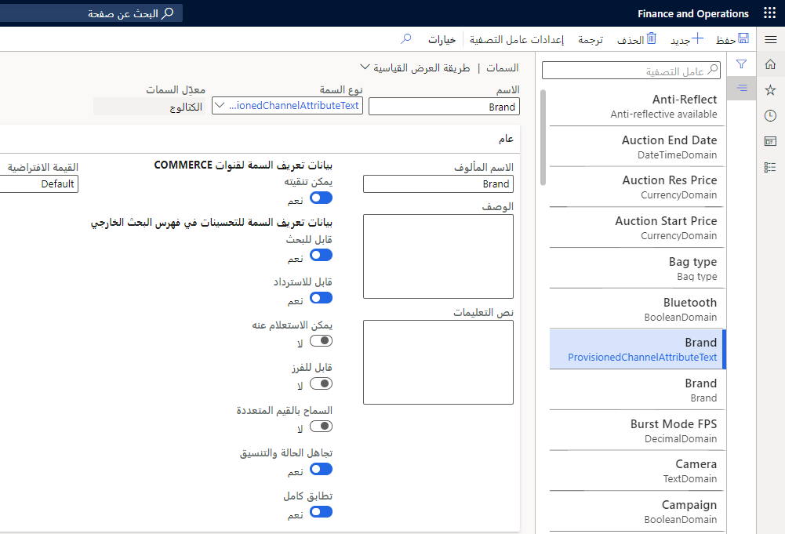

تُستخدم التدرجات الهرمية للفئات لأسباب عديدة مثل تصنيف المنتجات والموردين والعملاء والمعاملات لأغراض إعداد التقارير والتحليل والتسلسلات الهرمية التكميلية والمزيد.

يتكوّن كل تدرج هرمي للفئات من بنية من الفئات الفرعية. بإمكان المؤسسة إنشاء أكثر من تدرج هرمي واحد للفئات.

على سبيل المثال، قد تقوم مؤسستك بإنشاء تدرج هرمي واحد للفئات لتصنيف المنتجات المشتراة وتدرج هرمي آخر لتصنيف الموردين.

يعتمد عدد التدرجات الهرمية للفئات التي تستخدمها مؤسستك، وبنية وعدد الرموز لكل تدرج هرمي للفئات، على ما يلي:

-   عمليات المؤسسة
-   المنتجات والخدمات التي يتم شراؤها أو بيعها
-   معايير الصناعة المطبقة
-   متطلبات إعداد التقارير للمؤسسة

انتقل إلى صفحة **إدارة معلومات المنتج > الإعداد > الفئات والسمات > التدرجات الهرمية للفئات** لإنشاء التدرجات الهرمية للفئات والمحافظة عليها.

يمكن إرفاق الفئات بمنتج من زر **فئات المنتجات** في جميع صفحات **قائمة المنتجات**. يمكن تعيين فئات المنتجات للمنتجات المستخدمة لإنشاء كتالوجات المشتريات وأنواع التدرج الهرمي الأخرى أيضاً. هذه الخطوة مطلوبة قبل إضافة منتج إلى كتالوج تدبير.

## تحديد سمات المنتجات 

تحدد سمات المنتج التفاصيل التي تريد الاحتفاظ بها لمنتجاتك مثل العلامات التجارية والشركة المصنعة والطراز وما إلى ذلك، وتوفر تفاصيل إضافية قد ترغب مؤسستك في تسجيلها لمنتج أو فئة معينة.

يمكنك ربط سمات المنتج بالمنتج من خلال الفئة التي ينتمي إليها المنتج.

على سبيل المثال، عند إضافة فئة والمنتجات المرتبطة بها إلى كتالوج التدبير، يتم استيراد السمات التي تم تعيينها لفئة التدبير إلى الكتالوج ويمكن عرضها على موقع التدبير.

انتقل إلى صفحة **إدارة معلومات المنتج > الإعداد > الفئات والسمات > أنواع السمات** لإنشاء أنواع السمات والاحتفاظ بها.

عند تحديد سمات المنتج، يجب عليك أولاً تحديد نوع السمة ثم تعيينه للسمة. يحدد نوع السمة نوع البيانات التي يمكن إدخالها لسمة معينة وقائمة أو نطاق من القيم الصالحة التي يمكن استخدامها للسمة. السمة هي القيمة التي يتم عرضها مع المنتج لتزويد الطالب بتفاصيل إضافية حول المنتج.

انتقل إلى صفحة **إدارة معلومات المنتج > الإعداد > الفئات والسمات > السمات** لإنشاء السمات والاحتفاظ بها.

استناداً على نوع السمة التي تحددها، قد يتم عرض حقل **القيمة الافتراضية** كخانة اختيار أو حقل قائمة منسدلة أو قد يحتوي على بيانات إضافية مطلوبة مثل وحدة قياس أو عملة.

بعد إنشاء أنواع السمات وسمات المنتج، ستحتاج إلى تعيين سمات المنتج للفئات. بعد ذلك، ستقوم بتعيين فئة للمنتج، ثم يمكنك تحديد قيم سمات المنتج.
