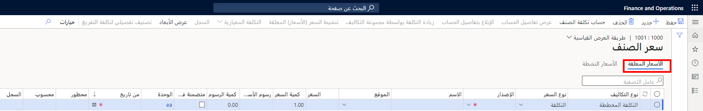

في Supply Chain Management، يمكنك إعداد سعر المنتج باستخدام إصدارات التكاليف أو عن طريق تحديد الأسعار الأساسية يدوياً في علامات التبويب **شراء**، و **بيع**، و **إدارة التكاليف** في صفحة **المنتجات الصادرة**. 

## سعر شراء المنتج 

يمكن تحديد سعر شراء المنتج مسبقاً بعدة طرق مختلفة. تتضمن المقاربات الأساسية سعر شراء قياسياً يمكنك تحديده يدوياً أو تحديثه تلقائياً، استناداً إلى الفواتير. ستتم تغطية المقاربات الأخرى لسعر شراء المنتج في سياق الشراء، مثل استخدام اتفاقيات تجارية تتعلق بسعر الشراء واتفاقيات الشراء.

في مقاربة أكثر بساطة، يمكنك تحديد سعر الشراء القياسي للمنتج من حيث وحدة قياس الشراء الافتراضية الخاصة به. إنه يمثل سعر شراء على مستوى الشركة يعمل كسعر افتراضي في بند الشراء في حالة عدم وجود مصادر أخرى لمعلومات التسعير. يمكن تحديد سعر الشراء القياسي هذا يدوياً أو تحديثه تلقائياً بواسطة فاتورة الشراء الأخيرة.

## سعر بيع المنتج 

يمكن تحديد سعر بيع المنتج مسبقاً بعدة طرق مختلفة. تتضمن المقاربات الأساسية سعر بيع قياسياً يمكن تحديده يدوياً أو حسابه تلقائياً. سنتناول المقاربات الأخرى لسعر بيع المنتج في سياق أمر مبيعات، مثل استخدام الاتفاقيات التجارية لسعر البيع واتفاقيات البيع.

في مقاربة أكثر بساطة، يمكنك تحديد سعر البيع القياسي للمنتج من حيث وحدة قياس البيع الافتراضية الخاصة به. إنه يمثل سعر بيع على مستوى الشركة يعمل كسعر افتراضي في بند البيع في حالة عدم وجود مصادر أخرى لمعلومات التسعير. يمكن تحديد سعر البيع القياسي هذا أو حسابه يدوياً، وتختلف الحسابات لمنتج تم شراؤه مقابل منتج مُصنَّع.

مع منتج تم شراؤه، يمكنك استخدام سعر الشراء القياسي للمنتج ونسبة مئوية محددة للقيمة المضافة للتكلفة الحالية (أو نسبة المساهمة) لحساب سعر بيعه القياسي. يُعاد حساب هذا السعر بشكل مستمر استناداً إلى التغييرات التي تم إجراؤها على سعر الشراء القياسي للمنتج كنتيجة لفاتورة المورّد الأخيرة.

مع منتج مُصنَّع، يمكنك تحديث سعر البيع القياسي عن طريق تنشيط سجل أسعار بيع المنتج، حيث يتم حساب سعر البيع استناداً إلى مقاربة التكلفة والتسعير للمكونات المشتراة وعمليات التوجيه وصيغ المصاريف العامة.

## إصدارات التكاليف 

إذا كنت لا تستخدم المواصفات اليدوية للأسعار الأساسية، فيمكنك إعداد إصدارات التكاليف. تسمح لك إصدارات التكاليف بإنشاء بيئات مميزة يحددها المستخدم للحفاظ على التكاليف المخططة للمنتجات وحسابها.
انتقل إلى صفحة **إعداد إصدار التكاليف** عن طريق الذهاب إلى **إدارة التكلفة > إعداد سياسات التكلفة المحددة مسبقاً > إصدارات التكاليف‬‏‫**.

يمكنك إدخال تكاليف المنتجات المخططة ومعدل فئات التكلفة ومعدل التكاليف غير المباشرة والنسبة في صفحة **إصدارات التكاليف**.
سيقوم حساب قائمة مكونات الصنف (BOM) المطبق على إصدار التكلفة بحساب التكاليف المخططة للمنتج المصنّع وإلحاقها به.
تطبق هذه العملية أيضاً على المنتجات المشتراة إذا تم إعداد النفقات العامة للشراء ليتم حسابها في ورقة التكاليف.

يمكنك تنشيط التكاليف التي تم إنشاؤها وذات الحالة **معلقة**، بطريقة متأنية أو بشكل مجمع، لجعلها فعالة وتطبيقها على تكلفة المخزون وتكلفة الإنتاج.

تعمل السمات الخاصة بإصدارات التكاليف على تمكين قيود المحتوى وحسابات التكاليف في هذا الإصدار. يمكنك تحليل تكاليف المنتجات في إصدار التكلفة والمحافظة عليها بشكل فردي أو لكل إصدار تكاليف.
يتم الاحتفاظ بسجل التكلفة النشط بالتفاصيل الكاملة.

تتوفر إصدارات التكاليف لجميع أنواع طرق تقدير التكاليف. ومع ذلك، عند تمكين التكلفة القياسية، يتم تقييد بعض المبادئ في صفحة **إعداد إصدارات التكاليف** ولا يمكن تغييرها.

### السيناريو

يريد مدير العمليات زيادة التكاليف القياسية للعام المقبل، وإنشاء إصدار تكاليف جديد مخصصة للتكاليف القياسية. يقوم العديد من المساهمين بتعبئة إصدار التكاليف بواسطة تكاليف الشراء للعام المقبل ومعدل فئة التكلفة ونسب التكلفة غير المباشرة.

يقوم حساب قائمة مكونات الصنف (BOM)، تم تطبيقه على إصدار التكاليف، بحساب التكاليف القياسية وإدراجها لمنتج مُصنَّع في الإصدار.
ويستند الحساب إلى مجموعة تكاليف لإصدار التكاليف. يراجع مدير العمليات محتوى إصدار التكاليف، ويصححه كما تقتضي الحاجة، ثم يؤمن إصدار التكاليف عندما يقتنع بمحتواه.

في بداية العام التالي، يجري مدير العمليات تنشيطاً مجمعاً لتكاليف إصدار التكاليف، مما يجعلها فعالة ومطبقة على تقييم المخزون وتكلفة الإنتاج لتلك السنة.

## أنواع إصدارات التكاليف 

وفيما يلي أنواع إصدارات التكاليف الثلاثة:

-   **التكلفة المخططة** - استخدم إصدار التكلفة هذا للمنتجات التي تستخدم افتراض تدفق التكلفة ضمن التكلفة الفعلية ([الوارد أولاً يصرف أولاً‬ (FIFO)](/dynamics365/supply-chain/cost-management/fifo-physical-value-marking/?azure-portal=true)، أو [المتوسط المرجح‬](/dynamics365/supply-chain/cost-management/weighted-average-date/?azure-portal=true)، أو [الوارد أخيراً يُصرف أولاً‬ (LIFO)](/dynamics365/supply-chain/cost-management/lifo-date-physical-value-marking/?azure-portal=true)).
-   **التكلفة القياسية** - استخدم إصدار التكلفة هذا لتلك المنتجات التي تستخدم طريقة تكلفة التكلفة القياسية وجميع المنتجات الأخرى التي يتم تجميعها مباشرةً في قائمة مكونات الصنف القياسية المستندة إلى التكلفة.
-   **التحويل** - استخدم إصدار التكلفة هذا عندما تقوم بتحويل منتج من طريقة تقدير تكلفة غير قياسية إلى طريقة تكلفة التكلفة القياسية.

    

يمكنك تحديد أنواع إصدارات التكاليف **التكلفة المخططة** و **التكلفة القياسية** في صفحة **إصدارات التكاليف**. كما يمكنك إنشاء إصدار **تكلفة التحويل** في صفحة **تحويل التكلفة القياسية**.

## أنواع إصدارات التكاليف - حساب قائمة مكونات الصنف 

يمكن أن يحتوي إصدار التكاليف أيضاً على بيانات حول أسعار مبيعات المنتج أو أسعار الشراء لأغراض حساب قائمة مكونات الصنف فقط.

بإمكان حساب قائمة مكونات الصنف (BOM) حساب سعر بيع المنتجات المصنّعة ويمكنه أيضاً إنشاء سجل أسعار بيع مرتبط داخل إصدار التكاليف.

بإمكان حساب قائمة مكونات الصنف (BOM) مع التكاليف المخططة أن يستند إلى سجلات أسعار شراء المنتج داخل إصدار التكاليف بدلاً من سجلات تكلفة المنتج. يجب إدخال سجلات أسعار شراء المنتج يدوياً.

## صفحة سعر الصنف 

يمكنك استخدام صفحة **سعر الصنف** لعرض محفوظات التكلفة والمحافظة على سجلات تكلفة المنتج لمنتج واحد.
للوصول إلى صفحة **سعر الصنف**، انتقل إلى **إدارة معلومات المنتج > المنتجات الصادرة > إدارة التكلفة > سعر الصنف**. ستستخدم عادةً صفحة **سعر الصنف** لإنشاء أسعار التكاليف لمنتج جديد واستخدام صفحة **إصدارات التكاليف** لإنشاء أسعار التكاليف للمنتجات الموجودة.

تتضمن صيانة البيانات إدخال التكاليف المعلقة لمنتج تم شراؤه، وحساب التكاليف المعلقة لمنتج مُصنَّع، وتنشيط سجلات التكاليف المعلقة. سيؤدي تنشيط سجل تكاليف معلق إلى تغيير حالته من **معلق** إلى **نشط** وسيغير تاريخ سريانه إلى تاريخ التنشيط. تعرض صفحة **سعر الصنف** سجلات التكلفة المعلقة والنشطة في علامات تبويب مختلفة. قد تعكس سجلات التكاليف المختلفة لمنتج ما إصدار تكاليف أو موقعاً أو تاريخ سريان مختلفاً أو حالة مختلفة.

يمكنك أيضاً استخدام صفحة **سعر الصنف** لعرض معلومات حول سجلات أسعار بيع المنتج وسجلات أسعار شراء المنتج والاحتفاظ بها في إصدار التكاليف. لإنشاء سجل أسعار البيع لأحد المنتجات، استخدم صفحة **حساب قائمة مكونات الصنف (BOM)** لحساب سعر بيع المنتج.

تُظهر اللقطة التالية علامة تبويب **الأسعار المعلقة** في صفحة **سعر الصنف**.

تتضمن علامة التبويب هذه الحقول التالية: 

-   **نوع السعر** - إظهار ما إذا كانت المعلومات تنطبق على سجل تكلفة المنتج أو سجل أسعار بيع المنتج أو سجل أسعار شراء المنتج.
-   **الإصدار** - إصدار التكاليف للسجل.
-   **الاسم** - اسم إصدار التكاليف للسجل.
-   **الموقع** - إظهار الموقع المناسب للسجل. يجب الاحتفاظ بسجلات تكلفة المنتج حسب الموقع.
-   **السعر** - أدخل التكلفة المعلقة أو اعرض التكلفة المعلقة المحسوبة لمنتج مصنّع أو اعرض التكلفة النشطة لسجل التكلفة.
-   **كمية السعر** - إظهار الكمية المرتبطة بسجل تكلفة المنتج. عادة ما يتم التعبير عن تكلفة المنتج لكمية واحدة. ومع ذلك، يمكن التعبير عنها لكل 100 أو 1000 للتعامل مع مشكلات الدقة العشرية.
-   **تكاليف الأسعار** - أدخل التكاليف المعلقة لتكاليف منتج تم شراؤه، أو احسب تماليف منتج مُصنَّع (بناءً على استهلاك التكاليف الثابتة)، أو اعرض التكاليف لسجل تكلفة نشط.
-   **كمية التكاليف** - إظهار الكمية المتعلقة بالتكاليف المتنوعة للمنتج. سيتم استهلاك التكاليف المتنوعة في الكمية المحددة.
-   **متضمناً في سعر الوحدة** - إظهار ما إذا كان سيتم تضمين التكاليف المتنوعة في تكلفة وحدة المنتج. يجب تضمين التكاليف المتنوعة عندما يعكس إصدار التكلفة نوع التكلفة القياسي.
-   **الوحدة** - عرض وحدة القياس لسجل التكلفة. يجب التعبير عن سجل تكلفة المنتج في وحدة قياس مخزون المنتج.
-   **من التاريخ** - عرض تاريخ السريان المقصود لسجل تكاليف معلقة. قد يكون التاريخ متخلفاً عن إصدار التكلفة.
-   **محظور** - علامة يعينها النظام تشير إلى تعذر المحافظة على سجل تكلفة نشط، أو أن علامة الحظر الخاصة بإصدار التكلفة قد منعت التغييرات في سجلات التكلفة المعلقة.
-   **محسوبة** - علامة مخصصة من قِبل النظام تشير إلى أن سجل التكلفة يحتوي على تكلفة محسوبة لمنتج مصنّع.
-   **السجل** - علامة يعينها النظام تشير إلى وجود سجل معلومات لسجل التكلفة. يمكنك عرض هذه العلامة بتحديد الزر **سجل**. يحتوي سجل المعلومات على تحذيرات تم إنشاؤها بواسطة حساب قائمة مكونات الصنف (BOM) لسجل التكلفة.

## تنشيط الأسعار المعلقة 

لتنشيط سعر معلق لأحد المنتجات، حدد **تنشيط**. تتضمن علامة التبويب **الأسعار النشطة** حقل **تاريخ التنشيط**، الذي يظهر وقت تنشيط السعر. لتنشيط الأسعار المعلقة للعديد من المنتجات، استخدم صفحة **إصدارات التكاليف**.

إذا حددت حقل **سعر إيصال ثابت** في علامة التبويب **إعداد** في صفحة **مجموعات نماذج الأصناف**، يتم دائماً إنشاء إيصالات استلام المنتجات بالسعر المحدد في حقل **السعر** ضمن عنوان **سعر التكلفة الأساسي** ويتم إصدار البنود بقيمة المخزون الحالية.
لا يمكن تحديد سعر الإيصال الثابت عند استخدام طريقة حساب **التكلفة القياسية**.

يعتمد سعر منتج معين على عدد الوحدات المحددة في حقل **وحدة السعر**. إذا كانت القيمة **1** أو فارغة، فستطبق التكلفة لوحدة واحدة من الصنف. ومع ذلك، إذا حددت قيمة أكبر من واحد أو صفر، فسيتم تطبيق السعر على هذه الكمية من المنتج.

### السيناريو

لقد اشتريت صندوقاً من 50 منتجاً حيث **سعر الوحدة** هو 50. تنطبق التكلفة على 50 وحدة من المنتج. عند إدخال بنود أمر الشراء أو بنود أوامر المبيعات أو بنود دفتر يومية المخزون، يتم تحويل سعر الوحدة تلقائياً للكمية المحددة في البند.
