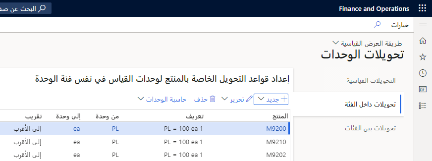

في Supply Chain Management، لا يمكن شراء منتج أو بيعه إلا في حال وجود وحدة قياس مقترنة به. يجب تحديد جميع الوحدات التي تستخدمها الشركة في صفحة **الوحدات**.

في صفحة **المنتجات الصادرة**، يمكنك تحديد وحدات القياس لأوامر الشراء والمخزون وأوامر المبيعات. على سبيل المثال، قد يتم شراء أحد المنتجات بالأرطال وتخزينه باللترات وبيعه بأنصاف اللترات.

لإنشاء وحدات القياس المتوفرة في نظامك والعمل معها، انتقل إلى **إدارة المؤسسة > الإعداد > الوحدات > الوحدات**.
تصف الأقسام المتبقية من هذه الوحدة ما يمكنك فعله في صفحة **الوحدات**.

## إنشاء وحدات وتحويلات قياسية
إذا كان نظامك لا يتضمن بالفعل وحدات القياس الأكثر استخداماً للنظام المتري و/أو النظام المتعارف عليه فِي الولايات المتحدة (USCS)، فيمكن أن يساعدك معالج إعداد الوحدة فِي البدء فِي تعريفات الوحدات الأساسية والتحويلات. لإكمال المعالج، حدد **معالج إنشاء الوحدة** فِي الجزء "الإجراء"، ثم اتبع الإرشادات التي تظهر على الشاشة.

## إنشاء أو تحرير وحدة قياس
لإنشاء وحدة قياس أو تحريرها، اتبع هذه الخطوات:

1.  ابدأ باتباع إحدى الخطوات التالية:
    - لتحرير وحدة موجودة، حددها فِي جزء القائمة.
    - لإنشاء وحدة جديدة، حدد **جديد** في جزء الإجراءات.
2.  في رأس السجل، قم بتعيين الحقول التالية:
    - **الوحدة** – أدخل المعرف أو الرمز لاستخدامه للإشارة إلى الوحدة بلغة النظام. عادةً، يكون هذا المعرف أو الرمز اختصارًا شائعًا للوحدة، مثل **ea** لكلمة each (كل) أو **cm** لكلمة centimeter (سنتيمتر).
    - **الوصف** – أدخل اسماً وصفياً للوحدة بلغة النظام. عادةً ما يكون هذا الاسم هو الاسم الكامل للوحدة، مثل **كل** أو **سنتيمتر**.
3.  في علامة التبويب السريعة **عام**، قم بتعيين الحقول التالية:
    - **فئة الوحدة** حدد الخاصية التي تقيسها الوحدة (مثل الطول أو المساحة أو الكتلة أو الكمية).
    - **نظام الوحدات** – حدد نظام القياس الذي تنتمي إليه الوحدة (الوحدات المترية أو الوحدات العرفية للولايات المتحدة).
    - **الوحدة الأساسية** – اضبط هذا الخيار على **نعم** لاستخدام الوحدة الحالية كوحدة أساسية لفئة الوحدة الخاصة بها. في هذه الحالة، ما عليك سوى تحديد عامل التحويل بين الوحدة الأساسية وكل وحدة إضافية فِي فئة الوحدة. ومن ثم، يمكن للنظام بعد ذلك التحويل بين جميع الوحدات فِي فئة الوحدة تلك. لذلك، من الأسهل إعداد التحويلات.
    
        على سبيل المثال، إذا كان الغالون هو الوحدة الأساسية لفئة الوحدة **الحجم**، فما عليك سوى إعداد عوامل التحويل من ربع لتر إلى غالون ومن نصف لتر إلى غالون. ومن ثم، يمكن للنظام أيضاً التحويل من ربع لتر إلى نصف لتر.
        يمكنك الحصول على وحدة أساسية واحدة فقط لكل فئة وحدة.
    - **وحدة النظام** – اضبط هذا الخيار على **نعم** لاستخدام الوحدة الحالية كوحدة مفترضة لجميع القياسات غير المحددة فِي فئة الوحدة الخاصة بها. على سبيل المثال، إذا كان الحقل المستخدم لإدخال كمية لا يسمح بتحديد وحدة (أو إذا لم يحدد المستخدم وحدة)، فسيستخدم النظام الوحدة التي تم تعيينها كوحدة نظام لـ **الكمية** فئة الوحدة. يمكنك الحصول على وحدة نظام واحدة فقط لكل فئة وحدة.
    - **الدقة العشرية** – حدد عدد المنازل العشرية لتقريب القيم المحددة أو المحولة إلى الوحدة الحالية.
4.  في جزء الإجراءات، حدد **حفظ**.

## تحديد ترجمات الوحدة
لتعريف الترجمات للمعرف أو الرمز ووصف وحدة القياس، اتبع هذه الخطوات.

1.  إنشاء أو تحديد الوحدة لإنشاء ترجمات لها.
2.  في جزء الإجراءات، حدد **نصوص الوحدة**. استخدم هذه الصفحة لتعريف الترجمات للمعرف أو الرمز للوحدة المحددة. بعد ذلك، يمكنك استخدام هذه الترجمات فِي المستندات الخارجية باللغات الخاصة بالعميل أو الخاصة بالبائع.
3.  في جزء الإجراءات، حدد **جديد**.
4.  في الحقل **اللغة** حدد اللغة التي تريد ترجمة معرّف الوحدة أو الرمز إليها.
5.  في الحقل **نص**، أدخل ترجمة معرّف الوحدة أو الرمز في اللغة المحددة.
6.  في جزء الإجراءات، حدد **حفظ**.
7.  أغلق الصفحة.
8.  في جزء الإجراءات، حدد **أوصاف الوحدات المترجمة**. استخدم هذه الصفحة لتعريف الأوصاف الخاصة باللغة للوحدة المختارة.
9.  في جزء الإجراءات، حدد **جديد**.
10. في الحقل **اللغة** حدد اللغة التي تريد ترجمة وصف الوحدة إليها.
11. في الحقل **الوصف**، أدخل ترجمة وصف الوحدة باللغة المحددة.
12. في جزء الإجراءات، حدد **حفظ**.
13. أغلق الصفحة.

## تحديد قواعد تحويل الوحدة
لتحديد قواعد التحويلات بين وحدات القياس، اتبع هذه الخطوات.

1.  إنشاء أو تحديد الوحدة لتحديد قواعد التحويل لها.
2.  في جزء الإجراءات، حدد **تحويلات الوحدة**. استخدم هذه الصفحة لتعريف قواعد تحويل الوحدة المحددة من وإلى الوحدات الأخرى في فئة الوحدة.
3.  حدد إحدى علامات التبويب التالية، بناءً على نوع التحويل الذي تريد إعداده:
    - **التحويلات القياسية** – إعداد قواعد التحويل القياسية لجميع المنتجات.
    - **التحويلات داخل الفئة** – إعداد قواعد التحويل الخاصة بالمنتج للوحدات في نفس فئة الوحدة.
    - **التحويلات بين الفئة** – إعداد قواعد التحويل الخاصة بالمنتج للوحدات عبر فئات الوحدات.
4.  اتبع إحدى الخطوات التالية:
    - لإنشاء تحويل جديد، حدد **جديد** على شريط الأدوات.
    - لتحرير تحويل موجود، حدد التحويل فِي الشبكة، ثم حدد **تحرير** على شريط الأدوات.
5.  في مربع الحوار المنسدل الذي يظهر، عيّن الحقول التالية:
    - **المنتج** - حدد المنتج المحدد الذي ينطبق عليه التحويل. هذا الحقل متاح فقط للتحويلات داخل الفئة وبين الفئة.
    - **تنسيق الصيغة** – اترك هذا الحقل مضبوطاً على **بسيط** لتحديد تحويل بسيط له عامل واحد. اضبطه على **متقدم** لإعداد معادلة أكثر تعقيداً. يختلف تنسيق المعادلات المتقدمة حسب فئة الوحدة.
    - **من الوحدة** – يعرض هذا الحقل الوحدة المحددة. عادة، لا يجب تغيير القيمة. (إذا قمت بتغيير القيمة، يجب عليك فتح الصفحة **تحويلات الوحدات** للوحدة المحددة لعرض التحويل الجديد بعد حفظه.)
    - **إلى الوحدة** – حدد الوحدة التي سيتم التحويل اليها.
    - **التقريب** – حدد كيفية تقريب الكسور، بناءً على **قيمة الدقة العشرية** للوحدة المحددة (**إلى أقرب**، أو **أعلى**، أو **أسفل**).
    - **صيغة التحويل** – استخدم الحقول المتبقية فِي أعلى مربع الحوار المنسدل لتحديد صيغة التحويل بين الوحدتين. تختلف الحقول المتاحة، بناءً على فئة الوحدة وتخطيط الصيغة الذي حددته.
6.  ثم حدد **موافق**.
7.  أغلق الصفحة.

## تحويلات الوحدات
لإنشاء قاعدة تحويل جديدة، اتبع الخطوات التالية.

1.  في الصفحة **تحويلات الوحدات**، حدد **جديد** لإنشاء قاعدة تحويل جديدة. لتعديل تحويل موجود، حدده في القائمة.
2.  في الجزء الأيمن، حدد نوع التحويل الذي تريد إعداده من الخيارات التالية:
    - **التحويلات القياسية** – القواعد التي تنطبق على جميع المنتجات. يمكنك فقط إعداد قواعد التحويل القياسية لوحدات القياس فِي نفس فئة الوحدة.
    - **تحويلات داخل الفئة** – قواعد لوحدات القياس فِي نفس فئة الوحدة. على سبيل المثال، يمكنك إعداد قاعدة تحويل لمنتج يحول صندوقاً إلى عدد القطع فِي صندوق. يتم تخصيص القطع والمربعات لفئة الوحدة **الكمية**.
    - **التحويلات بين الفئة** - قواعد وحدات القياس عبر فئات الوحدات. على سبيل المثال، يمكنك إعداد قاعدة تحويل لمنتج يحول الكيلوجرامات إلى اللترات. يتم تعيين الكيلوجرامات إلى فئة الوحدة **الكتلة** ويتم تخصيص اللترات لفئة **وحدة حجم Liquid**.
3.  في الحقل **العامل**، أدخل عامل تحويل بين **من الوحدة** و **إلى الوحدة**. على سبيل المثال، معامل التحويل من سنتيمتر إلى متر هو 100 لأن المتر الواحد يحتوي على 100 سنتيمتر.
4.  باستخدام قيم **البسط** والقيم **المقام** يمكنك تحديد ما إذا كانت العلاقة بين **من الوحدة** و **إلى الوحدة** هي نسبة 1: 1 أو إذا كانت كسراً.

    على سبيل المثال، تريد إنشاء قاعدة تحويل لمنتج حيث يتسع نصف قطعة فقط فِي المربع. في هذه الحالة، يمكنك إعداد عامل تحويل باستخدام **من الوحدة** = **الصندوق** و **إلى الوحدة** = **القطع**، ثم أدخل **1** فِي حقل **البسط** و **2** فِي حقل **المقام**.

يمكنك تحديد التحويل مع منتج معين، إذا لزم الأمر. بالأساس، يعني ذلك أن تحويل الوحدة يكون صالحاً فقط للمنتج المحدد. تُعد خصوصية المنتج مهمة لأن عبوة من نوع واحد من أنواع المنتجات قد تحتوي على خمس قطع، على سبيل المثال، بينما قد تحتوي عبوة من نوع آخر من المنتجات على عشر قطع. وبالتالي، يمكنك استخدام الوحدة **عبوة** لكميات مختلفة من القطع التي تعتمد على المنتج.

تعرض لقطة الشاشة التالية تحويلات الوحدات لأحد المنتجات فِي ea (كل) وصندوق وبالتات.
 

