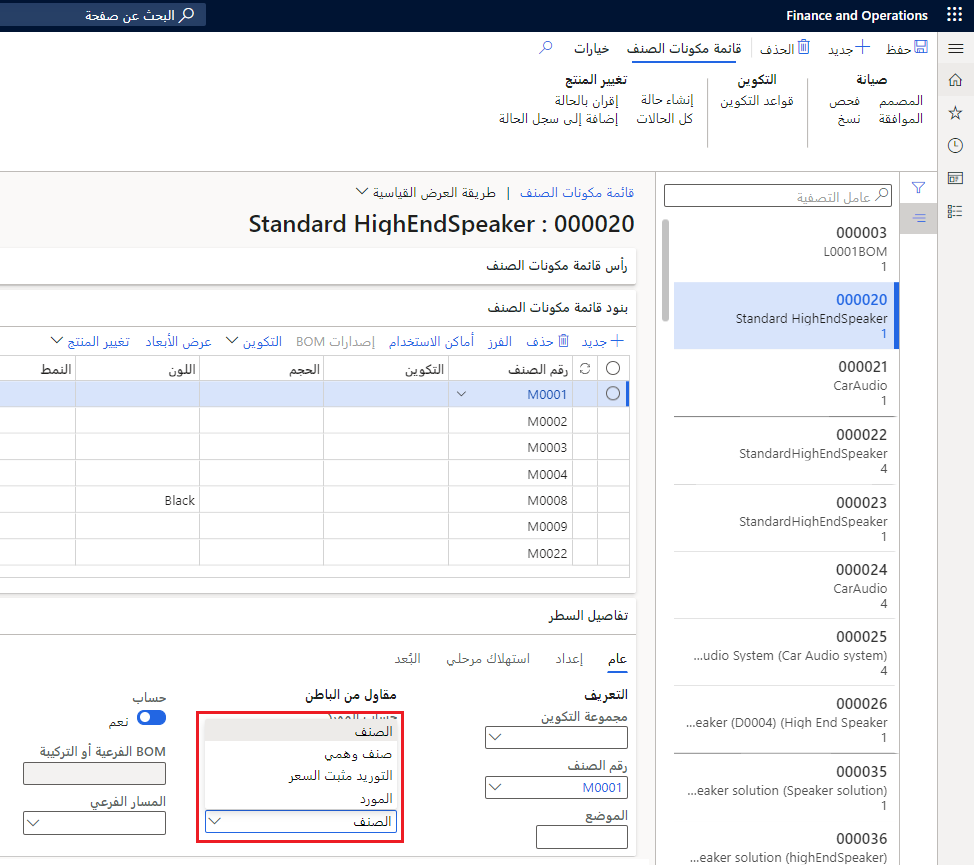
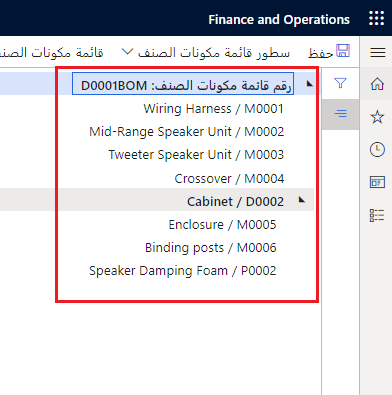

تمثّل قائمة مكونات الصنف (BOM) أحد أحجار الزاوية في تعريف عملية الإنتاج. وتستخدم شركات التصنيع قوائم مكونات الصنف (BOM) لتعقب المكونات المطلوبة لإنتاج أحد المنتجات والتخطيط لها.

تشكّل قائمة مكونات الصنف (BOM) قائمة شاملة تتضمن جميع المواد والقطع والمواد الخام والتجميعات وكمياتها المطلوبة لصناعة منتج نهائي.

تُستخدم قوائم مكونات الصنف (BOM) لتحديد المكونات أو المكونات الفرعية المطلوبة مادياً لصناعة كل رقم قطعة أو صنف مجمّع في الإنتاج. وإذا كانت الشركة تنتج عدة منتجات بسيطة فقط، فيمكن جدولة عملية الإنتاج يدوياً بواسطة قطع قائمة مكونات الصنف (BOM) الصحيحة التي تصل إلى صالة الإنتاج‬، في الوقت المناسب وعند المورد المناسب.

تحتاج الشركات إلى جدولة مكوناتها ومكوناتها الفرعية وتعقبها بالطريقة الأكثر كفاءه ومعقولة التكلفة.

تحدد قوائم مكونات الصنف (BOM) العلاقة بين المكونات والمنتج النهائي أو التجميع الفرعي. يُعد التعريف الواضح لهذه العلاقة مهماً بالنسبة للمهام التالية:

-   إنشاء أوامر الإنتاج
-   تنفيذ عمليات حساب التكاليف
-   تنفيذ عملية التخطيط للأصناف، مما يضمن شراء المنتجات الصحيحة وإنتاجها بالكميات المناسبة في الوقت المناسب
-   التأكد من مستويات المخزون الصحيحة
-   التأكد من استخدام المكونات الصحيحة لإنشاء منتج يلبي معايير الجودة

يجب تضمين كل صنف يتم حسابه مالياً في مخزون أو في مرحلة حساب التكاليف في قائمة مكونات الصنف (BOM). يتحدد مستوى التفاصيل الذي يجب تضمينه من خلال احتياجات الشركة على مستوى الإنتاج والمحاسبة.

على سبيل المثال، ثمة أصناف لا يتم تضمينها في أغلب الأحيان في قوائم مكونات الصنف (BOM) لأن تكلفة تعقب هذه الأصناف هي أعلى من قيمتها الفعلية، من هذه الأصناف الصواميل والمسامير والبراغي.

وعلى الرغم من أن قوائم مكونات الصنف (BOM) تعرّف المكونات وعلاقاتها، غير أنها لا تعرّف تسلسل الخطوات المطلوبة لإنتاج صنف نهائي أو تجميعه.
يتم تعريف هذه الخطوات على المسار.

## مفهوم المنتج 

تتكوّن قائمة مكونات الصنف (BOM) من منتجات موجودة في مخزونك. وبالتالي، من الضروري تذكيرك بتعريفات المنتجات التي يتم إنشاؤها بشكل مستقل عن كيان قانوني. تُعد القيم الرئيسية، مثل رقم المنتج ونوعه واسمه قيماً مشتركة عبر جميع الكيانات القانونية في المؤسسة. ويمكن استبدال بعض القيم الرئيسية بواسطة كيان قانوني، مثل اسم البحث، بينما يتم الاحتفاظ بالقيم الأخرى كسمات تعريف أساسية، وبالتالي لا يمكن تغييرها إلا على تعريف المنتج.

-   **المنتج** - المنتج هو منتج قابل للتعريف بشكل فريد. إنه يعمل كمنتج رئيسي لا يتغيّر؛ وبالتالي لا يمكن إقران أي بُعد من أبعاد المنتج بالتعريف.
-   **أصل المنتج** - تمثيل منتج قياسي أو وظيفي يُعد الأساس لتكوين متغيرات المنتج. يتم تكوين المتغيرات باستخدام تقنية تكوين، يمكن تحديدها إما من خلال مجموعة من أبعاد المنتج المعرّفة مسبقاً أو من خلال استخدام تكوينات المنتج في سيناريوهات المبيعات.
    تعمل أصول المنتج كقوالب أو نماذج للمتغيرات. وبإمكان متغيرات أصل المنتج أن تكون معرّفة مسبقاً أو مُنشأة في سيناريوهات المبيعات باستخدام أداة تكوين المنتج. يقترن أصل المنتج ببُعد واحد أو أكثر من أبعاد المنتج.
-   **متغير المنتج** - متغير المنتج هو تكوين أصل المنتج. بالاستناد إلى اختيار تقنية التكوين، بإمكان المتغير أن يكون إما معرّفاً بشكل مسبق باستخدام أبعاد المنتج لأصل المنتج أو مكوّناً باستخدام أداة تكوين المنتج.

بإمكان قوائم مكونات الصنف (BOM) أن تحتوي على أنواع أصناف أو خدمات، قد تتضمن أنواع فرعية من المنتجات أو أصول المنتجات مع متغيرات معينه في Finance and Operations، وهذا يتوقف على ما إذا تم شراء الصنف أو إنتاجه داخلياً.

أنواع المنتجات المستخدمة في قوائم مكونات الصنف (BOM) هي كما يلي:

-   **الصنف** - هذه الأنواع هي منتجات يتم شراؤها أو إنتاجها، ولكن يتم تضمينها في الكثير من الأحيان في إنتاج الأصناف المصنعة (BOM).
    يتم شراء صنف في قائمة مكونات صنف (BOM) تم تعريفه كصنف نوع منتج من مصدر خارجي أو يتم إنتاجه داخلياً، بحسب إعداد **نوع الأمر الافتراضي**. عند تعيين **نوع الأمر الافتراضي** إلى **أمر شراء**، يتم عندئذٍ شراء الصنف. عند تعيين **نوع الأمر الافتراضي** إلى **الإنتاج** أو **كانبان**، يتم عندئذٍ تصنيع الصنف.
-   **الخدمة** - هذه الأنواع هي أصناف يتم استخدامها، مثل الخدمة التي تشتريها عندما تقوم بتوريد عملية في أمر إنتاج إلى مورّد، وهذا ما يسمى تعاقد من الباطن.

    بإمكان صنف في قائمة مكونات الصنف (BOM) تم تعريفه على أنه من نوع المنتج "خدمة" تمثيل خدمة هي عبارة عن جزء من عملية التصنيع وتقييمها. على سبيل المثال، بإمكان صنف من النوع "خدمة" أن يكون عدد الساعات التي أدخلها كل مورد للخدمات التي يتم تنفيذها خلال عملية التصنيع.

## أنواع بنود قائمة مكونات الصنف (BOM) 

أنواع بنود قائمة مكونات الصنف (BOM) هي كما يلي:

-   **الصنف** - حدد نوع البند هذا للمواد أو الخدمات التي يتم استهلاكها مباشرةً، والتي لا تحتاج إلى عملية تحديد إضافية لإجمالي المكونات المطلوبة‬ أو توريد مثبت سعر.
-   **التوريد مثبت السعر** - عندما تستخدم نوع البند هذا، يتم إنشاء أمر إنتاج مرجعي لصنف بند قائمة مكونات الصنف (BOM) عند تقدير الإنتاج.

    عند تعيين بند قائمة مكونات الصنف (BOM) إلى **التوريد مثبت السعر**، سيتم عندئذٍ تثبيت سعر هذا الصنف (مما يشير إلى متطلبات طلب المنتج) وفقاً لطريقة الإنتاج (سواء الخالي من الهدر أو العادي) وليس بواسطة المستودع.
-   **الصنف الوهمي** - نوع البند هذا هو بشكل أساسي عبارة عن عنصر نائب للمكونات التي لا يتم تعقبها إذا كانت موجودة في مرحلة الإنتاج، ولكن يتم تضمينها وحسابها في قائمة مكونات الصنف الرئيسية (BOM) بدلاً من ذلك. تسمح قوائم مكونات الصنف (BOM) الوهمية للتخطيط الرئيسي بحساب متطلبات المكونات المطلوبة، على الرغم من استخدام الصنف من وقت إلى آخر فقط في عملية التصنيع. راجع [الأصناف الوهمية](/dynamics365/supply-chain/production-control/phantom-items/?azure-portal=true) للحصول على مثال.
-   **المورّد** - هذه الأنواع هي المكونات المشتراة من مورّد خارجي.
    وفي هذه الحالة، يتم إنشاء أمر شراء بشكل تلقائي عند تأكيد أمر مخطط.

    عند إنشاء أمر الإنتاج يدوياً، يتم إنشاء أمر الشراء عندما يتم تقدير أمر الإنتاج.

**إدارة معلومات المنتج > قوائم مكونات الصنف والمعادلات‬ > قوائم مكونات الصنف**

## السيناريو ##

يستخدم كيان كانوني يعمل في مجال تصنيع المصابيح اليدوية قائمة مكونات صنف (BOM) تحتوي على هيكل بلاستيكي ومصباح وبطارية وعدسة. ويقوم John، مدير المواد، بشراء المصابيح والبطاريات والعدسات.

لست بحاجة إلى شراء الهياكل البلاستيكية نظراً لإنتاجها داخلياً.

عند إنشاء قائمة مكونات الصنف (BOM) للمصباح اليدوي، يُدخل John البنود الأولى للمصباح والبطارية والعدسة باستخدام نوع بند **الصنف**. بعد ذلك، يُدخل John الهيكل البلاستيكي للمصباح اليدوي في قائمة مكونات الصنف (BOM) والذي يتم إنتاجه داخلياً باستخدام نوع البند **التوريد مثبت السعر**.
بإمكان هذه العملية أن تساعد على إنشاء أمر إنتاج للهيكل عند تقدير أمر الإنتاج للسلعة النهائية.

## ميزات قائمة مكونات الصنف (BOM) 

تصف القائمة التالية ميزات قائمة مكونات الصنف (BOM):

-   **التحكم في الإصدار** - يسمح بالإيقاف التدريجي لمكون قديم أو توقف استخدامه. يمكن إعداد قوائم مكونات الصنف (BOM) باستخدام إصدارات متعددة ذات تواريخ سريان مختلفة.
-   **التحكم في قائمة مكونات الصنف (BOM) الفرعية‬** - يسمح ببيع قوائم مكونات الصنف (BOM) الفرعية أو التخطيط لها، سواء بشكل مستقل عن الإنتاج الأصلي أو في الوقت نفسه.
-   **دعم المقاول من الباطن** - استخدم هذه الميزة لإنشاء أوامر شراء تلقائياً لمورّدين خارجيين عند تشغيل التخطيط الرئيسي.
-   **قوائم مكونات الصنف (BOM)‏ التي تعتمد على الكميات** - يمكن استخدام الكميات في قوائم مكونات الصنف (BOM) للتحكم في إصدار قائمة مكونات الصنف المستخدم في الإنتاج. على سبيل المثال، إذا تم طلب أقل من 500 قطعة من قائمة مكونات الصنف (BOM)، فسيتم استخدام الإصدار 1، وعند طلب أكثر من 500 قطعة، يتم استخدام الإصدار 2.
-   **قوائم مكونات صنف (BOM) متعددة المواقع (والمسارات)** - يمكن إعداد منتج نهائي بحيث يمكن تصنيع جزء منه في موقع إنتاج مختلف. يتم تنفيذ هذا الإعداد باستخدام المستويات المختلفة في بنية قائمة مكونات الصنف (BOM) لتعيين المكان الذي سيتم فيه إنتاج المكونات. عند قيام مواقع متعددة بمشاركة مخزون بنفس رقم الصنف، يمكن إعداد قائمة مكونات الصنف (والمسار) بحيث يمكن إنتاج مكونات هذه المنتجات في مواقع مختلفة. عند استخدام هذه الميزة، يجب أيضاً تعريف المسارات المناظرة بالاستناد إلى الموقع.
-   **قوائم مكونات الصنف (BOM) الوهمية** - قوائم مكونات الصنف (BOM) الوهمية بحدوث الخصم من المخزون فقط عند وجود حاجة إلى المكون في الإنتاج. حدد نوع بند الصنف الوهمي عندما ترغب في تحديد إجمالي المكونات المطلوبة لأي صنف منخفض المستوى من أصناف قائمة مكونات الصنف (BOM) الموجودة في بند قائمة مكونات الصنف (BOM).

    في التخطيط الرئيسي أو في حساب التكلفة المخططة أو عند تقدير أمر إنتاج يستخدم بنود قائمة مكونات الصنف (BOM) من النوع الوهمي، يتم استبدال بند قائمة مكونات الصنف (BOM) الأصلية الذي يشير إلى متغير منتج لديه BOM وهمية بأصناف المكون المدرجة كبنود في قائمة مكونات الصنف (BOM) في قائمة BOM هذه، كما هو محدد بواسطة إصدار قائمة مكونات الصنف (BOM) النشط الساري لمتغير المنتج هذا. وإذا كان متغير المنتج يتضمن مساراً نشطاً قابلاً للتطبيق، فيتم دمج عمليات هذا المسار في المسار الأصلي.

    تُستخدم قوائم مكونات الصنف الوهمية عادةً لتبسيط العملية الهندسية. سيؤدي الاستخدام المكثف لقوائم مكونات الصنف (BOM) الوهمية في مستويات متعددة إلى التأثير على الأداء، وتحديداً في سيناريوهات التصنيع المتكررة. لتحسين الأداء، يجب عليك تجنب التدرجات الهرمية العميقة لقوائم مكونات الصنف الوهمية. بدلاً من ذلك، استخدم مسارات وقوائم مكونات الصنف (BOM) الخاصة بالإنتاج التي تم تحديد إجمالي مكوناتها بشكل مسبق.

## إصدارات قائمة مكونات الصنف (BOM) 

بإمكان كل قائمة مكونات صنف (BOM) أن يكون لديها مجموعة متنوعة من إصدارات BOM إذا تم تحديد تواريخ أو مواقع أو أبعاد أو فواصل كميات مختلفة لكل إصدار.
يتطلب تضمين صنف ما تكويناً معيناً لقائمة مكونات الصنف.
يمكن تخصيص عدد غير محدد من الإصدارات لأصناف قائمة مكونات الصنف (BOM). وتسمح الإصدارات بإقران الأصناف بقوائم مكونات صنف (BOM) متعددة.

يمكنك إنشاء قائمة مكونات الصنف (BOM) بدون إصدار BOM؛ ومع ذلك، فانت تحتاج إلى إصدار BOM لربط BOM بمنتج. يمكنك إنشاء عدد غير محدود من إصدارات قائمة مكونات الصنف (BOM)، ولكن يتم استخدام إصدار BOM النشط فقط لأوامر الإنتاج.

يربط إصدار قائمة مكونات الصنف (BOM) قائمة BOM والمنتج لإنتاج السلع النهائية. بإمكان المنتج ألا يكون لديه أي إصدار أو إصدارات متعددة لقائمة مكونات الصنف (BOM). ويمكن الموافقة على إصدار قائمة مكونات الصنف (BOM) ثم يمكن تنشيطه. يُستخدم إصدار قائمة مكونات الصنف (BOM) النشط للعثور على قائمة مكونات الصنف (BOM) الافتراضية عند إنشاء أمر إنتاج للمنتج.

تُعد إصدارات قائمة مكونات الصنف (BOM) الارتباط أو المرجع بين أحد المنتجات وقائمة مكونات الصنف (BOM) الرئيسية. وتسمح إصدارات قائمة مكونات الصنف (BOM) بإقران المنتجات أو المكونات نفسها بقوائم مكونات صنف (BOM) مختلفة.

بإمكان إصدارات قائمة مكونات الصنف (BOM) أن تكون **نشطة** أو **غير نشطة‏‎**. الإصدارات النشطة هي الإصدارات الوحيدة التي يتعرّف عليها النظام خارج وظائف قائمة مكونات الصنف (BOM). على سبيل المثال، تستخدم الوحدة النمطية "التحكم بالإنتاج" الإصدارات النشطة فقط. يمكنك تحديد عدم وجود أي إصدارات نشطة لقائمة مكونات الصنف (BOM) أو أن مجموعة متنوعة من إصداراتها هي إصدارات نشطة لأي منتج في أي وقت معين. ومع ذلك، يتم تطبيق إصدار واحد في كل مرة. يتم تحديد الإصدار المطبّق بالاستناد إلى الوقت أو الموقع أو الكمية. ومع ذلك، بإمكان إصدارات مختلفة أن تكون موجودة بالاستناد إلى أبعاد المنتج، مثل اللون والحجم والتكوين.

بالنسبة لأغراض التخطيط والحساب والاستهلاك، يجب أن يحدد كل بند من بنود قائمة مكونات الصنف (BOM) ما إذا كان لدى الصنف أي تكوينات. يشكّل التكوين مجموعة مكونات قياسية، مثل مكبر صوت قمر صناعي ومضخم صوت يمكن تحديدها لصنف في قائمة مكونات الصنف (BOM) أثناء عملية الطلب.

يسمح إصدار قائمة مكونات الصنف (BOM) بإدخال تغييرات مستمرة على الصنف وباستخدام تكوينات مختلفة وفقاً لظروف التصنيع. يدعم التحكم في الإصدار أيضاً الإيقاف التدريجي للمكونات القديمة لتمكين إنتاج مكونات جديدة أو شرائها.

تتيح لك أساليب التحكم في الإصدار بدء إنتاج إصدارات محددة من قائمة مكونات الصنف (BOM) وإيقاف إنتاجها. يوجد تاريخ انتهاء صلاحية لجميع إصدارات قائمة مكونات الصنف (BOM).
ومع ذلك، يمكن استباق هذا التاريخ إذا قمت بالتحقق من صحة إصدار جديد. تطلب عملية التحقق من صحة إصدار قائمة مكونات الصنف (BOM) من النظام إخراج الإصدار القديم بشكل تدريجي وتحويل الإصدار الجديد إلى إصدار نشط. عندئذٍ، يبدأ النظام على الفور بالتخطيط والشراء بالاستناد إلى المعلومات الموجودة في إصدار قائمة مكونات الصنف (BOM) الجديد النشط.

على سبيل المثال، تقرر إحدى الشركات بدء إنتاج أحد منتجاتها الأكثر مبيعاً، طراز مضخم الصوت، في موقعها التشغيلي الثاني. ونتيجة لذلك، يتم إنشاء إصدار جديد لقائمة مكونات الصنف (BOM) لنموذج مضخم الصوت هذا، وتتم الموافقة عليه وتنشيطه. يكون هذا الإصدار مماثلاً للإصدار الرئيسي ولكنه لموقع مختلف.

بالإضافة إلى جعل أحد الإصدارات نشطاً أو غير نشط، تقدم Supply Chain Management الكثير من الطرق الأخرى للتحكم في إصدار قائمة مكونات الصنف (BOM) المستخدم في الإنتاج. تتضمن هذه الأساليب *التاريخ والكمية* و *التحكم في الموقع*.

بإمكان الكيانات القانونية إنشاء إصدارات متعددة لقائمة مكونات الصنف (BOM) (مماثله من حيث الكمية والتواريخ) التي يتم إنتاجها في مواقع مختلفة. وفي هذه الحالة، يمكنك إنشاء إصدار قائمة مكونات الصنف (BOM) في صفحة **بند قائمة مكونات الصنف** وتحديد الموقع الذي يكون إصدار قائمة مكونات الصنف صالحاً له في حقل **الموقع**. (إذا لم يتم تحديد أي موقع، فإن إصدار قائمة مكونات الصنف يكون صالحاً لجميع المواقع.)

يسمح لك التحكم في الإصدار المستند إلى الموقع بالتحكم في إصدارات قائمة مكونات الصنف (BOM) الجاهزة للإنتاج، بالاستناد إلى الموقع حيث يتم إنتاجها.

بإمكان الكيانات القانونية تعيين قائمة مكونات صنف (BOM) لمنتجات أو إصدارات متعددة، وفقاً لمصدرها وما إذا كان من الضروري أن يمر المنتج عبر عمليات تصنيع مختلفة. على سبيل المثال، قد تتم معالجة المنتج بواسطة موارد مختلفة أو قد تكون لديه مسارات مختلفة.

من الممارسات الشائعة في المجال أن تستخدم الكيانات القانونية المعرف نفسه لإنشاء منتج في مواقع مختلفة باستخدام مسارات مختلفة. ولدعم هذه الحالة، يمكنك تحديد إصدار عام لقائمة مكونات الصنف (BOM) لا يحدد موقعاً أو مستودعاً معيناً. وفي هذه الحالة، يتم تعيين استهلاك بند قائمة مكونات الصنف (BOM) إلى المورد ويصبح جزءاً من استهلاك المورد. يشير المورد إلى وحدة إنتاج تعيّن أيضاً مستودع الانتقاء.

## مستويات قائمة مكونات الصنف (BOM) 

تتكوّن قائمة مكونات الصنف (BOM) أحادية المستوى من مكونات تابعة بشكل مباشر تُعد ضرورية لصناعة المنتج ولا تتضمن تجميعات فرعية.

عندما تحتوي قائمة مكونات الصنف (BOM) على قائمة مكونات صنف أخرى كمكون لها، فإنها تُعرف عندئذٍ باسم قائمة مكونات صنف (BOM) متعددة المستويات، حيث يُشار إلى قائمة مكونات الصنف (BOM) الفرعية على أنها المستوى الأول ويُشار إلى مكوناتها على أنها المستوى الثاني. بإمكان قوائم مكونات الصنف (BOM) أن تتكوّن من العدد المطلوب من المستويات، بحسب نوع المنتج الجاري إنتاجه. وفي أغلب الأحيان، يُستخدم رسم شجرة أو بنية مخطط تفصيلي للإشارة إلى قائمة مكونات الصنف (BOM) متعددة المستويات.

**إدارة معلومات المنتج‬ > قوائم مكونات الصنف والمعادلات > قوائم مكونات الصنف > (تحديد صنف) > صيانة > المصمم**

شاهد هذا الفيديو للحصول على مقدمة حول مصمم قائمة مكونات الصنف (BOM).

&nbsp;
 > [!VIDEO https://www.microsoft.com/videoplayer/embed/RE3VwYy]

في Supply Chain Management، بإمكان قوائم مكونات الصنف (BOM) أن تتكوّن من العدد المطلوب من المستويات، بحسب نوع المنتج الجاري إنتاجه. وبالتالي، يمكن إعداد أي مكون معين في قائمة مكونات الصنف (BOM) بحيث يحتوي على قائمة مكونات صنف (BOM) خاصة به.

في أغلب الأحيان، تحتوي أصناف قائمة مكونات الصنف (BOM) المعقدة على قوائم مكونات صنف (BOM) فرعية متعددة. يتوقف عدد المستويات، أو قوائم مكونات الصنف (BOM) الفرعية في قائمة مكونات الصنف (BOM)، على كيفية إدارة الصنف.
بشكل عام، يحتاج الصنف إلى مستواه الخاص في قائمة مكونات الصنف (BOM)، إذا كان من الضروري أن يكون الصنف، في مرحلة ما:

-   متعقّباً
-   مخزّناً
-   مُباعاً

### مثال

تتكوّن دراجات البالغين من عجلتين ومقعد ومقاود واطار.
وتظهر جميع هذه المكونات في قائمة مكونات الصنف (BOM) الخاصة بالدراجة. ومع ذلك، يتكوّن الإطار أيضاً من عدة عناصر منفصلة (ثلاثة أو أربعة أنابيب ملحومة معاً). وبالتالي، توجد لدى الإطار قائمة مكونات صنف (BOM) خاصة به تسمى قائمة مكونات صنف فرعية، أي قائمة مكونات صنف داخل قائمة مكونات صنف للمنتج النهائي، الدراجة.‬

لنفترض أنه تم إنشاء قائمة مكونات صنف (BOM) لتجميع الدراجات. تم إعداد الأصناف التالية كنوع المنتج. يتم استخدام أنواع المنتجات في قائمة مكونات الصنف (BOM) ولا تحتاج إلى تجميع.

-   العجلات
-   المقعد
-   المقاود

يتم تجميع اطار الدراجة في الإنتاج. ويتم إعداد هذا الجزء من العملية كقائمة مكونات الصنف (BOM). ومع ذلك، فإن قائمة مكونات الصنف (BOM) الفرعية تتضمن الأصناف التالية:

-   الأنابيب
-   سلك التلحيم
-   الدعامات أو الحامل

## قوائم مكونات الصنف (BOM) والمسارات الخاصة بالموقع 

يتم إنشاء قوائم مكونات الصنف (BOM) والمسارات الخاصة بالموقع للسماح بالتحديد التلقائي لإصدار قائمة مكونات الصنف (BOM) والمسار وأبعاد المنتج الصحيحة، عندما تعمل مع مواقع متعددة. العناصر الرئيسية للميزة الخاصة بالموقع هي:

-   تتم مراعاة تحديد قائمه مكونات الصنف (BOM) والمسار، استناداً إلى أبعاد المنتج والموقع، في التخطيط الرئيسي.
-   بالنسبة إلى إصدارات قائمة مكونات الصنف (BOM) غير الخاصة بالموقع، بإمكان المستخدم تحديد خانة الاختيار **استهلاك الموارد** على بند قائمة مكونات الصنف (BOM) كبديل لمستودع الإصدار المشار إليه على بند قائمة مكونات الصنف (BOM).

من الشائع استخدام نفس قائمة مكونات الصنف (BOM) لإنتاج صنف في مواقع مختلفة باستخدام مسارات مختلفة. ولدعم هذه الممارسة، يمكنك تحديد إصدار عام لقائمة مكونات الصنف (BOM) لا يحدد موقعاً أو مستودعاً معيناً. يشير المورد، من خلال مجموعة موارده المعينة، إلى وحدة إنتاج، تشير هي أيضاً إلى مستودع الانتقاء.

قد يتضمن الإنتاج في مواقع متعددة قائمة مكونات صنف (BOM) يمكن إنتاج أصناف مكوناتها ونقلها بين مواقع مختلفة، وتشارك المواقع في أرقام أصناف مشتركة. يجب تنظيم إصدارات قائمة مكونات الصنف (BOM) لدعم بُعد الموقع الإلزامي.

يمكن إعداد منتج نهائي بحيث يمكن تصنيع جزء منه في موقع إنتاج مختلف. عند قيام مواقع متعددة بمشاركة مخزون بنفس رقم الصنف، يمكن إعداد قائمة مكونات الصنف والمسار بحيث يمكن إنتاج مكونات هذه الأصناف في موقع مختلف. عند استخدام هذه الميزة، يجب أيضاً تعريف المسارات المناظرة بالاستناد إلى الموقع.

عند التخطيط للمواد والموارد في بيئة تتضمن مواقع إنتاج متعددة، يختار النظام إصدار قائمة مكونات الصنف (BOM) وإصدار المسار بالاستناد إلى موقع المتطلبات، وفاصل تاريخ صالح، وأبعاد المنتج النشطة للصنف والكمية.

## قوائم مكونات الصنف (BOM) في دورة حياة المنتج 

في دورة حياة المنتج، قد يتم إنشاء أنواع متعددة من قوائم مكونات الصنف (BOM)‬‬ لأسباب مختلفة:

-   **قائمة مكونات الصنف (BOM) على رسم/مسودة** - تقدم قائمة مكونات الصنف (BOM) هذه تقديراً للمواد المطلوبة في مرحلة مبكرة من مراحل التصميم وتساعدك على إعداد تقدير تقريبي للتكلفة وسمات المنتج المقدّرة.
-   **قائمة مكونات الصنف (BOM‎) الهندسية** - تُستخدم قائمة مكونات الصنف (BOM‎) هذه عادةً عندما تقوم بتصميم منتجات تستند إلى مجموعة من المنتجات الموجودة. ويتم تنظيم قائمة مكونات الصنف (BOM) الهندسية لتبسيط عملية التصميم وتجميع المنتجات المعقدة في الوحدات النمطية الهندسية. فيما يتعلق بالمنتجات البسيطة، قد يكون من الممكن استخدام قوائم مكونات الصنف (BOM) الهندسية لعملية الإنتاج الفعلي.
    ومع ذلك، بالنسبة للمنتجات الأخرى، يجب تحويل قائمة مكونات الصنف (BOM) الهندسية إلى قائمة مكونات صنف (BOM) للإنتاج الفعلي. يتم عادةً تمثيل قوائم مكونات الصنف (BOM) الهندسية بواسطة قوائم وهمية في التدرج الهرمي لقائمة مكونات الصنف (BOM). وعلى الرغم من أنه يمكن استخدام قوائم مكونات الصنف (BOM) الهندسية لتخطيط عمليات التصنيع وتنفيذها، بإمكان هذا النهج أن يؤدي إلى حدوث حالات من انعدام الكفاءة، وتحديداً في العمليات المتكررة التي يتم فيها إنشاء عدد كبير من الأوامر.
-   **قائمة مكونات الصنف (BOM) للتخطيط** - تُستخدم قائمة مكونات الصنف (BOM) هذه للتخطيط لمتطلبات المواد. يتم حساب طلب المكونات بالاستناد إلى طلب المنتجات النهائية. وبطريقة مماثلة لقوائم مكونات الصنف (BOM) للتكاليف، قد تمثل قوائم مكونات الصنف (BOM) للتخطيط مزيجاً معيناً من المواد المستخدمة في فترة ما.
-   **قائمة مكونات الصنف (BOM) للإنتاج** - هذه هي قائمة مكونات الصنف (BOM) التي يتم استخدامها لإنتاج معين. يجب على قائمة مكونات الصنف (BOM) للإنتاج أن تأخذ في الاعتبار الموارد التي يتم استخدامها لإنتاج المنتج. عندما يتم إنشاء أمر إنتاج أو أمر دُفعة أو كانبان، يتم طي المستويات المتعددة لقوائم مكونات الصنف (BOM) الممثلة بواسطة قوائم وهمية إلى مستوى واحد ويتم توزيعها على العمليات الخاصة بالأمر.
-   **قائمة مكونات الصنف (BOM‎) للتكاليف** – تُستخدم قائمة مكونات الصنف (BOM‎) هذه لحساب التكلفة التقديرية للمنتج. على سبيل المثال، يمكنك استخدام قائمة مكونات الصنف (BOM) للتكاليف عند استخدام التكلفة القياسية أو عند حساب التكلفة التقديرية المخططة لمنتج معين. بإمكان قوائم مكونات الصنف (BOM) للتكاليف الإشارة إلى الاستخدام المتوقع لمزيج معين من المواد والموارد. وبالتالي، يمكنك استخدام قائمة مكونات الصنف (BOM) للتكاليف لإنشاء تكلفة تقديرية نموذجية لفترة ما والمساعدة على تجنب التباينات مع مرور الوقت.

تعتمد أنواع قائمة مكونات الصنف (BOM) المستخدمة في عملية تطبيق على التطبيق وعلى سيناريوهات العمل ومتطلباته. في التطبيقات البسيطة، يمكن تصميم قائمة مكونات الصنف (BOM) للتخطيط وقائمة مكونات الصنف (BOM) للإنتاج وقائمة مكونات الصنف (BOM) للتكاليف كقائمة مكونات صنف (BOM) واحدة. فيما يتعلق بالبيئات التي تحتوي على تغييرات هندسية متكررة ومسارات بديلة متعددة، قد يتطلب الأمر على الأرجح وجود مجموعة أكبر من أنواع قوائم مكونات الصنف (BOM).

فيما يلي الخطوات التي تتكوّن منها العملية الشاملة لإنشاء قوائم مكونات الصنف (BOM):

1.  أنشئ المنتج النهائي الذي سيتم ربطه بقائمة مكونات الصنف (BOM) عبر إصدار قائمة مكونات الصنف (BOM).
2.  أنشئ جميع المنتجات التي ستشكّل قائمة مكونات الصنف (BOM).
3.  أنشئ قائمة مكونات الصنف (BOM).
4.  أنشئ إصدار قائمة مكونات الصنف (BOM) الذي يقرن المنتج النهائي وقائمة مكونات الصنف (BOM)، ثم وافق عليه ونشّطه. يتم تنفيذ هذه المهمة قبل إضافة منتجات المكونات أو بعدها.
5.  أضف المنتجات لتحديد الأصناف المطلوب تضمينها في قائمة مكونات الصنف (BOM). تُعد هذه المنتجات بنود قائمة مكونات الصنف (BOM).
6.  إذا لزم الأمر، يمكنك إنشاء تكوينات وقواعد ذات صلة لقائمة مكونات الصنف (BOM).
7.  أنشئ قائمة مكونات صنف (BOM)/مسارات خاصة بالموقع للسماح بالتحديد التلقائي لإصدار قائمة مكونات الصنف (BOM) والمسار وأبعاد المنتج الصحيحة، إذا كنت تعمل مع مواقع متعددة.
