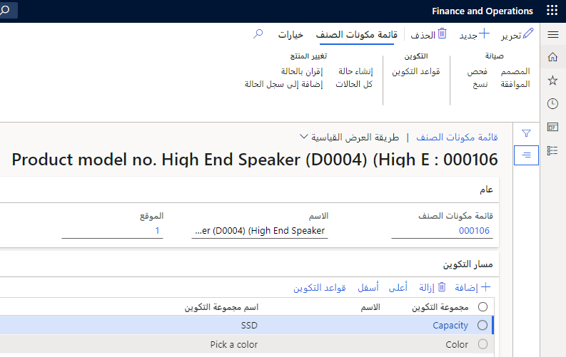

يتمثل الغرض من تكوينات قائمة مكونات الصنف والأصناف في تمكين الإدارة الدقيقة للمخزون والتخطيط الرئيسي لكل صنف. توفر هذه الوحدة معلومات حول تكوين أصناف قائمة مكونات الصنف وتقدم نظرة عامة على بنية العملية الحسابية لقائمة مكونات الصنف وعملية الإعداد المطلوبة لإجراء الحسابات. وتوضّح أيضاً كيفية تكوين قائمة مكونات الصنف في Supply Chain Management.

في حالة توفّر المنتج بأشكال متعددة، على سبيل المثال، الألوان أو الطرازات أو الأحجام، ووجود ضرورة لتعقب كل منتج، يمكنك استخدام أحد الأسلوبَين التاليين:

-   إنشاء رقم صنف جديد لكل شكل
-   إنشاء تكوينات للمنتج

تتمثل الميزة في استخدام التكوينات في أن رقم صنف واحداً فقط يكون مطلوباً لقائمة مكونات الصنف. وأيضاً بسبب تطابق البيانات الأساسية لجميع التكوينات، يجب الاحتفاظ بالمعلومات المرتبطة بقائمة مكونات الصنف الأساسية فقط. لكن يجب تحديد تكوينات المنتج ذات الصلة لكل حركة للصنف.

على سبيل المثال، تُعد مكبرات الصوت منخفضة التردد من الطراز 03، والتي تنتجها شركة **USMF** قائمة مكونات صنف. يتمثل تكوينا مكبرات الصوت منخفضة التردد من هذا الطراز في اللونين الأسود والفضي، ما يعني أنهما يستخدمان رقم الصنف نفسه كمكبرات الصوت منخفضة التردد من الطراز 03، لكن لكل منهما رقم تكوين خاصاً به.

## تكوينات قائمة مكونات الصنف 

يمكنك استخدام تكوينات قائمة مكونات الصنف لإعداد مجموعة مركبة من المكونات القياسية المحددة لقائمة مكونات الصنف. في حالة إنتاج قائمة مكونات صنف بعدة أشكال مختلفة، يمكن إنشاء رقم صنف جديد لكل شكل، أو يمكنك إعداد تكوين قائمة مكونات صنف لكل صنف.

على سبيل المثال، في حالة بيع نظام فيديو منزلي بألوان أو طرازات أو أحجام مختلفة، ويلزم تعقب كل منتج، عليك إعداد تكوين قائمة مكونات صنف.

ونظراً لإمكانية زيادة الأصناف الجديدة لأعداد المنتجات التي يتم الاحتفاظ بها في المخزون بشكل ملحوظ، من أفضل الممارسات استخدام تكوينات قائمة مكونات الصنف.

على الرغم من إمكانية إنشاء التكوينات والاحتفاظ بها لجميع الأصناف، لا تنطبق مجموعات التكوين وقواعد التكوين ومسارات التكوين إلا على قوائم مكونات الصنف.

لإعداد تكوينات قوائم مكونات الصنف، عليك إنشاء مجموعات تكوين ومسارات تكوين وقواعد تكوين.

## مسارات التكوين 

هناك اختلاف بين مسارات التكوين ومسارات الإنتاج. توجّه مسارات الإنتاج الأصناف خلال عملية التصنيع من مواد خام إلى منتج نهائي. يصف المسار تسلسل الموارد وخطوات العمل المطلوبة لإنتاج أحد الأصناف. 

تتحكم مسارات التكوين في تسلسل تحديد تكوينات الصنف. على سبيل المثال، يعتمد حجم طراز مكبر الصوت منخفض التردد على نوع طراز مكبر الصوت المصنوع باستخدام قوالب الحقن وحجم مسامير الآلة المستخدمة. وبالتالي، فمن المنطقي أن يكون التحديد الأول هو مجموعة تكوين التبييت. التحديد الثاني سيكون لمجموعة تكوين الروابط.

## تكوينات المنتج 

في حالة إتاحة المنتج بأشكال مختلفة وتوفُّر جميع التكوينات على سبيل المثال بالسعر نفسه أو وقت التسليم نفسه، من الممارسات الجيدة استخدام تكوينات المنتج بدلاً من إنشاء أصناف فردية تتبع النمط نفسه.

لمزيد من المعلومات عن تكوين المنتج، يُرجى الاطّلاع على [‬‏‫الشروع في العمل باستخدام تكوين المنتج في Dynamics 365 Supply Chain Management](https://docs.microsoft.com/learn/modules/get-started-product-configuration-dyn365-supply-chain-mgmt/?azure-portal=true).

### السيناريو

تمتلك شركة USMF العديد من أنظمة المسرح المنزلي التي يتم إنتاجها بالطريقة نفسها. تقدّم أنظمة المسرح المنزلي هذه ميزات متنوعة قابلة للتبديل. على سبيل المثال، تقدّم الشركة ألواناً وأحجاماً مختلفة من طرازات مشغلات DVD ومكبرات الصوت منخفضة التردد. عندما تستخدم معالجات الأوامر تكوينات المنتج، تحتاج فقط إلى إعداد صنف واحد لمشغل DVD.
يساعدهم هذا الأسلوب في تزويد عملائهم بالمجموعات المركبة المتوفرة من مشغلات DVD ومكبرات الصوت منخفضة التردد.

يمكن أيضاً إعداد مسارات التكوين لتحديد تسلسل تنفيذ المجموعات المركبة للتكوين، ويمكن إعداد قواعد التكوين لمنع تحديد تكوينات غير صالحة.

## مجموعات التكوين 

في Supply Chain Management، عليك إنشاء مجموعة تكوين قبل إنشاء بنود قائمة مكونات الصنف. تُستخدم مجموعات التكوين لتجميع أرقام الأصناف في قائمة مكونات الصنف. لتكوين قائمة مكونات الصنف، حدد أحد الأصناف من كل مجموعة تكوين. عند استخدام مجموعات التكوين، يحدد النظام بند قائمة مكونات الصنف المحدد في مجموعة التكوين في قائمة مكونات الصنف.

على سبيل المثال، لنفترض أن دراجة متاحة بلونين: الأحمر والأزرق. ونظراً لوجود دراجتَين، قد يكون من المنطقي إنشاء قامتَي مكونات صنف، لكل منهما رقم صنف خاص بها (لون) في بنود قائمة مكونات الصنف.

مع ذلك، يمكنك أيضاً إنشاء قائمة مكونات صنف للدراجة حيث يمكن الاختيار بين اللونَين. في هذه الحالة، يتم تخصيص الصنفَين في بنود قائمة مكونات الصنف (اللونان) لمجموعة التكوين نفسها التي يمكن تسميتها "اللون".

**إدارة معلومات المنتج > الإعداد > ‏‫قوائم مكونات الصنف والمعادلات‬ > مجموعات التكوين**

يمكن إنشاء تكوينَين، واحد لكل لون، لصنف قائمة مكونات الصنف. يتم إدخال رقم صنف قائمة مكونات الصنف، دراجة، في بند لأمر مبيعات، ويتم إعداد التكوين المطلوب للون الدراجة في صفحة **تكوين الصنف**. يحدد اختيار تكوين في مجموعة تكوين المكوّن المضمّن في قائمة مكونات الصنف المعيّنة.

## قواعد التكوين 

عندما تصبح جميع مكونات قائمة مكونات الصنف في مجموعات تكوين، يمكن إعداد قواعد التكوين لقائمة مكونات الصنف. يتم إنشاء قواعد التكوين لكل مجموعة تكوين ورقم صنف في المجموعة في كل قائمة مكونات صنف، ويمكنها مساعدتك في المواقف التالية:

-   تحديد الارتباط بين مجموعات التكوين الفردية وأرقام الأصناف في قائمة مكونات الصنف.
-   التأكد من عدم التحديد غير الصحيح لأرقام الأصناف التي لا تتضمن أي ارتباطات منطقية.
-   تبسيط تعريف التكوينات لأن رقم الصنف المرتبط بشكل مباشر برقم صنف آخر يتم تحديده تلقائياً كوحدة مرتبطة في حركات النظام. يمكنك استخدام قواعد التكوين لتقييد مكونات مركبة معينة للأصناف في تكوين قائمة مكونات الصنف.

لا تتأثر التكوينات الحالية بالتغييرات التي يتم إجراؤها لاحقاً لقواعد التكوين. لكننا نوصي بتعيين القواعد قبل تعريف تكوين جديد أو فحصها لمعرفة إن كانت القواعد بحاجة إلى تغيير.

**إدارة معلومات المنتجات >المنتجات > المنتجات الصادرة**

### مثال
لن يتم صنع نظام مسرح منزلي جديد قيد الإنتاج باستخدام طراز مشغل DVD أسود اللون ومكبر صوت إضافي فضي لأن هذا الصنف أثبت ضعف مبيعاته. عندما تنشئ Susan، معالِجة الأمر، أمراً لنظام مسرح منزلي، تحدد أولاً خيار DVD ثم خيار مكبر الصوت الإضافي. ونظراً لإعداد القواعد لتقييد المجموعة المركبة من ميزات هذا النظام، يمكن أن تحدد Susan فقط طراز مشغل DVD ومكبر صوت إضافي متوافقَين فقط. في هذه الحالة، لا تتضمن الميزات المركبة المتاحة نظام مسرح منزلي بطراز مشغل DVD أسود ومكبر صوت إضافي فضي.

إذا طلب أحد العملاء نظام مسرح منزلي بطراز مشغل DVD أسود ومكبر صوت إضافي فضي، يصبح الأمر صنف أمر خاصاً ويتم إرسال الأمر إلى أداة تكوين المنتج للتكوين.

## تكوينات الأصناف 

في حالة توفُّر أحد الأصناف بأشكال مختلفة وتوفُّر جميع التكوينات، على سبيل المثال بالسعر نفسه أو وقت التسليم نفسه، من أفضل الممارسات استخدام تكوينات الصنف بدلاً من إنشاء أصناف فردية كثيرة.

قاعدة الصنف القابل للتكوين هي أن جميع المكونات المستخدمة محددة لجميع التكوينات في قائمة مكونات صنف واحدة مشتركة. من خلال تعيين مجموعات التكوين في بنود قائمة مكونات الصنف، يمكن أن يحدد المستخدمون بنود قائمة مكونات الصنف التي يجب استخدامها لكل تكوين.

عند تمكين بُعد التكوين، عليك تحديد بُعد التكوين متى يتم تحديد رقم الصنف.

التكوينات التالية متوفرة:

-   **متغير معرف مسبقاً‬‏‫** - يتم تكوين المتغيرات باستخدام أبعاد المنتج عند إنشاء المتغيرات. أي أنه في أي وقت بعد إنشاء أصل المنتج، يمكنك تعيين أبعاد المنتج النشطة لمجموعة أبعاد المنتج المقترنة بأصل المنتج وإنشاء متغيرات استناداً إلى أبعاد المنتج.
-   **تكوين مستنِد إلى بُعد** - يتم تكوين المتغيرات باستخدام البُعد **تكوين** عند تطبيق المتغيرات على بنود الحركة. يجب أن يكون بُعد **التكوين** نشطاً في مجموعة بُعد المنتج المقترنة بأصل المنتج.
-   **تكوين مستنِد إلى قيد** - يتم تكوين المتغيرات باستخدام أداة تكوين المنتج عندما يتم تطبيق المتغيرات على بنود الحركة

يمكنك أيضاً إنشاء متغيرات المنتج تلقائياً بتحديد خانة الاختيار **إنشاء متغيرات تلقائياً**، ما يسمح بالإنشاء التلقائي للمتغيرات عند تعيين أبعاد منتج جديدة لأصل منتج. يمكنك استخدام هذا الخيار مع أصول المنتجات عندما تكون تقنية تكوين المتغيرات هي **تكوين مستنِد إلى بُعد** أو **متغير معرّف مسبقاً**.

## حساب قائمة مكونات الصنف 

تحدد حسابات قائمة مكونات الصنف (BOM) الأسعار المرتبطة بقائمة BOM. عند إجراء العمليات الحسابية لقائمة مكونات الصنف (BOM)، يمكنك عرض أسعار BOM المقدرة على جميع مستويات BOM، وإذا لزم الأمر، يمكنك تحديثها في BOM.

### السيناريو

تحتاج Ellen، مديرة المستودع، إلى معلومات حول تقييم المخزون للعام القادم. وبالتالي تسأل Vince، مدير التشغيل، لتحديد التكلفة المخططة باستخدام إصدار محاسبة التكاليف الجديد.

تقوم عملية حسابية لقائمة مكونات الصنف، يتم إجراؤها لإصدار محاسبة التكاليف، بحساب التكاليف القياسية وإدراجها لمنتج مُصنَّع في الإصدار.

في كثير من الأحيان، تتلقى إيلين الأنواع التالية من الطلبات المتعلقة بالمخزون:

-   أسعار المبيعات للأصناف بكميات مختلفة
-   مقارنات بين أسعار الأصناف المختلفة
-   التحقق من هوامش الأرباح ونسب المساهمة
-   التحقق من اختلافات الأسعار الكبيرة عند طلب كميات مختلفة
-   تحديد حجم الإجراء الأمثل لقائمة BOM

لكل من هذه الحالات، فهي تقوم بإجراء العملية الحسابية لقائمة مكونات الصنف (BOM) لإدارة تلك الطلبات ثم تقوم بتعديل أصناف المخزون وفقاً لذلك.

## بنية العملية الحسابية لقائمة مكونات الصنف (BOM) 

لإعداد حسابات قائمة مكونات الصنف، عليك:

-   إنشاء مجموعات تكاليف قبل تعريف إعدادات الربح.
-   تحديد إعدادات الربح قبل إجراء عمليات حسابية لسعر المبيعات.
-   إعداد مجموعات الحساب قبل إجراء العمليات الحسابية لقائمة مكونات الصنف (BOM) أو عرضها.
-   إعداد إصدار محاسبة التكاليف لإجراء حسابات محددة لقائمة مكونات الصنف.

وتظهر بنية BOM:

-   كيفية مساهمة صنف واحد أو عملية واحدة في السعر على مستواها في قائمة مكونات الصنف
-   كيفية مساهمة جميع الأصناف والعمليات على أحد المستويات في السعر الكلي
-   نظرة عامة تعرض التكاليف الملخصة لمجموعات التكاليف

## إعدادات مجموعة الحساب 

من خلال تعيين مجموعات حساب للأصناف، يمكنك تحديد كيفية حساب التكلفة وأسعار المبيعات. يمكنك أيضاً تعيين مجموعة حساب قائمة مكونات الصنف للأصناف بحيث يُنشئ حساب قائمة مكونات الصنف رسائل تحذير حول المصادر المحتملة لأخطاء الحساب.

عند إعداد عناصر مجموعة حساب وتعيينها لقيمة افتراضية، يمكن إجراء حسابات قائمة مكونات الصنف.

لإعداد مجموعات حساب، حدد **إدارة التكلفة > إعداد سياسات التكلفة المحددة مسبقاً > مجموعات الحساب**. تحتوي مجموعات الحساب على إعدادات تُستخدم في حسابات قائمة مكونات الصنف، بما في ذلك:

-   مجموعات التكاليف
-   سعر المبيعات للصنف

## مجموعات التكاليف 

توفّر مجموعات التكاليف تفاصيل المصروفات لجميع الأصناف وفئات التكلفة. يمكن إنشاء مجموعات التكلفة وتجميع تكاليف BOM ذات الصلة التالية:

-   الموارد
-   الأجور
-   المواد
-   المصاريف الإضافية
-   وقت الإعداد والتشغيل في عمليات التوجيه

عند تشغيل حساب BOM، تحدد مجموعات التكلفة كيفية توزيع المصروفات بين مكونات BOM ومجموعات التكلفة المختلفة. بمعنى آخر، تحدد مجموعات التكاليف الكم الذي تم استهلاكه من حيث الموارد والأجور والمصروفات الإضافية والمواد.

باستخدام مجموعات التكلفة، يمكن حساب سعر المبيعات لقائمة BOM. يمكنك أيضاً تعيين واحد أو أكثر من إعدادات الربح لكل مجموعة تكلفة بحيث يتمكن Supply Chain Management من حساب سعر مقترح لصنف مُصنَّع يستند إلى نهج رفع السعر زائد التكلفة. تحدد النسبة المئوية لتحديد الربح النسبة المئوية التي يضيفها النظام إلى سعر التكلفة عند حساب سعر المبيعات.

## إعدادات الربح 

في صفحة **مجموعات التكاليف**، في علامة التبويب **الربح**، يحدد الحقل **تحديد الربح** حجم النسبة المئوية للربح المرتبطة بأصناف التكلفة أو فئات التكلفة ضمن كل مجموعة تكلفة. يُستخدم الحقل أيضاً لتحديد سعر المبيعات استناداً إلى تكلفة الإنتاج المحسوبة عند حساب قوائم BOMs وفئات التكلفة للمسارات.

يمكن للشركات تعيين إعدادات الربح التالية بحيث تتم مراعاتها في حسابات قائمة مكونات الصنف:

-   قياسي
-   الربح 1
-   الربح 2
-   الربح 3

**التحكم بالإنتاج > الإعداد > المسارات > مجموعة التكاليف**

## تصنيف التكاليف 

يمكنك إعداد تصنيفات التكاليف للأصناف المُصنّعة (مثل المواد والعمالة والمصروفات الإضافية) التي لا يتم ترحيلها إلى دفتر الأستاذ العام من خلال حركات المخزون. بشكل اختياري، يمكن تحديد الأصناف المُصنّعة هذه في دفتر الأستاذ الفرعي للمخزون.

يمكنك تحديد الأصناف المُصنعة في دفتر الأستاذ الفرعي بالانتقال إلى علامة التبويب **إدارة المخزون > الإعداد > معلمات إدارة المستودعات والمخزون > محاسبة المخزون** وتحديد ما إذا كنت ستستخدم دفتر الأستاذ الفرعي في حقل **تصنيف التكاليف**.

تعمل ميزة تصنيف التكلفة على تمكين تعقب تركيب التكلفة للأصناف الموجودة بالتكلفة القياسية على جميع مستويات الإنتاج للتكاليف المخططة والمقدرة والفعلية. يمكن تحليل تكلفة المنتج وتكاليف الإنتاج والمخزون والأعمال تحت التنفيذ (WIP) وتكلفة البضائع المبيعة وتركيب التكلفة وتجميعها في مجموعات التكلفة الأصلية الخاصة بها.

في التكلفة المخططة، تمكّن حسابات تقدير الإنتاج وتكلفة الإنتاج ومجموعات التكاليف من تحديد المستخدم المرتبطة بالموارد جمع مساهمات التكلفة وتصنيفها. عند تقدير قيمة مساهمات التكلفة للمكونات المُصنّعة بالتكاليف القياسية، يدرج Supply Chain Management تحليل التكلفة القياسية الملخص لكل مجموعة تكاليف. تمكن هذه العملية من تجميع تحليل التكلفة المجمّعة متعددة المستويات لكل مجموعة تكاليف لتكلفة المنتج والإنتاج.

## تكلفة قائمة مكونات الصنف  

يستخدم حساب قائمة مكونات الصنف بيانات من مصادر متعددة لحساب التكاليف القياسية لصنف مُصنَّع. تشمل المصادر معلومات عن تفاصيل توجيه الصنف ومعادلات حساب التكلفة غير المباشرة وإصدار محاسبة التكاليف.

تشمل معلومات الصنف المُشترى المستخدمة في حساب التكلفة القياسية لقائمة مكونات الصنف التكلفة ومجموعة التكاليف وشروط التحذير.

تشمل معلومات الصنف المُصنَّع المستخدمة في حساب التكلفة القياسية لقائمة مكونات الصنف كمية الأمر القياسية للمخزون وشروط التحذير المضمنة في مجموعة حساب قائمة مكونات الصنف لهذا الصنف.

تعتمد معلومات قائمة مكونات الصنف المستخدمة في حساب التكلفة القياسية لقائمة مكونات الصنف على ما يلي:

-   إصدار قائمة مكونات الصنف
-   كمية صنف بند قائمة مكونات الصنف
-   خردة صنف بند قائمة مكونات الصنف
-   تواريخ صلاحية صنف بند قائمة مكونات الصنف
-   نوع الأمر الافتراضي لصنف بند قائمة مكونات الصنف
-   معلمات حساب التكلفة
-   المسار الفرعي للمكون المُصنَّع
-   رقم العملية
-   تأثير النسب المئوية لخردة التشغيل

يمكن أن يتجاهل المستخدم أصناف بنود قائمة مكونات الصنف في حسابات التكلفة إذا لزم الأمر. تشمل معلومات إصدار محاسبة التكاليف المستخدمة في حساب التكلفة القياسية لقائمة مكونات الصنف نوع التكلفة ومبدأ احتياطي مفوّض وعلامة حظر للتكاليف المعلقة وموقع محدد وتاريخ البدء.
