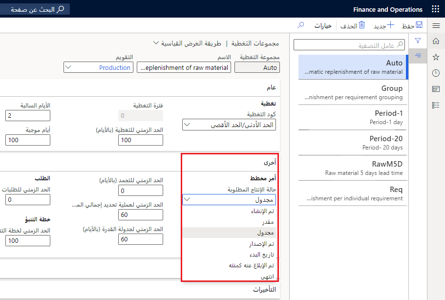
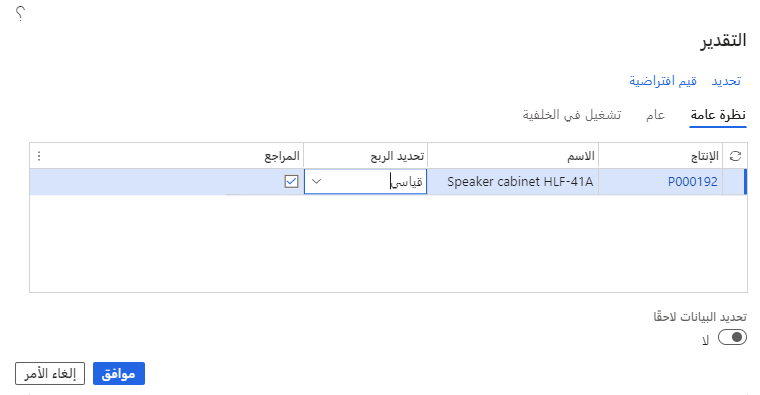
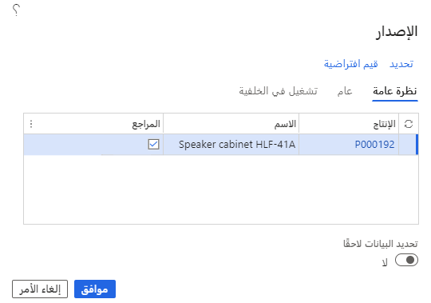
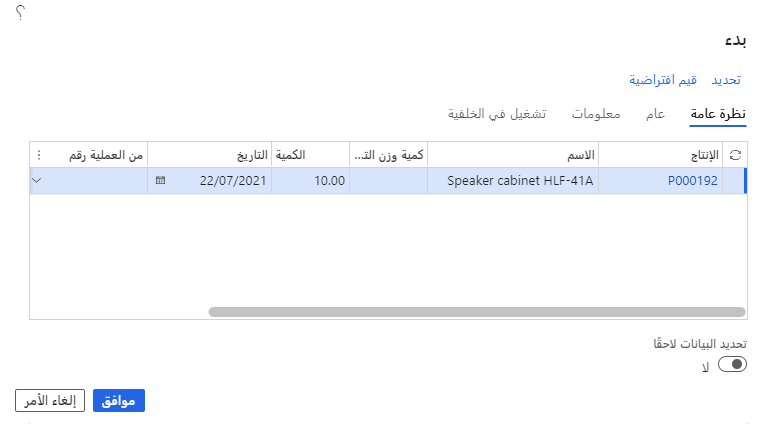
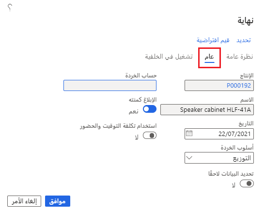

يحتوي أمر الإنتاج على معلومات حول ما سيتم إنتاجه والكمية وتاريخ الانتهاء المخطط. تقوم Supply Chain Management بتعيين حالة أمر لكل خطوة في دورة حياة الأمر.

توضح هذه الوحدة كيفية إنشاء أمر إنتاج.

في الشركات التي يتم فيها الإنتاج داخلياً، يتم إنشاء أوامر الإنتاج بشكل متكرر من أجل:

-   تلبية طلب المبيعات عندما يكون المخزون غير كافٍ.
-   قم بتزويد قوائم مكونات الأصناف كتجميعات فرعية للعناصر الأخرى المطلوبة.
-   قم بتلبية الطلب الذي يتوقعه الموظفون المعتمدون.
-   قم بتلبية طلب الصنف النهائي المتوقع.

عند إنشاء أمر لأول مرة، يتم تعيينه تلقائياً لحالة **تم الإنشاء**. تُظهر الحالة مكان الصنف في عملية الإنتاج.

ثلاث طرق يمكن من خلالها إنشاء أوامر الإنتاج في Supply Chain Management هي:

-   **يدوياً** - يمكنك إنشاء أوامر الإنتاج في صفحة قائمة **أوامر الإنتاج** عن طريق تحديد **التحكم بالإنتاج> أوامر الإنتاج > جميع أوامر الإنتاج**.

-   **مباشرة من بند أمر المبيعات من الصنف** - يمكنك إنشاء أوامر الإنتاج مباشرةً من أمر المبيعات عن طريق تحديد بند أمر المبيعات ثم تحديد **المنتج والتوريد > أمر الإنتاج**.

    عندما يتم إنشاء أمر إنتاج مباشرة من بند أمر المبيعات، فإن المعلومات الموجودة في الأمر تحتوي تلقائياً على تاريخ صالح ونطاقات كمية. لا يلزم إعداد هذا يدوياً. إذا كان يجب إجراء التغييرات بعد إنشاء أمر الإنتاج من أمر المبيعات، فيجب إجراؤها يدوياً.

-   **كنتيجة لأمر مخطط في حساب المتطلبات** - يتم إنشاء أوامر الإنتاج تلقائياً عند تشغيل التخطيط الرئيسي وتأكيد أوامر الإنتاج المخططة. يمكنك تحديد حالة الإنتاج التي تريد تعيينها لأوامر الإنتاج "الناتجة" والحدود الزمنية. لتحديد هذه المعلمات وغيرها من المعلمات التي توجه سلوك الأوامر المخططة، حدد **التخطيط الرئيسي > الإعداد > تغطية > مجموعات التغطية > أخرى**.

    

ضع في اعتبارك الحقول التالية عند إنشاء أمر إنتاج:

-   **الإنتاج** - يعرض هذا الحقل رقم أمر الإنتاج وهو تعريف فريد لأمر الإنتاج. عند إنشاء أوامر إنتاج جديدة، يتم تخصيص الرقم تلقائياً أو إدخاله يدوياً.
-   **رقم الصنف** - عرض هوية فريدة للصنف الذي سيتم إنتاجه. ‏‏يتعذر تغيير هذا الحقل. يتم تحديد العنصر المراد إنتاجه عند إعداد الإنتاج.
-   **الكمية** - تحتوي على كمية الإنتاج المجدولة.
-   **الإبلاغ عن المتبقي كمنتهٍ** - عرض العدد المتبقي ليتم الإبلاغ عنه كمنتهٍ.
-   **التسليم** - عرض تاريخ التسليم أو الانتهاء المطلوب للإنتاج. استخدم هذا الحقل لضبط عمليات الإنتاج أو جدولة المهام، حيث يمكن إجراء الجدولة بأثر رجعي من تاريخ التسليم. عندما تجري جدولة العمليات أو جدولة المهام لأمر إنتاج يحتوي على إنشاء تلقائي لأوامر مربوطة للمكونات التي تم تحديدها في قائمة مكونات الصنف، يتم تلقائياً تعيين تاريخ التسليم لعمليات الإنتاج الناقص إلى التاريخ الذي يتم فيه استخدام الأصناف في إنتاج.
-   **الحالة** - إظهار بالضبط مكان أمر الإنتاج في دورة الإنتاج الإجمالية. يتم تحديث حالة الإنتاج تلقائياً في كل مرة يتم فيها تشغيل التحديثات أو الجدولة في أمر الإنتاج. تبدأ دورة الحياة النموذجية لأمر الإنتاج ببداية عملية الإنتاج عند إنشاء الأمر لأول مرة. يتم تعيين حالة **تم الإنشاء** للأمر تلقائياً في هذه المرحلة. تتضمن تحديثات الحالة للمراحل اللاحقة ما يلي: **تم التقدير**، و **تمت الجدولة**، **تم الإصدار**، و **تم بدء التشغيل**، و **تم الإبلاغ عنه كمنتهٍ**، و **انتهى**.
-   **حالة المتبقي** - إظهار حالة الباقي في أمر الإنتاج.
-   **نوع المرجع** - عرض الاتصالات بأوامر أخرى، بما في ذلك نوع مرجع الصنف للإنتاج. إذا تم إنشاء أمر الإنتاج مباشرة إلى بند أمر، يتم عرض **أمر المبيعات**.
    إذا تم إنشاء أمر الإنتاج لعملية شراء أو لمشروع، يتم تعرض **أمر الشراء** أو **المشروع**. إذا كان هناك مرجع لأمر إنتاج آخر، يتم عرض **الإنتاج**.
    لا يمكنك تحديث هذا الحقل.
-   **المجموعة** - تُستخدم مجموعات الإنتاج لتجميع عمليات الإنتاج ذات الخصائص المتشابهة، على سبيل المثال، نوع العنصر المطلوب إنتاجه أو الشخص الذي أنشأ أوامر الإنتاج.
-   **مؤمن لإعادة الجدولة** - الإشارة إلى ما إذا كان أمر الإنتاج مؤمناً لإعادة الجدولة.

## صفحه تفاصيل أمر الإنتاج 

يتم استخدام علامة التبويب **عام** في صفحة **أوامر الإنتاج** لعرض أو تعديل التعريف العام ومعلومات الإنتاج والحالة وتواريخ الجدولة وتجميعات مجموعات الإنتاج لأوامر الإنتاج المحددة.

استخدم علامة التبويب **إعداد** لتحديد المعايير التي تريد استخدامها لمعالجة أمر الإنتاج. تتضمن هذه المعايير التاريخ الذي يصبح فيه قائمة مكونات الصنف سارية المفعول، ورقم المسار الذي يستند إليه أمر الإنتاج، ومعلومات جدولة الإنتاج، وطريقة ترحيل الأمر إلى دفتر الأستاذ، وعوامل القياس في الصنف الذي يتم إنتاجه.

يمكنك عرض جميع أوامر الإنتاج ذات الصلة، بما في ذلك عدد أوامر الإنتاج ذات المستوى الأعلى التي يعتبر أمر الإنتاج المحدد أحد مكوناتها والمعرف الأبجدي الرقمي للأمر المخطط.

تحتوي علامة التبويب **مراجع** في صفحة **أوامر الإنتاج** على معلومات مثل نوع المرجع. إذا تم إنشاء أمر الإنتاج مباشرة إلى بند أمر، يتم عرض أمر المبيعات. إذا كان هناك مرجع لأمر إنتاج آخر، يتم عرض أمر الإنتاج.

تحتوي علامة التبويب **تحديث** على الحقول التي تحتوي على معلومات تتعلق بالترحيل والمخزون وأحدث جدولة والكمية. يمكنك أيضاً عرض آخر التحديثات لأمر الإنتاج الحالي في علامة التبويب **تحديث**.

يتم استخدام علامة التبويب **أبعاد المخزون** لعرض أو تغيير المعلومات الخاصة بأبعاد المنتج والتخزين والتعقب التي يقترن بها أمر الإنتاج.

يتم استخدام علامة التبويب **الأبعاد المالية** لعرض أو تغيير المعلومات الخاصة بالقسم الذي يرتبط به أمر الإنتاج ومركز التكلفة والغرض منه.

يتم استخدام علامة التبويب **المستودع** لعرض أو تغيير المعلومات حول تحديد قيمة **إصدار إلى المستودع** لحجز المواد الخام جزئياً أو كلياً لمستودع تتم إدارته بواسطة وحدة إدارة المستودعات.

## التقدير 

استخدم صفحة **التقدير** لتحديد أمر إنتاج وتشغيل تقدير حول الكمية التي سيستهلكها في تكاليف المواد والقدرة الإنتاجية.
يعد إجراء تقدير خطوة إلزامية في دورة حياة الإنتاج ويحدث بعد إنشاء أمر الإنتاج. إذا لم تقم بتشغيل تقدير التكلفة، فسيقوم النظام بحسابه تلقائياً قبل أن يستمر في الخطوة التالية.

**إدارة التكلفة > محاسبة التصنيع > أوامر الإنتاج > العملية > التقدير**

توفر عملية تقدير أمر الإنتاج المواد المتوقعة وتكاليف استهلاك السعة لإنتاج عنصر في الإنتاج. وتتمثل وظيفتها الأساسية في تقدير استهلاك العنصر والطريق فيما يتعلق بعملية الإنتاج. تشكل هذه التقديرات الأساس للجدولة اللاحقة وعمليات دورة الإنتاج.

يحسب تشغيل التقدير القيم التالية:

-   **تكلفة الإنتاج** - البند العلوي من التقدير. يوضح التكلفة الكاملة لتشغيل الإنتاج وإجمالي سعر البيع للإنتاج. إنه مجموع كل بنود التكلفة في التقدير.
-   **تكاليف المسار أو مركز العمل** - تكاليف العمليات المتضمنة في الإنتاج، بما في ذلك عناصر مثل وقت الإعداد ووقت التشغيل والنفقات العامة.
-   **تكاليف المواد** - تكاليف وأسعار مكونات قائمة المواد اللازمة لإنتاج الصنف.

## التقدير والجدولة التلقائية 

كجزء من خطوات دورة حياة الإنتاج، إذا لم تكن تكلفة الإنتاج مقدرة أو مجدولة بالفعل قبل أن تصبح جاهزة للإصدار، يمكن إعداد Supply Chain Management لتشغيل خطوات التقدير والجدولة تلقائياً.

انتظر ما دمت تعتقد أنه عملي قبل تغيير أوامرك بالحالة **تمت الجدولة** إلى حالة **تم الإصدار**. سبب الانتظار هو أنه لا يزال من الممكن إعادة جدولة الطلبات المجدولة دون الحاجة إلى استدعاء الإصدارات المختلفة من أوراق الإنتاج المطبوعة التي تتم طباعتها عادةً أثناء تغيير الحالة.

عندما يتم إصدار إنتاج، يمكنك بدء عمل يمكن إعداده كدفعة أو وظيفة ليلية، والتي تطبع جميع بطاقات المسار وبطاقات العمل. هذا الإجراء شائع في الشركات التي لديها العديد من أوامر الإنتاج اليومية.

## إصدار أوامر الإنتاج 

بعد تقدير أمر الإنتاج وجدولته (أو إعادة جدولته)، يصبح أمر الإنتاج جاهزاً للإصدار. عندما يتم إصدار أمر الإنتاج، فإنه يغادر المكتب الأمامي ويتم إتاحته لأرضية المتجر للإنتاج.

الحقول الموجودة في علامة التبويب **نظرة عامة** في صفحة **الإصدار** هي:

-   **الإنتاج** - حدد رقم الإنتاج الذي سيتم إصداره. إذا حددت **إصدار** من صفحة **أوامر الإنتاج**، يتم ملء الحقول تلقائياً بالإنتاج الحالي ويتم عرض حقل **الاسم**. يمكنك تحديد أي إنتاج لا يحتوي على حالة **تم الإبلاغ عنه كمنتهٍ** أو **تم حساب التكلفة**.
-   **المراجع** - إذا تم تحديد خانة الاختيار هذه، فسيتم إصدار المراجع المرتبطة بالإنتاج وفقاً لنفس الشروط التي تنطبق على هذا. يتم إصدار فقط الإنتاج الحالي وأي إنتاج أساسي.

**إدارة التكلفة > محاسبة التصنيع > أوامر الإنتاج > العملية > إصدار**

لتحرير جميع عمليات الإنتاج في التدرج الهرمي للإنتاج عند تحرير الإنتاج الرئيسي، أشر إلى ضرورة إصدار المراجع. يمكنك أيضاً إصدار إنتاجات محددة في التدرج الهرمي والإنتاج الأساسي لها بنفس الطريقة عن طريق إطلاق الإنتاج المحدد والإشارة إلى أنه يجب أيضاً إصدار المراجع الأساسية.

## بدء أوامر الإنتاج 

عند إصدار أمر الإنتاج وإنشاء التقارير، فإن الخطوة التالية هي بدء أمر الإنتاج. يمكنك بدء جميع العمليات في أمر الإنتاج، أو بعضها فقط، وحفظ الباقي حتى وقت لاحق.
عند بدء الأمر، تتغير حالته إلى **تم البدء**، بغض النظر عما إذا كان الإنتاج الكامل أو جزء فقط من الإنتاج قد بدأ.

لبدء أمر إنتاج، حدد **التحكم بالإنتاج > أوامر الإنتاج > جميع أوامر الإنتاج**. حدد أمر الإنتاج الضروري وحدد **بدء** من جزء الإجراء. عند تغيير حاله الإنتاج إلى **تم البدء**، اختر الأصناف التي تتألف منها قائمة مكونات الصنف للإنتاج.
(يُطلق على النسخة المطبوعة من الأصناف المشاركة في الإنتاج قائمة الانتقاء). بشكل افتراضي، يقترح النظام بدء الكمية التي لم تبدأ بعد. يمكن أيضاً اختيار استهلاك الصنف والمسار فيما يتعلق بـ **البدء**.

**إدارة التكلفة > محاسبة التصنيع > أوامر الإنتاج > العملية > بدء**

يمكنك تغيير أمر إنتاج بالحالة **إصدار** أو **بدء**.

على سبيل المثال، يمكنك تغيير قائمة مكونات الصنف أو المسار. ومع ذلك، إذا كان التغيير يؤثر على التكاليف أو الجدولة، فيجب عليك إعادة حساب الاستهلاك وإعادة جدولة الإنتاج. يمكنك القيام بهذه المهمة عن طريق تشغيل جدولة عملية أو تحديث جدولة العمل.

## الإبلاغ عن أوامر الإنتاج كمنتهية 

استخدم صفحة **الإبلاغ عنه كمنتهٍ** للإبلاغ عن كل الإنتاج أو جزء منه كمنتهٍ. عندما تقوم بالإبلاغ عن أمر ما على أنه منتهٍ، فإنه يتلقى حالة **الإبلاغ عنه كمنتهٍ**.

تسمح هذه العملية للأصناف التي تم الإبلاغ عنها كمنتهية لتكون متوفرة في المخزون وتحرر الموارد لجدولة مهام الإنتاج الأخرى. يرسل التقرير تلقائياً معلومات حول كمية الأصناف المنتجة، وعدد الوحدات التي بها خطأ، وسبب الأخطاء.

إذا لم يمر الإنتاج بخطوات التحديث في دورة حياة الإنتاج، فسيقوم Supply Chain Management بإجراء تحديث تلقائي. يمكن أن تتضمن هذه التحديثات الخطوات التالية في دورة الحياة:

-   التقدير
-   الجدولة
-   إصدار
-   البدء

## إنهاء أوامر الإنتاج 

الخطوة الأخيرة في دورة حياة أمر الإنتاج هي "إنهاء". عند اكتمال الإنتاج وإنهاء الطلبات رسمياً، يتم حساب التكلفة أيضاً. يتم إنشاء حركة استلام بالحالة **تم الشراء** لصنف الإنتاج. تغطي هذه الحركة عمليات الاستلام للأصناف التي تم إنشاؤها والتي ضمن الحالة **تم الطلب**، والأصناف التي تم الإعلام عن انتهائها والتي ضمن الحالة **تم الاستلام** ويتم حذف حركات الاستلام التي تم إنشاؤها في وقت سابق.

**إدارة التكلفة > محاسبة التصنيع > أوامر الإنتاج > العملية > إنهاء**

 

يتم حجز الأصناف والأعمال تحت التنفيذ (WIP) التي تم ترحيلها مسبقاً تلقائياً في دفتر الأستاذ ويتم ترحيل كافة دفاتر اليومية وإغلاقها. يتم احتساب التكاليف الفعلية عند انتهاء الإنتاج. وتستند هذه التكاليف إلى استهلاك المواد والوقت المحقق. يمكن مقارنه التكاليف الفعلية بتكاليف استهلاك الوقت والمواد المقدرة التي تم حسابها عند تقدير أمر الإنتاج.

## حساب السعر النهائي 

يغطي حساب السعر النهائي الخيارات التالية:

-   **استهلاك الأصناف**: يتم حساب مبلغ التكلفة لاستهلاك الأصناف على النحو التالي: **استهلاك صنف المكون * سعر التكلفة = مبلغ التكلفة المحقق**.

    يغطي حساب السعر النهائي الخيارات التالية: إذا لم يتم تمييز الأصناف المستهلكة بحركة مفتوحة، فسيتم استخدام متوسط التكلفة، وسعر تكلفة الصنف مأخوذ من المخزون.
    ومع ذلك، إذا كان الصنف من الحركات المفتوحة التي تم تمييزها لحركة استلام ضمن الحالة **تم الشراء**، يتم أخذ سعر تكلفة الصنف من حركة الاستلام هذه. بالنسبة لتكلفة استهلاك الصنف، يقوم البرنامج بإصدار حركة ضمن الحالة **مُباع**. يتم حذف حركة الإصدار الأصلية التي ضمن الحالة **قيد الطلب** أو **منتقاة‬‏‫**.

    عندما يتعلق أمر الإنتاج بمعالجة التكاليف، تتم معالجة جميع المنتجات من نوع الصنف أو الخدمة في قائمة مكونات المواد بنفس الطريقة.
-   **الأصناف المنتهية** - يتم حساب مبلغ التكلفة للأصناف المنتهية كالتالي: **عدد الأصناف المنتهية * سعر تكلفه الصنف= مبلغ التكلفة المحقق**.

    يتم الحصول على سعر تكلفة الصنف من الصنف عند حساب التكاليف. وخلال التكلفة الخاصة بأرباح الأصناف، يتم تحديث حركة المخزون الأصلية إلى الحالة **تم الشراء** من **تم الطلب** أو **تم الاستلام**.
-   **استهلاك العمليات** - (الوقت المستهلك المبلغ عنه * سعر التكلفة لكل ساعة المبلغ عنه) + (الكمية التي تمت معالجتها *سعر تكلفة الكمية المبلغ عنه) = مبلغ التكلفة المحقق.

    يتضمن استهلاك العملية أوقات التشغيل ووقت الإعداد والكمية المعالجة.

يتم حساب مبلغ التكلفة لاستهلاك وقت التشغيل ووقت الإعداد والكمية المعالجة على النحو التالي:

-   عند تحديد الانتقاء التلقائي للموارد، يتم استرداد سعر التكلفة تلقائياً من فئة وقت التشغيل وفئة الإعداد وفئة الكمية المذكورة في المسار.
-   إذا تم الإبلاغ عن عدد الأصناف المنتهية للعمليات باستخدام دفتر يومية الإبلاغ عنه كمنتهٍ، فإن هذه الأصناف هي تلك المستخدمة في التكاليف.

عند تعيين حالة **تم الانتهاء** لأمر الإنتاج ولم يعد من الممكن تحديثه، يتم حساب تكلفة أمر الإنتاج، ويتم إنشاء حركة استلام بالحالة **تم الشراء** للصنف المنتج. يتم إغلاق كافة دفاتر اليومية المقترنة بأمر الإنتاج.
