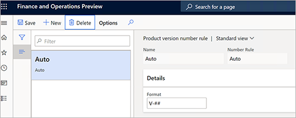

لمتابعة السيناريو الذي ستستخدمه في التمارين الآتية، يجب أولاً إعداد الميزة عن طريق توفير بيانات العرض التوضيحي وإضافة بعض السجلات المخصصة.

قبل محاولة تنفيذك أي تمارين في بقية هذه الوحدة، اتبع التعليمات الموجودة في كافة الأقسام الفرعية الآتية. وتقدم هذه الأقسام الفرعية أيضاً العديد من صفحات الإعدادات المهمة التي ستستخدمها عند إعداد إدارة التغييرات الهندسية لمؤسستك الخاصة.

## توفير بيانات العرض التوضيحي القياسية

وتعامل مع نظام يتم فيه تثبيت بيانات العرض التوضيحي القياسية. وتعمل بيانات العرض التوضيحي القياسية على إضافة بيانات إلى العديد من الكيانات القانونية للعروض التوضيحية (الشركات والمؤسسات). وفي أثناء العمل خلال التمارين، ستستخدم منتقي الشركة في الجانب الأيمن من شريط التنقل للتبديل بين إحدى الشركتين وهي *DEMF‎* التي تم إعداداها *كمؤسسه هندسية* وشركة أخرى وهي *USMF‎* التي تم إعداداها *كمؤسسه تشغيليه*.

لقراءة المزيد حول إعداد نظام يتضمن بيانات عرض توضيحي راجع [توزيع بيئة العرض التوضيحي](https://docs.microsoft.com/dynamics365/fin-ops-core/dev-itpro/deployment/deploy-demo-environment/?azure-portal=true). يمكن للمسؤول مساعدتك على إعداد النظام.

## إعداد مؤسسة هندسية

مؤسسه هندسية تمتلك بيانات هندسية، وتكون مسؤولة عن تصميم المنتج وتغييرات المنتج. لإعداد المؤسسات الهندسية، اتبع الخطوات الآتية.

1. انتقل إلى **إدارة التغيير الهندسي > الإعداد > المؤسسات الهندسية**.
1. حدد **جديد** لإضافة صف إلى الشبكة، وعيِّن له القيم الآتية:

    - **المؤسسة الهندسية**: *DEMF*
    - **اسم المؤسسة**: *Contoso Entertainment System Germany*

    
    
## إعداد مجموعه أبعاد منتج الإصدار

لإعداد مجموعة أبعاد منتج الإصدار، اتبع الخطوات الآتية.

1. انتقل إلى **إدارة معلومات المنتجات > الإعداد > مجموعات الأبعاد والمتغيرات > مجموعات أبعاد المنتج**.
1. حدد **جديد** لإنشاء مجموعة أبعاد المنتج.
1. قم بتعيين حقل **الاسم** إلى **الإصدار**
1. حدد **حفظ** لحفظ البُعد الجديد وتحميل القيم إلى علامة التبويب السريعة **أبعاد المنتج**.
1. في علامة التبويب السريعة **أبعاد المنتج**، قم بتعيين **الإصدار** كبُعد نشط للمنتج.

    

## إعداد حالات دورة حياة المنتج

نظراً إلى أن المنتج الهندسي يمر عبر دورة حياته، من المهم أن تكون قادراً على التحكم في الحركات المسموح بها لكل حالة دورة حياة. لإعداد حالات دورة حياة المنتج، اتبع الخطوات الآتية.

1. انتقل إلى **إدارة التغيير الهندسي > الإعداد > حالة دورة حياة المنتج**.
1. حدد **جديد** لإضافة حالة دورة حياة، وعيِّن لها القيم الآتية:

    - **الحالة** : *تشغيلية*
    - **الوصف**: *تشغيلية*

1. حدد **حفظ** لحفظ حالة دورة الحياة الجديدة وتحميل القيم إلى **إجراءات العمل الممكنة**.
1. في علامة التبويب السريعة **إجراءات العمل الممكنة**، حدد إجراءات العمل التي يجب توفرها. بالنسبة إلى هذا المثال، اترك الحقل **السياسة** مضبوطاً على **ممكن** لكافة إجراءات العمل.

    

1. حدد **جديد** لإضافة حالة دورة حياة أخرى، وعيِّن لها القيم الآتية:

    - **الحالة:** *نموذج أولي*
    - **الوصف:** *نموذج أولي*

1. حدد **حفظ** لحفظ حالة دورة الحياة الجديدة وتحميل القيم إلى **إجراءات العمل الممكنة**.
1. في علامة التبويب السريعة **إجراءات العمل الممكنة**، حدد إجراءات العمل التي يجب توفرها. بالنسبة إلى هذا المثال، اترك الحقل **السياسة** مضبوطاً على *ممكن مع تحذير* لكافة إجراءات العمل.

    

## إعداد قاعدة رقم الإصدار

لإعداد قاعدة رقم الإصدار، اتبع الخطوات التالية:

1. انتقل إلى **إدارة التغيير الهندسي > إعداد > قاعدة رقم إصدار المنتج**.
1. حدد **جديد** لإضافة قاعدة، وعيِّن لها القيم الآتية:

    - **الاسم:** *تلقائي*
    - **قاعدة الرقم:** *تلقائي*
    - **التنسيق:** *V-\#\#*

    

## إعداد سياسية إصدار المنتج

لإعداد سياسية إصدار المنتج، اتبع الخطوات الآتية:

1. انتقل إلى **إدارة التغيير الهندسي > الإعداد > سياسات إصدار المنتج**.
1. حدد **جديد** لإضافة سياسة إصدار، وعيِّن لها القيم الآتية:

    - **الاسم:** *مكونات*
    - **الوصف:** *مكونات*

1. في علامة التبويب السريعة **عام**، عيّن القيم الآتية:

    - **نوع المنتج:** *سلعة*
    - **تطبيق القوالب:** *دائماً*
    - **نشط:** *نعم*

1. في علامة التبويب السريعة **جميع المنتجات**، حدد **إضافة** لإضافة سطر وعيِّن له القيم الآتية:

    - **معرف حساب الشركة:** *DEMF*
    - **قالب المنتج المُصدر:** *D0006*

1. حدد **جديد** لإضافة سطر آخر، وعيِّن له القيم الآتية:

    - **معرف حساب الشركة:** *USMF*
    - **قالب المنتج المُصدر:** *D0006*
    - **استلام ‏‫قائمة مكونات الصنف‬ (BOM):** حدد خانة الاختيار هذه.
    - **نسخ اعتماد قائمة مكونات الصنف:** حدد خانة الاختيار هذه.
    - **نسخ تنشيط قائمة مكونات الصنف:** حدد خانة الاختيار هذه.
    - **استلام ‏‫مسار:** حدد خانة الاختيار هذه.
    - **نسخ اعتماد المسار:** حدد خانة الاختيار هذه.
    - **نسخ تنشيط المسار:** حدد خانة الاختيار هذه.

    

## إعداد فئة المنتج الهندسي 

توفر فئات المنتجات الهندسية أساساً لإنشاء المنتجات الهندسية (أي المنتجات التي يتم إصدارها والتحكم فيها من خلال إدارة التغيير الهندسي). لإعداد فئات المنتجات الهندسية، اتبع الخطوات الآتية.

1. انتقل إلى **إدارة تغيير الهندسة > تفاصيل فئة المنتج الهندسي**.
1. حدد **جديد** لإنشاء فئة، وعيِّن لها القيم الآتية:
    
    - **الاسم:** *مكونات*
    - **المؤسسة الهندسية:** *DEMF*

1. في علامة التبويب السريعة **التفاصيل**، عيّن القيم الآتية:

    - **نوع المنتج:** *سلعة*
    - **إصدار المسار في الحركات:** *نعم*
    - **مجموعة أبعاد المنتج** *الإصدار*
    - **حالة دورة حياة المنتج عند الإنشاء:** *تشغيلي*
    - **قاعدة رقم الإصدار:** *تلقائي*
    - **فرض السريان:** *لا*
    - **استخدام مصطلح قاعدة الرقم:** *لا*
    - **استخدام مصطلح قاعدة الاسم:** *لا*
    - **استخدام مصطلح قاعدة الوصف:** *لا*

1. في علامة التبويب السريعة **سياسة الاستعداد**، عيِّن حقل **سياسة إصدار المنتج** على *مكونات*.
1. حدد **حفظ**.

    

### إعداد شروط قبول المنتج

1. استخدم منتقي الشركة في الجانب الأيمن من شريط التنقل للتبديل إلى الكيان القانوني *USMF‎* (الشركة).
1. انتقل إلى **إدارة التغيير الهندسي > الإعداد > معلمات إدارة التغيير الهندسي**.
1. في علامة التبويب **التحكم في الإصدار**، في القسم **قبول المنتج**، عيِّن الحقل **قبول المنتج** على *يدوي*.

    
