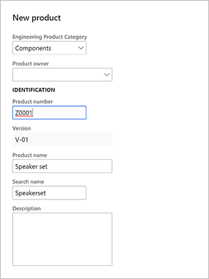
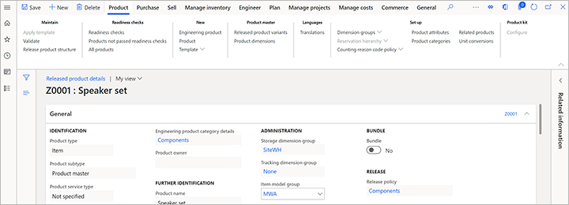
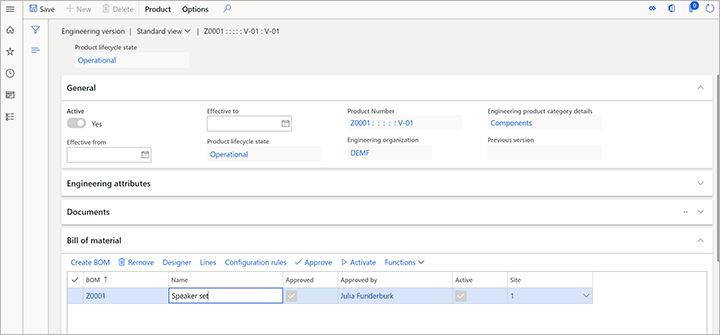

المنتج الهندسي هو منتج يتم إصداره والتحكم فيه من خلال إدارة التغييرات الهندسية. وبعبارة أخرى، يمكنك التحكم في التغييرات خلال حياتها، وسيتم حفظ معلومات التغيير باستخدام أوامر التغيير الهندسي. لإنشاء منتجات هندسية، اتبع هذه الخطوات.

1. تأكد من وجودك في الكيان القانوني لمؤسستك الهندسية (*DEMF* لهذا المثال). استخدم منتقي الشركة على الجانب الأيمن من شريط التنقل كما هو مطلوب.
1. افتح صفحة **المنتجات الصادرة** باتباع إحدى هذه الخطوات:

    - انتقل إلى **إدارة معلومات المنتجات > المنتجات > المنتجات الصادرة**.
    - انتقل إلى **إدارة التغيير الهندسي > عام > المنتجات الصادرة**.

1. في جزء الإجراءات، في علامة التبويب **المنتج**، في المجموعة **جديد**، حدد **منتج هندسي**.
1. في مربع الحوار **منتج جديد**، عيِّن القيم الآتية:

    - **فئة المنتج الهندسي**: *المكونات*
    - **رقم المنتج**: *Z0001*
    - **اسم المنتج**: *مجموعة مكبرات صوت*

    
   
    > [!NOTE]
    > يتم تعيين حقل **الإصدار** تلقائياً باستخدام قاعدة رقم إصدار المنتج التي قمت بإعدادها في وقت سابق.

1. حدد **موافق** لإنشاء المنتج وإغلاق مربع الحوار.
1. يتم فتح الصفحة **التفاصيل** الخاصة بالمنتج الجديد. لاحظ أنه تم بالفعل ملء القيم لبعض الحقول، مثل **مجموعة بُعد التخزين** و/أو **مجموعة بُعد التعقب** و/أو **مجموعة نموذج الصنف**. تم تعيين هذه الحقول تلقائياً لأن المنتج يتم إصداره في الكيان القانوني ‎*DEMF* ويستخدم سياسة إصدار المنتج *المكونات*، والتي ترتبط بفئة المنتج الهندسي *المكونات*. بسبب استخدام الصنف *D0006* سابقاً على أنه قالب لإعداد بند للكيان القانوني *DEMF*، أُخذت القيم التي تم ملؤها من الصنف *D0006*.

    
    
1. في جزء "الإجراءات"، في علامة التبويب **المهندس**، في المجموعة **إدارة التغيير الهندسي**، حدد **إصدارات هندسية** لعرض إصدارات المنتج.

    

1. في الصفحة **الإصدارات الهندسية**، لاحظ أنه يوجد إصدار واحد فقط للمنتج، ويكون نشطاً.
1. حدد الإصدار لعرض التفاصيل الخاصة به.
1. في الصفحة **الإصدار الهندسي**، في علامة التبويب السريعة **قائمة مكونات الصنف**، حدد **إنشاء قائمة مكونات الصنف**.
1. في مربع الحوار **إنشاء قائمة مكونات الصنف**، عيِّن القيم الآتية:

    - رقم **قائمة مكونات الصنف**:‏ Z0001
    - **الاسم**: مجموعة مكبرات صوت
    - **الموقع**: ‏1

1. حدد **موافق** لإنشاء قائمة مكونات الصنف وأغلق مربع الحوار.
1. في علامة التبويب السريعة **قائمة مكونات الصنف**، حدد **قائمة مكونات الصنف**.
1. في الصفحة **قائمة مكونات الصنف**، في علامة التبويب السريعة **بنود قائمة مكونات الصنف**، أضف ثلاثة بنود، بند لكل من أرقام الأصناف *D0001* و *D0003* و *D0006*.

    

1. حدد **حفظ**، ثم أغلق الصفحة.
1. في الصفحة **الإصدار الهندسي**، في علامة التبويب السريعة **قائمة مكونات الصنف**، حدد **الموافقة**.
1. في مربع الحوار الذي يظهر، حدد **موافق**.
1. في الصفحة **الإصدار الهندسي**، في علامة التبويب السريعة **قائمة مكونات الصنف**، حدد **تنشيط**. لاحظ أنه يتم تحديد مربعي الاختيار **نشط** و **تمت الموافقة عليه** لقائمة مكونات الصنف.

    

1. أغلق الصفحة.