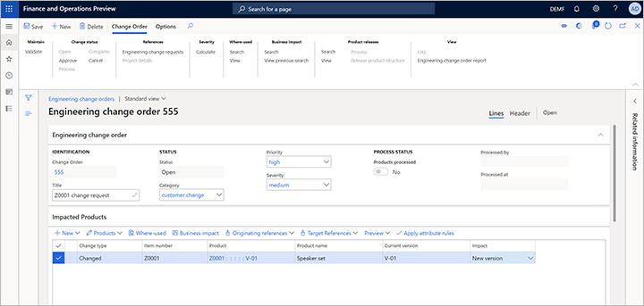

يعرف موظف المبيعات أن المنتج مهم وتم تصميمه خصيصا للعميل. بالتالي، يقوم موظف المبيعات باستدعاء مهندس في شركة *DEMF* لإعلامه بطلب التغيير. وبهذه الطريقة، يمكن أن يقوم المهندس بتسريع العملية.

يقوم المهندس الآن بمراجعة الطلب من العميل وإنشاء أمر تغيير للمنتج.

1. نظراً لأن المهندس يعمل في شركة *DEMF*، قم بتعيين الكيان القانوني إلى *DEMF*. (استخدم منتقي الشركة الموجود في الجانب الأيمن من شريط التنقل).
1. انتقل إلى **إدارة التغييرات الهندسية > شائع > طلبات التغيير الهندسي**.
1. قم بفتح طلب التغيير *555*.
1. راجع المعلومات، ثم قم باعتماد التغيير. في جزء الإجراءات، ضمن علامة التبويب **طلب تغيير**، في المجموعة **حالة التغيير**، حدد **اعتماد**.
1. انتقل إلى **إدارة التغييرات الهندسية > شائع > أوامر التغيير الهندسي**.
1. في جزء الإجراء، حدد **جديد** لإنشاء أمر تغيير، وقم بتعيين القيم التالية له:

    - **أمر التغيير**: *555*
    - **المسمى الوظيفي**: *طلب التغيير Z0001*
    - **الفئة**: *تغيير العميل*
    - **الأولوية**: *عالية*
    - **الخطورة**: *متوسطة*

1. في علامة التبويب السريعة **المنتجات المتأثرة**، حدد **الجديد > إضافة منتج موجود** لإضافة صف إلى الشبكة، ثم قم بتعيين القيم التالية له:

    - **المنتج**: *Z0001*
    - **التأثير**: *إصدار جديد*

    

1. لاحظ أنه نظراً لقيامك بتعيين الحقل **التأثير** إلى *الإصدار الجديد*، يعرض الحقل **الإصدار الجديد** في علامة التبويب **التفاصيل**  في علامة التبويب السريعة **تفاصيل المنتج** رقم الإصدار الجديد (*V-02* لهذا المثال).

    

1. حدد **حفظ** في جزء الإجراءات.
1. في علامة التبويب السريعة **تفاصيل المنتج**، ضمن علامة التبويب **قائمة مكونات الصنف**، حدد **البنود** لفتح قائمة مكونات الصنف الخاصة بالإصدار *V-01* من المنتج *Z0001*.

    

1. حدد البند لرقم الصنف *D0003*، ثم في جزء الإجراء، حدد **حذف**. تتغير قيمة حقل **نوع التغيير** لهذا السطر إلى *محذوف*.
1. حدد **حفظ** في جزء الإجراءات.

    

1. قم بإغلاق صفحة **بند قائمة مكونات الصنف** للرجوع إلى الصفحة **أمر التغيير الهندسي**.
1. في علامة التبويب السريعة **تفاصيل المنتج**، ضمن علامة التبويب **قائمة مكونات الصنف**، لاحظ أن قيمة حقل **نوع التغيير** لقائمة مكونات الصنف *Z0001* الآن هي *تم التغيير*.

    

    يجب أن تتم الموافقة على الأمر الآن قبل معالجة التغييرات. عند معالجة التغييرات، يتم تحديث المنتجات بالتغييرات التي يتم تضمينها في أمر التغيير الهندسي. بالنسبة لهذا المثال، تم تحديد الشخص الذي قام بإنشاء أمر التغيير الهندسي كمعتمد.

1. في جزء الإجراءات، ضمن علامة التبويب **أمر التغيير**، في المجموعة **حالة التغيير**، حدد **اعتماد**.
1. حدد **معالجة** لتحديث معلومات المنتج.
1. حدد **إكمال** لوضع علامة على أمر التغيير كمكتمل.
