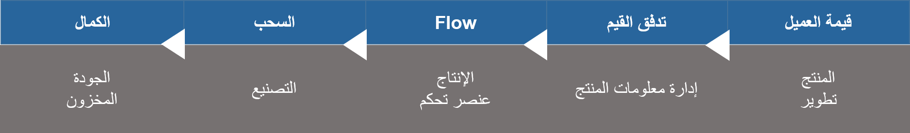

وفقاً لما ذكره Womack وJones في كتابهما *Lean Thinking: Banish Waste and Create Wealth in Your Corporation*، تم تعريف **القيمة** على أنها "القدرة المقدمة إلى عميل [أ] في الوقت المناسب وبسعر مناسب، على النحو المحدد في كل حالة من قبل العميل." 

**القيمة** هي نقطة البداية الحاسمة لتفكير lean ولا يمكن تحديدها إلا من قبل العميل النهائي. يتناقض العميل النهائي أو مستخدم المنتج مع العملاء المؤقتين، مثل المبيعات والتسويق والتوزيع والموردين وغير ذلك. القيمة أيضاً خاصة بالمنتج.

توفر المفاهيم الأساسية لـ lean manufacturing في Dynamics 365 Supply Chain Manufacturing مستوى أساسياً من الإدراك لمفاهيم Lean الضرورية للعمل مع lean.

في العمل الأساسي حول lean، وضع Womack وJones تعريفات للمبادئ الخمسة التالية:

-   قيمة العميل
-   تحديد تدفق القيم
-   التدفق
-   السحب
-   الكمال

## قيمة العميل

عند تعريف القيمة، فإنك تحدد ما الذي يمثل قيمة من منظور العميل. تأمل المثال التالي. يحدد العميل قيمة المنتج في سلسلة التوريد lean. تعمل أنشطة إضافة القيمة على تحويل المنتج إلى أقرب صورة يريدها العميل بالفعل.

يعتبر النشاط الذي لا يضيف قيمة بمثابة إهدار. 

## تحديد تدفق القيم
 
يعد تدفق القيم سلسلة عمليات من المواد الخام إلى العميل النهائي أو من مفهوم المنتج إلى الطرح في السوق.

يعد تحديد مخطط تدفق القيم أداة مهمة للمساعدة على نمذجة تحويل lean. 

## التدفق
 

الرغبة في إنشاء تدفق كلما أمكن ذلك في العملية. على سبيل المثال، يمكنك استخدام تدفق مكون من قطعة واحدة عن طريق ربط جميع الأنشطة والعمليات في أكثر التركيبات كفاءة لزيادة المحتوى ذي القيمة المضافة مع تقليل الإهدارات.

بالنسبة للتدفق الواحد، يتم التخلص من وقت انتظار العمل الجاري بين العمليات، مما يؤدي إلى إضافة القيمة بسرعة.
قم بتلبية احتياجات العميل فقط.

## السحب
 

السحب هو الاستجابة لمعدل طلب العميل. طلب العميل يقود سلسلة التوريد. إذا نظرت إلى سلسلة التوريد من الأنشطة النهائية إلى الأنشطة التمهيدية، فإن المورد التمهيدي لا ينتج شيئاً حتى يشير العميل النهائي إلى الحاجة.

## الكمال
 

في السعي لتحقيق الكمال، تعد lean رحلة للتحسين المتواصل.
الهدف هو إنتاج ما يريده العميل بالضبط، عندما يريده العميل، وبطريقة اقتصادية. بالنسبة إلى lean، الكمال هو الغاية المنشودة. تذكر أنه يمكن تحسين أي شيء وكل شيء.

توضح هذه الصورة كيف يمكن لمفاهيم lean أن تعمل مع الميزات في Supply Chain Manufacturing.

 
