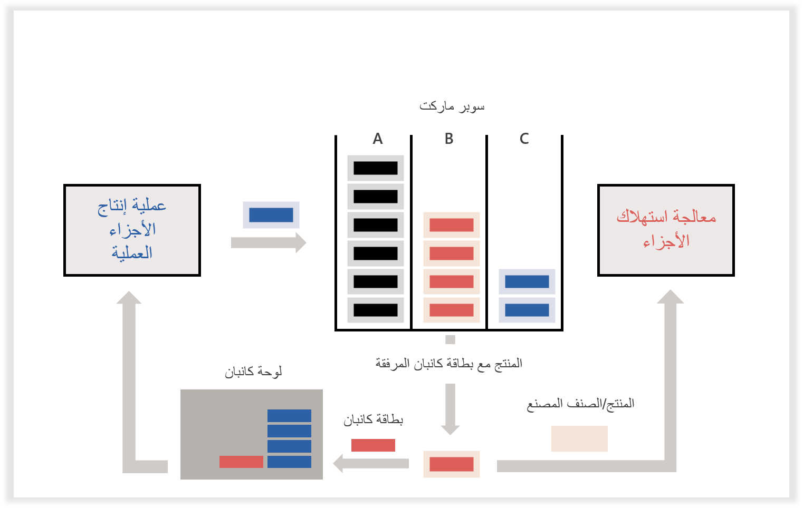

10 مصطلحات أساسية مستخدمة عبر الوحدة النمطية Lean manufacturing في Supply Chain Management، وهي:

-   **تدفق القيم** - يتم تمثيل تدفق القيم بواسطة تدفق إنتاج واحد أو متعدد. ويمكن أيضاً تصميمه كوحدة تشغيل لأغراض حساب التكلفة.
-   **Kaizen** - كلمة يابانية تعني "التحسين المستمر"، وتشير هذه الكلمة إلى فلسفة إدارة تؤكد على مشاركة الموظفين، حيث يتم تقييم كل عملية باستمرار وإعادة تقييمها للتخلص من الفاقد.
-   **خلية العمل** - تعبر خلية العمل عن مجموعة موارد حيثما يتم تجميع الموارد لتشغيل سير إجراءات العمل. تمثل خلية العمل القدرة الفعالة لكافة الموارد التي يتم تعيينها إلى الخلية. لم يتم توثيق البنية الداخلية للخلية في النظام.
-   **زمن الدورة** - يتم تحديد متوسط أزمنة الدورة لكل نشاط من أنشطة تدفق الإنتاج عند التحقق من صحة إصدار تدفق الإنتاج بناءً على متطلبات الوقت اللازم لإنتاج وحدة من المنتج لإصدار تدفق الإنتاج. يتم حساب أزمنة الدورات الفعلية لفترة محددة ومقارنتها بالمعدل المتوسط من خلال التحكم في أداء زمن الدورة.
-   **الوقت اللازم لإنتاج وحدة من المنتج** - يتم تحديد متطلبات الوقت اللازم لإنتاج وحدة من المنتج في إصدار تدفق الإنتاج. بالنسبة لتدفقات الإنتاج التي تغذي التدفقات الأخرى، يمكن حساب متطلبات الوقت اللازم لإنتاج وحدة من المنتج بناءً على أزمنة الدورات المستهدفة للأنشطة الاستهلاكية.
-   **سوبر ماركت** - يشير لفظ "سوبر ماركت" إلى موقع تخزين مركزي حيث يتم تخزين المواد (الخام) بالقرب من نقطة الاستخدام بحيث يمكن للعملاء (أو المستهلكين) سحبها حسب الحاجة. يتم استخدام أسواق السوبر ماركت للقيام بما يلي:
    - تقليل تكاليف الحركة.
    - تيسير الإدارة المرئية.
    - إنشاء إطار العمل لنظام كانبان لنقطة الاستخدام (السحب).
-   **تدفق الإنتاج** - يتم ربط تدفق الإنتاج بوحدة تشغيل تقوم بتشغيل دور تدفق القيم. يمكن وصف تدفق المواد والمنتجات في جميع أنحاء خلايا العمل والمواقع لسيناريو إنتاج أو توريد معين على أنه تسلسل أو شبكة صغيرة من أنشطة المعالجة أو التحويل، تسمى تدفق الإنتاج.
-   **تحديد تكاليف الإصدار التلقائي** - يتجاهل تحديد تكاليف الإصدار التلقائي تسجيل بعض أو كل إدخالات دفتر اليومية التي تتعلق بالمراحل بداية من شراء المواد المباشرة إلى بيع البضائع النهائية. نظراً لحذف بعض المراحل، تستخدم إدخالات دفتر اليومية لمرحلة لاحقة التكاليف العادية أو القياسية للعمل بشكل عكسي من أجل "التخلص من" التكاليف في الدورة التي لم يتم فيها تسجيل إدخالات دفتر اليومية.
-   **كانبان** - وتعني باليابانية "السجل المرئي"، تم اعتماد بطاقات كانبان من قبل العديد من الصناعات كوسيلة للتحكم في الإنتاج والتوريد الداخلي. يمكن تطبيق كانبان على تذكرة ورقية أو حاوية فعلية. تتمثل بطاقة كانبان في إشارة سحب تمثل الطلب، وتشغِّل أنشطة المعالجة والتحويل لوحدة من صنف معين أو مجموعة أصناف.
-   **تسوية Heijunka** - تقنية تسوية الإنتاج باستخدام إما الحجم أو مزيج من المنتجات. في Supply Chain Management، يتم استخدام لوحة جدول كانبان كلوحة heijunka لتسوية حمل عمل الإنتاج على الخلية.

تصميم الخلية والسطر عبارة عن عملية هرمية، بدءاً من تخطيط المصنع إلى بيئة العمل التفصيلية لمحطة العمل، والتي تتضمن العديد من العمليات والأنشطة التي تلعب دوراً في lean manufacturing، مثل ما يلي: 

 - مجموعة المنتجات أو تحديد تدفق القيمة 
 - تعيين تدفق القيم 
 - مشكلات الإستراتيجية والتعاقد من الباطن 
 - تخطيط المصنع وموقع أسواق السوبر ماركت 
 - توقيتات النشاط وأخذ العينات 
 - حساب زمن دورة المبيعات والوقت اللازم لإنتاج وحدة من المنتج
 - هوية القيد 
 - kaizen ورقي 
 - الحد الأدنى النظري لأوقات النشاط 
 - الحد الأدنى النظري لعوامل التشغيل 
 - حساب المدخرات وتكاليف مرجع الخلية 
 - محاكاة الورق المقوى 
 - تصميم تخطيط الخلية 
 - موازنة عامل التشغيل 
 - بيئة محطة العمل 
 - تصميم نظام السحب

## تعريف القيمة للعميل
 

عند تعريف القيمة، فإنك تحدد ما الذي يمثل قيمة من منظور العميل:

-   يحدد العميل قيمة المنتج في سلسلة التوريد lean.
-   تعمل أنشطة إضافة القيمة على تحويل المنتج إلى أقرب صورة يريدها العميل بالفعل.
-   يعتبر النشاط الذي لا يضيف قيمة بمثابة إهدار.

## تدفق القيم
 

يعد تدفق القيم سلسلة من العمليات بدءاً من المواد الخام إلى العميل النهائي، أو من مفهوم المنتج إلى الطرح في السوق. راجع سلسلة التوريد بأكملها، كلما تمكنت من ذلك.

يتم تصميم تدفق القيم كوحدة تشغيل في Supply Chain Management، مما يسمح باستخدام تدفق القيم كبُعد مالي.

يعد تعيين تدفق القيم أداة هامة للمساعدة في تصميم التحويل محدود الفاقد. يتكون تدفق القيم من الأنشطة المطلوبة لتصميم وإنشاء مجموعة من المنتجات أو الخدمات التي يتم القيام من خلال مجموعة من الوظائف المرتبطة ببعضها البعض. تعمل سلسلة الوظائف المرتبطة هذه بدءاً من نقطة مواصفات العميل إلى مصدر المواد الخام، وهو ما يمثل مخزون الشركة المصنعة محدود الفاقد.

يتمثل أحد أهداف تدفق القيم في تحديد القيمة للعميل النهائي بشكل صحيح. أما الهدف الآخر فيدور حول التحليل والتركيز بحيث يقوم بكل شيء بدايةً من تطوير المنتج والإنتاج إلى المبيعات والخدمة بطريقة تتم فيها إزالة الإجراءات التي لا تخلق قيمة، ومواصلة الإجراءات التي تخلق قيمة بحيث تكون في تدفق مستمر بناء على سحب العميل.

يمكن تصميم تدفق القيم للحالة المستقبلية في Supply Chain Management كتدفق إنتاج. يتم تصميم جميع عمليات تدفق القيم على أنها أنشطة معالجة داخل تدفقات الإنتاج. يمكن أن تتكون العديد من تدفقات الإنتاج من تدفق القيم.

لذلك، يتم استخدام تدفق القيم جنباً إلى جنب مع تدفق الإنتاج، لتصميم بنية lean manufacturing في Supply Chain Management.

## إنشاء تدفق إنتاج
 

تشير تدفقات الإنتاج إلى تدفق المواد والمنتجات عبر خلايا العمل والمواقع لسيناريو توريد أو إنتاج محدد. كما يمكن وصف تدفق الإنتاج كتسلسل أو كشبكة اتصال صغيرة لأنشطة المعالجة أو التحويل. بعبارة أخرى، يقوم بإنشاء تدفق كلما أمكن في العملية.

يمكنك استخدام تدفق مكون من قطعة واحدة عن طريق ربط جميع الأنشطة والعمليات في أكثر التركيبات كفاءة لزيادة المحتوى ذي القيمة المضافة مع تقليل الإهدارات. باستخدام هذا النهج، يتم التخلص من وقت انتظار العمل الجاري بين العمليات، مما يؤدي إلى إضافة القيمة بسرعة أكبر.

في الحالة التي يتم فيها استخدام منتجات تدفق إنتاج في تدفق آخر، فإنه تتم تسميته *تدفق التغذية*. 

يتم إدخال تدفقات الإنتاج كمكونات أساسية لـ lean manufacturing لأنها تقوم بما يلي: 

 - تحديد أنشطة المعالجة والتحويل لتدفق القيم. 
 - دعم قواعد كانبان في تعريف الأنشطة التي يمر بها كانبان. 
 - توفير سياق مستند إلى نشاط لعمليات التخطيط والإنتاج. 
 - إنشاء سياق تكلفة لسيناريوهات متعددة لإنتاج كانبان.

لدعم التحسين المستمر، يتم تنفيذ تدفقات الإنتاج في إصدارات لها وقت سريان معين. يسمح لك هذا التنفيذ بنسخ إصدار تدفق الإنتاج الموجود، بما في ذلك كافة قواعد كانبان ذات الصلة، وإعداد إصدار مسودة من تدفق الإنتاج، ثم تصميم تدفق الإنتاج الخاص بالحالة المستقبلية قبل التحقق من صحة الإنتاج وتنشيطه.

يسمح النموذج المستند إلى النشاط بإعداد نطاق واسع من السيناريوهات دون التعقيد الإضافي لعاملي ورشة العمل لأن جميع السيناريوهات تستخدم نفس واجهة المستخدم القائمة على النشاط.

## مقدمة إلى بطاقات كانبان
 

وتشير كلمة *كانبان* باليابانية إلى "السجل المرئي". تم اعتماد وظائف كانبان من قِبل العديد من الصناعات كوسيلة للتحكم في الإنتاج والتوريد الداخلي.

عندما يتم استهلاك كانبان، يجب أن يتم تمريرها أو تشغيلها إلى مصدر التوريد لتزويدها. يتم تعريف مصدر هذا التوريد من خلال أنشطة تدفق الإنتاج التي ترتبط بها بطاقة كانبان، مما يوفر تعريفاً لكيفية تعبئة كانبان. تنطوي قواعد كانبان في Supply Chain Management على أهمية خاصة لتدفقات الإنتاج لأنها تحدد الأنشطة التي تمر بها بطاقة كانبان.

يختلف تدفق القيم عن أسلوب تخطيط متطلبات المواد التقليدية (MRP)، حيث يتم ربط الأصناف الفردية بالموارد الفردية والمستقلة أو مجموعات الموارد، مثل مراكز العمل ومجموعات العمل. يوحد تدفق القيم العملية لمجموعة المنتجات في نهج تنازلي. 

يعرض الرسم التخطيطي أدناه معالجة كانبان وكيفية استخدامها.
 

