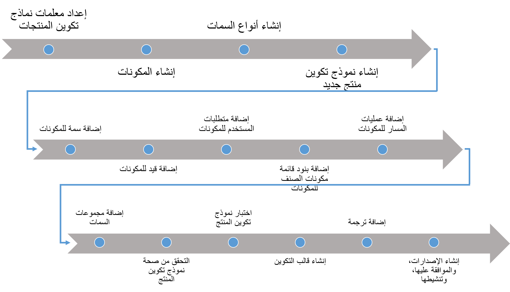
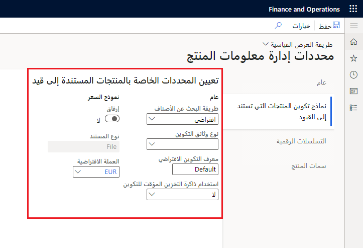
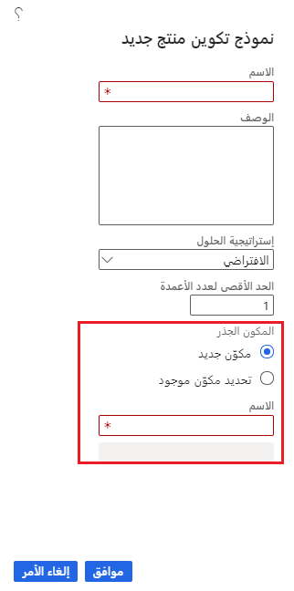
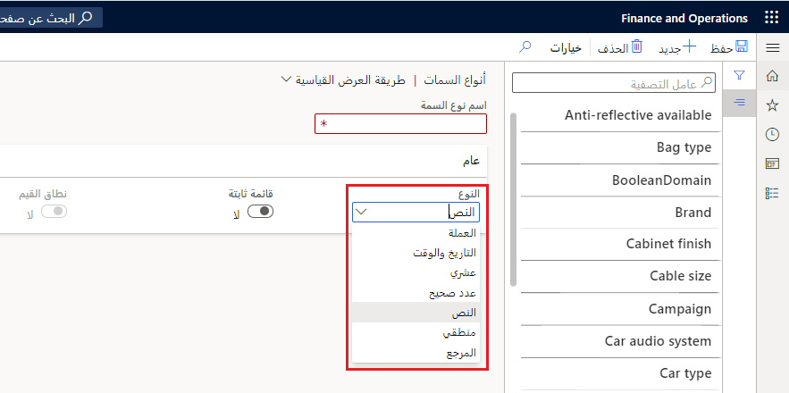
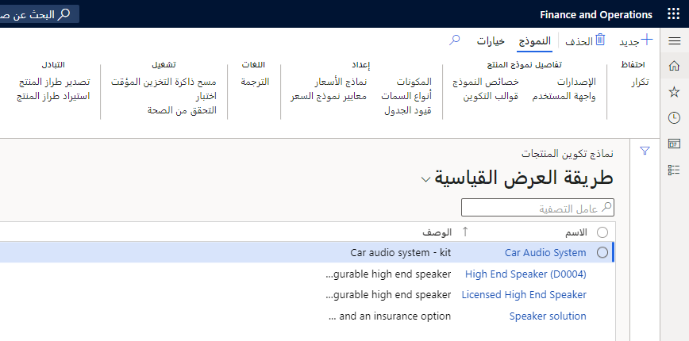
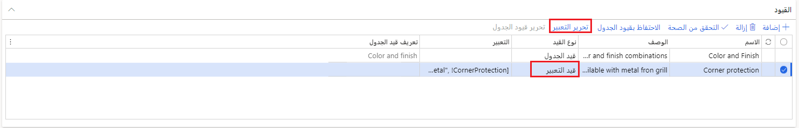
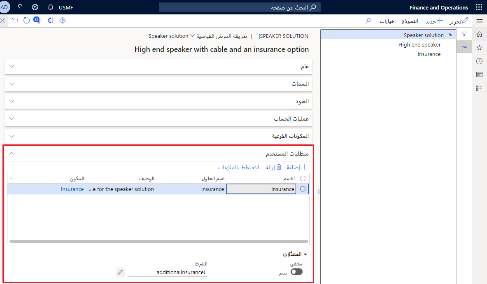
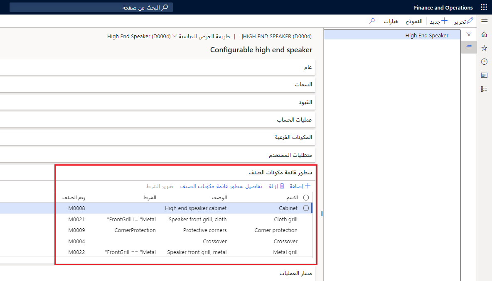
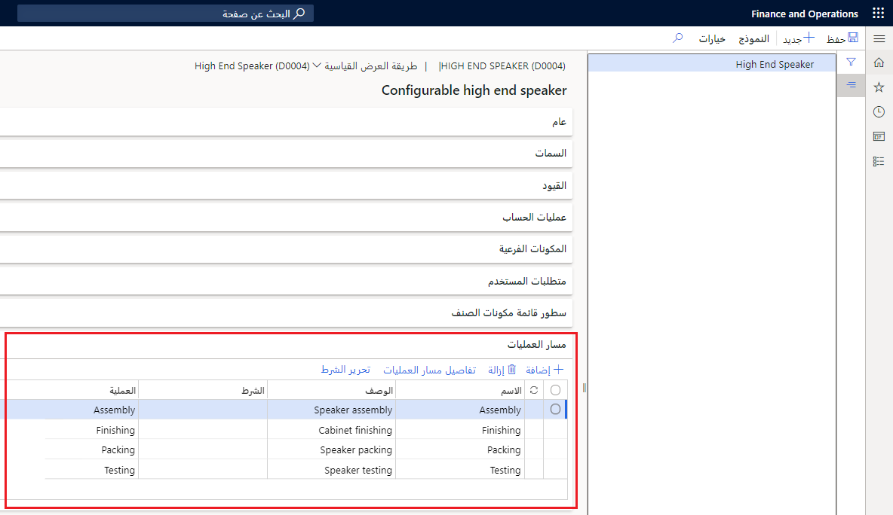
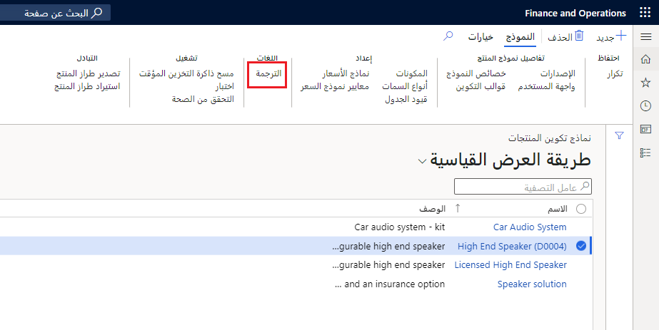

يوضح الشكل التالي التدفق والأنشطة المطلوبة لإنشاء نموذج التكوين.

انتقل إلى **إدارة معلومات المنتج > الإعداد > معلمات إدارة معلومات المنتج** لإعداد معلمات نموذج تكوين المنتج المستندة إلى القيود قبل إنشاء نموذج تكوين المنتج.

تتوفر المعلمات التالية:

-   **التسلسل الرقمي لنموذج تكوين المنتج المستند إلى قيد** - يتيح تحديد كافة التكوينات التي تقوم بإنشائها بشكل فريد. يجب تحديد تسلسل رقمي لتعريف متغيرات المنتجات التي تقوم بإنشائها بشكل فريد.

    على سبيل المثال، عندما تقوم سوزان، القائم بمعالجة الأمر، بتكوين صنف في أمر مبيعات، يتم سحب رقم من هذا التسلسل الرقمي. ويتم تخزين الرقم في حقل **بعد التكوين** للمنتج الموجود في بند الأمر.

-   **أسلوب البحث عن الأصناف** - يحدد ما إذا كانت الأصناف القابلة للتكوين ستظهر مع جميع الأصناف الأخرى، أو إذا كنت تريد عرضها في علامة تبويب منفصلة.
    
    تتوفر القيم الآتية:

    -   **افتراضي** - يعرض نماذج تكوين المنتج في قائمة مع الأصناف الأخرى المتوفرة عند تحديد صنف في بند أمر المبيعات.

    -   **قابل للتكوين** - يعرض نماذج تكوين المنتج في علامة تبويب منفصلة عندما تحدد صنفاً في بند أمر المبيعات.

-   **نوع وثائق التكوين** - يتيح لك إضافة ملاحظة إلى بند الأمر. سوف تعرض الملاحظة نتائج التكوين الذي قمت بإنشائه.

-   **معرف التكوين الافتراضي** - يعيّن الاسم الأولي لتكوين متغيرات المنتج التي، كمعيار، يتم إصدارها مع أصول المنتجات المستندة إلى القيود.

-   **استخدام ذاكرة التخزين المؤقت للتكوين** - يستخدم هذا الإعداد لتقليل قدر الوقت المستغرق في تشغيل صفحة **نماذج تكوين المنتج**.

-   **إرفاق** - يمكنك من إرفاق تصنيف أسعار المبيعات التي تم إنشاؤها لنموذج تكوين المنتج من بند أمر المبيعات.
    حدد هذا الخيار لاختيار تنسيق، مثل ملف أو صورة، لتصنيف أسعار المبيعات.

-   **العملة الافتراضية** - استخدم هذه المعلمة لنموذج تكوين سعر. حدد العملة الافتراضية إذا كنت ترغب في إعداد نموذج سعر لنموذج تكوين منتج.

    بعد إعداد المعلمات، يمكنك الاختيار من بين العديد من العمليات التي تُستخدم عادةً لإنشاء نموذج تكوين المنتج.

## المكونات

تعد المكونات اللبنات الأساسية لنموذج تكوين المنتج، وترتبط بها معظم المعلومات حول النموذج. يتم تحديد المكونات مرة واحدة ويمكن استخدامها عدة مرات في واحد أو أكثر من نماذج تكوين المنتج.

**إدارة معلومات الإنتاج > المنتجات > نماذج تكوين المنتج > جديد**.

بعد تعيين مكون لنموذج تكوين المنتج، يمكنك إضافة معلومات إلى المكون بحيث يتناسب مع نموذج تكوين المنتج المحدد. يمكن أن تتضمن هذه التفاصيل المضافة معلومات حول متطلبات المستخدم، والسمات، والقيود، وبنود قائمة مكونات الصنف، وعمليات المسار.
يمكن أن يشتمل المكون أيضاً على مكونات أخرى كمكونات فرعية.

يمكنك استخدام أحد المكونات عدة مرات في نموذج تكوين المنتج، ويمكن إعادة استخدام المكون في نماذج تكوين منتج متعددة.

على سبيل المثال، عند إنشاء نموذج تكوين منتج لنظام المسرح المنزلي، يمكنك إنشاء مكونات مثل نظام الفيديو ونظام الصوت. يمكن أن يتكون نظام الصوت أيضاً من مكونين، مثل جهاز استقبال وسماعات. يُعرف جهاز الاستقبال والسماعات بالمكونات الفرعية لنظام الصوت.

يمكن استخدام الأصناف التي تحتوي على **تكوين مستند إلى قيد** مثل **تقنية التكوين** الموجودة في صفحة **تفاصيل المنتجات الصادرة** كمكونات لإنشاء نموذج تكوين منتج.
وبخلاف ذلك، لا يمكن تحديد الصنف في علامة التبويب السريعة **المكونات الفرعية** في صفحة **تفاصيل نموذج تكوين المنتج المستند إلى قيد**.

-   **أنواع السمات** - حدد مجموعة أنواع البيانات أو المجالات للسمات المستخدمة في نموذج تكوين منتج في **إدارة معلومات المنتج > الإعداد > الفئات والسمات > السمات**. يمكن استخدام أنواع البيانات التالية في نموذج تكوين المنتج: نصي ومنطقي وعدد صحيح وعشري. 

    

    يمكنك استخدام القيم العشرية، والنص بدون قائمة ثابتة، والأعداد الصحيحة بدون نطاقات في نموذج تكوين المنتج. ومع ذلك، لا يمكنك استخدام أنواع البيانات هذه عند كتابة قيد.

    تدعم أداة حل القيود Microsoft Solver Foundation النص ذا القائمة الثابتة والقيم المنطقية والأعداد الصحيحة للنطاقات فقط. يتم عرض نوعي البيانات "العملة" و"التاريخ والوقت" في القائمة في حقل **النوع**.
    ومع ذلك، لا يمكن استخدامهما في نموذج تكوين منتج.

-   **نموذج تكوين المنتج** - يتم إنشاؤه لتمثيل بنية المنتج العامة في **إدارة معلومات المنتج > المنتجات**.

    

-   **سمات** - يحتوي كل مكون على سمة واحدة أو أكثر تحدد خصائصها. وتمثل السمات ما يجب على المستخدمين الاختيار منه أثناء عملية التكوين.

    يتم تحديد سمات نموذج المنتج باستخدام مجال يقيد القيم التي يمكن للمستخدم تحديدها. يمكن استخدام قيم السمات في القيود لتقليل التباين بشكل إضافي. يمكنك أيضاً تحديد استخدام قيمة السمة فقط عند وجود شرط معين. مثل قيود التعبير، تتم كتابة الشروط كتعبير بلغة تصميم التحسين (OML).

    تصف السمات خصائص المكونات. يمكنك استخدام السمات لتحديد الميزات التي يمكن تحديدها في حالة تكوين متغير منتج مميز. يحتوي كل مكون على سمة واحدة أو أكثر والتي تقوم بتعريف خصائصه. وتعبر السمات عما ستختار منه أثناء عملية التكوين.

    يمكن تعيين قيمة افتراضية للسمة. ويتم استخدام القيمة الافتراضية في واجهة مستخدم التكوين عند تكوين نموذج تكوين المنتج. يمكن أن تكون السمات إلزامية. إذا كانت السمة إلزامية، يجب عليك تعيين قيمة عند تكوين المنتج. يمكنك أيضاً تعيين شرط لسمة إلزامية.
    إذا تم استيفاء الشرط، يجب عليك إدخال قيمة للسمة الإلزامية.

-   **القيود** - تصف قيود نموذج تكوين المنتج. تُستخدم القيود للمساعدة في ضمان تحديد القيم الصالحة فقط عند تكوين نموذج تكوين المنتج.
    
    يدعم تكوين المنتج قيود التعبير وقيود الجدول. استخدم قيود التعبير للتعبير عن العلاقات بين السمات لتأكيد تحديد القيم المتوافقة عند تكوين منتج. **إدارة معلومات الإنتاج > المنتجات > نماذج تكوين المنتج**.

    

- **قيود الجدول** - يتم التعبير عنها في جدول يحدد بوضوح المجموعات المطلوب تشغيلها لمجموعة محددة من السمات. تتم معالجة القيود بواسطة أداة حل قيود MSF.

-   **العمليات الحسابية** - تمثل آلية لإجراء العمليات الحسابية في نموذج التكوين. على سبيل المثال، يمكن أن تحدد عملية حسابية طول قطعة معينة من المادة الخام أو وقت المعالجة لعملية الصقل.
    تعتبر العمليات الحسابية إلزامية، وتعيّن القيمة لسمة الهدف بعد أن تصبح جميع قيم البيانات الجدولية المضمنة في تعبير الحساب متاحة.

-   **المكونات الفرعية** - تمثل بنية الشجرة لنموذج تكوين المنتج. نظراً لأن المكونات الفرعية تشير إلى المكونات الحالية، فإنها تشجع على إعادة استخدام المكونات في نماذج تكوين منتجات متعددة.

    يتم استخدام مكون فرعي لإنشاء علاقة أصل / فرعي بين مكونين.

-   **متطلبات المستخدم** - تمثل تجريداً سهل الاستخدام بين متطلبات المستخدم والمكونات والسمات المحددة. يحتوي متطلب المستخدم على جميع خصائص المكون الفرعي. ومع ذلك، لا يمكنك تعيين متطلبات مستخدم إلى أصل منتج.

    

-   **بنود قائمة مكونات الصنف** - يتم تضمينها لتحديد قائمة مكونات الصنف للتصنيع لكل مكون. يجب أن يشير بند قائمة مكونات الصنف إلى أصل منتج أو أي منتج صادر، ويمكن تعيين جميع الخصائص إلى قيمة ثابتة أو تعيينها إلى سمة.

    

-   **عمليات المسار** - يتم تضمينها لتحديد مسار التصنيع ويجب أن تشير إلى عملية محددة.

    

-   **تخصيص واجهة مستخدم التكوين** - يمكنك تنظيم وترتيب السمات والمكونات الفرعية في مجموعات سمات أو عن طريق نقلها لأعلى ولأسفل في بنية شجرة واجهة المستخدم.

-   **التحقق من صحة نموذج تكوين المنتج** - يمكن أن يحدث التحقق من نموذج تكوين المنتج على عدة مستويات في النموذج، ويمكن أن يشمل التحقق من صحة ما يلي: القيود، أو شروط بند قائمة مكونات الصنف أو شروط تشغيل المسار، أو نموذج تكوين المنتج الكامل.

-   **اختبار نموذج تكوين المنتج** - بعد إعداد نموذج تكوين المنتج، يمكنك اختبار أن النموذج يعمل كما هو متوقع عن طريق محاكاة عملية التكوين.

-   **إنشاء قوالب التهيئة** - يمكن إنشاء واحد أو أكثر من قوالب التكوين إما لتسريع عملية التكوين أو تعزيز مجموعات سمات معينة. يمكن أن تكون الحالة الأخيرة استجابة لحملة مبيعات تركز على مجموعة معينة من ميزات المنتج.

-   **إضافة ترجمات التهيئة** - إذا كان من المقرر بيع المنتج في بلدان و/ أو مناطق مختلفة، يمكن إنشاء ترجمات لجميع النصوص التي تظهر في واجهة مستخدم التكوين.

    

-   **إنشاء الإصدارات والموافقة عليها وتنشيطها** - تتمثل الخطوة الأخيرة والأكثر أهمية في العملية في إنشاء إصدار لنموذج تكوين المنتج. يمثل الإصدار العلاقة بين أصل المنتج ونموذج تكوين المنتج. يمكنك تحديد الإصدار لتكوين أمر أو بند عرض أسعار. يجب الموافقة على الإصدار وتنشيطه قبل استخدامه في جلسة التكوين. 
    
-   **الوصول إلى تكوين المنتج** - يتمثل الغرض من عملية التكوين في إنشاء متغير مميز للمنتج الذي يلبي متطلبات العميل.

## السيناريو

يجب على مصمم المنتج إنشاء نموذج منتج جديد يتضمن العديد من المكونات لنظام المسرح المنزلي، ويتيح نموذج المنتج في العديد من البلدان و/ أو المناطق.

يجب تحديد السمات التي تميز قدرات كل مكون، ويجب إنشاء قيود للمكونات لتقييد متغيرات المنتج المسموح بها. تتم إضافة بنود قائمة مكونات الصنف لتمثيل الأجزاء المطلوبة لإنشاء المنتج جنباً إلى جنب مع عمليات المسار.

يجب تقديم أنواع مختلفة من الخدمات للعميل. تسمح هذه الخدمات بإعداد نظام المسرح المنزلي وتثبيته، وتشمل خدمات الإصلاح. يجب أن يكون مصمم المنتج قادراً على اختبار التكوين والتحقق من تحديد السمات والقيود بشكل صحيح.

للمساعدة في تسريع عملية التكوين عندما يقوم معالج الأمر بإدخال أوامر مبيعات العملاء، سيقوم مصمم المنتج بإنشاء قوالب للإصدارات الأكثر شيوعاً من نظام المسرح المنزلي.

يجب أن يكون معالج الأمر قادراً على الاختيار من القوالب التي أنشأها مصمم المنتج، أو تكوين أمر المبيعات يدوياً باستخدام الخيارات التي قدمها لتلبية متطلبات العميل.
 
