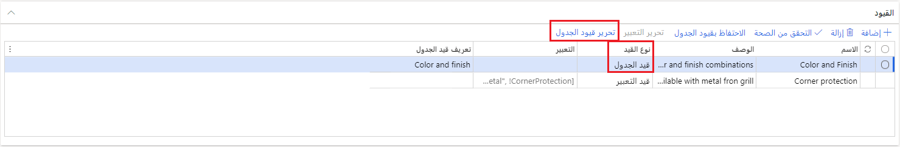
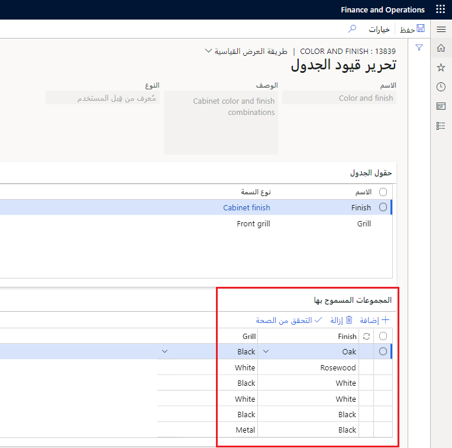

تتحكم القيود في قيم السمات التي يمكنك تحديدها عند تكوين منتجات لأمر المبيعات أو عرض أسعار المبيعات أو أمر الشراء أو أمر الإنتاج. يمكنك استخدام قيود التعبير أو قيود الجدول استناداً إلى الطريقة التي تفضلها لبناء القيود.

## قيود التعبير

يشير استخدام نموذج تكوين منتج يستند إلى قيد إلى وجود بعض القيود عند قيام المستخدم بتحديد قيم للسمات المتنوعة. يمكن تطبيق مثل هذه القيود كقيود تعبير باستخدام لغة نمذجة التحسين (OML).

تُوصف قيود التعبير بأنها تعبير يستخدم عوامل ووظائف حسابية ومنطقية. تتم كتابة قيد تعبير لمكون محدد في نموذج تكوين منتج. ولا يمكن إعادة استخدامه أو مشاركته مع مكون آخر. ومع ذلك، يمكن أن تشير قيود التعبير لمكون ما إلى سمات المكونات الفرعية للمكون.

وبدلاً من ذلك، يمكن تنفيذ قيد على شكل قيد جدول.

## قيود الجدول

يتم تضمين قيد الجدول في نموذج تكوين المنتج عن طريق الإشارة إلى تعريف قيد الجدول وتعيين السمات ذات الصلة في النموذج إلى الأعمدة الموجودة في قيد الجدول.

يمكن أن تكون قيود الجدول محددة من قِبل النظام أو من قِبل المستخدم:

-   يتم بناء قيد الجدول **المحدد من قبل المستخدم** بواسطة المستخدم. يقوم المستخدم بتحديد مجموعة من أنواع السمات لتمثيل أعمدة الجدول ثم يقوم بإدخال قيم من المجالات الخاصة بأنواع السمات المحددة لتكوين الصفوف في قيد الجدول.
    
    ويكون قيد الجدول المعرف من قبل المستخدم ثابتاً ويتألف من الأعمدة التي تمثل أنواع السمات. ويمثل كل صف مجموعة قانونية من قيم السمات المأخوذة من أنواع السمات.

-   يتم تحديد قيد الجدول **المحدد بواسطة النظام** عن طريق تحديد جدول Supply Chain Management المراد استخدامه كمرجع ثم تحديد الحقول من هذا الجدول لتكوين الأعمدة في القيد. وصفوف قيد الجدول هي صفوف جدول Supply Chain Management الموجودة في وقت التكوين.

تسرد قيود الجدول مجموعات القيم المسموح بها للسمات عند تكوين منتج. يمكن استخدام تعريفات قيود الجدول بوجه عام. عند إنشاء قيد جدول لأحد المكونات في أحد نماذج تكوين المنتج، حدد تعريفاً لقيد الجدول. لإنشاء المجموعات المسموح بها، يمكنك إضافة سمات من أنواع محددة إلى المكونات. ويكون لكل نوع سمة قيمة محددة.

يوضح المثال التالي كيف يمكنك تقييد تكوين سماعة ليقتصر على تشطيب كابينة وواجهة معينة. يوضح الجدول الأول تشطيب الكابينة والواجهة المتوفرة بشكل عام للتكوين. يتم تحديد القيم لأنواع سمات  **تشطيب الكابينة**  و **شبكة الواجهة**.

| نوع السمة | القيم                      |
|----------------|-----------------------------|
| تشطيب الكابينة | أسود، لون بلوطي، خشب الورد، أبيض |
| شبكة الواجهة    | أسود، معدن، أبيض         |

يعرض الجدول التالي المجموعات التي تم تحديدها بواسطة قيد جدول  **اللون والتشطيب** . باستخدام قيد الجدول هذا، يمكنك تكوين السماعة بتشطيب بلوطي وشبكة سوداء، وتشطيب خشب الورد وشبكة بيضاء وهكذا.

| التشطيب   | الشبكة |
|----------|-------|
| لون بلوطي      | أسود |
| خشب الورد | أبيض |
| أبيض    | أسود |
| أبيض    | أبيض |
| أسود    | أسود |
| أسود    | معدن |

### بناء الجملة

عند كتابه القيود، يجب استخدام بناء جملة لغة نمذجة التحسين (OML). يستخدم النظام حلول Microsoft Solver Foundation (MSF) لحل القيود.

## استخدام قيود الجدول أو قيود التعبير

يمكنك استخدام إما قيود التعبير أو قيود الجدول استناداً إلى الطريقة التي تفضلها لبناء القيود. يتم بناء قيد الجدول كمصفوفة، بينما يتم بناء قيد التعبير كعبارة منفردة. عند تكوين منتج، لا يهم نوع القيد المُستخدَّم. يوضح المثال التالي كيف يختلف الأسلوبين.

عند تكوين منتج باستخدام إعدادات القيد التالية، يتم السماح بهذه المجموعات:

-   منتج باللون الأسود، وبحجم 30 أو 50

-   منتج باللون الأحمر، وبحجم 20

### إعداد قيود التعبير

(اللون == \"أسود\" و(الحجم == \"30\" \| الحجم == \"50\")) \| (اللون == \"أحمر\" والحجم  ==\"20\")

يمكنك كتابة قيد تعبير باستخدام عوامل البادئة المتوفرة أو منهج التدوين الوسطي. بالنسبة لمشغلات  **الحد الأدنى** و **الحد الأقصى** و **Abs**، لا يمكنك استخدام منهج التدوين الوسطي. يتم تضمين هذه المشغلات كمشغلات قياسية في معظم لغات البرمجة.

## قيود الجدول المحددة من قِبل النظام ومن قِبل المستخدم

نوعا قيود الجدول للمكونات في نموذج تكوين منتج ما هما **معرف من قبل المستخدم** و **معرف من قبل النظام**.

تمثل قيود الجدول المصفوفات الخاصة بمجموعات السمات المسموح بها، حيث يحدد كل صف مجموعة واحدة من قيم السمات المحتملة.

تمثل قيود الجدول المصفوفات الخاصة بتوليفات السمات المسموح بها للمكونات الموجودة في نموذج تكوين منتج. يعرِّف كل صف في الجدول مجموعة واحدة من قيم السمات المحتملة. يمكنك تعريف نوعين من القيود في نموذج تكوين منتج:

-   **قيد التعبير** - إنشاء تعبير يحدد العلاقات بين السمات لضمان أنه يمكن فقط تحديد القيم المتوافقة أثناء تكوين المنتج.

-   **قيد الجدول** - إنشاء جدول يحدد كافة التوليفات المسموح بها لمجموعة محددة من السمات. يتوفر نوعان من قيود الجداول: معرف من قبل المستخدم ومعرف من قبل النظام.

### قيود الجدول المعرفة من قبل المستخدم

يمثل قيد الجدول المعرف من قبل المستخدم نوعاً من المصفوفات يتم استخدامه لوصف مجموعات من قيم السمات التي يتم تعريفها بواسطة أنواع السمات. على سبيل المثال، إذا قمت بإنتاج سماعات، فيمكنك تضمين أعمدة لتشطيب الكابينة والشبكة الأمامية في قيد الجدول المعرف من قبل المستخدم.

يحتوي نوع السمة الخاص بتشطيب الكابينة على أربعة قيم، ويحتوي نوع السمة الخاصة بالشبكة الأمامية على ثلاث قيم. بالتالي، إذا كانت القيود غير مستخدمة، فستكون التوليفات المحتملة 4 × 3 = 12.
ومع ذلك، في هذا المثال، يتم السماح بست مجموعات فقط، كما هو موضح في الجدول التالي.

**إدارة معلومات المنتج > المنتجات > نماذج تكوين المنتجات > القيود**

يتم عرض المعلومات المتعلقة بالتوليفات في علامة تبويب  **المجموعات مسموح بها**  في صفحة  **تحرير قيود الجدول**  في **إدارة معلومات المنتج > المنتجات > نماذج تكوين المنتج > (حدد نموذج) > القيود > تحرير قيد الجدول**.

### قيود الجدول المعرفة من قبل النظام

يقوم قيد الجدول المحدد بواسطة النظام بإنشاء تعيين ديناميكي بين نوع سمة وحقل في جدول. عند تضمين قيد جدول محدد من قبل النظام في نموذج تكوين منتج، يضمن التعيين أن يتم عرض البيانات الموجودة في الجدول بدلاً من القيم الخاصة بنوع السمة. والنتيجة هي قيد ديناميكي نظراً لأن يمكن تعديل محتويات الجدول (بواسطة وحدات نمطية أخرى، على سبيل المثال).

عند إنشاء قيد جدول محدد بواسطة النظام، ستقوم بتحديد جدول، وبشكل اختياري يمكنك تحديد الاستعلام المراد استخدامه، ثم اقران أنواع السمات بالحقول في الجدول المحدد. ويجب أن تتطابق أنواع الحقول مع أنواع السمات.

قبل أن يصبح قيد الجدول ساري المفعول في نموذج تكوين منتج، يجب تضمين قيد الجدول في قيد بأحد مكونات النموذج. يتمثل الإجراء في إنشاء قيد جديد وتحديد نوع قيد الجدول، ثم تحديد تعريف قيد الجدول المطلوب استخدامه. في النهاية، يجب تعيين كافة الحقول الموجودة في قيود الجدول إلى سمات في نموذج تكوين المنتج.

ومع ذلك، لا يتطلب الأمر مطابقة تلك القيم كقيم تعداد ونطاقات الأعداد الصحيحة. يتم استبدال قيم نوع السمة بالقيم الموجودة في الحقل من الجدول الذي تم تحديده. بعد إنشاء قيد جدول معرف من قبل النظام، يمكنك إضافة القيد إلى أحد المكونات، ثم تعيين السمة إلى أسماء الأعمدة في قيد الجدول.

