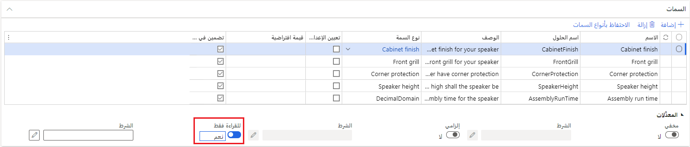

يمكن استخدام الحسابات للعمليات الحسابية أو المنطقية. وهي تستكمل قيود التعبيرات في نماذج تكوين المنتج. يمكنك تحديد الحسابات في صفحة **تفاصيل نموذج تكوين المنتج المستند إلى قيد** ثم إنشاء تعبيرات للعمليات الحسابية في محرر التعبير. 

الحساب هو العنصر الذي يمكنك استخدامه في نموذج تكوين المنتج. تستكمل العمليات الحسابية القيود عن طريق السماح لك باستخدام الأرقام العشرية لحساب القيم عند تكوين منتج. بالإضافة إلى ذلك، تحتوي العمليات الحسابية على مجموعة أكبر من عوامل التشغيل المتوفرة بخلاف ما تحتويه القيود.

مثل القيد، يتم ربط الحساب بمكون محدد في نموذج تكوين منتج ولا يمكن إعادة استخدامه بواسطة مكون آخر أو مشاركته معه. والاختلاف الهام بين العمليات الحسابية والقيود هو أن العمليات الحسابية إلزامية (أحادية الاتجاه)، بينما تعتبر القيود توضيحية (ثنائية الاتجاه).

تتكون عملية الحساب من سمة هدف وتعبير حساب.

### سمة الهدف

السمة الهدف هي سمة تستلم نتيجة تعبير الحساب.

في التعبير التالي، السمة الهدف هي مقاس مفرض المائدة:

> **التعبير:** إذا كان [decimalAttribute1 <= decimalAttribute2, صواب، خطأ]

**DecimalAttribute1** هو طول الطاولة و **decimalAttribute2** هو طول مفرش الطاولة. يرجع التعبير القيمة **صواب** إلى السمة الهدف إذا كان  **decimalAttribute2** أكبر من أو يساوي **decimalAttribute1**. بخلاف ذلك، يُرجع التعبير  **خطأ**.
بالتالي، يكون مقاس مفرش الطاولة مقبولا إذا كان طول مفرش الطاولة هو نفس طول الطاولة أو يتجاوزه.

يمكن تعيين كافة أنواع السمات التي تدعمها وحدة تكوين المنتج إلى سمات هدف باستثناء النص بدون قائمة ثابتة.

لا يمكن لقيمة السمة الهدف تقييد قيم سمات الإدخال نظرا لأن العمليات الحسابية تكون أحادية الاتجاه. بالتالي، يتم تعيين قيمة السمة الهدف استناداً إلى التغييرات في قيمة سمات الإدخال ولكن التغيير في قيمة الهدف لا يؤثر على قيمة سمات الإدخال. يختلف هذا السلوك عن سلوك القيود. تحدث القيود في كلا الاتجاهين.

**مثال:**

في التعبير التالي، يكون الهدف من عملية الحساب هو طول سلك الطاقة وقيمة الإدخال هي لون.

> **التعبير:** [إذا كان اللون == "أخضر"، 1.5، 1.0]

عند تكوين الصنف، يتم تعيين طول سلك الطاقة إلى  **1.5** إذا قمت بتحديد  **أخضر** كقيمة لسمة اللون. إذا قمت بتحديد لون آخر، يتم تعيين الطول إلى  **1.0**. ومع ذلك، نظراً لأن العمليات الحسابية تكون أحادية الاتجاه، لا تقوم عملية الحساب بتعيين قيمة سمة اللون إلى اللون  **الأخضر**  إذا قمت بتحديد طول  **1.5**.

إذا كانت السمة الهدف من نوع عدد صحيح، ولكن عملية الحساب تقوم بإنشاء رقم عشري، يتم إرجاع جزء العدد الصحيح فقط من النتيجة المحسوبة، وتتم إزالة الجزء العشري، ولا يتم تقريب النتيجة. على سبيل المثال، يتم عرض نتيجة 12.70 في صورة 12.

تحدث العمليات الحسابية عند توفير قيمة لكافة سمات الإدخال. يمكنك الكتابة فوق القيمة التي يتم حسابها للسمة الهدف ما لم يتم تعيين السمة الهدف كمخفية أو للقراءة فقط.

### إعداد سمة هدف كمخفية أو للقراءة فقط

لتعيين سمة كمخفية أو للقراءة فقط، اتبع الخطوات التالية.

1.  حدد  **إدارة معلومات المنتج > المنتجات > نماذج تكوين المنتجات**

2.  حدد نموذج تكوين منتج، ثم في جزء الإجراء، حدد  **تحرير**.

3.  في صفحة  **تفاصيل نموذج تكوين المنتج المستند إلى قيد** ، حدد السمة المطلوب استخدامها كسمة هدف.

4.  في علامة التبويب السريعة  **السمات** ، حدد  **مخفية**  أو  **للقراءة فقط**.

    

لا يمكن الكتابة فوق عملية الحساب بالقيم التي قمت بتعيينها. القيم التي تقوم بتعيينها عند تكوين منتج هي القيم التي يتم استخدامها. لا يمكن لعملية الحساب التي تحدث عند تغيير قيم الإدخال في الحساب الكتابة فوق القيم التي توفرها لسمة معينة.

إذا قمت بإزالة قيمة إدخال في عملية حساب، ستتم إزالة قيمة السمة الهدف أيضاًً.

## رسالة الخطأ - النموذج متعارض

تظهر رسالة الخطأ **النموذج متعارض** عندما تتضمن العملية الحسابية خطأ أو عندما توجد تعارضات في واحد أو أكثر من القيود.

فيما يلي المواقف التي يمكن أن تحدث فيها أخطاء في العمليات الحسابية:

-   قسمة القيمة على 0 (صفر).

-   وجود تعارض بين العنصرين التاليين:

    -   القيم المتوفرة لسمة ولكنها محدودة بقيد

    -   قيمة تم إنشاؤها بواسطة عملية حساب

-   القيم التي يتم إرجاعها بواسطة عملية الحساب تقع خارج مجال السمة، على سبيل المثال، عدد صحيح من [1.. 10] يتم حسابه إلى 0.

## رسالة الخطأ - بعد التحقق من صحة طراز منتج بنجاح

إذا استلمت رسالة الخطأ **بعد التحقق من صحة طراز منتج بنجاح**، لا يتم تضمين العمليات الحسابية في عملية التحقق من الصحة. يجب اختبار نموذج تكوين المنتج للبحث عن الأخطاء في العمليات الحسابية. لاختبار نموذج تكوين منتج، اتبع الخطوات التالية:

1.  حدد  **إدارة معلومات المنتج > المنتجات > نماذج تكوين المنتجات**

2.  حدد نموذج تكوين منتج، ثم في جزء الإجراء، في المجموعة  **تشغيل** ، حدد  **اختبار**.

