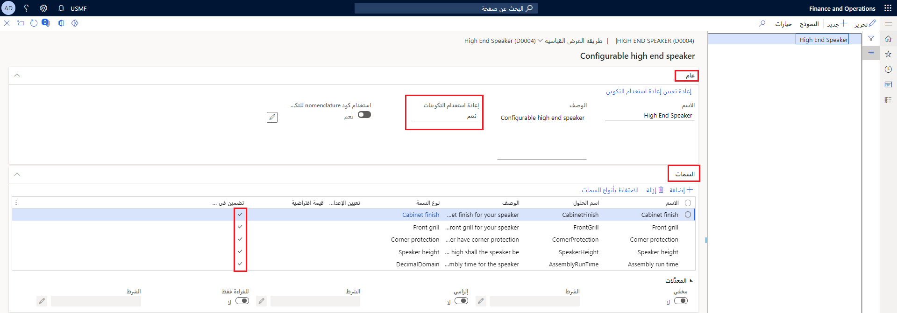

يمكنك تحديد أنك تريد تلقائياً إعادة استخدام تكوين موجود لمنتج. بعد ذلك، عند إكمال أحد المستخدمين لجلسة تكوين، يقوم النظام بالتحقق مما إذا كان التكوين الذي يتطابق مع تحديدات المستخدم موجود بالفعل أم لا. في حالة العثور على تكوين مطابق، يتم إعادة استخدام معرف التكوين وقائمة مكونات الصنف (BOM) المطابقة والمسار.

لتمكين إعادة استخدام التكوينات، يجب تحديد المعلومات التالية للمكونات والسمات في صفحة  **تفاصيل نموذج تكوين المنتج** :

-   **المكونات والمكونات الفرعية**  - في علامة التبويب السريعة  **عام** ، في حقل  **إعادة استخدام التكوينات** ، حدد  **نعم**.

-   **السمات**  - في علامة التبويب السريعة  **السمات** ، حدد خيار  **تضمين في إعادة الاستخدام** . يظهر هذا الخيار فقط عند تمكين المكون المتعلق لإعادة الاستخدام. إذا لم تقم بتحديد أي سمات لإعادة الاستخدام، فإنه سيتم دائماً إعادة استخدام التكوين، بغض النظر عن تحديدات المستخدم أثناء جلسة التكوين. ويجب أن تتطابق قيم السمات في التكوين الموجود مع تحديدات المستخدم. على سبيل المثال، إذا قام المستخدم بتحديد  **أزرق**  كلون أثناء جلسة التكوين، فسيقوم النظام بالتحقق مما إذا كان التكوين الموجود للمكون باللون الأزرق أم لا.

    

عند إعادة تعيين عملية إعادة استخدام التكوين، لا يتم الأخذ في الاعتبار التكوينات التي تم إنشاؤها مسبقاً. قد ترغب في إعادة تعيين عملية إعادة استخدام التكوين إذا تم تغيير قائمة مكونات الصنف أو المسار ولكن لم يتم تغيير أي سمات متعلقة.
يمكنك إعادة تعيين عملية إعادة استخدام التكوين في علامة التبويب السريعة  **عام**  للمكون.

