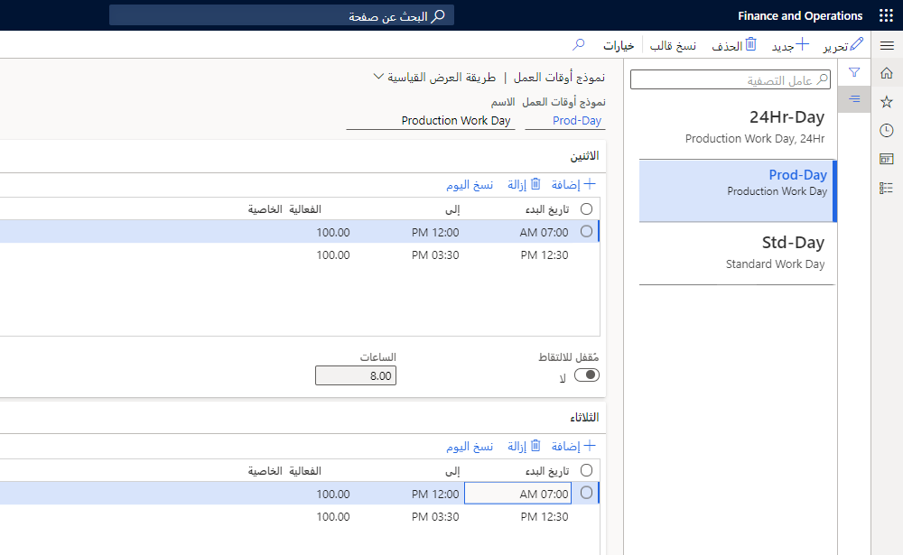
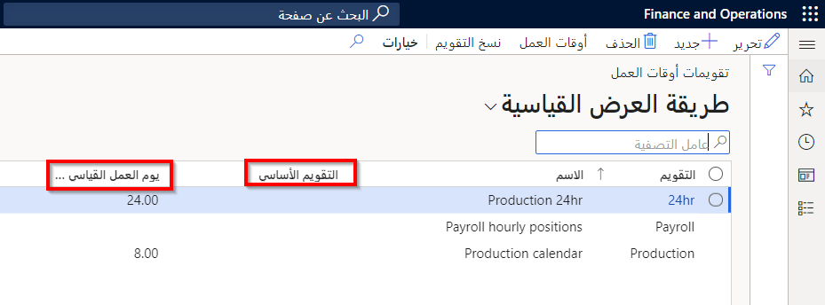
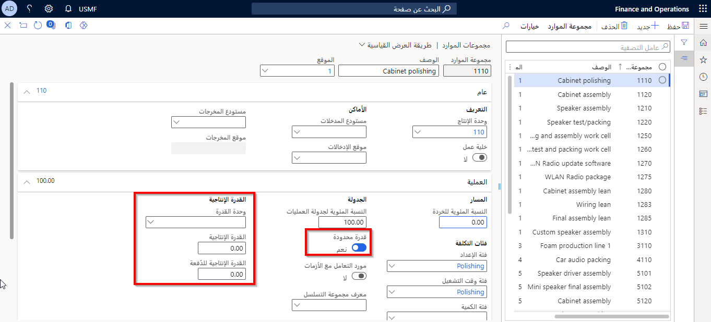
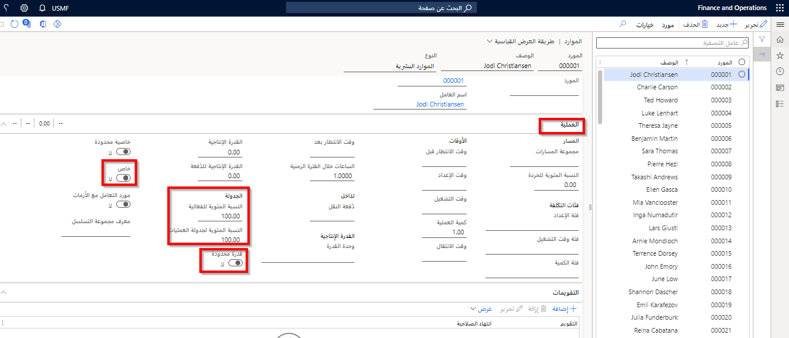

يجب إعداد التقويمات والموارد في وحدة إدارة المؤسسة النمطية قبل استخدام الوحدة النمطية للتحكم بالإنتاج. الموارد هي المعدات الفعلية (يشار إليها عموماً باسم "الموارد") التي يتم استخدامها لإنشاء الأصناف النهائية. 

نظراً لأن القدرة الإنتاجية على الموارد محدودة، تحتاج أيضاً إلى مراعاة الوقت الذي تتوفر فيه الموارد ("أوقات العمل") عندما تقوم بتقييم مقدار الوقت الذي سيستغرقه إكمال الصنف. 

توضح هذه الوحدة تخطيط القدرة الإنتاجية في التصنيع.

وتتسلسل عملية إعداد الموارد والجداول الزمنية للعمل في Supply Chain Management:

1.  إنشاء قوالب أوقات العمل.
2.  إنشاء تقويمات مواعيد العمل.
3.  إنشاء القدرات الإنتاجية.
4.  إنشاء الموارد.
5.  إنشاء مجموعات الموارد.

## قوالب أوقات العمل 

تتمثل الخطوة الأولى في عملية إعداد الموارد والتقويمات للاستخدام في الوحدة النمطية لمراقبة الإنتاج في إعداد قوالب أوقات العمل. يتم تحديد قوالب أوقات العمل في صفحة **قوالب أوقات العمل**، والتي يتم تحديدها باختيار **إدارة المؤسسة > إعداد > تقويمات > قوالب أوقات العمل**.

يمكنك استخدام هذه الصفحة لإعداد قوالب تعكس أوقات العمل العادية في شركتك. يمكن أن يكون هذا تسلسل إنتاج على مدار 24 ساعة والذي تكون الموارد فيه عبارة عن أجهزة، أو يمكن أن يكون أسبوع عمل من 9 إلى 5 لقسم الشراء، حيث تكون الموارد عبارة عن موظفين.

**إدارة المؤسسة > إعداد > تقويمات > قوالب أوقات العمل**
 

ستساعدك القوالب على إنشاء تقويمات أوقات العمل وإدارتها بما يتناسب مع مواردك. تستخدم تقويمات أوقات العمل أوقات العمل التي تحددها في هذا القالب.

على سبيل المثال، قد تكون إحدى الفترات مساوية للوقت الذي يبدأ فيه يوم العمل رسمياً وحتى استراحة الغداء، بينما قد تكون الفترة الأخرى من نهاية استراحة الغداء إلى النهاية الرسمية ليوم العمل. يتم إكمال هذا لكل يوم يعمل فيه الكيان القانوني. يتم نسخ الساعات المجدولة إلى تقويم أوقات العمل.

يمكنك تحديد الساعات العادية أو الأكثر استخداماً للعملية. استخدم الحقل **من** لتحديد وقت بدء فترة العمل والحقل **إلى** لتحديد وقت انتهاء فترة العمل. يمكنك أيضاً استخدام حقلي **الفعالية** وكذلك **الخاصية** لتعريف استخدام كل فترة من الفترات الزمنية التي قمت بإعدادها.

**الفعالية**

يمكنك استخدام حقل **الفعالية** لتحديد نسبة الفعالية التي سيتم استخدامها في جدولة الفترة المعنية، حيث:

وقت الجدولة= الوقت * 100/النسبة المئوية للفعالية.

على سبيل المثال، إذا كانت وردية المساء تعمل بمستوى فعالية 75 في المائة (مقابل الوردية الصباحية، التي تعمل بنسبة 90 في المائة)، فيمكنك ملاحظة ذلك هنا. وتأخذ تأثيرات هذه المعدلات في الاعتبار في القدرة المتاحة على الموارد وفي جميع أنحاء النظام.

**الخصائص**

يمكنك استخدام حقل **الخصائص** لتعيين خصائص إلى القوالب الخاصة بك. تستخدم الخصائص في جدولة وهيكلة الإنتاج. الفكرة هي أن المنتجات التي تشترك في نفس الخصائص يمكن إنتاجها في وقت واحد. يتم استخدام الخصائص بواسطة الموارد للمساعدة على تحسين جداول الإنتاج ويتم إعدادها في صفحة **الخصائص**. يفيد هذا غالباً في إعداد الخصائص على التقويمات لاستخدامها في إعداد الخصائص على الموارد.

**إنشاء خصائص الموارد** 

خصائص الموارد هي السمات التي يمكنك تعيينها لمواردك الخاصة لاستخدامها ضمن عملية الجدولة. ترتبط الخصائص بقوالب مواعيد العمل بصورة مباشرة. على سبيل المثال، إذا قمت بتعيين خاصية باللون الأحمر إلى جهاز الطلاء في يوم الإثنين، عند تشغيل الجدولة، سيقوم هذا المورد بطلاء العناصر باللون *الأحمر* في أيام الإثنين فقط.

لا تكون خصائص المورد مطلوبة عند إعداد تقويمات أوقات العمل. ومع ذلك، إذا كنت ترغب في استخدام الخصائص، فإن إعدادها في الوقت نفسه يكون أكثر فعالية.

## التقويمات 
الخطوة الثانية في عملية إعداد التقويمات والموارد هي إنشاء التقويم. يجب إعداد التقاويم قبل إنشاء مجموعات الموارد. وذلك لأنه عند إنشاء مجموعة موارد أو مورد، يجب تخصيص التقويم الذي يجب استخدامه. ومن هذا المنطلق، فإن التقويمات تخدم كأساس لحساب القدرة الإنتاجية للموارد الفردية.

استخدم صفحة **التقويمات** لإنشاء تقويم واحد أو أكثر لإدارة ساعات العمل المستخدمة في الموارد ومجموعات الموارد. إذا قمت بإنشاء أكثر من تقويم، فمن الأفضل إنشاء تقويم أساسي أولاً.
 
انتقل إلى **إدارة المؤسسة > إعداد > تقويمات > تقويمات**.
 

إذا قمت بتحرير التقويم الأساسي، فستنعكس التغييرات في جميع التقويمات الأخرى التي تقوم بإنشائها. ومع ذلك، إذا قمت بإجراء تغييرات على تقويمات أوقات العمل الفردية، فلن يتم تحديث التغييرات في التقويم الأساسي.

يحدد حقل **التقويم الأساسي** أن التقويم الحالي يكتسب من التقويم الأساسي المحدد أو التقويم الأساسي المحتمل. عندما يتم تحديث التغييرات على التقويم، يكتسب التقويم الحالي أوقات العملية من التقويم الأساسي. ومع ذلك، فإن قالب أوقات العملية الذي تم تحديده للتحديث سيتحكم في التحديث. يمكنك مسح التقويم الأساسي عند تحديث أوقات العملية.

يكون **يوم العمل القياسي بالساعات** مطلوباً فقط لـ Lean manufacturing.

بمجرد إنشاء سجل تقويم، يمكنك تكوين أوقات العمل عن طريق تحديد زر **أوقات العمل**.

**إنشاء أوقات العمل** 

تُستخدم صفحة **أوقات العمل** لاحتواء سجل لكل يوم تقويمي في السنة. يمكنك تحديد أوقات العمل عن طريق إدخال الأوقات بشكل فردي أو عن طريق نسخ المعلومات الموجودة في التقويم وإجراء التغييرات ذات الصلة. أدخِل أيام وأوقات العمل النموذجية المستخدمة في الإنتاج، وأية اختلافات متسقة لهذه الأوقات مثل الإجازات أو أيام العطلات. يمكنك استخدام زر **إنشاء أوقات العمل** في صفحة **أوقات العمل** لتحديد التقويم الذي سيتم استخدامه لإنشاء أوقات العمل، ثم تحديد الفترة الزمنية التي سيتم تحديث التقويم خلالها، أو يمكنك تحديد قالب زمني للعمل تم تحديده بالفعل.

عند إعداد التقويمات ومجموعات الموارد، يمكن ربطها ببعضها البعض. ويتم إجراء ذلك عن طريق تحديد مجموعات الموارد الملائمة في علامة التبويب **تقويمات** في صفحة **مجموعات الموارد**.

## قدرات الموارد 

تُعد الخطوة الثالثة في العملية هي إنشاء القدرات الإنتاجية للموارد التي تصف ما يمكن أن تحققه الموارد. عندما تقوم بتصميم مسار، يمكن التعبير عن المتطلبات التي تحتاجها الموارد لتنفيذ العمليات المختلفة في المسار كمجموعة من قدرات الموارد. ويسمح هذا بتأجيل توزيع الموارد حتى تتم جدولة الإنتاج.

- **القدرات الإنتاجية**: هي قدرة المورد على تنفيذ نشاط معين متعلق بالإنتاج. تم تعيين القدرات إلى مورد عملية. يمكن تعيين أكثر من قدرة واحدة لأحد الموارد، ويمكن تعيين قدرة لأكثر من مورد واحد. يمكن أيضاً تعيين القدرات للموارد على أساس مؤقت عن طريق تحديد تاريخ بدء وتاريخ انتهاء لتعيين القدرة. القدرات التي انتهت صلاحيتها في أحد الموارد ستمنع جدولة المورد للإنتاج إذا تطلب الإنتاج تلك القدرة. يمكن تجديد القدرة التي انتهت صلاحيتها لاحقاً. أيضاً، يمكن تعيين القدرة لأي نوع من الموارد.
- **المهارات**: ضمن صفحة **المهارات**، يمكنك إنشاء الاختصاصات التي ستحددها للموظفين أو الوظائف وإدارتها. قد تتطلب العملية مورداً بمهارة معينة.
    يمكن لمحرك الجدولة العثور على موارد بمهارات محددة من خلال البحث عن معلومات المهارة الخاصة بالعامل الذي يرتبط به المورد. هذا ينطبق فقط على جدولة العمل، وليس جدولة العملية. لإعداد المهارات، افتح: **الموارد البشرية > الاختصاصات > إعداد > المهارات**.
- **الدورات التدريبية**: يمكن إنشاء الدورات التدريبية وصيانتها. يتيح لك ذلك إمكانية تعقب الدورات التدريبية التي حضرها الموظفون. قد تتطلب العملية مورداً ذي دورة تدريبية معينة. يمكن لمشغل الجدولة العثور على الموارد ذات الصلة بدورات تدريبية معينة وذلك بالبحث عن معلومات الدورة التدريبية للعامل الذي يرتبط به المورد. هذا ينطبق فقط على جدولة العمل.
- **الشهادة**: يمكن إضافة الشهادات إلى المستخدم، مما يتيح لك تتبع الشهادات التي يتمتع بها الموظفون. قد تتطلب العملية مورداً ذي شهادة معينة. يمكن لمشغل الجدولة العثور على الموارد ذات الصلة بشهادات معينة وذلك بالبحث عن معلومات الشهادة للعامل الذي يرتبط به المورد. هذا ينطبق فقط على جدولة العمل.
- **العنوان**: يمكن أن يكون عنوان الموظف أيضاً متطلباً للوظيفة. قد تتطلب العملية مورداً بعنوان معين. يمكن لمحرك الجدولة العثور على موارد بعناوين محددة من خلال البحث عن معلومات العنوان الخاص بالعامل الذي يرتبط به المورد. هذا ينطبق فقط على جدولة العمل.

## الأولوية والمستوى 

تستخدم **الأولوية** لتحديد المورد الذي يجب تخصيصه أولاً في حالة قيام أكثر من مورد بتنفيذ نفس القدرة ضمن نفس المستوى خلال الفترة المحددة. بالنسبة لقدرة معينة، يتم تحديد المورد ذي أقل رقم أولوية أولاً. بمعنى آخر، كلما انخفض رقم الأولوية لقدرة معينة، زادت الأولوية.

**المستوى** هو مؤهل القدرة الذي يتيح البحث في النظام عن مورد مناسب في حالة وجود موارد متعددة ممكّنة. لا يحتوي المستوى على أي وحدات وهو عبارة عن قيمة رقمية لغرض البحث عن مورد فقط. لا يتم استخدامه في حسابات القدرة بأي شكل من الأشكال. 

على سبيل المثال، في حالة إدخال قيمة مستوى 100 في المسار، فإن ذلك يعني أنه يمكن استخدام كافة الموارد التي يمكن تنفيذها بقيمة أكبر من 100 أو تساويها. إذا كان للمورد R1 مستوى 300، عندها يمكن لذلك المورد تنفيذ العمليات التي تحتاج إلى ما يصل إلى 300.

## الموارد 

يتم تخصيص الموارد للوظائف والعمليات. يمكن أن تكون الموارد أنواعاً مختلفة، بما في ذلك الآلات أو الأدوات أو الموارد البشرية أو الموردين أو أدوات الإنشاء أو المواقع. يتماشى محرك الجدولة مع نموذج الموارد الجديد ويمكنه جدولة الموارد بناءً على قدراتها.

تحل الموارد والقدرات محل مراكز العمل ومجموعات المهام لتوفير المزيد من المرونة في الإعداد والصيانة. في Supply Chain Management، يمكن تخصيص الموارد للوظائف والعمليات من خلال مطابقة قدرات الموارد بمتطلبات العملية.

يتم النظر في الموارد البديلة ذات القدرات نفسها، ما لم تكن هناك متطلبات لمورد معين أو مجموعة موارد. ينطبق هذا سواء اخترت تشغيل جدولة الوظائف أو جدولة العمليات. تتكون عملية التحديد من مطابقة متطلبات العملية مع قدرات الموارد. مع أخذ المتطلبات الأخرى، مثل الموقع ووقت العمل للمورد ونوع المورد أيضاً، في الاعتبار عند القيام بتخطيط الإنتاج.

## إعداد الموارد 

يتم استخدام موارد التشغيل في جميع مراحل عمليات الإنتاج أو المشروع. يمكن أن تكون آلات أو أدوات أو أشخاصاً أو مورّدين يساهمون في إنتاج صنف. تعتبر كوحدة واحدة لإدارة تخطيط متطلبات السعة والجدولة التفصيلية. بعد إنشاء مورد العمليات، يمكنك تعيينه إلى مجموعة موارد وعمليات إنتاج محددة.

يمكنك إعادة تعيين الموارد لمجموعات موارد مختلفة. مع ذلك، يمكن تعيين مورد لمجموعة موارد واحدة فقط في كل مرة. يمثل حقلي **تاريخ السريان** وكذلك **تاريخ انتهاء الصلاحية** في علامة التبويب **مجموعات الموارد** متى يمكن استخدام المورد المعني للإنتاج.

يتيح لك هذا الإعداد مشاركة مورد عبر العديد من المواقع. عندما يصبح المورد عضواً في مجموعة الموارد، فإنه يمثل الانتقال الفعلي من موقع إلى آخر.

## مجموعات الموارد 

بعد إنشاء القدرات والموارد، فإن الخطوة التالية في العملية هي إنشاء مجموعات الموارد.
تعتمد الطريقة التي يتم بها إعداد مجموعات الموارد على مدى تعقيد عملية التصنيع. في حالة ضرورة استيفاء العديد من المتطلبات، ووجود تصنيفات متعددة تستند إلى القدرة الإنتاجية أو سعة الموارد الفردية، فيجب أن تنعكس هذه العوامل على إعداد مجموعة الموارد.
 
**التحكم بالإنتاج > إعداد > الموارد > مجموعات الموارد**

على سبيل المثال، يمكنك ترحيل معلومات حول الموارد إلى دفتر الأستاذ باستخدام مجموعة الموارد بدلاً من الاضطرار إلى ترحيل البيانات المالية لكل مورد على حدة.

كمثال آخر، يمكن النظر إلى مجموعة الموارد على أنها تمثل منطقة فعلية حيث توجد الموارد في أرضية الإنتاج، وغالباً ما يتم تحديدها بخط أصفر على الأرض.

يمكن للشركات تحديد نسبة جدولة التشغيل ونسبة الفعالية لمواردها ومجموعات الموارد الخاصة بها. تحدد هذه النسب المئوية مدى توفر القدرة في مجموعة الموارد أو الموارد المرتبطة بجدولة العملية.

**إدارة المؤسسة > الموارد > الموارد**.

## نسبة جدولة العمليات 

يُظهر حقل **النسبة المئوية لجدولة العملية** في علامة التبويب **عملية** ضمن مجموعات **الموارد** وصفحات **الموارد** أقصى نسبة مئوية للقدرة الإنتاجية اليومية التي يمكن جدولتها لكل عملية إنتاج سواء على مستوى المجموعة أو مستوى المورد. وهذا يعني أنه في حال توافر مجموعة الموارد أو الموارد لمدة ثماني ساعات يومياً، وفقاً للتقويم، وتم تعيين نسبة جدولة العمليات إلى 50 بالمائة، فتكون مدة توافر الجدولة أربع ساعات. لاحظ أن ذلك لكل أمر إنتاج. 

على سبيل المثال، يمكنك جدولة أمري إنتاج معاً كل 4 ساعات في يوم عمل كامل يستمر 8 ساعات.

## النسبة المئوية للكفاءة 

يستخدم حقل **نسبة الفعالية** الموجود في علامة التبويب **عملية** ضمن صفحات **الموارد** أو **مجموعات الموارد** لتقليل أو زيادة مدة الوظائف الفردية المجدولة في المورد أو مجموعة الموارد. 

على سبيل المثال، إذا تم تعيين النسبة المئوية للفعالية إلى 50 بالمائة، فإن الوظيفة المجدولة في المورد أو مجموعة الموارد تتطلب 50 بالمائة من القدرة الإنتاجية المتوفرة وفقاً للتقويم، مما يعني أن وقت المعالجة أطول بمرتين. يتم تطبيق المعادلة التالية: 

وقت الجدولة= الوقت × 100/النسبة المئوية للفعالية.

تتيح النسبة المئوية للفعالية إمكانية تغيير فعالية التشغيل الافتراضية لهذا المورد. تكون التغييرات على هذا الإعداد إما زيادة أو نقصان مدة الوظائف الفردية المجدولة على الموارد أو مجموعات الموارد.

## الحصرية 

الحصرية هي خيار تكوين آخر في الموارد التي تؤثر في الجدولة والتقويمات. فالحصرية متاحة فقط في الموارد وليس مجموعات الموارد. 

عند استخدام العمليات الرئيسية والثانوية، حدد خيار **خاص** لحجز المورد بشكل حصري للوظيفة. ولن تتم الوظيفة الأخرى بمقاطعة الوظائف الجارية للمورد. 

على سبيل المثال، يكون المورد الأساسي خاصاً. عند حدوث فاصل في جدولة المورد الثانوي، لا يمكن حجز المورد الرئيسي لوظائف أخرى. 

وكمثال آخر، فإن المورد الثانوي يكون خاصاً. يتطلب تنفيذ العملية تحميل 50 بالمائة على المورد الثانوي. يتم حجز المورد الثانوي في التحميل بنسبة 100 بالمائة، حتى وإن كان يعمل بنسبة 50 في المائة ولا يمكن جدولة أية وظائف أخرى في ذلك المورد حتى اكتمال الوظيفة. إذا تم إلغاء تحديد هذا الخيار، ففي حالة وجود فجوة بين عمليات الحجز أو إذا كان المورد غير مستخدم في القدرة الإنتاجية بنسبة 100 في المائة، فيمكن حجزه لوظائف أخرى.

لتحديد أحد الموارد على أنه خاص، حدد خانة الاختيار **خاص** ضمن علامة التبويب **عملية** ضمن صفحة **الموارد**.
 
## تخطيط القدرة الإنتاجية والقدرة الإنتاجية المحدودة 

يتم تحديد أوامر تخطيط الإنتاج في Supply Chain Management بواسطة مقدار القدرة الإنتاجية المتاحة ضمن مجموعات الموارد و/أو الموارد المحددة، استناداً إلى تقويمات الإنتاج ومتطلباتها. تتضمن صفحات **مجموعات الموارد** و **الموارد** على خانة اختيار **القدرة الإنتاجية المحدودة**. إذا قمت بتحديد خانة اختيار **القدرة الإنتاجية المحدودة**، فإنك تقوم بتحديد جدولة العمليات أو الوظائف إلى القدرة الإنتاجية الفعلية المتوفرة في مجموعة الموارد أو المورد.

في حالة تحديد خانة اختيار **القدرة الإنتاجية المحدودة**، ستكون القدرة الإنتاجية محدودة. وهذا يعني أنه تتم جدولة العمليات أو الوظائف استناداً إلى القدرة الإنتاجية الفعلية المتوفرة في مجموعة الموارد أو المورد. وفي حالة إلغاء تحديد خانة الاختيار، تتم جدولة العمليات والوظائف بقدرة إنتاجية غير محدودة ولا يتم اعتبار القدرة الإنتاجية المحجوزة بالفعل في مورد أو مجموعة موارد.

عند تعيين قدرة إنتاجية محدودة على مستوى المورد أو مجموعة الموارد، تقوم Supply Chain Management في المرة التالية التي يتم فيها تشغيل الجدولة الرئيسية بعرض الأوامر الحالية كما هو مجدول وتواريخ الطلب الخاصة بالأوامر الجديدة، ثم تقوم بجدولتها تلقائياً استناداً إلى مدى التوفر.

تأكد من تحديد القدرة الإنتاجية المحدودة في مجموعة الموارد أو المورد أو التخطيط الرئيسي إذا كنت ترغب في تشغيل قدرة إنتاجية محدودة أثناء الجدولة.
