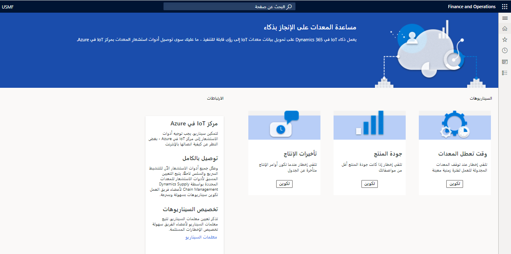
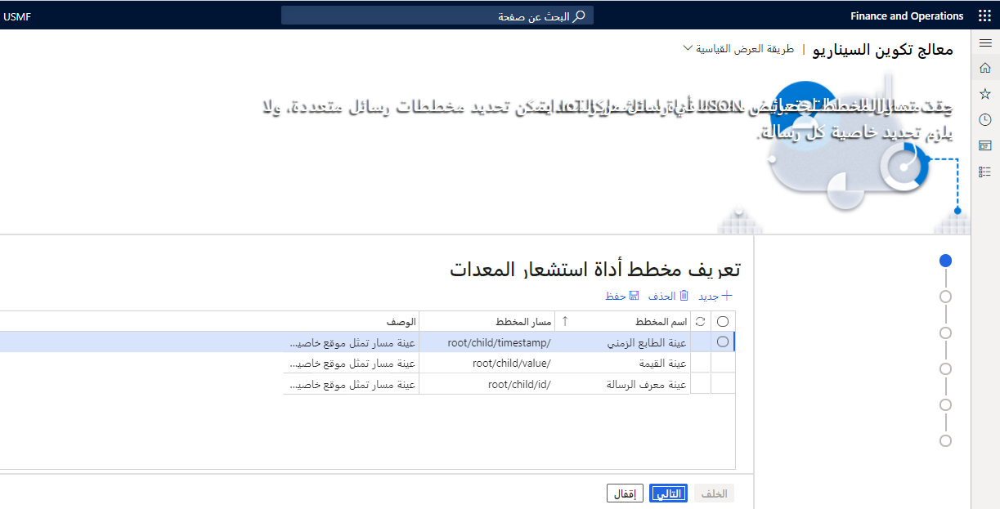
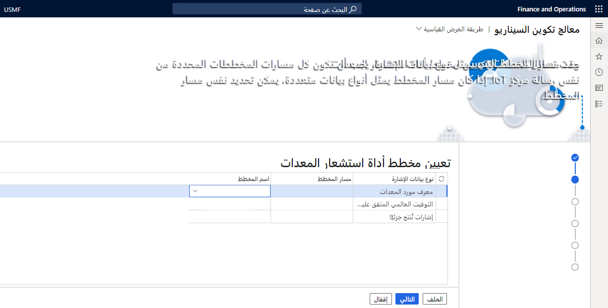
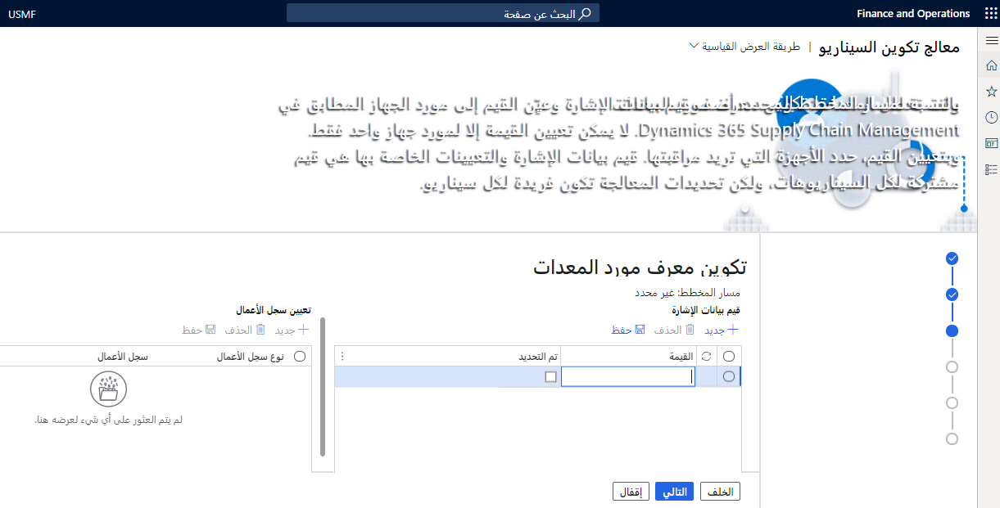
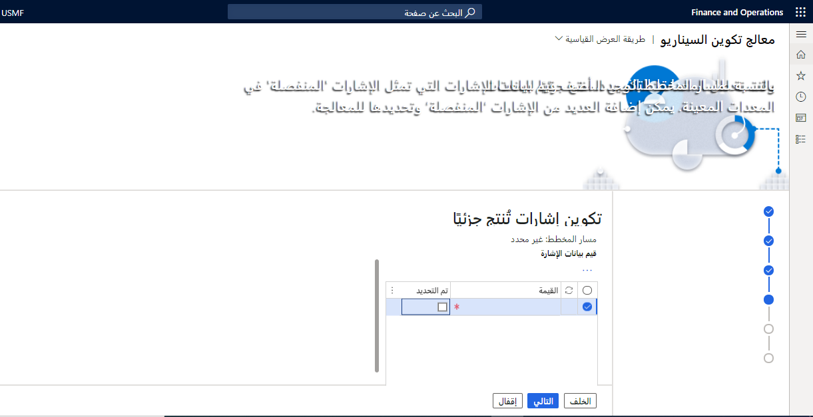

تمكّن Supply Chain Management المستخدمين من خلال عرض تقنية إنترنت الأشياء (IoT) التي تدعم العديد من الأفكار والإجراءات الأساسية داخل التطبيق. من خلال توصيل مستشعرات معداتك بمركز IoT في Microsoft Azure، يمكنك إعداد سيناريوهات الإنتاج وإدارتها في Supply Chain Management.

## التحكم بالإنتاج وإنترنت الأشياء

هناك العديد من السيناريوهات المعتمدة لذكاء إنترنت الأشياء لخدمات الإعلام ضمن التحكم في الإنتاج في إدارة سلاسل التوريد. تسمح هذه الإعلامات للمستخدمين بالتصرف حسب الحاجة. تساعد الوظيفة الإضافية لإنترنت الأشياء على تسهيل تتبع وتحسين فعالية المعدات بشكل عام في الوقت الفعلي. 

يتم شرح كل سيناريو من السيناريوهات المعتمدة في الأقسام التالية. 

### الأوامر المتأخرة 

قد تحدث حالات تتأخر فيها أوامر الإنتاج لعدة أسباب. باستخدام إنترنت الأشياء، يمكنك إعداد الإشعارات والإجراءات لإدارة أوامر الإنتاج المتأخرة. يمكنك عرض العمليات التي تأثرت بسبب التأخير، والتي ستسمح للمستخدمين بتحديد مقاييس تأخير الطلبات لمزيج مختلف من الموارد والمنتجات. ويمكن بعد ذلك إرسال إخطار لإعلام المستخدمين بوقت حدوث استثناءات الحدود. كما يمكنك هذا النهج من اتخاذ الإجراءات اللازمة للطلبات المتأخرة ويمنحك القدرة على عرض التأثير أو إنشاء طلب صيانة. 

### تعطل الأجهزة 
ويمكن لذكاء إنترنت الأشياء توفير خدمات الإعلام وإجراءات لإدارة الوقت الذي قد تكون فيه المعدات في حالة عدم التشغيل. يمكنك تحديد مقاييس حدود تعطيل الجهاز ويمكنك إعلام المستخدمين عند حدوث استثناء للحد الفاصل. كما يمكنك هذا النهج من اتخاذ الإجراءات اللازمة للطلبات المتأخرة ويمنحك القدرة على عرض التأثير أو إنشاء أمر عمل صيانة. 

### الكشف عن عيوب الجودة
يمكن استخدام خدمات الإعلام عن حالات عيوب إدارة الجودة. يمكنك تعريف سمات الجودة للمنتجات والحصول على إعلام عند حدوث استثناءات لهذه السمات. 

### الإعداد بدون تعليمات 
توفر ميزة الإعداد بدون التعليمات البرمجية طريقة سريعة وخالية من التعليمات البرمجية لتوصيل الجهاز بخدمة ذكاء إنترنت الأشياء وبدء استخدام الرؤى القابلة للتنفيذ. 

## تكوين ذكاء إنترنت الأشياء لسيناريوهات التحكم في الإنتاج

> [!NOTE]
> لاستخدام هذه الميزة، يجب تمكين ميزة **ذكاء إنترنت الأشياء** في مساحة العمل **إدارة الميزات**. 

للشروع في بدء تكوين ذكاء إنترنت الأشياء لسيناريوهات التحكم في الإنتاج، اتبع الخطوات التالية.

1.  انتقل إلى **التحكم في الإنتاج > إعداد > ذكاء إنترنت الأشياء > معلمات السيناريو**.
2.  في صفحة **معلمات السيناريو**، يمكنك إعداد معلمات لسيناريوهات إنترنت الأشياء الخاصة بك.
    - **التسلسل الزمني**: في علامة التبويب **التسلسل الزمني**، قم بلصق ذاكرة التخزين المؤقت Redis في **سلسلة اتصال متجر Redis القياسي**. اتبع الخطوات التالية للوصول إلى السلسلة:
        1.  سجل الدخول إلى مدخل Azure.
        2.  من لوحة المعلومات، حدد **كافة الخدمات > ذاكرة التخزين المؤقتة Azure لـ Redis**. 
        3.  انتقل إلى **الإعدادات > مفاتيح الوصول**. 
        4.  يستخدم هذا الزر في نسخ القيمة في حقل **سلسلة الاتصال الأساسي**. 
        5.  في حالة عدم وجود سجلات في هذه الشاشة، ستحتاج إلى إنشاء ذاكرة تخزين مؤقتة Redis. لمزيد من المعلومات حول هذا الموضوع، انتقل إلى [التشغيل السريع: استخدام ذاكرة التخزين المؤقتة Azure لـ Redis مع تطبيق .Net Framework](https://docs.microsoft.com/azure/azure-cache-for-redis/cache-dotnet-how-to-use-azure-redis-cache/?azure-portal=true).
        > [!IMPORTANT]
        > كلما قمت بتحديث ذاكرة التخزين المؤقت Redis، تأكد من تحديثها في Supply Chain Management.

    - **توقف الأجهزة**: في علامة التبويب **توقف الأجهزة**، يمكنك تحديد الحد الافتراضي بالدقائق لوقت توقف الجهاز. هذه المواصفات هي عدد الدقائق التي يحتاجها الجهاز لكي تتم مراعاتها في وقت التوقف. يمكنك بعد ذلك تحديد الحد لكل مورد في الجدول.
    - **عمليات تأخير الإنتاج**‎ – في علامة التبويب **عمليات تأخير الإنتاج**، يمكنك تحديد حدود تفاوت تأخير الإنتاج للمسارات. 

بعد تكوين المعلمات الخاصة بك وإدخال ذاكرة التخزين المؤقت Redis، ستحتاج إلى تكوين القياسات.

1.  انتقل إلى **التحكم في الإنتاج > الاستعلامات والتقارير > ذكاء إنترنت الأشياء > المفاتيح القياسية**. 
5.  حدد **تحديث** في جزء الإجراء. 
6.  حدد **موافق** لتشغيل التحديث. بعد اكتمال التحديث، يتم استرداد كافة مفاتيح القياس في ذاكرة التخزين المؤقت Redis وإضافتها إلى قائمة **مفاتيح القياس**. 
7.  تكوين السلسلة الزمنية لحالة المورد. 
8.  انتقل إلى **التحكم في الإنتاج > تنفيذ التصنيع > حالة المورد**. 
9.  في صفحة **حالة الموارد**، حدد **تكوين**. 
10. في حقل **المورد**، حدد المورد الذي ترغب في تكوينه ومراقبته. 
11. حدد أيقونة **تحرير** لحقل **التسلسل الزمني 1**.
12. حدد قياساً في الشبكة (يجب التأكد من أن مفاتيح القياس قد تم تحديثها).
13. حدد **موافق** للرجوع إلى مربع الحوار **تكوين**. 
14. أدخل **اسم العرض**. 
15. حدد إطاراً زمنياً في حقل **إظهار البيانات من**. 
16. حدد **موافق**. 

## إدارة السيناريو
إن صفحة **‏‫إدارة السيناريو** في إدارة سلاسل التوريد هي المكان الذي يمكنك من خلاله عرض الرؤى الخاصة بإنترنت الأشياء وإدارتها للتحكم في الإنتاج. 

 
يمكنك الوصول إلى صفحة **إدارة السيناريو** من **التحكم في الإنتاج > إعداد > ذكاء إنترنت الأشياء > إدارة السيناريو**. من هذه الصفحة، يمكنك تكوين السيناريوهات المذكورة سابقاً. 

للبدء، حدد السيناريو الذي تريد تكوينه من صفحة **إدارة السيناريو**. سيقوم المعالج بشرح الإعداد للسيناريو الخاص بك.

1.  تعريف مسار المخطط لخصائص JSON في رسائل مركز إنترنت الأشياء.

    
 
2.  حدد مسار المخطط الذي يمثل نوع بيانات الإشارة.

    
 

3.  تحديد تكوين معرّف مورد المعدات لمسار المخطط المحدد. 

    
 
4.  قم بإضافة قيم بيانات الاشارة التي تمثل الإشارات الخاصة بالمعدات التي تم تعيينها. 

    
 
 
5.  إعداد حد توقف المعدات. سيتم إرسال الإشعار عندما يكون عدد الدقائق بين الوقت الحالي وإشارات الجزء التدريجي الأخيرة للجهاز أكبر من حد توقف الجهاز.

    

 
6.  قم بتمكين السيناريو بإعداد مفتاح التبديل إلى **نعم** في الخطوة الأخيرة من المعالج. 

 

لمزيد من المعلومات حول تكوين السيناريو، انتقل إلى [إعداد السيناريو للحصول على ذكاء إنترنت الأشياء](https://docs.microsoft.com/dynamics365/supply-chain/iot/iot-scenario-setup/?azure-portal=true).
