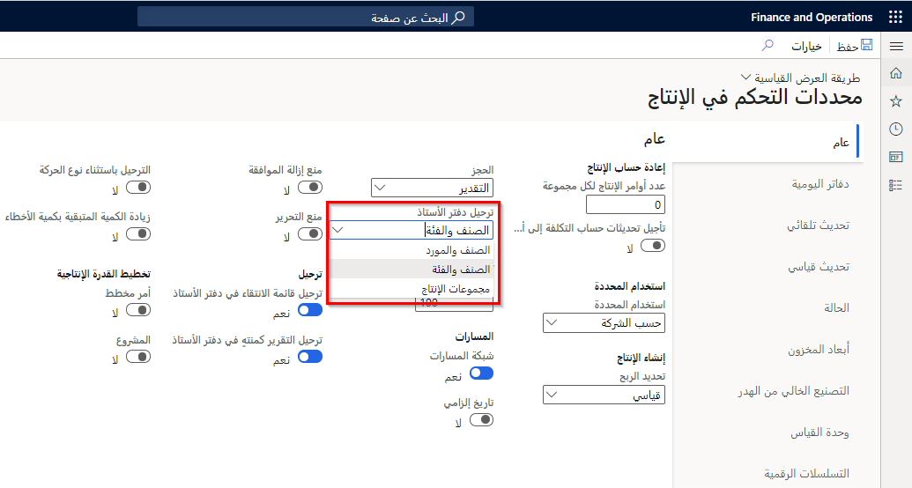
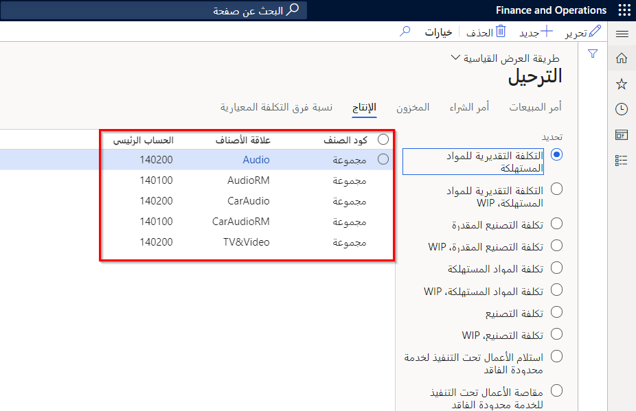
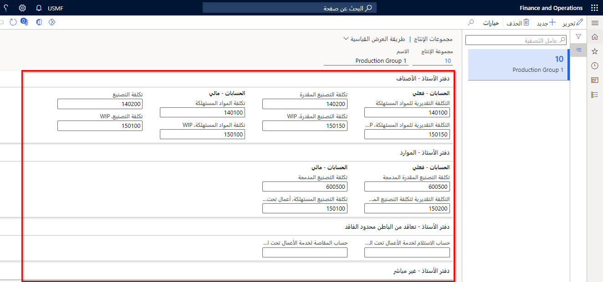
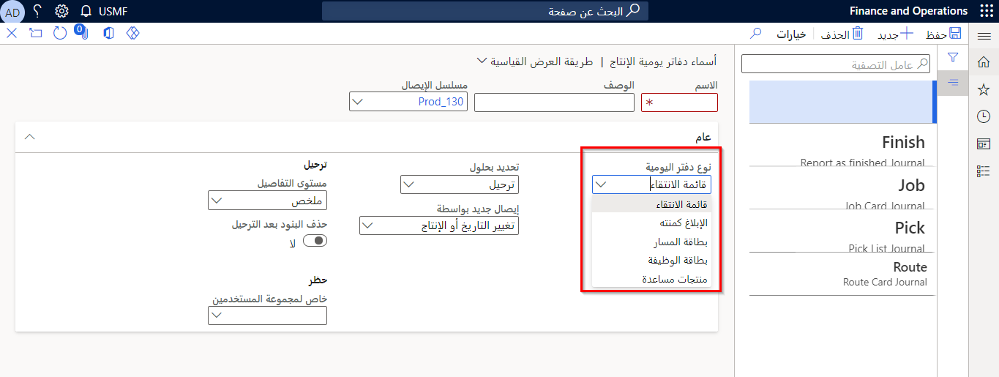
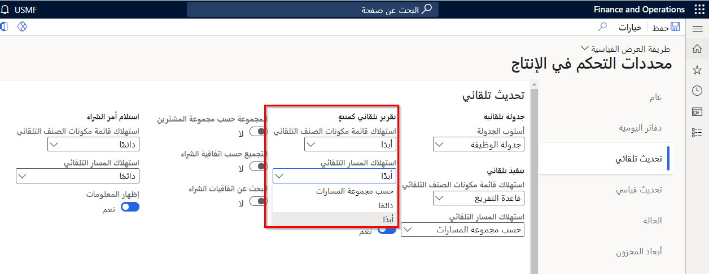

بصفتك مستشار التصنيع الوظيفي، يجب أن تكون على دراية بالعلاقة بين الوحدة النمطية للتحكم في الإنتاج والوحدات النمطية الأخرى في إدارة سلاسل التوريد. يشرح هذا الموضوع التكامل بين الوحدة النمطية لدفتر الأستاذ العام والوحدة النمطية للتحكم بالإنتاج.

تبدأ دورة حياة أمر الإنتاج رسمياً بإنشاء أمر الإنتاج وتنتهي بصنف مصنع جاهز للعميل. عندما تكتمل إحدى الخطوات في دوره الحياة، يقوم أمر الإنتاج بإظهار ذلك بتغيير الحالة.

ترتبط كل خطوة في دورة الحياة بالأنشطة التالية:

- مراقبة الإنتاج والتحكم فيه
- تقدير التكاليف وحسابها
- جدولة الأوامر
- بدء الإنتاج الفعلي وإنهائه

يحتوي أمر الإنتاج على معلومات حول ما سيتم إنتاجه والكمية (المقدار) وتاريخ الانتهاء المخطط. يقوم النظام بتعيين حالة أمر لكل خطوة في دورة حياة الأمر. تُظهر الحالة مكان الصنف في عملية الإنتاج. عند إنشاء أمر لأول مرة، يتم تعيينه تلقائياً لحالة "تم الإنشاء".

لمساعدتك على فهم التفاعلات بين دفتر الأستاذ العام ووحدات التحكم في الإنتاج، تقوم هذه الوحدة بمراجعة حالات الإنتاج مع التركيز على كيفية ارتباط كل خطوة بالبيانات المالية أو التفاعل مع دفتر الأستاذ العام.

## الإنشاء والتقدير 

يتم إنشاء أول خطوتين من دورة حياة أمر الإنتاج وتقديرهما.

- **إنشاء**: عند إنشاء أوامر الإنتاج، يمكنك تحديد الإعدادات التي تحدد كيفية ترحيل حركات أمر الإنتاج إلى دفتر الأستاذ. تتعلق هذه الإعدادات بأوامر الإنتاج التي يتم إنشاؤها يدوياً أو تلقائياً من أمر مبيعات أو جدول تخطيط رئيسي.
- **تقدير**: تتضمن هذه الخطوة حساب استهلاك المواد والعمالة والطريق الأكثر احتمالاً للإنتاج. يمكنك إنشاء حركات المخزون، والتي هي حركات إصدار للمواد الخام بحالة "قيد الطلب" واستلام حركات قائمة مكونات الصنف بحالة "تم الطلب". يمكنك أيضاً إنشاء أوامر شراء وإنتاجات فرعية لأمر الإنتاج، وحجز الأصناف وحساب سعر السلع المنتهية استناداً إلى إعدادات المعلمة.

## جدولة 

الخطوة التالية في دورة حياة أمر الإنتاج هي الجدولة. بعد تقدير أمر الإنتاج، تتم جدولته. يمكن جدولة أوامر الإنتاج بناءً على جدولة العمليات أو جدولة الوظيفة أو كلتيهما.

- **جدولة العمليات** - توفر هذه الجدولة خطة تقريبية طويلة الأجل. باستخدام هذه الطريقة، يمكنك تعيين تاريخي البدء والانتهاء لأوامر الإنتاج. إذا كانت أوامر الإنتاج مرفقة بعمليات المسار، يمكنك تعيينها لمجموعات مركز التكلفة.
- **جدولة الوظيفة** - توفّر طريقة الجدولة هذه خطة تفصيلية. يتم تقسيم كل عملية إلى وظائف فردية بتواريخ وأوقات وموارد معينة. في حالة استخدام قدرة إنتاجية محدودة، يتم تعيين الوظائف إلى الموارد بناءً على التوافر. يمكنك عرض الجدول وتغييره في مخطط Gantt.

## الإصدار والبدء 

الخطوات التالية لدورة حياة أمر الإنتاج هي الإصدار والبدء.

- **إصدار**: في هذه الخطوة، يقوم النظام بإصدار أمر الإنتاج عندما يكون الجدول واقعياً ويتم الانتهاء منه. وفي هذا الوقت، يمكنك طباعة مستندات أمر الإنتاج مثل بطاقة الوظيفة وبطاقة المسار ووظيفة المسار. في هذه المرحلة، تتغير حالة أمر الإنتاج للإشارة إلى أنه يمكن بدء الإنتاج.
- **بدء**: عند بدء أمر إنتاج، يمكنك ترحيل التكاليف مقابل الأمر. يمكنك تلقائياً توزيع تكاليف المواد والمسار المقدرة للأمر عند بدء تشغيله. ويعرف هذا التوزيع باسم ما قبل التدفق أو الاستهلاك التلقائي.

يمكنك توزيع المواد يدوياً للأمر عن طريق إنشاء دفاتر يومية لقائمة الانتقاء، ثم توزيع تكاليف العمالة والمسارات الأخرى إلى الأمر. في حالة استخدام جدولة العمليات، يمكنك توزيع هذه التكاليف عن طريق إنشاء دفتر يومية بطاقة مسار. في حالة استخدام جدولة الوظائف، يمكنك توزيع هذه التكاليف عن طريق إنشاء دفتر يومية بطاقة الوظيفة.

## الإبلاغ كمنتهٍ 

الخطوة التالية في دورة حياة أمر الإنتاج هي الإبلاغ كمنتهٍ. عند الإبلاغ عن أمر الإنتاج كمنتهٍ، يتم تحديث كمية السلع المنتهية المكتملة في الوحدة النمطية لإدارة المخزون والمستودعات. إذا كنت تستخدم محاسبة العمال تحت التنفيذ (WIP)، يستخدم النظام التكلفة المعيارية من الصفحة **‏‫في المتناول‬** لإنشاء دفتر يومية دفتر الأستاذ لتقليل حسابات الأعمال تحت التنفيذ وزيادة مخزون البضائع المنتهية.

عند حساب تكلفة أمر إنتاج، يتم ترحيل التكلفة الفعلية للإنتاج ويتم إلغاء الترحيل الذي يحدث أثناء الإبلاغ كمنتهٍ. في حالة عدم توزيع تكاليف المواد والعمالة المرتبطة بالإنتاج بالفعل في دفتر يومية أو عن طريق المسح المسبق، يمكن توزيعها تلقائياً بواسطة المسح الاسترجاعي. يتضمن ذلك إجراء الخصم التالي لعمليات حركات المخزون.

## الإنهاء 

الخطوة التالية في دورة حياة أمر الإنتاج هي الإنهاء. قبل إنهاء الإنتاج، يقوم النظام بحساب التكاليف الفعلية للكمية المنتجة ويتم عكس كافة التكاليف المقدرة الخاصة بالمواد والعمالة والمصروفات الزائدة واستبدالها بتكاليف فعلية.

إذا قمت بتحديد خانة الاختيار **إنهاء المهمة** عند إجراء **الإبلاغ كمنتهٍ** للوظيفة، تتغير حالة أمر الإنتاج إلى "تم الإنهاء". تمنع هذه الحالة ترحيل أية تكاليف إضافية دون قصد إلى أمر إنتاج مكتمل.

عندما يتم الإبلاغ عن الإنتاج على أنه منتهٍ، يعني هذا أن الأصناف المنتهية قد وصلت إلى المخزون وأصبحت متاحة للشحن. يتم ترحيل قيمة هذه الأصناف إلى الحساب الذي تم تحديده في الحقل **الإبلاغ كمنتهٍ**. اخصم المبلغ على هذا الحساب الإضافي واحسب المبلغ بضرب الكمية في سعر التكلفة القياسي. يعمل هذا الحساب كحساب إضافي لأنه يتم تسجيل المبلغ فقط على هذا الحساب حتى يتم احتساب التكلفة. لموازنة الدفاتر، قم باعتماد نفس المبلغ للحساب المحدد في الحقل **الإبلاغ عن الحساب المقابل كمنتهٍ**.

## إعدادات دفتر الأستاذ الافتراضية 

يمكنك تحديد إعداد دفتر الأستاذ كقيمة افتراضية في صفحة **معلمات التحكم في الإنتاج** عن طريق الانتقال إلى علامة التبويب **التحكم في الإنتاج > الإعداد > معلمات التحكم في الإنتاج > عام** وتحديد حقل **ترحيل دفتر الأستاذ**. سيتم تعيين القيمة الافتراضية تلقائياً لجميع أوامر الإنتاج اللاحقة التي تم إنشاؤها من بند أمر المبيعات أو التخطيط الرئيسي أو أوامر الإنتاج الفرعية.
 

عند إنشاء أمر إنتاج يدوياً في صفحة **إنشاء أمر الإنتاج**، فستتم تعبئة القيمة في حقل **دفتر الأستاذ** مسبقاً بالقيمة الافتراضية. يمكنك تجاوزه بتحديد قيمة أخرى من قائمة الخيارات.

## ملفات تعريف ترحيل المخزون 

يتحكم ملف تعريف ترحيل المخزون في الحسابات الرئيسية التي سيتم استخدامها مع كل تحديث ترحيل في دفتر الأستاذ الفرعي للمخزون ودفتر الأستاذ العام.

**إدارة المخزون > إعداد > ترحيل > ترحيل** 

 
## مجموعات الإنتاج  

تقوم مجموعات الإنتاج بإنشاء علاقة بين أوامر الإنتاج وحسابات دفتر الأستاذ. يمكنك استخدام هذا الخيار عند تكوين محددات التحكم في الإنتاج لاستخدام خيار **مجموعة الإنتاج**. عند تحديد هذا الخيار، فإن **مجموعة الإنتاج** في **التحكم في الإنتاج > إعداد > الإنتاج** تكون خياراً إلزامياً في أمر الإنتاج، كما ستأتي كافة معلومات ملف تعريف الترحيل من مجموعة الإنتاج المحددة.
 

يتم استخدام الصفحة **مجموعات الإنتاج** لتطوير قائمة بمجموعات الإنتاج التي يمكنك الإنشاء منها لإنشاء أوامر الإنتاج.

يمكنك أيضاً استخدام هذه الصفحة لتعيين إعدادات دفتر الأستاذ لجميع أوامر الإنتاج المضمنة في مجموعة الإنتاج، عند استخدام إعدادات مجموعة الإنتاج كقاعدة ترحيل. 

عند تحديد إعدادات دفتر الأستاذ في مجموعة الإنتاج، يتم ترحيل كافة أوامر الإنتاج في المجموعة إلى دفتر الأستاذ باستخدام نفس المعايير المحددة للمجموعة. بمعنى آخر، يتم تطبيق ملف تعريف الترحيل هذا كإعداد افتراضي لكافة الأوامر التي تُعد جزءاً من مجموعة الإنتاج ويتحكم في كيفية تنفيذ الترحيل وكيفية حساب التكاليف.

## دفاتر يومية الإنتاج 

يتم استخدام دفاتر يومية الإنتاج للإبلاغ عن استهلاك الصنف واستهلاك المسار والأصناف المنتهية. إنها رابط مباشر لنظام دفتر الأستاذ لأن ترحيل دفاتر اليومية هذه يتضمن الترحيل إلى دفتر الأستاذ. يتم ترحيل حركات دفتر اليومية ضمن إعداد **دفتر الأستاذ العام المستند إلى دفتر الأستاذ** الخاص بأمر الإنتاج.

## أنواع دفاتر يومية الإنتاج 

تحتوي دفاتر يومية الإنتاج على سجل لكل نوع من أنواع حركات الأصناف المختلفة التي تحدث عندما تعمل بأوامر الإنتاج. إن حركات الأصناف هذه لها تأثير مباشر على السجلات المالية للشركة. حدد موقع دفاتر يومية الإنتاج عن طريق تحديد **التحكم في الإنتاج** ثم **إعداد > دفاتر يومية**، ثم حدد نوع دفتر اليومية من القائمة.
 

تتضمن أنواع دفاتر يومية الإنتاج ما يلي:

- **قائمة الانتقاء**: يُعد دفتر اليومية هذا سجلاً بالمواد الخام التي يتم سحبها خارج المخزون.
- **بطاقة المسار** - يعد دفتر اليومية هذا سجلاً باستهلاك المسار.
- **بطاقة الوظيفة** - يعد دفتر اليومية هذا سجلاً باستهلاك المورد باستخدام بطاقات وظيفة التعليقات.
- **الإبلاغ كمنتهٍ** - يعد دفتر اليومية هذا سجلاً بجميع الأصناف المنتهية.

عند ترحيل دفتر يومية الإنتاج، يتم تحويل كافة حركات الصنف تلقائياً إلى دفتر الأستاذ العام. يتم استخدام المعلومات التي يتم ترحيلها من دفاتر يومية مختلفة في النظام في دفتر الأستاذ العام عند حساب الحركات المالية على مستوى الشركة.

## التعليقات على الاستهلاك أثناء الإنتاج 

إذا كنت ترغب في ذلك، يمكنك توجيه النظام لتحديث دفاتر يومية الإنتاج لتوفير الملاحظات تلقائياً بعد بدء عملية الإنتاج. يمكنك القيام بذلك عن طريق تحديد الخيار ذي الصلة في الصفحة **معلمات التحكم في الإنتاج** في **التحكم في الإنتاج > إعداد**.
 

يمكن تحديد الخيارات التالية في الحقل **استهلاك قائمة مكونات الصنف التلقائي**:

- **قاعدة التفريغ**: يمكنك تحديد أصناف فردية في قائمة مكونات الصنف ليتم إصدارها يدوياً. يتم تحرير كافة الأصناف الأخرى التي لم يتم تحديد الإصدار اليدوي لها تلقائياً.
- **دائماً**: يتم إصدار كافة الأصناف تلقائياً.
- **أبداً**: يتم إصدار كافة الأصناف يدوياً.

يمكن تحديد الخيارات التالية في الحقل **استهلاك المسار التلقائي**:

- **مجموعة المسارات التابعة**: إذا تم تحديد الاستهلاك التلقائي في ملاحظات مجموعة المسار وقامت بتضمين أوقات الإعداد والمعالجة، يكون للمسار استهلاك تلقائي. إذا لم يكن الأمر كذلك، يجب إدخال الاستهلاك يدوياً.
- **دائماً** - يتم إدخال كل استهلاك المسار تلقائياً.
- **أبداً** - يتم إدخال كل استهلاك المسار يدوياً.

## ترحيل تكلفة الإنتاج 

يتم ترحيل تكاليف الإنتاج في كل مرة يتم فيها ترحيل دفتر يومية. تتراكم تكاليف الإنتاج في حسابي **الأصناف في الإنتاج** و **العمل قيد المعالجة** حتى يكتمل أمر الإنتاج.

أوامر الإنتاج غير المنتهية لها تكاليف إنتاج مقدرة استناداً إلى الكميات المقدرة، ويتم ترحيل التكاليف الفردية للكميات التي تم الإبلاغ عنها كمنتهية. ومع ذلك، لا يتم حساب تكلفة الإنتاج المحققة حتى يتم إنهاء أمر الإنتاج. عند انتهاء أمر الإنتاج، يتم حساب تكلفة الإنتاج النهائية باستخدام مبالغ الإنتاج الفعلية.

