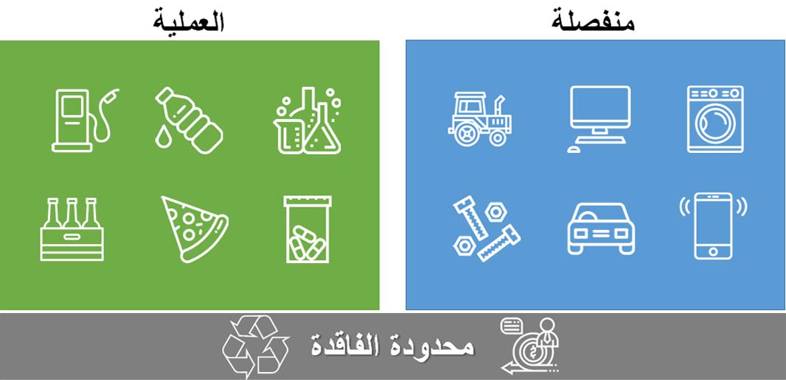

توضح هذه الوحدة النمطية المفاهيم المستخدمة في الوحدة النمطية للتحكم في الإنتاج في Dynamics 365 Supply Chain Management.

في هذه الوحدة النمطية، سوف تتعرف على الميزات التالية:

- منهجيات‬ التصنيع المنفصل والتصنيع محدود الفاقد والتصنيع التحويلي‬ 
- التصنيع الموحد 
- كيفية تكوين التحكم في الإنتاج للتصنيع الموحد
- تخطيط القدرة الإنتاجية
- التكامل بين **دفتر الأستاذ العام** والوحدات النمطية **للتحكم بالإنتاج**
- مجموعات الإنتاج
- كيفية العمل باستخدام مفاتيح التوزيع
- تحليلات ومعلومات ‏‫حول إنترنت الأشياء‬

تعرض هذه الصورة الفرق بين التصنيع المنفصل والتصنيع محدود الفاقد والتصنيع التحويلي‬.

