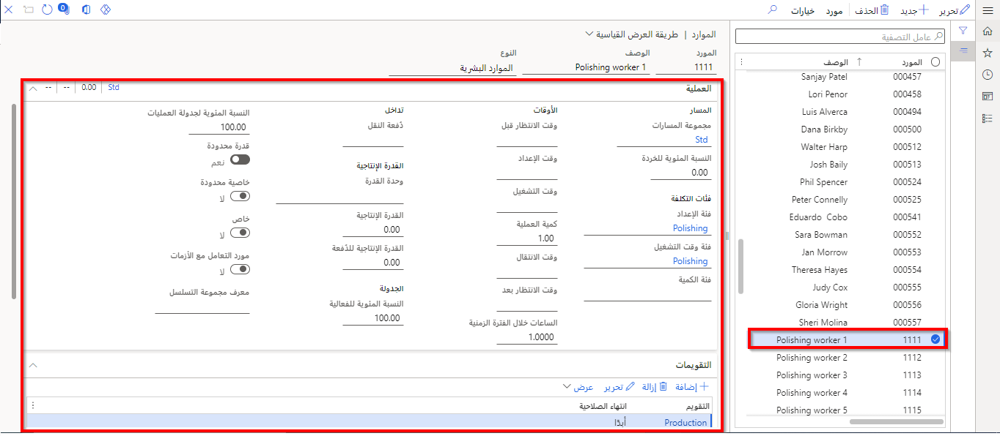
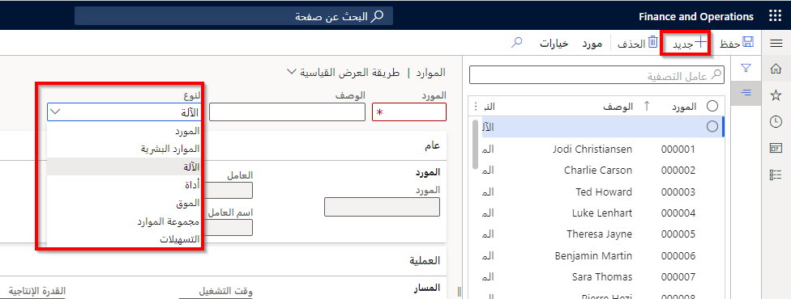
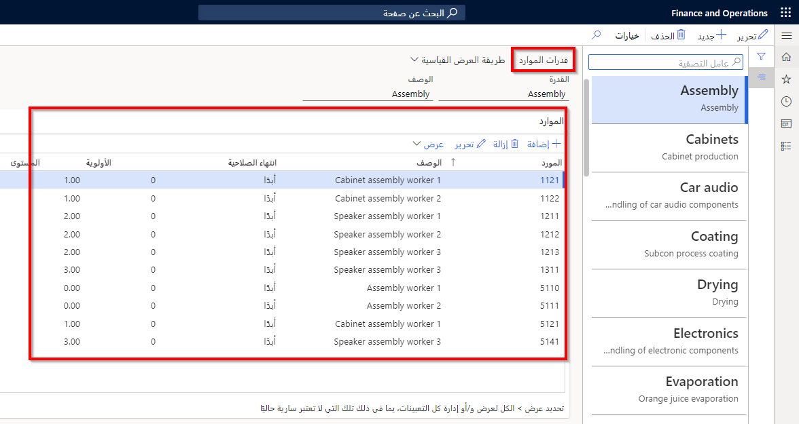
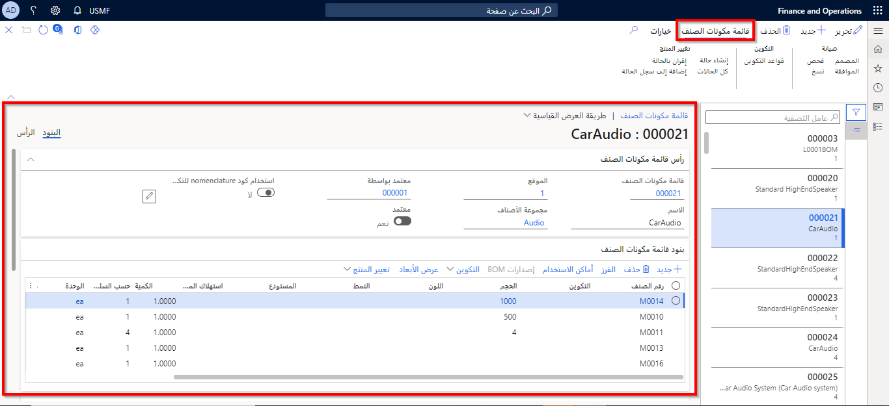
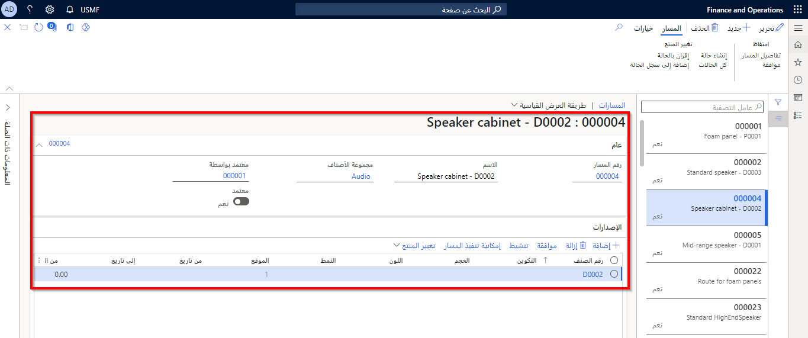

على الرغم من تفرد عمليات التصنيع لكل شركة، تبعاً لطبيعة بيئة التشغيل، فإن العناصر التصورية الأساسية المستخدمة في وحدة التحكم في الإنتاج متشابهة في كثير من الأحيان.

المفاهيم الأساسية في وحدة التحكم في الإنتاج هي كما يلي:

- التقويمات
- الموارد
- أنواع الموارد
- قدرات الموارد
- قائمة مكونات الصنف (BOM)
- المسارات والعمليات
- المعادلة
- تدفقات القيم
- نماذج تدفق الإنتاج
- وحدات الإنتاج
- مجموعات الإنتاج
- مجموعات الإنتاج
- مفاتيح التوزيع
- وظيفة كانبان

## الموارد 

الموارد هي إجمالي موارد العمل الخاصة بالشركة. يمكن أن تكون هذه الأصناف أي شيء يتم استخدامه لإنشاء أو إنتاج أو تسليم بضاعة و/أو خدمة، بالإضافة إلى المواد التي يتم استهلاكها في العملية. يمكن أن تكون الموارد أنواعاً مختلفة، بما في ذلك الأجهزة أو الأدوات أو الأشخاص أو الموردين أو المواقع.

**إدارة المؤسسة > الموارد > الموارد**.
 

## أنواع الموارد 

يتم إنشاء الموارد في الوحدة النمطية لإدارة المؤسسة. ويتم استخدامها في الإنتاج إلى جانب التقويم لإدارة القدرة الإجمالية لمعدات الشركة ومواردها. يمكن أن يرتبط كل مورد بمجموعة موارد، ويمكن أن يوجد مورد واحد أو عدة موارد في أي مجموعة موارد معينة.

تتوفر أنواع الموارد التالية في Supply Chain Management:

- **المورد** - يمكن استخدام هذا النوع عند إجراء عملية (أو مهمة) بواسطة مورد خارجي أو مقاول من الباطن. يمكن ربط رقم المورد بهذا النوع من الموارد للمساعدة في الجدولة والتعقب.
- **الموارد البشرية** - يمكن استخدام هذا النوع لتحديد الوقت الذي يقوم فيه الأفراد أو مجموعة من الموظفين بإجراء عملية ما.
- **الجهاز** - يمكن استخدام هذا النوع لربط جهاز فردي أو مجموعة من الأجهزة بمورد. وهو نوع المورد الأكثر استخداماً.
- **الأداة** - يمكن استخدام هذا النوع للتحكم في حجوزات الأداة وجدولتها. استخدم هذا النوع فقط عندما تكون القدرة محدودة.
- **الموقع** - يمكن استخدام هذا النوع للتحكم في حجوزات موقع محدد وجدولته.
- **أداة الإنشاء** - بناء أو بنية ثابتة مطلوبة لتنفيذ نشاط.

**إدارة المؤسسة > الموارد > جديد**

## قدرات الموارد 

تم تعيين القدرات إلى مورد عملية. يمكن تعيين أكثر من قدرة واحدة لأحد الموارد، ويمكن تعيين قدرة لأكثر من مورد واحد. يمكن أيضاً تعيين القدرات للموارد على أساس مؤقت عن طريق تحديد تاريخ بدء وتاريخ انتهاء لتعيين القدرة.
 
**إدارة المؤسسة > الموارد > قدرات الموارد**.

القدرات التي انتهت صلاحيتها في أحد الموارد ستمنع جدولة المورد للإنتاج إذا تطلب الإنتاج تلك القدرة. يمكن تجديد القدرة التي انتهت صلاحيتها فيما بعد.

عند تحديد متطلبات الموارد لمسار الإنتاج، يمكنك تحديد قدرة واحدة أو أكثر من القدرات كمتطلبات. عند تنفيذ جدولة الإنتاج، فإن القدرات المحددة في متطلبات الموارد في مسار العمليات تتوافق مع القدرات التي تم تحديدها للموارد. 

يتم بعد ذلك تحديد الموارد ذات القدرات التي تستوفي المتطلبات. عند تحديد قدرات لموارد مختلفة، يجب عليك إعداد القدرات بحيث يتم إعداد سرعات معالجة مختلفة بشكل كبير كقدرات مختلفة.

## قائمة مكونات الصنف (BOM) 

تعد قائمة مكونات الصنف أحد أهم المستندات في شركة التصنيع. قبل أن تتمكن الشركة من إنتاج منتج، يجب أن تعرف المكونات التي سيتم تضمينها وعدد هذه المكونات المطلوبة لصنع المنتج النهائي. تحتوي قائمة مكونات الصنف على كافة المكونات أو الأجزاء أو المواد الخام المطلوبة لصنع منتج نهائي واحد.

**إدارة معلومات المنتج > قوائم مكونات الأصناف والمعادلات > قوائم مكونات الأصناف**
 

## المسارات والعمليات 

تحدد المسارات خطوات العملية اللازمة لإنتاج منتج نهائي.
 
تحدد قائمة مكونات الصنف المواد المطلوبة، ويحدد المورد مكان إنتاج الصنف، ويحدد المسار تسلسل الأحداث لإنشاء المنتج النهائي. تعد العمليات المهام الخاصة أو عمليات العمل التي يتم وضعها معاً بالمسار لإنتاج منتج معين. يتم إقران كل مهمة بحصة زمنية لإكمال المهمة الفردية.

**التحكم بالإنتاج > العمليات > كافة المسارات**
 

## تحديد الإعدادات الاختيارية 

يمكن للشركات أيضاً إعداد إعدادات اختيارية تتحكم في عملية الإنتاج إذا كانت ذات صلة ببيئات الإنتاج الخاصة بها. 

الإعدادات الاختيارية هي كالتالي:

- **مجموعات الإنتاج** - يمكن إعداد مجموعات الإنتاج لإنشاء علاقات بين أمر الإنتاج وحسابات دفتر الأستاذ. سيتم استخدام حسابات دفتر الأستاذ لترحيل الأوامر أو تجميعها لإعداد التقارير.
- **أوعيه الإنتاج** - يمكن إنشاء أوعية الإنتاج لتجميع أوامر الإنتاج لمعالجة أوامر الإنتاج العاجلة أو لحذف مجموعات الأوامر وترحيلها.
- **الخصائص** - يمكن تحديد الخصائص لإنشاء سمات خاصة يمكنك يمكنك تعيينها لمواردك لاستخدامها ضمن عملية الجدولة. يتم ربط هذه السمات بقالب وقت العمل.
- **قدرات الموارد** - يمكن إنشاء قدرات الموارد عند الحاجة إلى الموارد لتنفيذ عمليات مختلفة في المسار، والتي يمكن التعبير عنها كمجموعة قدرات للموارد. ويسمح هذا بتأجيل توزيع الموارد حتى تتم جدولة الإنتاج.

## تكامل التحكم بالإنتاج مع وحدات نمطية أخرى في Supply Chain Management 

تتكامل الوحدة النمطية للتحكم بالإنتاج مع الوحدات النمطية التالية في Supply Chain Management:

- إدارة المخزون
- إدارة المستودعات
- دفتر الأستاذ العام
- التخطيط الرئيسي
- إدارة المؤسسة
- محاسبة المشروع
- إدارة معلومات المنتج

ويدعم هذا التكامل تدفق المعلومات المطلوبة لإكمال تصنيع الصنف المنتهي. يتبع إنتاج الأصناف دورة حياة إنتاجية متسلسلة. تعكس دورة الحياة الخطوات الفعلية التي يتم اتخاذها لتصنيع أحد الأصناف. وتبدأ بإنشاء أمر إنتاج، وتنتهي بصنف منتهٍ ومصنع جاهز للعميل. 

تتطلب كل خطوة في دورة الحياة أنواعاً مختلفة من المعلومات. عندما تكتمل خطوة في دورة الحياة، يقوم أمر الإنتاج بالإشارة إلى ذلك من خلال تغيير في حالة الإنتاج. إذا تم تخطي خطوة أو أكثر من الخطوات الإلزامية (أو التحديثات)، فسيتم تنفيذ الخطوات تلقائياً قبل نقل أمر الإنتاج إلى الخطوة التالية. 

## دورة حياة الإنتاج والحالات 

يتم تعيين حالة لأمر الإنتاج تعكس مكانها في دورة حياة الإنتاج. وتكون حالة الأوامر كما يلي:

- ‏إنشاء
- تقدير
- جدولة
- تم الإصدار
- البدء
- الإبلاغ كمنتهٍ
- الإنهاء

