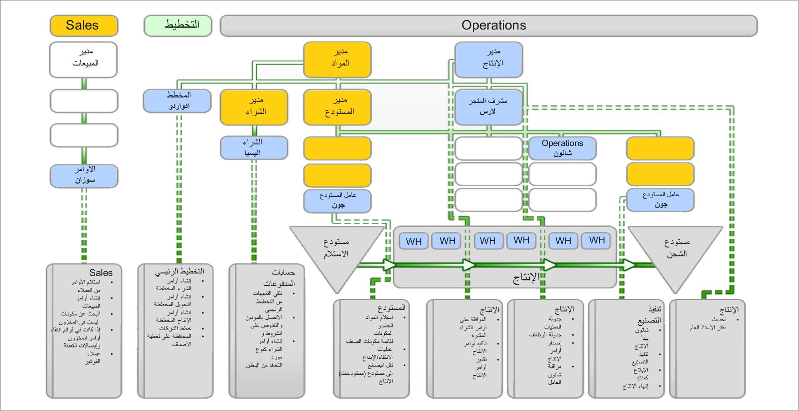

يتبع إنتاج المنتجات، وهي عملية تُعرف أيضاً بدورة حياة الإنتاج، خطوات محددة مطلوبة لإكمال تصنيع أحد الأصناف. تبدأ دورة الحياة بإنشاء أمر الإنتاج أو أمر الدفعة أو كانبان. وينتهي بصنف منتهٍ ومصنع وجاهز إما لعميل أو لمرحلة أخرى من الإنتاج. تتطلب كل خطوة في دورة الحياة أنواعاً مختلفة من المعلومات لإكمال العملية. ومع اكتمال كل خطوة، يُظهر أمر الإنتاج أو أمر الدفعة أو كانبان تغييراً في حالة الإنتاج.  

وتتطلب الأنواع المختلفة من المنتجات عمليات تصنيع مختلفة.

ترتبط الوحدة النمطية لمراقبة الإنتاج بوحدات نمطية أخرى، مثل إدارة معلومات المنتجات وإدارة المخزون ودفتر الأستاذ العام وإدارة المستودعات ومحاسبة المشروع وإدارة المؤسسة. ويدعم هذا التكامل تدفق المعلومات المطلوبة لإكمال تصنيع الصنف المنتهي.
  

وتتأثر عملية الإنتاج عادة بأساليب محاسبة التكاليف وتقييم المخزون التي يتم اختيارها لعملية إنتاج معينة. تدعم إدارة سلاسل التوريد كلا من التكلفة الفعلية (‏‫الوارد أولاً يُصرف أولاً‬ (FIFO) و‏‫الوارد أخيراً يُصرف أولاً‬ (LIFO) ومعدل النقل والمتوسط المرجح الدوري) وأساليب التكلفة القياسية. يتم تنفيذ Lean manufacturing وفقاً لقاعدة تحديد تكاليف الإصدار التلقائي.

ويحدد اختيار طرق قياس التكلفة أيضاً متطلبات إعداد التقارير حول استهلاك المواد والموارد أثناء عملية الإنتاج. يتم عادةً استخدام المعلومات التي يتم ترحيلها من دفاتر يومية مختلفة في النظام في دفتر الأستاذ العام عند حساب الحركات المالية على مستوى الشركة.

لمزيد من المعلومات، راجع [الشروع في العمل باستخدام الوحدة النمطية للتحكم في الإنتاج في Dynamics 365 Supply Chain Management](/training/modules/get-started-production-control-dyn365-supply-chain-mgmt/?azure-portal=true).
